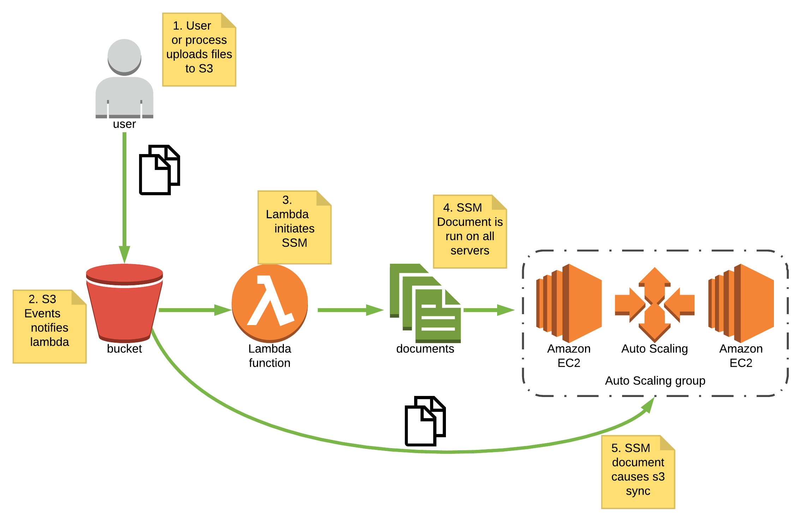
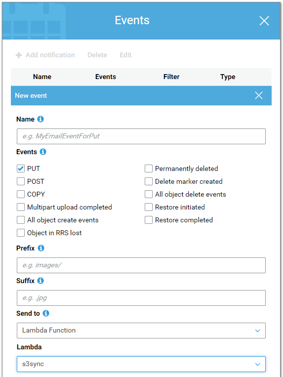

One of the things I love about working with Cloud is the various ways you can
fit together different services to perform complex business functions in a
relatively straight-forward manner.

<!--more-->

Before AWS’s Elastic File System was generally available, I had a customer who
had a requirement to share files across an Auto Scaling group of web servers.
In this instance, the files were read-only. Deploying an NFS server was a
possible solution but came with the downsides of additional cost and a single
point of failure. Instead, I recommended the following solution to them:



In the diagram above, files are uploaded to S3 through another business process.
The S3 bucket is configured with bucket notifications which in turn, triggers a
Lambda function. The Lambda function triggers an
[SSM document](https://docs.aws.amazon.com/systems-manager/latest/userguide/sysman-ssm-docs.html),
which runs on each of the servers in the autoscale group. This SSM document is
essentially a simple Bash script to perform a one-way synchronisation of the S3
bucket in question to a local directory.

This [Rube Goldberg](https://en.wikipedia.org/wiki/Rube_Goldberg_machine) machine
of AWS services seems complex, but it’s surprisingly simple and fast. In for our
testing, files even up to a couple of MB in size were on all servers in close to
a second.

I’m now working with a customer in the manufacturing industry who is moving a
legacy application to AWS. Their application makes use of a smart-ftp solution
that allows business processes to be initiated by upload events to FTP. For
various reasons this smart-ftp solution won’t be moving to AWS along with the
rest of their application. Fortunately, the S3 Rube Goldberg machine mentioned
earlier is a great fit as they can swap out FTP in favour of S3. The process
this time around will be slightly different. Instead of distributing the files
out to a group of servers, the final SSM document is a Bash script, which begins
execution of an internal business process. The catch is, it isn't triggered
by every upload to S3. The internal business process can only begin once a file
of a particular name is uploaded which signals a complete batch of files is
uploaded and ready for processing. S3 events supports prefixes and suffixes,
allowing the notification to only trigger once this file is uploaded.

What previously would have been a single machine running 24/7 (and prone to
failure) is now a serverless, reliable mechanism that will run at a fraction
of the cost.

If you’re interested in implementing a similar solution yourself, keep reading
to see how I implemented this originally.

## A Basic HOWTO

Ordinarily, I’d deploy this all through Cloudformation or Terraform, but for
the sake of being able to follow along, we’ll do this all through the console.

To begin, we need to go ahead and create our Lambda Function and an associated
IAM policy.

Firstly, go to the Lambda console and create a new Lambda function. Select
**Author From Scratch**. Give the function a name such as **s3sync** and select
**Node.js 8.10** as the runtime.

Select **Create a new role with basic Lambda permissions**. We’ll go back and
modify the permission later to give us the extra permissions we’ll need for
executing SSM documents.

Click **Create Function**.

Skip down to the function code and paste in the following code:

```javascript
var aws = require('aws-sdk');
var ssm = new aws.SSM();
console.log('Loading function');

exports.handler = function(event, context, callback) {

		var s3bucket = event.Records[0].s3.bucket.name;
		var s3object = event.Records[0].s3.object.key;
		console.log('value1 = event.Records[0].s3.bucket.name');
		callback(null, s3bucket);

var params =

{
	"CloudWatchOutputConfig": {
		"CloudWatchLogGroupName": "s3syncSSM",
		"CloudWatchOutputEnabled": true
	},
	"DocumentName": "s3sync",
	"Parameters": {
		"S3Bucket": [
			s3bucket
		],
		"Directory": [
			"/home/s3sync"
		]
	},
	"Targets": [
		{
			"Key": "tag:s3sync",
			"Values": [
				"true"
			]
		}
	],
	"Comment": "Synchronizing S3 Bucket",
	"TimeoutSeconds": 60,
	"OutputS3BucketName": "s3synclogs",
	"OutputS3Region": "us-east-1"
}
ssm.sendCommand(params, function(err, data) {
	if (err) console.log(err, err.stack); // an error occurred
	else     console.log(data);           // successful response
});

};
```

Scroll down to Execution role and click **View the role on the IAM console**


Click **Attach policy** and look for the **AmazonSSMAutomationRole**.

Next, click on the policy name and go to the json tab and paste in the following:

```json
{
	"Version": "2012-10-17",
	"Statement": [
		{
			"Sid": "logspermission",
			"Effect": "Allow",
			"Action": [
	"logs:CreateLogStream",
	"logs:CreateLogGroup",
	"logs:PutLogEvents"
			],
			"Resource": [
	"arn:aws:logs:us-east-1:111111111111:log-group:/aws/lambda/s3sync:*",
	"arn:aws:logs:us-east-1:111111111111:*"
			]
		},
		{
			"Sid": "ssmpermission",
			"Effect": "Allow",
			"Action": "ssm:*",
			"Resource": "arn:aws:ssm:*:*:document/s3sync"
		}
	]
}
```

Replace the region _us-east-1_ and the account number _111111111111_ with your
region and account number.

The policy should be tightened up for security purposes, but for our testing,
this is sufficient.

Click **Review** and save changes.

Next, we’ll create our SSM Document. Head over to the EC2 console and scroll
down the left-hand panel to find Documents under _Systems Manager Shared Resources_.

Name the document _s3sync_

Document type is **Command**

For the content, remove the {} brackets and enter in the document below:

```json
{
	"schemaVersion": "1.2",
	"description": "Sync an S3 Bucket to local directory",
	"parameters": {
		"S3Bucket": {
			"type": "String",
			"description": "The S3 Bucket to sync"
		},
		"Directory": {
			"type": "String",
			"description": "The local directory to Synchronize to the S3 Bucket",
			"default": "/home/s3sync"
		}
	},
	"runtimeConfig": {
		"aws:runShellScript": {
			"properties": [
				{
					"runCommand": [
						"#!/bin/bash -e",
						"S3_ENDPOINT='s3://'{{S3Bucket}}",
						"echo {{S3Bucket}}",
						"echo $S3_ENDPOINT",
						"mkdir -p {{Directory}}",
						"aws s3 sync $S3_ENDPOINT {{Directory}}"
					]
				}
			]
		}
	}
}
```

Click **Create Document**

Next, we need an S3 Bucket. Name your bucket anything you like, as long as it’s
unique. Then open the empty bucket and click on the Properties tab then find the
events option and click on it.

Click Add notification and name it _s3sync_.



You will notice we have the ability to select a number of event types which is
what gives this process a lot of flexibility when it comes to automating business
processes through S3. For now though, select PUT. Scroll down to **Send to** and
select the Lambda function we created earlier then click **Save**.

Now, the only thing left to do is launch our EC2 resources and tag them
appropriately. In the Lambda function above we’ve hardcoded the tags to be
**Name=s3sync, Value=true**. Go ahead and launch a linux instance with that tag.
You’ll need to ensure that the IAM role associated with your EC2 instances gives
the appropriate permission to associate it with SSM and access the S3 bucket
we’re working with.

The inbuilt policies _AmazonEC2RoleforSSM_ and _AmazonS3ReadOnlyAccess_ should
be sufficient for now.

## Testing

Once you have some instances launched, upload a file to the S3 bucket then head
over to the Lambda console and check the **monitoring** tab of your function.
You should see the invocation count go up and hopefully, the **Error count**
and **Success Rate (%)** show successes (and no errors). You may need to wait
a few minutes for the monitoring graphs to update.

Then you can head over to the EC2 console and go to **Run Command** under **Systems Manager Services**.

You should now see your document s3sync has run and hopefully completed successfully.
If that’s the case, logging on to the server you launched earlier and checking
the ```/home/s3sync``` directory will show the file you uploaded to S3. If so,
congratulations! You’ve successfully deployed a fully automated S3/Lambda/SSM
solution for keeping your S3 bucket in sync.

As I mentioned earlier, this is just a concept of what S3 events could be used
for. In my case, I modified and adopted it to replace a legacy business
process.

Use the Feedback tab to make any comments or ask questions.
