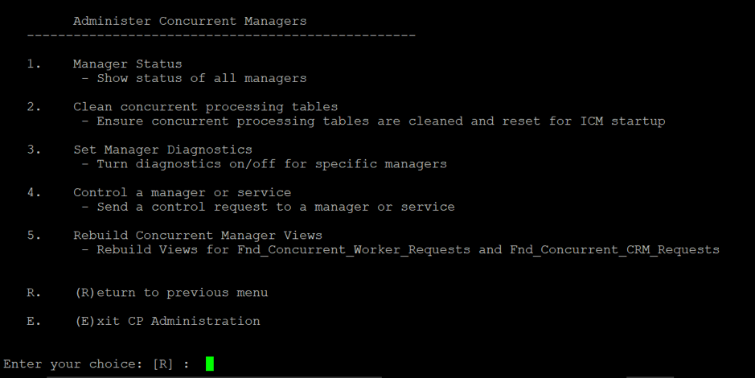
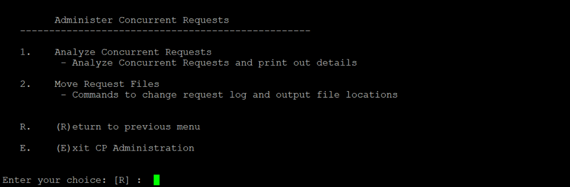

Oracle&reg; has launched CPADMIN, a concurrent processing command-line utility
for E-Business Suite&reg; (EBS) versions R12.1.3 and R12.2.x. CPADMIN is a
menu-based utility that wraps multiple existing utilities for concurrent
processes and allows you to work on several concurrent process-related tasks
under a single menu.

Newly released and user friendly, CPADMIN is the replacement for the
**cmclean.sql** script in EBS Release 12. This blog explores some features of
CPADMIN and shows you how to use it to execute multiple tasks with a single
command.

<!--more-->

### Tasks handled by CPADMIN

You can use CPADMIN for the following tasks:

- **View manager status**: Shows status of all the managers. You can view all
  running concurrent manager (CM) statuses (with or without process IDs). The
  same status information is shown in the **Administer Concurrent Managers**
  form and on the Oracle Access Manager (OAM) **Concurrent Managers** page.
- **Clean concurrent processing tables**: Helps clear concurrent processing (CP)
  tables and ensures CP tables are cleaned and reset for Internal Concurrent
  Manager (ICM) startup.
- **Set manager diagnostics**: Sets CM diagnostics and lets you turn diagnostics
  on and off for specific managers.
- **Control a manager or service**: Sends a control request to a manager or
  service and starts, stops, or verifies an individual CM.
- **Rebuild concurrent manager views**: Rebuilds the CM views for
  **Fnd\_Concurrent\_Worker\_Requests** and **Fnd\_Concurrent\_CRM\_Requests**.
- **Analyze concurrent requests**:  Analyzes concurrent requests and prints out
  the details. This task was added in Oracle EBS 12.2.x.
- **Move request files**:  Changes the request log and output file locations.
  This task was added in Oracle EBS 12.2.x.

### Steps to use CPADMIN

Use the following steps to use the CPADMIN command-line utility to perform
maintenance tasks:

**Note:** Screenshots are taken from Oracle EBS version 12.1.3.

1. Set the environment.

2. Run CPADMIN by executing the following command from any directory:

        $FND_TOP/bin/cpadmin.sh

    The following screen displays:

    

<ol start=3>
    <li>Enter <b>1</b> to display the <b>Administer Concurrent Managers</b> menu,
    as shown in the following image:</li>
</ol>

   

<ol start=4>
    <li>Choose the tasks to perform. When you're finished, press <b>R</b> to
    return to the previous menu.</li>
    <li>From the <b>Main Menu</b>, enter <b>2</b> to show the <b>Administer
    Concurrent Requests</b> menu as shown in the following image:</li>
</ol>

   

### Enable the CPADMIN utility in Oracle EBS

To activate the CPADMIN utility in EBS, apply the Concurrent Processing RUP2
Patchset 22549247, which is RUP3 for Concurrent Processing Release 12.1.3.
This patch consolidates Concurrent Processing RUP2 (19287293) along with all
fixes released after RUP2.

**Note:** Before you apply patch 22549247, ensure that you have applied patches
17884289 and 8919491. For Oracle EBS 12.2.x, this feature is already
enabled.

### Conclusion

CPADMIN is an interesting tool that consolidates different CP management
functions into a single menu-based tool. It is simple to use, and you can run
it in PuTTY&reg; to monitor the CM status and start or stop the manager from the
backend. You don’t need to open an application URL to monitor a CM or to start
or stop the manager. With this tool, you can execute multiple tasks with a single
command. CPADMIN replaces **cmclean.sql**, so use CPADMIN to perform
that function. You can do multiple CP-related tasks from the backend, which you
previously could not perform.

Use the Feedback tab to make any comments or ask questions.

Learn more about our [database services](https://www.rackspace.com/dba-services)
and [Rackspace Application services](https://www.rackspace.com/application-management/managed-services).
