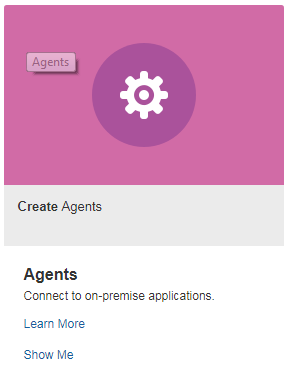
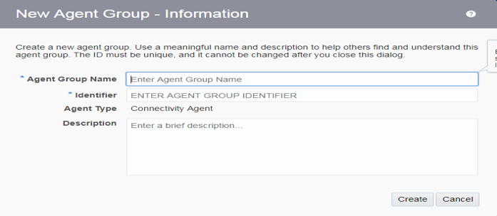

To gain access to or to establish a connection with an on-premises, standalone
database or Oracle&reg; E-business Suite (EBS) database from the Oracle
Integration Cloud Service, you need to install the Oracle Integration Cloud Service
connectivity agent on your on-premises host. The Oracle Integration Cloud Service
agent installs a WebLogic server with only the AdminServer component.

<!--more-->

### Installation prerequisites

Before you install the connectivity agent on an on-premises database, make sure
that you have considered the following prerequisites:

*  Operating system (OS) prerequisites include the following items:

   -  Oracle Enterprise Linux&reg; (OEL) version 6 or 7.

   -  8 GB of free memory on the host with a 4 GB Java heap size. If the heap
      size increases, you need more memory.

   -  A fully-qualified domain name entry in **/etc/hosts**.

   -  A mount point with 20 GB of free space.

   -  A user name with the database administrator (DBA) group.

*  Java version prerequisites include the following items:

   -  You must install Oracle JDK version 1.7 or 1.8 to install and use the
      connectivity agent.

   -  Other JDKs are not supported.

*  Open port 443 on the on-premises host to enable connectivity between the
   on-premises host (where agent will be installed) and the Oracle Integration
   Cloud Service.

### Required software downloads and configuration steps

Use the following steps to download the required software components.

#### Download the Oracle Integration Cloud Service connectivity agent

Use the following steps to download the connectivity agent software from the
Oracle Integration Cloud Service:

1.  Enter [https://cloud.oracle.com/OIC](https://cloud.oracle.com/OIC) in your browser.
2.  Click **Sign In** and follow the prompts to sign in with your cloud user
    name and password.
3.  Click **Agent**.

<ol start=4>
    <li>Click <b>Download</b> and then click <b>Connectivity Agent</b>.</li>
</ol>

<ol start=5>
    <li>Move the downloaded installation software
   to your on-premises host server.The software size should be around 2GB.</li>
</ol>

#### Create an agent group in the Oracle Integration Cloud Service

Before installing the agent, create an agent group in Oracle Integration Cloud
Service by using the following steps:

1. Sign in on [https://cloud.oracle.com/OIC](https://cloud.oracle.com/OIC) with
   your cloud administrator login ID and password, and create an agent group by
   clicking the **Agent Icon**.

<ol start=2>
    <li>Click <b>Create Agent Group</b> and provide inputs as shown in the following image:</li>
</ol>

The inputs include the following items:

- **Agent group name**: This name is used when you install the connectivity agent on
  the on-premises host.
- **Identifier**: You can use the same name as the agent group name or give any
  name to identify this group.
- **Agent type**: Not changeable.
- **Description**: Give a description of the agent.

#### Download the Oracle Java JDK 1.7 or 1.8

Download the Oracle Java JDK 1.7 or 1.8 from
[Oracle](https://www.oracle.com/technetwork/java/javase/downloads/jdk8-downloads-2133151.html).

In this blog post, the installation used the 64-bit version Java as the Linux version.

**Note:** Move the downloaded Java to the on-premises host where you want to
install the connectivity agent and extract it.

### Install the Oracle Integration Cloud Service connectivity agent

Make sure the installation software that you previously downloaded is already
moved to your on-premises host server.

Use the following steps to install the connectivity agent in **/u01/app/OICS**
in the on-premises Linux host.

#### Set JDK 1.7 or 1.8 to PATH

1.  Extract the latest JDK version at **/u01/app/OICS** as shown in the following
    example:

    [Softwares]$ pwd
    /u02/app/OICS/Softwares
    [Softwares]$ ls -ltr jdk-8u181-linux-x64.tar.gz
    -rw-r--r-- 1 orati2 dba 185646832 Aug 22 02:29 jdk-8u181-linux-x64.tar.gz
    [Softwares]$
    [Softwares]$ tar -xzvf jdk-8u181-linux-x64.tar.gz
    [Softwares]$ ls -tlr|grep ^d
    drwxr-xr-x 7 orati2 dba       4096 Jul  7 04:09 jdk1.8.0_181
    [Softwares]$

2.  Copy all the files from **jdk1.8.0_181** to your **JAVA_HOME** directory as
    shown in the following example:

    [Softwares]$ pwd
    /u02/app/OICS/Softwares
    [Softwares]$ cd jdk1.8.0_181
    [jdk1.8.0_181]$ cp -pr *.* ../../jdk/

3.  Export JAVA_HOME, add it to your PATH, and check the Java version as shown in the
    following example:

    [OICS]$ export JAVA_HOME=/u02/app/OICS/jdk
    [OICS]$ export PATH=$JAVA_HOME/bin:$PATH
    [OICS]$ which java
    /u02/app/OICS/jdk/bin/java
    [OICS]$ java -version
    java version "1.8.0_181"
    Java(TM) SE Runtime Environment (build 1.8.0_181-b13)
    Java HotSpot(TM) 64-Bit Server VM (build 25.181-b13, mixed mode)
    [OICS]$

#### Check the connectivity between the on-premises server and the Oracle Integration Cloud Service

Before installing the agent, verify that the Oracle Integrated Cloud Service URL can be
accessed from the on-premises server. If it is inaccessible, the connectivity
agent installation fails. Use the following command, which downloads a small
file, to verify that Oracle Integration Cloud Service URL is accessible. If the download
succeeds, the URL is accessible.

    [OICS]$  wget -p https://inspire1-rhughes.integration.us2.oraclecloud.com:443

    100%[=====================================================================================================================================================>] 8,295       --.-K/s   in 0.003s

    2018-11-15 06:32:49 (2.69 MB/s) - âinspire1-rhughes.integration.us2.oraclecloud.com/index.htmlâ saved [8295/8295]

    FINISHED --2018-11-15 06:32:49--
    Total wall clock time: 0.6s
    Downloaded: 1 file, 8.1K in 0.003s (2.69 MB/s)
    [OICS]$

#### Install the on-premises connectivity agent

To install the on-premises connectivity agent, extract the
connectivity agent software. Copy **cloud-connectivity-agent-installer.bsx**
to a location where you want to install the connectivity agent, such as **/u2/app/OICS/Agent**
in this example.

Install the agent by using the following command:

    ./cloud-connectivity-agent-installer.bsx —h=https://ICS_host.us.oracle.com:port —u=username —p=my_password —ad=agent_group_identifier -au=agent_username -ap=agent_password

The parameters of the command include the following options:

-	`-h` (Required): The Oracle Integration Cloud Service hostname and port.
-	`-u` (Required): The username of the Oracle Integration Cloud Service with
   which the agent connects.
-	`-p` (Required): The password of Oracle Integration Cloud Service.
-	`-ad` (Required): The agent group name that you created previously.
-	`-au` (optional): The WebLogic administrator username, if you don’t want
   WebLogic as a user. You should give the username as WebLogic only.
-	`-ap` (optional): The password of the WebLogic user provided in the ` -ad`
   parameter.

The following example demonstrates the installation:

    [Agent]$ pwd
    /u02/app/OICS/Agent
    [Agent]$ ./cloud-connectivity-agent-installer.bsx —h=https://inspire1-rhughes.integration.us2.oraclecloud.com:443 —u=Vedagiri.Kandasamy@cognizant.com —p=Cts#12345 —ad=INSPIRE_ICS_DB_AGENT -au=weblogic -ap=weblogic123

Upon successful installation of the agent, the WebLogic console URL is shown in
the following example:

    https://hostname:7001/console.

Open the console by using the username `weblogic` and the password given during
the installation in the `-ap` parameter.

The WebLogic console should show **AdminServer** in **RUNNING** status.

#### Import the Oracle Integration Cloud Service certificate

Use the following steps to import the Oracle Integration Cloud Service certificate
into the agent Keystore Service (KSS) key store.

1.  In the **startAgent.sh** file, check line 63 for the key store path, for
    example, **Agent_Home/cert/keystore.jks**. In this case, **Agent_Home** is
    **/u02/app/OICS/Agent/cert/keystore.jks**.
2.	Back up the key store.
3.  Download the Oracle Integration Cloud Service certificates to the host where
    the agent is running.
4.  Log in to the Oracle Integration Cloud Service.
5.  In a browser, click the secure link to the left of the HTTPS URL.
6.  Click **Secure Connection > More Information > Security > View Certificate > Details**.
7.  Click **Export** and save the file with a **.crt** extension and as a
    **type X.509 Certificate with chain (PEM) (\*.crt,\*.pem)**.
8.  Download all three certificates (Root, Intermediate, and User Level, and move
    the downloaded certificates to **/u02/app/OICS/Agent/agenthome/cert**.

    [cert]$ pwd
    /u02/app/OICS/Agent/agenthome/cert
    [cert]$ ls -ltr *.crt
    -rw-r--r-- 1 orati2 dba 1360 Aug 23 03:28 RootCA.crt
    -rw-r--r-- 1 orati2 dba 1674 Aug 23 04:22 CA_intermediate.crt
    -rw-r--r-- 1 orati2 dba 2318 Aug 23 04:22 oraclecloudcom.crt
    [cert]$

<ol start=9>
    <li>Import the entire certificate chain from Oracle Integration Cloud Service as follows:</li>
</ol>

    [cert]$ keytool -import -trustcacerts -keystore /u02/app/OICS/Agent/agenthome/cert/keystore.jks -file oraclecloudcom.crt -     alias ICS.us2.oraclecloud.com
    Enter keystore password: *******

    [cert]$ keytool -import -trustcacerts -keystore /u02/app/OICS/Agent/agenthome/cert/keystore.jks -file RootCA.crt -alias       ICS.us2.oraclecloud.com
    Enter keystore password:  *******
    Certificate already exists in system-wide CA keystore under alias <rootca [jdk]>
    Do you still want to add it to your own keystore? [no]:  yes
    Certificate was added to keystore

    [cert]$ keytool -import -trustcacerts -keystore /u02/app/OICS/Agent/agenthome/cert/keystore.jks -file CA_intermediate.crt     -alias intermediate_ICS.us2.oraclecloud.com

#### Bounce the agent services

To stop the connectivity agent on the on-premises host, set the environments
variable of the Oracle Integration Cloud Service agent by using the following commands:

    export JAVA_HOME=/u01/app/OICS/jdk
    export AGENT_HOME=/u02/app/OICS/Agent/agenthome
    export PATH=$JAVA_HOME:$AGENT_HOME:$PATH

    cd /u02/app/OICS/Agent
    sh stopAgent.sh

To start the connectivity agent on the on-premises host, set the environment
variables of the Oracle Integration Cloud Service agent by using the following commands:

    export JAVA_HOME=/u01/app/OICS/jdk
    export AGENT_HOME=/u02/app/OICS/Agent/agenthome
    export PATH=$JAVA_HOME:$AGENT_HOME:$PATH

    cd /u02/app/OICS/Agent
    nohup ./startAgent.sh -u=CloudUserName -p=CloudPassword &

### Conclusion

The Oracle on-premises connectivity agent is a key component to integrate any
on-premises database to the Oracle Cloud. The latest version of Oracle connectivity
agent is available and enables the agent to run in a high availability
configuration.

Use the Feedback tab to make any comments or ask questions.

Learn more about our [database services](https://www.rackspace.com/dba-services)
and [Rackspace Application services](https://www.rackspace.com/application-management/managed-services).
