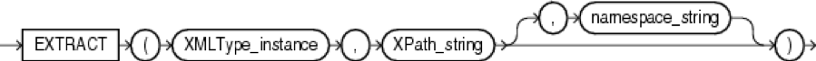

This blog explores a few methods for handling XML data in Oracle&reg; PL/SQL. Learn more about our [database services](https://www.rackspace.com/dba-services).

<!--more-->

If you want to convert XML data from an XML file into Oracle PL/SQL rows and columns,
the following options are available:

-	Load the XML file into an XML table and then parse it.
-	Directly parse the XML file without loading into an XML table.

To load the XML data into an Oracle table, use options such as `SQLLOADER`,
`utl_file`, or `XML CLOB`. After you load the data into a table, you need to
extract values from each XML tag. To extract the XML data, use the built-in
functions provided by Oracle, such as `XMLELEMENT`, `XMLAGG`, `XMLTABLE`,
`XMLSEQUENCE`, and `EXTRACTVALUE`.

The main built-in function used is `EXTRACT`, which is shown in the following image:

*Image Source*: [https://docs.oracle.com/cd/B19306_01/server.102/b14200/img/extract_xml.gif](https://docs.oracle.com/cd/B19306_01/server.102/b14200/img/extract_xml.gif)

### Example file

To explore these options in detail, the example in this post uses the
file, **Test.xml**. To access the file in the database, use the **DBA** directory,
which is defined in Oracle. The examples use **XX\_UTL\_DIR** as the reference
directory. You can use your own directory of choice instead.

**Test.xml** has the following contents:

    <?xml version = '1.0' encoding = 'UTF-8'?>
    <UANotification xmlns="https://www.test.com/UANotification">
        <NotificationHeader>
        <Property name="ErrorMessage" value="User Data Invalid"/>
                <Property name="SPSDocumentKey" value="11111111111"/>
                <Property name="AppKey" value="22222222"/>
                <Property name="FileName" value="SH201701181418.61W"/>
                <Property name="SenderName" value="Test"/>
                <Property name="ReceiverName" value="Integrated Supply Network"/>
                <Property name="DocumentType" value="856"/>
                <Property name="SourceDataType" value="XML"/>
                <Property name="DestinationDataType" value="FEDS"/>
                <Property name="XtencilNet" value="shFedsWrite"/>
                <Property name="PreviousMaps" value="shFedsWrite]"/>
        </NotificationHeader>
        <FINotification xmlns="https://www.test.com/fileIntegration">
                <ServiceResult>
                        <DataError>
                                <Message>Invalid data test 1</Message>
                        </DataError>
                        <DataError>
                                <Message>Invalid data test 2</Message>
                        </DataError>
                </ServiceResult>
        </FINotification>
    </UANotification>

### First approach:  Load the XML file into an XML table and then parse it

First, create a table in Oracle that includes a column with data type **XMLTYPE**.

For example, use the following code to create the table:

    CREATE TABLE xml_tab (
      File_name  varchar2(100),
      xml_data  XMLTYPE
    );

Next, insert data from **Test.xml** into **xml.tab** by using the following
command:.

    INSERT INTO xml_tab
    VALUES ( ‘Test.xml’,
    XMLTYPE (BFILENAME ('XX_UTL_DIR', ‘Test.xml’),
    NLS_CHARSET_ID ('AL32UTF8')
    ));

The preceding INSERT statement inserts the data of file **Test.xml**
into the field `xml_data` of the table **xml\_tab**. After the INSERT completes, the XML
data is available in table **xml\_tab**. To read the data in a SELECT query, use
the SELECT statements described next.

To read the text of the tag `Message` that is available under the parent tag
`DataError`, use the following SQL command:

    SELECT EXTRACT (VALUE (a1),
                '/DataError/Message/text()',
                'xmlns="https://www.test.com/fileIntegration')
          msg
     FROM xml_tab,
       TABLE (
          XMLSEQUENCE (
             EXTRACT (
                xml_data,
                '/UANotification/ns2:FINotification/ns2:ServiceResult/ns2:DataError',
                'xmlns="https://www.test.com/UANotification" xmlns:ns2="https://www.test.com/fileIntegration"'))) a1
    WHERE file_name = 'Test.xml';

To read `property name` and its value, use the following SQL command:

    SELECT EXTRACTVALUE (VALUE (a1),
                     '/Property/@name',
                     'xmlns="https://www.test.com/UANotification')
          attribute,
       EXTRACTVALUE (VALUE (a1),
                     '/Property/@value',
                     'xmlns="https://www.test.com/UANotification')
          VALUE
     FROM xml_tab,
       TABLE (
          XMLSEQUENCE (
             EXTRACT (
                xml_data,
                '/UANotification/NotificationHeader/Property',
                'xmlns="https://www.test.com/UANotification" xmlns:ns2="https://www.test.com/fileIntegration"'))) a1
     WHERE file_name = 'Test.xml';

### Second approach: Directly parse the XML file without loading it into an XML table

If you want to directly parse **Test.xml** without loading it into the Oracle
table, then you might use the following SELECT statement:

    SELECT EXTRACTvalue (VALUE (a1),
                '/Property/@name',
                'xmlns="https://www.test.com/UANotification') attribute,
                 EXTRACTvalue (VALUE (a1),
                '/Property/@value',
                'xmlns="https://www.test.com/UANotification') value
     FROM
       TABLE (
          XMLSEQUENCE (
             EXTRACT (
                xmltype(BFILENAME ('XX_UTL_DIR', 'Test.xml'),NLS_CHARSET_ID ('AL32UTF8')),
                '/UANotification/NotificationHeader/Property',
                'xmlns="https://www.test.com/UANotification" xmlns:ns2="https://www.test.com/fileIntegration"'))) a1

### Wrap up

Both of the methods to parse XML data described in this post give you the same final
output. The first approach is a three-step process, which requires the following
pieces of code:

1.  Create the Oracle table.
2.  Insert the data of the XML file into the created table.
3.  Write a SELECT statement to extract values from the table.

The second option is a single-step process where you write a SELECT statement
and get the desired result.

### Conclusion

Either option works, but if you need to store the XML file in Oracle for
future reference, then you should use the first approach because the data persists
in the table for future reference and you can access it any time.

By choosing the second approach, you can directly parse the data. However, with
this option, the original XML file data can’t be accessed in the future because this
option never stores the content of XML file in Oracle.

Use the Feedback tab to make any comments or ask questions.

### Optimize your environment with expert administration, management, and configuration

[Rackspace's Application services](https://www.rackspace.com/application-management/managed-services)
**(RAS)** experts provide the following [professional](https://www.rackspace.com/application-management/professional-services)
and
[managed services](https://www.rackspace.com/application-management/managed-services) across
a broad portfolio of applications:

- [eCommerce and Digital Experience platforms](https://www.rackspace.com/ecommerce-digital-experience)
- [Enterprise Resource Planning (ERP)](https://www.rackspace.com/erp)
- [Business Intelligence](https://www.rackspace.com/business-intelligence)
- [Salesforce Customer Relationship Management (CRM)](https://www.rackspace.com/salesforce-managed-services)
- [Databases](https://www.rackspace.com/dba-services)
- [Email Hosting and Productivity](https://www.rackspace.com/email-hosting)

We deliver:

- **Unbiased expertise**: We simplify and guide your modernization journey,
focusing on the capabilities that deliver immediate value.
- **Fanatical experience&trade;**: We combine a Process first. Technology second.&reg;
approach with dedicated technical support to provide comprehensive solutions.
- **Unrivaled portfolio**: We apply extensive cloud experience to help you
choose and deploy the right technology on the right cloud.
- **Agile delivery**: We meet you where you are in your journey and align
our success with yours.

[Chat now](https://www.rackspace.com/#chat) to get started.

