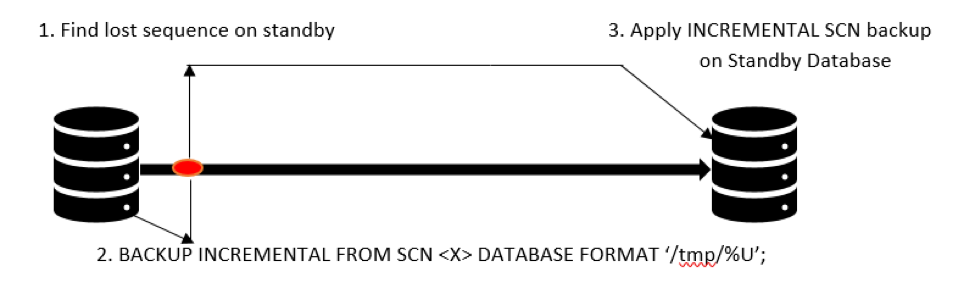

If a physical standby database loses or corrupts an archived redo data or
has an unresolvable archive gap, which is the result of archive logs getting
missed on the primary database or the archives getting corrupted, then no
valid backups exists for recovery.

<!--more-->

If an archive exists on the primary database, troubleshoot the issue, and if
the archive is not corrupted, the archive is automatically transferred. If
an archive is corrupted at the operating system (OS) level and you do have a
backup, then restore the database by using the archive log from the backup. If
none of these solutions work, you can recover the standby database with an
incremental system change number (SCN) for standby/Roll Forward.

This blog shows you how to use the Oracle&reg; Recovery Manager (RMAN)
incremental backup to roll the standby database forward faster than by using a
redo log apply.

### How does an incremental backup work?

The following image shows the incremental backup process:

All the changes between the SCN of the original image copy and the SCN of the
incremental backup are applied to the image.

To use this method, create a backup on the primary database that starts at the
standby database’s current SCN, which you can then use to roll forward the standby database.

### Steps to roll forward a physical standby database

Use the following steps to roll forward a physical standby database.

#### Find the SCN gap

1. Use the following code to record the SCN gap between the standby and the
   production databases:

        SQL> select status,instance_name,database_role from v$database,v$instance;

        STATUS       INSTANCE_NAME    DATABASE_ROLE
        ------------ ---------------- ----------------
        MOUNTED      PROD             PHYSICAL STANDBY

        SQL> SELECT to_char(CURRENT_SCN) FROM V$DATABASE;

        CURRENT_SCN
        -------------
        5997422841660

        SQL> select min(fhscn) from x$kcvfh;

        CURRENT_SCN
        -------------
        5997422841643

2. Note the lower SCN from the preceding queries, and run the following code:

        SQL> select status,instance_name,database_role from v$database,v$instance;

        STATUS       INSTANCE_NAME    DATABASE_ROLE
        ------------ ---------------- ----------------
        OPEN          PROD             PRIMARY

        SQL> SELECT to_char(CURRENT_SCN) FROM V$DATABASE;

        CURRENT_SCN
        -------------
        5997428587053

#### Take an incremental SCN backup and create a standby **controlfile** backup

1. Run the following code on the production server to take an SCN backup:

        [oracle@pslmtli.rackspace.com] $ rman target /
        RMAN>BACKUP INCREMENTAL FROM SCN 5997422841643 DATABASE FORMAT '/u01/orapi/stage/TEMP/DBDR_%U' tag 'ArchiveGap';
        Starting backup at 25-MAR-18

        channel ORA_DISK_1: starting full datafile backup set
        channel ORA_DISK_1: specifying datafile(s) in backup set
        including current control file in backup set
        channel ORA_DISK_1: starting piece 1 at 25-MAR-18
        channel ORA_DISK_1: finished piece 1 at 25-MAR-18
        piece handle=/u01/orapi/stage/TEMP/ DBDR123.bak tag= ArchiveGap comment=NONE
        channel ORA_DISK_1: backup set complete, elapsed time: 00:00:03
        Finished backup at 25-MAR-18

2. Run the following code to create the standby **controlfile** backup:

        RMAN> backup current controlfile for standby format ='/u01/orapi/stage/TEMP/standby_control.bctl';

3. Transfer the backups from the primary server to the standby.

4. Run the following code to apply a incremental SCN backup on the standby
   database, which catalogs all the backup pieces and the **controlfile**:

        [oracle@nslmtli.rackspace.com] $ rman target /

        Recovery Manager: Release 11.2.0.1.0 - Production on Sun Mar 2515:51:02 2012

        Copyright (c) 1982, 2009, Oracle and/or its affiliates.  All rights reserved.

        connected to target database: PSTLI (DBID=431934829, not open)

        RMAN> catalog start with ‘/u01/archives/stage/temp/’;

5. Run the following code to recover the standby database with the cataloged
   incremental backup pieces:

        RMAN> RECOVER DATABASE NOREDO;

6. Run the following code to shutdown the physical standby database, start it
   in the *nomount* stage, and restore the standby **controlfile** backup that
   you took from the primary database:

        RMAN> shutdown immediate

        database dismounted
        Oracle instance shut down

        RMAN> startup nomount

        connected to target database (not started)
        Oracle instance started

        Total System Global Area     659730432 bytes

        Fixed Size                     2216264 bytes
        Variable Size                398462648 bytes
        Database Buffers             255852544 bytes
        Redo Buffers                   3198976 bytes

        RMAN> restore standby controlfile from ‘/u01/archives/stage/temp/standby_control.bctl’;

        Finished restore at 25-MAR-18

7. Shutdown the standby database and mount the standby database so that you can
   mount the standby database with the new **controlfile** that was restored in
   the previous step.

Now the standby database is synchronized with the primary database.

### Conclusion

You can use RMAN incremental backups to synchronize a physical standby database
with the primary database. By using the RMAN `BACKUP INCREMENTAL FROM SCN`
command, you can create a backup on the primary database that starts at the
standby database's current SCN, which you can then use to roll the standby
database forward in time.

Use the Feedback tab to make any comments or ask questions.

### Optimize your environment with expert administration, management, and configuration

[Rackspace's Application services](https://www.rackspace.com/application-management/managed-services)
**(RAS)** experts provide the following [professional](https://www.rackspace.com/application-management/professional-services)
and
[managed services](https://www.rackspace.com/application-management/managed-services) across
a broad portfolio of applications:

- [eCommerce and Digital Experience platforms](https://www.rackspace.com/ecommerce-digital-experience)
- [Enterprise Resource Planning (ERP)](https://www.rackspace.com/erp)
- [Business Intelligence](https://www.rackspace.com/business-intelligence)
- [Salesforce Customer Relationship Management (CRM)](https://www.rackspace.com/salesforce-managed-services)
- [Databases](https://www.rackspace.com/dba-services)
- [Email Hosting and Productivity](https://www.rackspace.com/email-hosting)

We deliver:

- **Unbiased expertise**: We simplify and guide your modernization journey,
focusing on the capabilities that deliver immediate value.
- **Fanatical Experience**&trade;: We combine a Process first. Technology second.&reg;
approach with dedicated technical support to provide comprehensive solutions.
- **Unrivaled portfolio**: We apply extensive cloud experience to help you
choose and deploy the right technology on the right cloud.
- **Agile delivery**: We meet you where you are in your journey and align
our success with yours.

[Chat now](https://www.rackspace.com/#chat) to get started.
