SAP&reg; Hybris Cloud for Customer (C4C) is a cloud-based solution for effectively
managing customer sales, customer service, marketing activities, and customer
relationships. SAP C4C is a Software as a Service (SaaS) platform for sales and
services.

<!--more-->

C4C includes out-of-the-box integration with Microsoft&reg; Outlook&reg;,
which helps business users to manage contacts and email activities
to synchronize from Outlook.

This blog covers the Outlook add-in feature and discusses step-by-step
instructions to integrate Outlook with C4C. The add-in is available in the
download link of the C4C application.

**Note:** This add-in is available for the Outlook client only. Default add-ins
are available in C4C, based on the client's requirements.

### Prerequisite: Fine-tune configuration

Before we enable the Outlook integration, we need to fine-tune the business
configuration by executing the following steps:

1. Go to **Business Configuration>Implementation Projects>Open Activity List**.
2. Select the **Fine-Tune** tab.
3. Add **Activities** to the solution as shown in the following image:

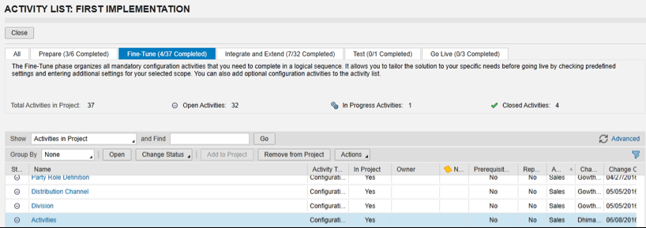

### Install the C4C Outlook add-in

To integrate C4C with Outlook, perform the following steps:

1.	Close Outlook.
2.  Login into C4C and navigate to **Downloads**.
3.	Click **Add-in for Microsoft Outlook** as shown in the following image:

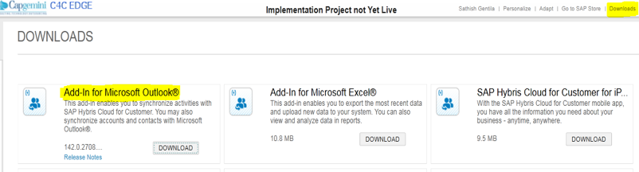

After the successful installation of the Outlook add-in, the following tabs are
available in the toolbars for each activity type:

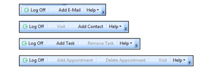

Perform the following steps to enable the Outlook integration features:

1. Choose **Tools>Trust Center** and select **Add-Ins** from left-hand panel.
2. Select **SAP Hybris Cloud for Customer Add-In for Microsoft Outlook**.
3. Select **Manage: Disabled Items** and click **Go**.
4. Ensure that you enable any disabled items.

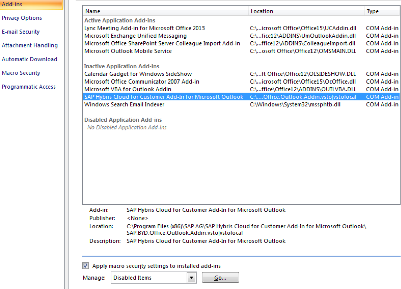

<ol start=5>
    <li>Log on to C4C to provide the URL and user credentials in the pop-up
    window as shown in the following image:</li>
</ol>

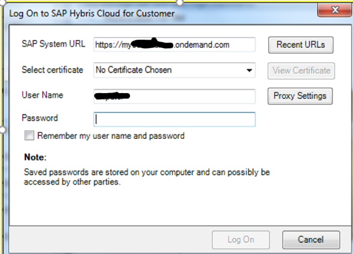

<ol start=6>
    <li>To activate the business object synchronization functionality, select
    <b>View>SAP Hybris Cloud for Customer</b> as shown in the following image:</li>
</ol>

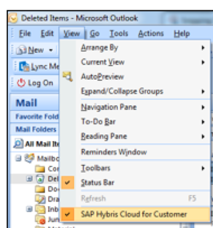

<ol start=7>
    <li> Select <b>Settings</b> from the Outlook menu bar to select the
    data to synchronize with C4C. The settings are shown in the following image:</li>
</ol>

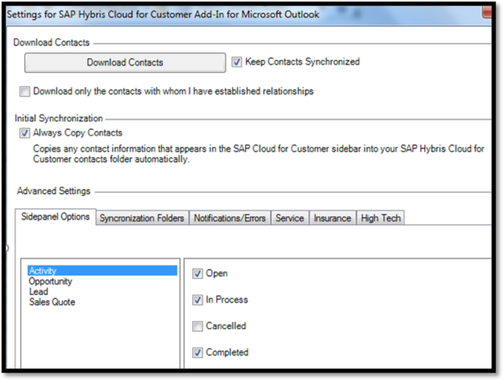

<ol start=8>
    <li>Select <b>Download Contacts</b> to download and synchronize contacts between C4C
    and Outlook.</li>
</ol>

<ol start=9>
    <li> Select <b>Advanced Settings>Activity</b> to synchronize activities, leads, and
   opportunities.</li>
</ol>

### The C4C Outlook add-in synchronization functionality

The C4C Outlook add-in provides the **Add E-mail** button, as shown in the
following image, so you can synchronize inbound emails to C4C. By using this
function, you can track email as business activities, generate reports, and
possibly identify new business opportunities.

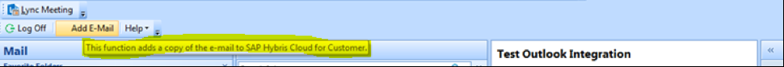

Similarly, the add-in enables you to add appointments, tasks, and contacts as
shown in the following images:

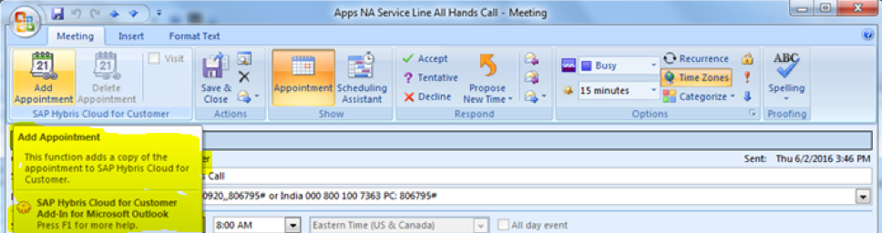

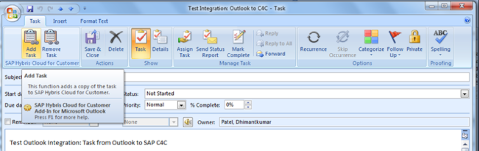

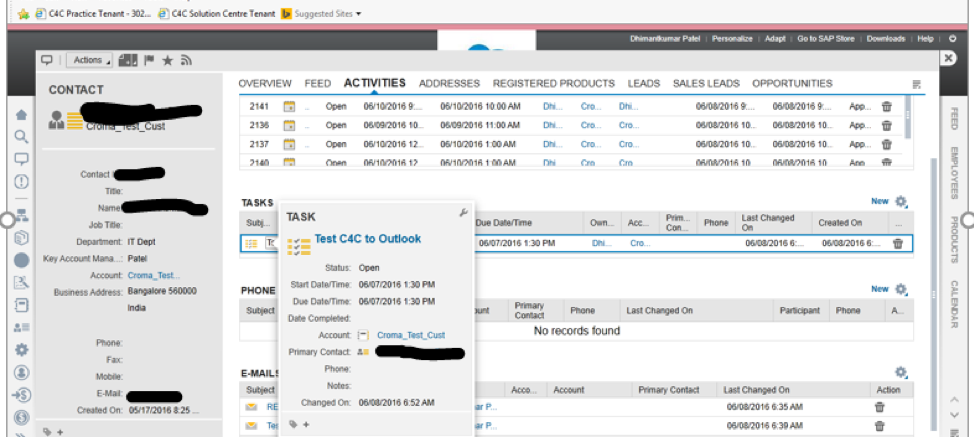

To download and activate automatic synchronization of contacts between Outlook
and C4C, choose **Tools > SAP Cloud for Customer Add-In Settings** in Outlook
and check the options as shown in the following image:

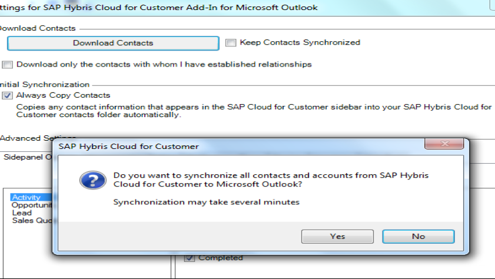

You can select the following business object types for automatic synchronization:

-	Opportunities
-	Leads
-	Activities
-	Campaigns
-	Sales Quotes
-	E-mails
-	Appointments
-	Tasks
-	Contacts

The add-in also provides the **Save and Send email to Hybris C4C** button in
Outlook for sending email and for creating new contacts. You can choose an
account to associate with email and contacts when you synchronize the data with
C4C.

### Conclusion

The C4C Outlook integration provides a quick view of sales information like
opportunities and associated activities. It enables customers to link e-mail
conversations, contacts, appointments, tasks, and visits in Outlook and to
synchronize data with C4C.

Use the Feedback tab to make any comments or ask questions.

### Optimize your environment with expert administration, management, and configuration

[Rackspace's Application services](https://www.rackspace.com/application-management/managed-services)
**(RAS)** experts provide the following [professional](https://www.rackspace.com/application-management/professional-services)
and
[managed services](https://www.rackspace.com/application-management/managed-services) across
a broad portfolio of applications:

- [eCommerce and Digital Experience platforms](https://www.rackspace.com/ecommerce-digital-experience)
- [Enterprise Resource Planning (ERP)](https://www.rackspace.com/erp)
- [Business Intelligence](https://www.rackspace.com/business-intelligence)
- [Salesforce Customer Relationship Management (CRM)](https://www.rackspace.com/salesforce-managed-services)
- [Databases](https://www.rackspace.com/dba-services)
- [Email Hosting and Productivity](https://www.rackspace.com/email-hosting)

We deliver:

- **Unbiased expertise**: We simplify and guide your modernization journey,
focusing on the capabilities that deliver immediate value.
- **Fanatical Experience**&trade;: We combine a Process first. Technology second.&reg;
approach with dedicated technical support to provide comprehensive solutions.
- **Unrivaled portfolio**: We apply extensive cloud experience to help you
choose and deploy the right technology on the right cloud.
- **Agile delivery**: We meet you where you are in your journey and align
our success with yours.

[Chat now](https://www.rackspace.com/#chat) to get started.
