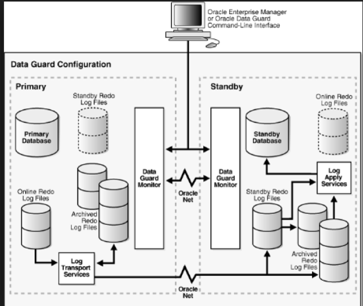
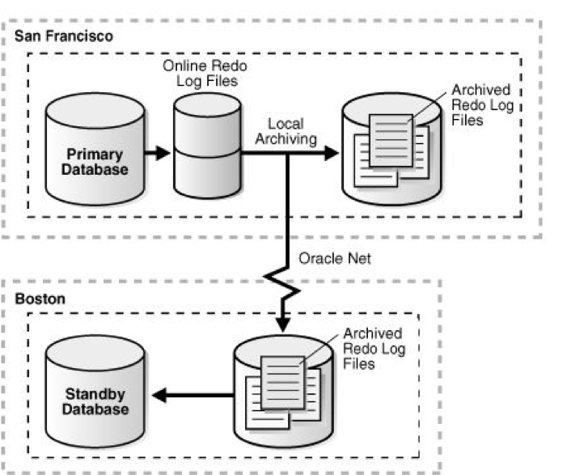
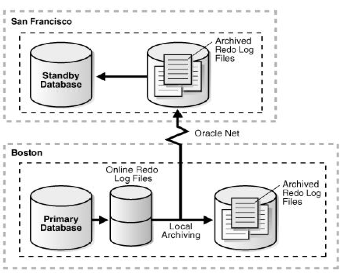
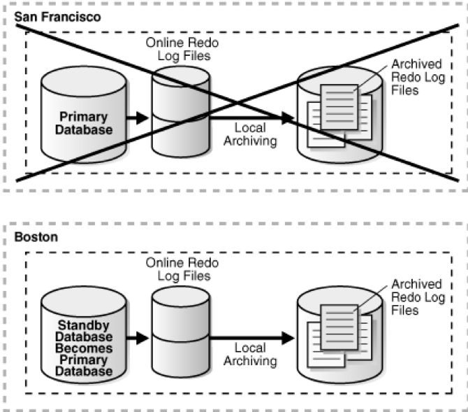

As IT continues to grow, information systems are becoming more critical in
different industries. Service interruptions in information systems can cause
economic loss, critical data loss, and impact the brand image in the market,
especially for industries such as communication, finance, medical care,
e-commerce, logistics, and government. Therefore, service continuity is critical
to the construction of information systems. Currently, service continuity is
typically improved by building disaster recovery (DR) centers where copies of
production data are saved.

<!--more-->

### Introduction

In a traditional DR solution, one DR center is deployed for each production
data center (DC). The DR center does not provide service access unless the production
DC encounters a disaster that leads to a service breakdown, which can't
be repaired in a short span of time. Therefore, DR centers face the following
challenges:

- When the production center encounters power supply failures, fires, floods, or
earthquakes, manual operation is required to switch services to the DR center.
Professional recovery measures and debugging are also required. These disasters
might cause long-term service interruption and service discontinuity.

- The DR center does not provide services and remains idle most of the time,
which lowers resource usage.

To meet customer requirements on efficient resource usage, load balancing, and
automatic switchover between two DCs, Oracle&reg; launched the
end-to-end Active-Active DC Solution. This solution enables both DCs to run
concurrently and share service loads to improve the overall service capability
and resource usage. The solution also ensures automatic failover with zero
service awareness in case of device failures or a single-DC failure. In addition,
it boasts zero Recovery Point Objective (RPO) and zero Recovery Time Objective
(RTO). Note: RTO depends on the application system and the deployment mode.

There are two availability modes in the current storage industry:

-	active-passive (AP) or active-standby
-	active-active (AA) or metro virtual data center (MVDC)

### Critical components of the database layer

The database (DB) should be set up in active-standby mode with a zero data loss
option. The following items are critical components:

-	Oracle Data Guard Broker: Automates and centralizes the Data Guard
configuration and helps invoke switchover, or failover, with a single
command for complex role changes.
-	Flashback Database: Provides rewind, or revert, for a DB, and stores flashback
log information in the flash recovery area.
-	Fast-Start Failover (FSFO): Enables failover with zero data loss. FSFO does
not trigger unless the standby DB is in sync with primary DB.
-	Observer: Provides a separate process incorporated into the Data Guard command-line
interface, `dgmgrl`, which monitors the state of primary and standby DBs for
possible failure conditions.

### Data Guard configuration

The following image shows the Data Guard configuration:

*Image source:* [https://neeraj-dba.blogspot.com/2011/10/dataguard-broker-and-its-benefits_05.html](https://neeraj-dba.blogspot.com/2011/10/dataguard-broker-and-its-benefits_05.html)

On the primary DB, the Log Writer (LGWR) process submits the redo data to one
or more Log Network Server (LNSn) processes, which then initiates the network
I/O to multiple remote destinations in parallel. Transactions are not committed
on the primary database until the redo data is necessary to recover the
transaction received by all LGWR SYNC destinations.

On the standby DB, the Remote File Server (RFS) receives redo data over the
network from the LGWR process and writes the redo data to the standby redo log
files.

### Maximum availability architecture

When you design an architecture for maximum availability, you should consider
both the possible causes of downtime and how to classify unplanned and planned
downtime.

Unplanned downtime includes unexpected interruptions to the following items:

-	Server availability: You need to ensure uninterrupted access to DB
services despite the unexpected failure of one or more machines hosting the
DB server, which could happen due to hardware or software fault. Oracle
Real Application Clusters (RAC) provide the most effective protection against
such failures.

-	Data availability: To mitigate data failures, such as loss, damage or
corruption of business-critical data, your plan needs to make sure that you
always have access to your data.

Planned downtime includes scheduled interruptions to access including the
following items:

-	System changes
-	Data changes
-	App changes

### Switchover testing scenarios for a MVDC

A switchover is a controlled, planned role reversal operation where the primary
and standby DBs in the Data Guard configuration switch their roles. After a switchover,
each database continues to participate in the Data Guard configuration in its new role.

#### Switchover process

A switchover takes place in the following sequence:

1.	The original primary DB switches role to standby.
2.	The original standby DB transitions to the primary role.

The Data Guard Broker takes care of the following activities automatically when you
perform a switchover:

- Verifies that the primary and the target standby DBs are online and that
there are no errors.
- Shuts down all but one instance in the RAC configuration for both primary
and standby DBs.
- Switches the roles of the primary and standby DBs. The Data Guard Broker first
converts the original primary DB to run in the standby role. Then, the broker
transitions the target standby DB to the primary role. It also updates the
broker configuration file to record the changes in roles to ensure that each
DB runs in the correct role after a restart.
- Restarts the new standby (former primary) DB and starts the Redo Apply process,
applying redo data from the new primary DB. If this is a RAC DB, the broker
restarts the instances that it shut down before the switchover.
- Restarts the new primary DB, opens and starts redo transport services,
transmitting redo data to the standby DB. If this is a RAC DB, the broker
restarts the instances that it shut down before the switchover.

Before switchover:

*Image source:* [https://docs.oracle.com/cd/E11882_01/server.112/e41134/role_management.htm#SBYDB00615](https://docs.oracle.com/cd/E11882_01/server.112/e41134/role_management.htm#SBYDB00615)

After switchover:

*Image source:* [https://docs.oracle.com/cd/E11882_01/server.112/e41134/role_management.htm#SBYDB00615](https://docs.oracle.com/cd/E11882_01/server.112/e41134/role_management.htm#SBYDB00615)

#### Steps to perform a switchover

To perform a switchover, execute the following steps:

1.	Ensure the application is completely shut down, and no user is connected to
the database.

2. Disable the archive UTL scripts that are running in both DCs at least
30 minutes before the switchover starts. After the testing is complete and the
DB is running in the preferred location, uncomment the archived utility scripts.

3.	Run the following SQL queries in the current primary DB:

        SELECT * FROM DBA_JOBS_RUNNING; (There should not be any sys owned jobs running)
        SELECT OWNER, JOB_NAME, START_DATE, END_DATE, ENABLED FROM DBA_SCHEDULER_JOBS WHERE ENABLED='TRUE' AND OWNER <> 'SYS';
            (Data Guard Broker does not kill the jobs owned by sys.)

4. Set `job_queue_processes` and `aq_tm_processes` to 0. Make note of the
original value because you need to reset to the original value after the
switchover testing completes.

5. Stop the `emagent` that is running on the primary DB.

6. Run the following SQL queries in the current primary DB:

        SELECT sid, username, status, program, inst_id FROM gv$session
        WHERE username is not null and status='ACTIVE' order by inst_id;
            (Validate and check the number of connections is active; a large number
            of active connections can lead to the switchover taking more time.)

7. Log out of all `sqlplus` sessions where you are connected as `sys`.

8. Run the following SQL queries in the current primary DB:

        set linesize to 132
        col value format a35
        SELECT inst_id,name,value from gv$parameter
        WHERE name in ('job_queue_processes','aq_tm_processes');
            (Check and validate the value of job_queue_processes and aq_tm_processes should be zero.)

9.	Run the following command to validate the Data Guard configuration:

        DGMGRL> show configuration verbose

        ** STATUS Should show success, do not proceed if the status is not "success".

10. Check the Cluster Ready Services (CRS) status to ensure that all the resources
are registered online because the broker gives the handover to CRS to mount and
shutdown the DB during this process.

11. Switchover a few logs on the primary DB and verify they got applied on the
standby DB.

12. Before proceeding, perform a switchover and monitor the DRC log and the
alert log for any failures. The following command converts the old primary to
standby and then converts the old standby to primary:

        DGMGRL> switchover to ‘DDMPROD_STANDBY’;

13. After the switchover is complete, ensure the log transport and log apply services
are up and functioning properly.

### Failover testing scenarios for a MVDC

A failover is when the primary DB (all instances of a RAC primary DB) fails and
the standby DB is transitioned to take over the primary role. A failover is
performed in the following cases:

-	A catastrophic failure of the primary DB with no possibility of recovering
the primary DB in a timely manner.
-	When both the observer and the standby DB lose their network connection to
the primary DB, and when the standby DB confirms that it is in a *synchronized*
state.

#### Failover scenarios

The following DB conditions trigger a fast-start failover:

-	Primary site failure
-	Primary DB conditions, including the following:
   - Instance failure
   - Last surviving instance, if RAC
   - Shutdown abort of the last available instance
-	Data files taken offline due to I/O errors (threshold ignored when performing
   a failover due to offline data files)

Network-related conditions might cause a failover only if links between the
primary and observer, as well as the primary and target standby DBs, are down.
A connection between Observer and standby is required to enable the observer to
confirm that the configuration is in a synchronized state.

*Image source:* [https://docs.oracle.com/cd/E11882_01/server.112/e41134/role_management.htm#SBYDB00615](https://docs.oracle.com/cd/E11882_01/server.112/e41134/role_management.htm#SBYDB00615)

### Conclusion

An MVDC helps efficient resource usage, load balancing, high availability, and
automatic switchover between two DCs. Both DCs run concurrently (active-active)
to share service loads and improve the overall service capability. An MVDC reduces
the human intervention required to switch between databases for disaster recovery
failovers or an upgrade/maintenance switchovers.

Use the Feedback tab to make any comments or ask questions.

### Optimize your environment with expert administration, management, and configuration

[Rackspace's Application services](https://www.rackspace.com/application-management/managed-services)
**(RAS)** experts provide the following [professional](https://www.rackspace.com/application-management/professional-services)
and
[managed services](https://www.rackspace.com/application-management/managed-services) across
a broad portfolio of applications:

- [eCommerce and Digital Experience platforms](https://www.rackspace.com/ecommerce-digital-experience)
- [Enterprise Resource Planning (ERP)](https://www.rackspace.com/erp)
- [Business Intelligence](https://www.rackspace.com/business-intelligence)
- [Salesforce Customer Relationship Management (CRM)](https://www.rackspace.com/salesforce-managed-services)
- [Databases](https://www.rackspace.com/dba-services)
- [Email Hosting and Productivity](https://www.rackspace.com/email-hosting)

We deliver:

- **Unbiased expertise**: We simplify and guide your modernization journey,
focusing on the capabilities that deliver immediate value.
- **Fanatical Experience**&trade;: We combine a Process first. Technology second.&reg;
approach with dedicated technical support to provide comprehensive solutions.
- **Unrivaled portfolio**: We apply extensive cloud experience to help you
choose and deploy the right technology on the right cloud.
- **Agile delivery**: We meet you where you are in your journey and align
our success with yours.

[Chat now](https://www.rackspace.com/#chat) to get started.
