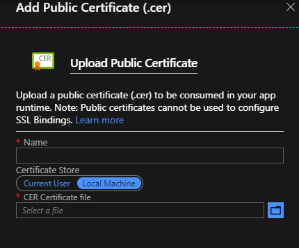
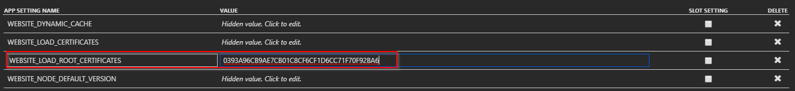
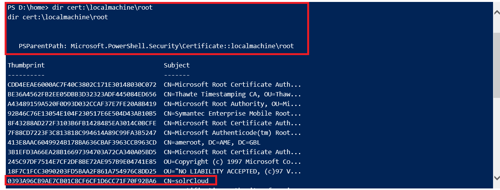
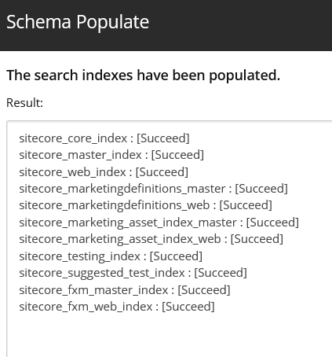

When deploying Sitecore in to an Azure App Service, you have two options for
setting up your search method. The first is method is to use the Azure search,
which is integrated into the PaaS Deploy. The other method, and my personal
favorite, is to deploy Apache&reg; Solr Cloud.

<!--more-->

Using the latter requires us to deploy virtual machines into a virtual network,
setting up both an internal load balancer with our Solr nodes in a backend pool
and a virtual net integration to connect the Azure Web Apps to the vnet over a
point-to-site vpn. Because it is best practice to run Solr Cloud with SSL, we
must purchase a publicly signed certificate to have all the nodes and the load
balancer name in the SAN list. We need a publicly signed certificate because
Azure App Service does not let you add a public key into the trusted root store.
The connection would be untrusted and fail within an App Service web app. With
the introduction of Sitecore 9.1.1, we can now deploy into a dedicated Azure App
Service Environment (ASE).

### ASE types

There are two types of ASE’s: Public and Internal, and this article focuses on
the internal type. An Internal ASE has an internal load balancer that routes
requests to the correct web app. The VNET should have a DNS server set with the
forward lookup zones that you plan to route into. In my example, I have an Internal
ASE with a domain name of **azuretestingsite.com**. All web apps provisioned
into this ASE inherit this domain name, so, if I provision a web app called
**Jimmy**, the URL would be **jimmy.azuretestingsite.com**. You can assign
custom domains to this web app as well, but they cannot overlap with the domain
that is used for the ASE.

### Setting it up

Because an ASE is provisioned into a subnet, we can create another subnet in the
same vnet to hold our Solr Cloud nodes. Within our DNS server, we can create an
*A* record called **solrlb.azuretestingsite.com**, which routes the Solr requests
to the backend nodes. Assuming we configured Solr Cloud with a self-signed
certificate for HTTPS, we need to extract the public key and upload it into each
web app that makes Solr Cloud calls. Navigate to the **SSL Settings** of the web
app, select the local machine, and upload a public certificate.

In the web app **App Settings**, add a new setting called
**WEBSITE\_LOAD\_ROOT\_CERTIFICATES** and add the thumbprint of the certificate
you uploaded. Restart the web app to load it into the trusted root store.

To verify that the certificate is loaded into the trusted root store, log in to
KUDU using the publishing credentials of the Azure Web App. Start a powershell
prompt within KUDU and type ``dir cert:\localmachine\root``.

Repeat the above steps on all the required web apps that need to access Solr
Cloud. Log in to the Sitecore management portal and populate the index schema.

We are now successfully using a self-signed certificate to make an HTTPS
connection to Solr Cloud from an Azure Web App.

Use the Feedback tab to make any comments or ask questions.