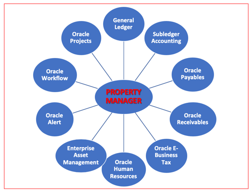
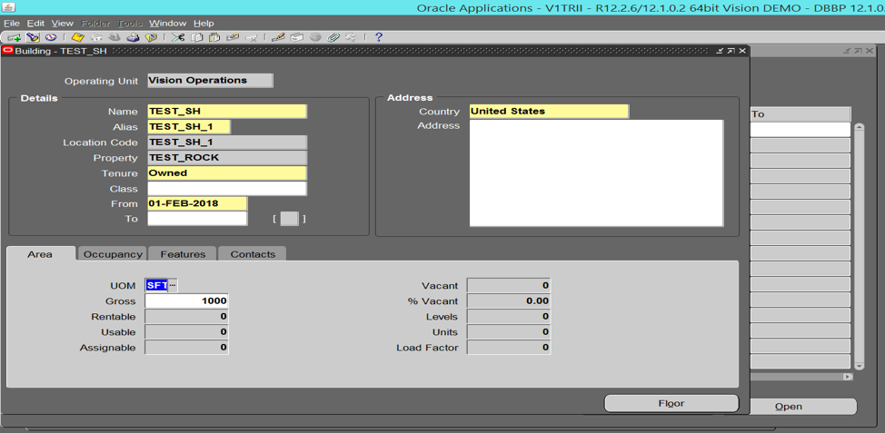
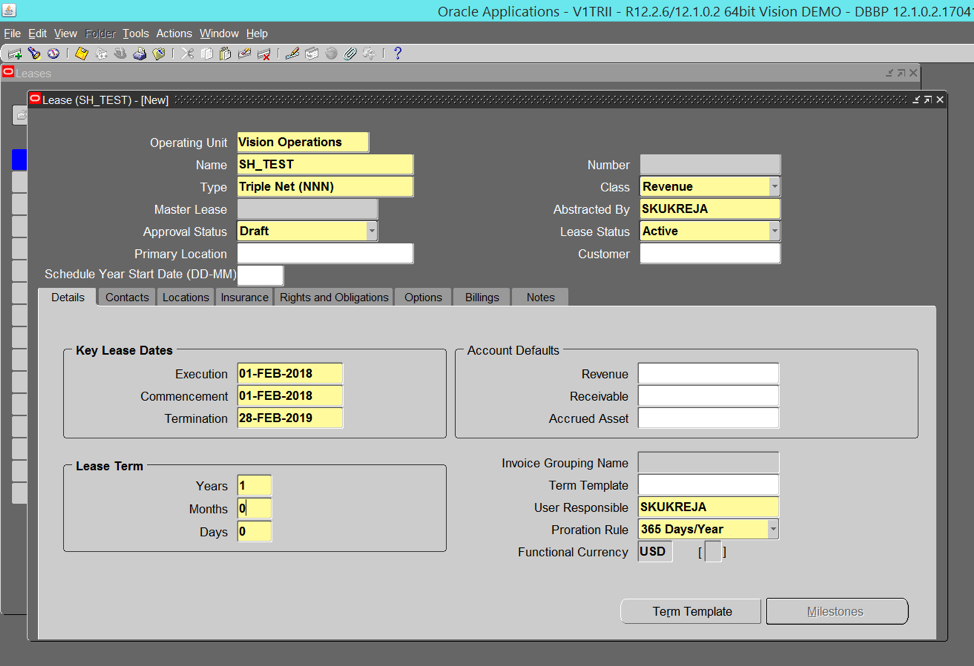

The Oracle&reg; Property Manager is part of the Oracle Real Estate Management
solution and is a database that is specifically designed for companies and corporate
giants that have large property portfolios. This blog highlights the Oracle Property
Manager’s various features and functions.

<!--more-->

### Introduction

Oracle Property Manger not only automates and organizes a company’s property
portfolio, but it also enables users to make intelligent decisions to
maximize profits. Oracle Property Manager integrates with the modules that capitalize
on database efficiency for both employees and customers, as shown in the
following image:

### Key features of the Oracle Property Manager

By using the Oracle Property Manager, you can perform the following tasks:

-	Property administration: Classify the type of property, geographical location,
    condition, and tenure.

-	Space allocation: Assign the space to an employee or customer.

-	Lease management: Perform the following activities:
    -  Abstract, modify, and amend lease information.
    -  Calculate rent and common area maintenance expenses.

-	Accept and make payments: Create invoices for Oracle Accounts Payable (AP) or
    Accounts Receivables (AR).

-	Run and view reports: Perform the following activities:
    -  Create over 30 standard reports that provide all the required information
       for the property.
    -  Use other reporting tools for customized reports.
    -  Integrate with computer-aided design (CAD) programs to import and export data.

### Property administration

By using standard forms, you can define a property as a combination of land
details and building details. The database provides a built-in hierarchy that
starts at the top by grouping properties within office parks and regions, as
shown in the following image:

Building details can include location, tenure, address, user-defined class, and
status. Additionally, you can enter other important information like area
details, occupancy area, features, and contacts.

You can also subdivide a building into floors and offices, and you can enter the
previous records for each individual subclassification. The following image
shows a building details form:

Finally, you can subdivide land into various parcels, withholding information
like land area, conditions, and the features for each classified parcel. You
can record the asset numbers, titles, and details, and do so by using flexfields.

### Space assignments

After you define the property, assign it to either an employee or a customer at
any of the previously described levels. Facilitate the assignment by using the
cost center or General Ledger (GL) codes for revenue or cost purposes. Space
assignment forms display the entered data of the assignment logically and
include the total occupancy at various levels, such as building, office, floor,
and so on. You can also record information related to any project, organization,
or task at this level.

### Lease management

By using the Oracle Property Manager, you can oversee and control a variety of lease
management tasks, such as the following tasks:

- Calculate lease amounts.
- Modify or amend a lease.
- Create invoice schedules.
- Set up milestones.
- Collect rent based on variable factors.

There are specifically-designed forms to capture the necessary information about
the property to be leased, such as details, contacts, locations, insurance, and
so on. The following image shows a lease details form:

The Oracle Property Manager enables you to create the lease according to your business
requirements. You can create a lease for the whole property, for a single floor,
or for a single building. You can use the information that you enter to
calculate the rent and share that information with other modules like Oracle
AP or AR to facilitate billing.

### Property agents and reports

The system enables you to record information about customers, suppliers, and
employees that are assigned to or associated with a particular property,
by integrating with other Oracle modules.

There are more than 30 standard reports divided into space, rent, employee,
lease, and other areas, which help you to keep track of the activities performed
in the Oracle Property Manager.

### Conclusion

You can think of the Oracle Property Manager as a property register that records various
information about the property at different levels, making property easier to
manage. The Oracle Property Manager module enables you to track what has, or has not,
been billed, and when used in combination with the AR module,
what has, or has not, been paid. You can easily interface the Oracle Property Manager with
Oracle AP, AR, and Fixed Assets to carryout various activities such as billing,
receiving rent, invoicing, and so on.

Use the Feedback tab to make any comments or ask questions.

### Optimize your environment with expert administration, management, and configuration

[Rackspace's Application services](https://www.rackspace.com/application-management/managed-services)
**(RAS)** experts provide the following [professional](https://www.rackspace.com/application-management/professional-services)
and
[managed services](https://www.rackspace.com/application-management/managed-services) across
a broad portfolio of applications:

- [eCommerce and Digital Experience platforms](https://www.rackspace.com/ecommerce-digital-experience)
- [Enterprise Resource Planning (ERP)](https://www.rackspace.com/erp)
- [Business Intelligence](https://www.rackspace.com/business-intelligence)
- [Salesforce Customer Relationship Management (CRM)](https://www.rackspace.com/salesforce-managed-services)
- [Databases](https://www.rackspace.com/dba-services)
- [Email Hosting and Productivity](https://www.rackspace.com/email-hosting)

We deliver:

- **Unbiased expertise**: We simplify and guide your modernization journey,
focusing on the capabilities that deliver immediate value.
- **Fanatical Experience**&trade;: We combine a Process first. Technology second.&reg;
approach with dedicated technical support to provide comprehensive solutions.
- **Unrivaled portfolio**: We apply extensive cloud experience to help you
choose and deploy the right technology on the right cloud.
- **Agile delivery**: We meet you where you are in your journey and align
our success with yours.

[Chat now](https://www.rackspace.com/#chat) to get started.
