When you migrate resources from one Amazon Web Services&reg; (AWS) account to another,
you might be asked to migrate the Amazon Route 53&trade; Domain Name Service (DNS) records
as well. To do this, use cli53, a command line tool for Amazon Route 53, to migrate Route 53 DNS records from
the source to the target. cli53 exports all the DNS records into a JSON file.
After cli53 moves the records, you need to make some complex changes to the file
before finally importing it to the target. This blog explains how to simplify
the process of migrating all Route 53 DNS records from the source to the target.

<!--more-->

### Overview

Use the following steps to migrate DNS records by using cli53:

1. Download and install cli53 from GitHub.
2. Create an identity and access management (IAM) user in both the AWS source and
   target accounts.
3. Export the Route 53 DNS records from the source AWS account.
4. Import the Route 53 DNS records to the target AWS account.

#### Download and install cli53

Download the cli53 utility from
[GitHub](https://github.com/barnybug/cli53/releases/tag/0.8.12).

To install cli53, select from the following installation instructions based on
your operating system.

##### Linux

To install cli53 on Linux&reg;, run the following commands:

    $ sudo mv cli53-my-platform /usr/local/bin/cli53
    $ sudo chmod +x /usr/local/bin/cli53

##### Apple Mac

To install cli53 on an Apple&reg; Mac&reg;, run the following command:

    $ brew install cli53

##### Microsoft Windows

You can run the cli53 executable (extension `.exe`) on Microsoft&reg; Windows&reg; without
installing it.

To verify cli53 on Windows, perform the following tasks:

1. Open a command prompt.
2. Change directory to the location where you downloaded the cli53 executable.
3. Run the cli35 list command, as shown in the following image:

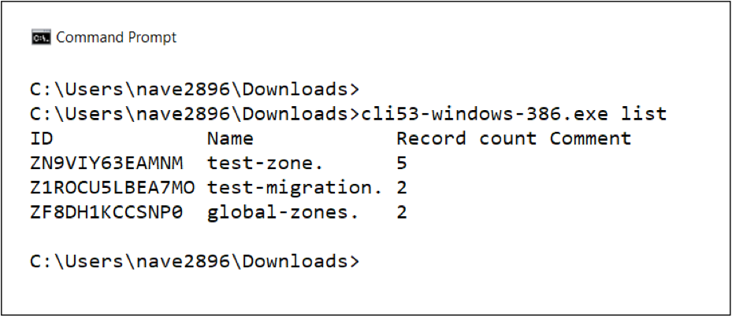

#### Create an IAM user

You need to create an IAM user on both the AWS accounts. cli53 requires one IAM
user on the source AWS account to export all the DNS records to a plain text
file and one IAM user on the target AWS account to import all the DNS records.

Use the following instructions to create an IAM user:

1. Log in to the source AWS account.
2. Go to the IAM service console and click **Users**.
3. Click **Add User**.
4. Enter your user name, select **Access type -> Programmatic Access** and
   click **Next: Permissions** as shown in the following image.

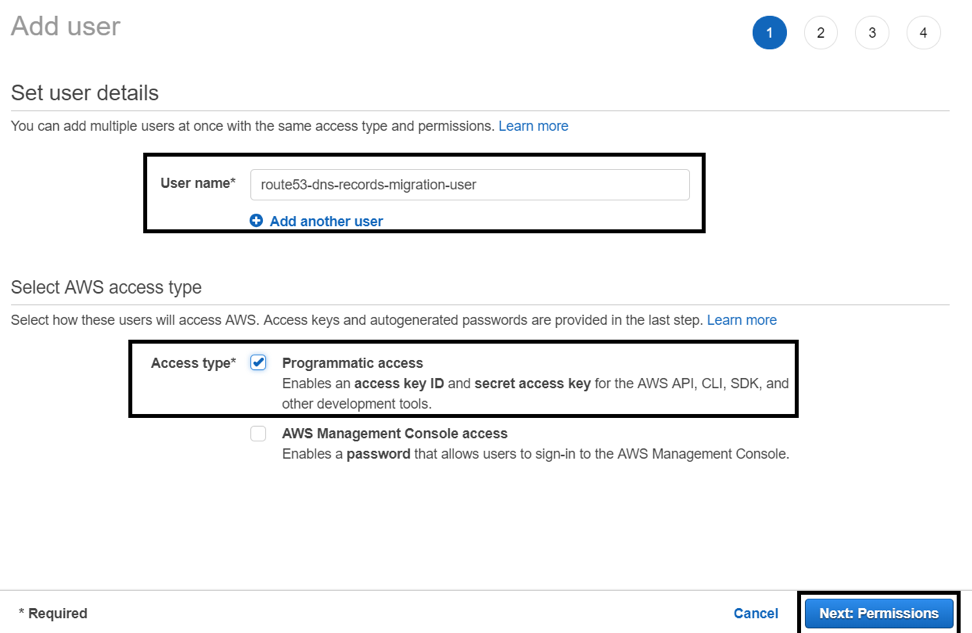

<ol start=5>
  <li>Select <b>Attach existing policies directly</b>, type <b>route53</b> in
  the filter policies search bar, select the <b>AmazonRoute53FullAccess</b>
  policy, and click <b>Next: Review</b> as shown in the following image:</li>
</ol>

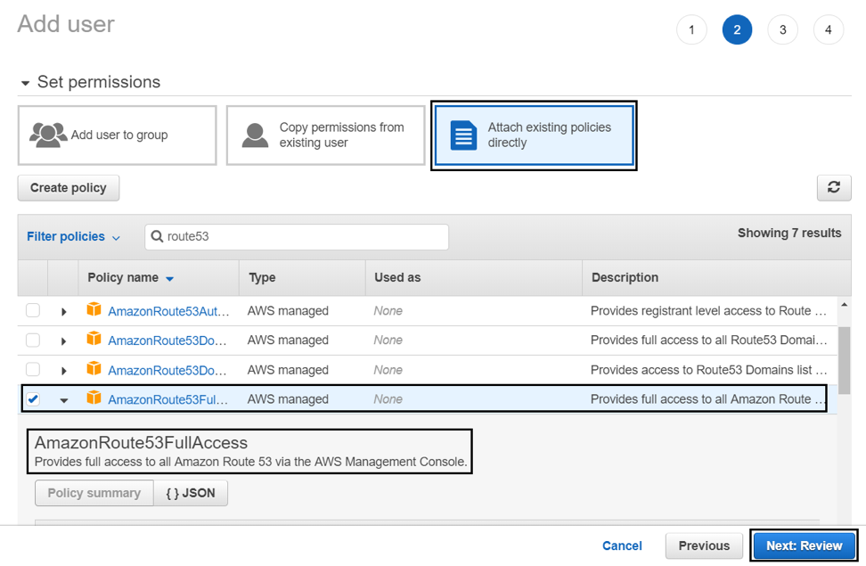

<ol start=6>
  <li>The following screen displays:</li>
</ol>

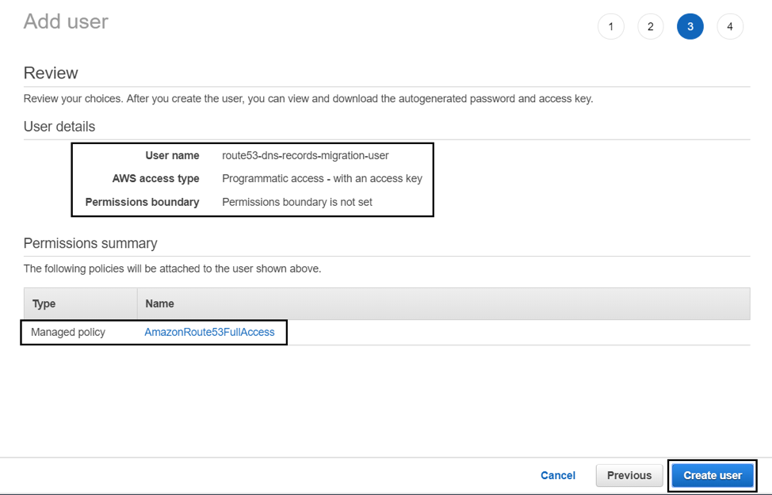

<ol start=7>
  <li>Click <b>Create User</b>. On the confirmation screen, shown in the
  following image, make note of your IAM <b>Access key ID</b> and <b>Secret
  access key</b>. We recommend that you download your keys to a <b>.csv</b>
  file on your local machine.</li>
</ol>

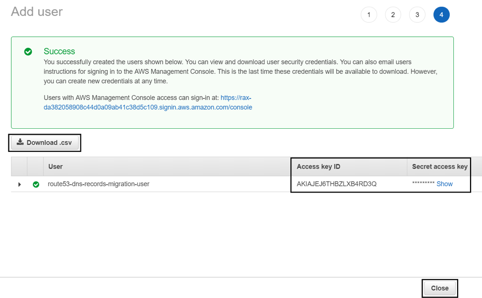

<ol start=8>
  <li>Repeat the preceding steps for the target AWS account.</li>
</ol>

#### Export Route 53 DNS records from the source account

The cli53 utility exports all Route 53 DNS records to a plain text file. This
file has all the records. You can easily edit all the DNS records and their
parameters. Use the following instructions to export Route 53 DNS records:

1. Go to your **.aws** home directory and find the **credentials** file as
shown in the following image:

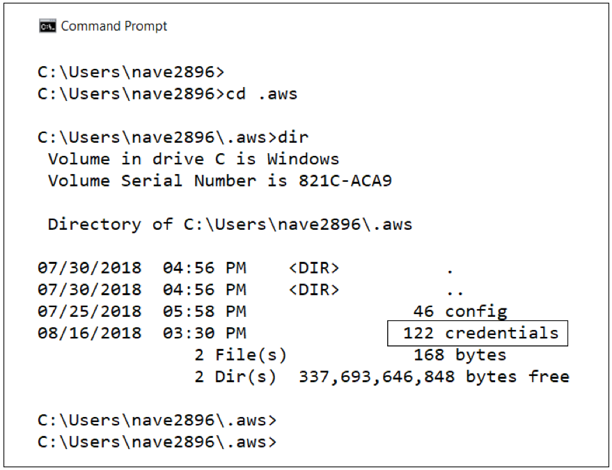

<ol start=2>
  <li>Open the editor and update the file, <b>credentials</b>, with your
  <b>Access key id</b> and <b>Secret access key</b> from the IAM user that you
  created on the source AWS account as shown in the following image. Save the
  file.</li>
</ol>

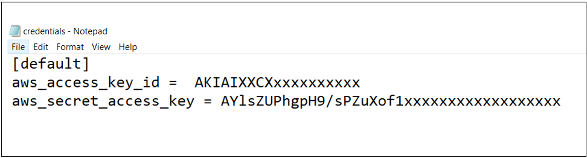

<ol start=3>
  <li>Open a command prompt and run the list command to verify that
  you are on the source AWS account as shown in the following image:</li>
</ol>

<ol start=4>
  <li>Run the following command to export the Route 53 hosted zones into the file
  from the source AWS account to create a plain text file with all the Route 53 DNS
  records.</li>
</ol>

    C:\> cli53-windows-386.exe export <hosted-zone-name> > /path/to/file

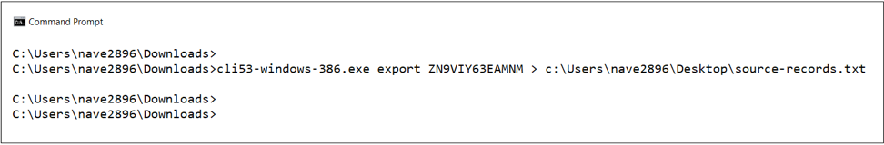

#### Import Route 53 records to the target account

To import the DNS records to the target AWS account, you need to create hosted
zones before importing the DNS records. Delete the **NS** and **SOA** DNS
records from the plain text export file because these records are available in
the target hosted zone. You should also update the credentials file with the
target AWS account, IAM user **Access key ID**, and **Secret access key**.

Use the following steps to import the DNS records to the target AWS account:

1. Delete the **NS** and **SOA** records from the export file.  Also, if there
is a different domain name on the target AWS account, update the domain
name under $ORIGIN in the plain text file and save the file.

The following image shows the DNS file before the record deletion:

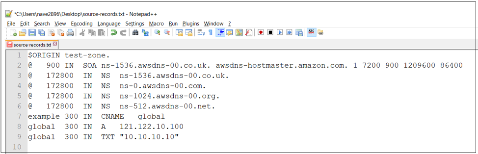

The following image shows the DNS file after the record deletion:

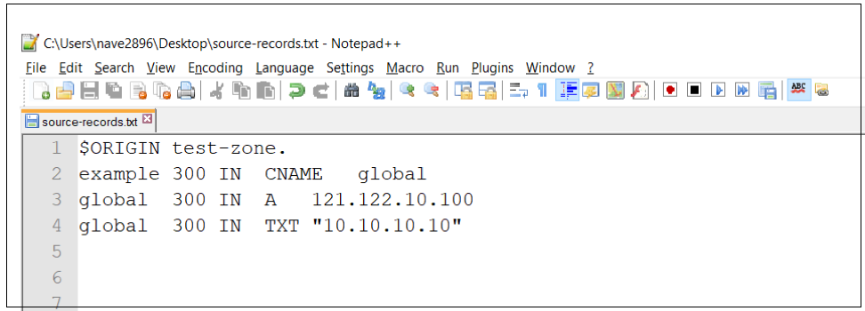

<ol start=2>
  <li>Update the <b>credentials</b> file in your home directory to add the target
  AWS account IAM user <b>Access key ID</b> and <b>Secret access key</b> as
  shown in the following image:</li>
</ol>

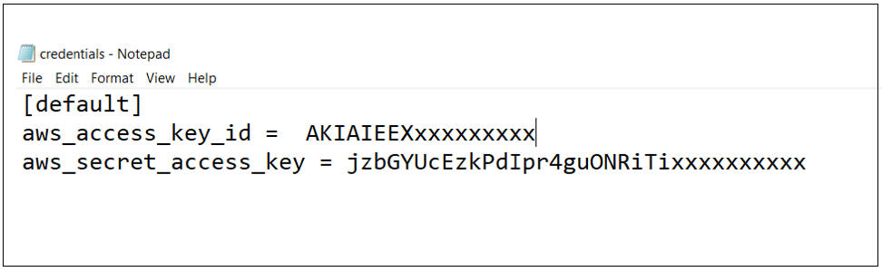

<ol start=3>
  <li>Open a command prompt and verify that you have successfully switched to
  the target AWS account. Run the <b>list</b> command to check the hosted zones
  at the target site as shown in the following image:</li>
</ol>

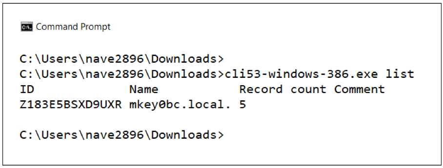

<ol start=4>
  <li>If there is not already a hosted zone in the target AWS account, create
  one to use to import the DNS records from the plain text file by running the
  following command:<</li>
</ol>

    C:\> cli53-windows-386.exe create <hosted-zone name> --comment ‘<comments>’

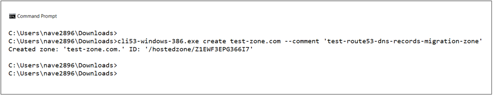

<ol start=5>
  <li>Import the DNS records to the hosted zone on the target AWS account. Copy
  the hosted zone ID and run the following command:</li>
</ol>

    C:\> cli53-windows-386.exe import --file </path/to/file> <hosted-zone-name>

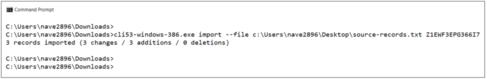

<ol start=6>
  <li>Verify all of the DNS records on the target AWS account under the
  Route 53 management console and check that all the records are in place as
  shown in the following images:</li>
</ol>

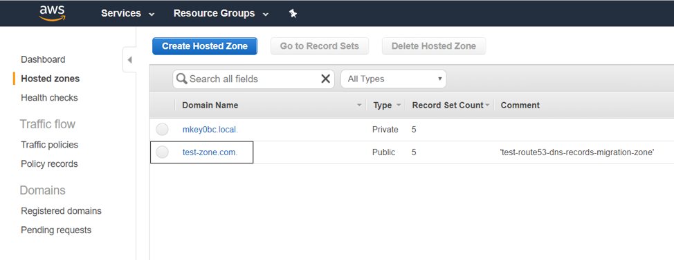

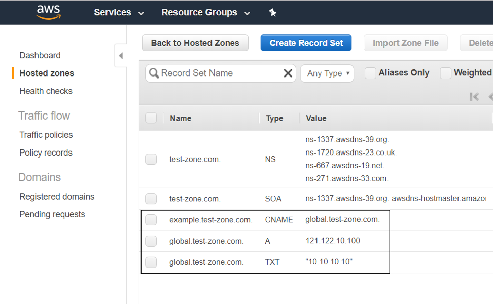

### Conclusion

Migrating DNS is a crucial activity in every migration. Manual changes in DNS
record sets are error-prone and can lead to unavoidable outages. The cli53
utility makes it easy to migrate all DNS records to the target AWS environment
by creating a plain text file that is both easy to understand and update.

Use the Feedback tab to make any comments or ask questions.

### Optimize your environment with expert administration, management, and configuration

[Rackspace's Application services](https://www.rackspace.com/application-management/managed-services)
**(RAS)** experts provide the following [professional](https://www.rackspace.com/application-management/professional-services)
and
[managed services](https://www.rackspace.com/application-management/managed-services) across
a broad portfolio of applications:

- [eCommerce and Digital Experience platforms](https://www.rackspace.com/ecommerce-digital-experience)
- [Enterprise Resource Planning (ERP)](https://www.rackspace.com/erp)
- [Business Intelligence](https://www.rackspace.com/business-intelligence)
- [Salesforce Customer Relationship Management (CRM)](https://www.rackspace.com/salesforce-managed-services)
- [Databases](https://www.rackspace.com/dba-services)
- [Email Hosting and Productivity](https://www.rackspace.com/email-hosting)

We deliver:

- **Unbiased expertise**: We simplify and guide your modernization journey,
focusing on the capabilities that deliver immediate value.
- **Fanatical Experience**&trade;: We combine a Process first. Technology second.&reg;
approach with dedicated technical support to provide comprehensive solutions.
- **Unrivaled portfolio**: We apply extensive cloud experience to help you
choose and deploy the right technology on the right cloud.
- **Agile delivery**: We meet you where you are in your journey and align
our success with yours.

[Chat now](https://www.rackspace.com/#chat) to get started.
