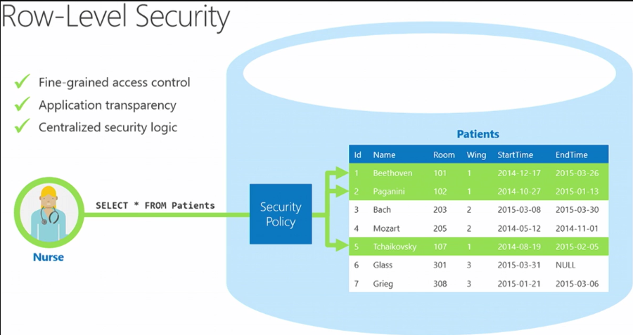
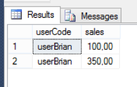
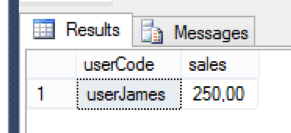

Microsoft&reg; has focused on security in SQL Server&reg;, and almost all releases
either have an enhancement to existing features or have introduced new security
features. In SQL Server 2016, Microsoft introduced many new security features
that help users protect their data, including Row-Level Security, Always
Encrypted, and Dynamic Data Masking.

<!--more-->

### Introduction

In my previous blog, I wrote about
[Dynamic data masking in SQL Server 2016](https://developer.rackspace.com/blog/dynamic-data-masking-in-sql-server-2016/).
In this blog, I introduce the Row-Level Security (RLS) feature, which enables
you to control which users have access to rows in a table. RLS enables you to
implement restrictions on the data based on the characteristics of the user who
is executing a query. RLS helps you to control access to data easily with
complete transparency for different users.

### The need for RLS

There are times when we need to return only selective data to selective users.
In the past, we did that by creating views and granting user select permission
on those views. However, that approach became unmanageable with the number of views
required to accommodate the growing volume of data and number of users. So
Microsoft introduced RLS to meet the security requirement in the new circumstances.

RLS enables fine-grained control over access to rows in a table, enabling you
to easily control which users can access which data with complete transparency
to the application.

With this feature, rows are filtered based on the execution context of the query,
rather than the current user access rights. You can create secure logic rules to
determine which user can see which rows and restrict any rows (or data) by
designing a flexible and robust security policy for a table, as shown in the
following image:

*Image Source:* [https://sqlwithmanoj.com/2015/07/13/implementing-row-level-security-rls-with-sql-server-2016/](https://sqlwithmanoj.com/2015/07/13/implementing-row-level-security-rls-with-sql-server-2016/)

### RLS properties

RLS has the following properties:

-	Fine-grained access role (control both read and write access to specific rows)
-	Application transparency (no application changes are required)
-	Centralize the access within the database
-	Easy to implement and maintain

### How RLS works

To implement the RLS, you need to consider the following elements:

-  Predicate function
-  Security predicates
-  Security policy

The following sections describe these items.

#### Predicate function

A predicate function is an in-line table value function that checks whether a
user executing a query has access to data based on logic defined on it. This
function returns `1` for each row that a user is permitted to access.

#### Security predicates

The security predicate helps in binding the predicate function to the table.
RLS supports two types of security predicates: Filter predicates and block
predicates. The filter predicate filters the data silently without raising any
error for the following operations according to the logic defined in the
predicate function.

- `SELECT`
- `UPDATE`
- `DELETE`

The block predicate explicitly raises an error and blocks the user from using
the following operations on data that violates the predicate function logic:

- `AFTER INSERT`
- `AFTER UPDATE`
- `BEFORE UPDATE`
- `BEFORE DELETE`

#### Security policy

A security policy object gets created for RLS grouping all the security
predicates that referenced the predicate function.

### Use cases

Here are some design examples of how RLS can be used:

-	A hospital can create a security policy that allows nurses to view data rows
   for their patients only.
-	A bank can create a policy to restrict access to financial data rows based
   on an employee's business division or role in the company.
- 	A multi-tenant application can create a policy to enforce a logical separation
   of each tenant's data rows from every other tenant's rows. Because data for
   many tenants is stored in a single table, the process is more efficient.
   Each tenant can see only its data rows.

### Implement RLS

Following is an example of how to implement RLS:

Step 1: Run the following code to create a database `RowFilter` and two users
to test with:

    CREATE DATABASE RowFilter;
    GO
    USE RowFilter;
    GO
    CREATE USER userBrian WITHOUT LOGIN;
    CREATE USER userJames WITHOUT LOGIN;
    GO

Step 2: Run the following code to create a table with examples and grant the
SELECT privilege to the new users:

    CREATE TABLE dbo.SalesFigures (
    [userCode] NVARCHAR(10),
    [sales] MONEY)
    GO
    INSERT  INTO dbo.SalesFigures
    VALUES ('userBrian',100), ('userJames',250), ('userBrian',350)
    GO
    GRANT SELECT ON dbo.SalesFigures TO userBrian
    GRANT SELECT ON dbo.SalesFigures TO userJames
    GO

Step 3: Run the following code to add a filter predicate function:

    CREATE FUNCTION dbo.rowLevelPredicate (@userCode as sysname)
    RETURNS TABLE
    WITH SCHEMABINDING
    AS
    RETURN SELECT 1 AS rowLevelPredicateResult
    WHERE @userCode = USER_NAME();
    GO

Step 4: Run the following code to add a filter predicate to the table
**dbo.Sales Figures**:

    CREATE SECURITY POLICY UserFilter
    ADD FILTER PREDICATE dbo.rowLevelPredicate(userCode)
    ON dbo.SalesFigures
    WITH (STATE = ON);
    GO

Step 5: Run the following code to test the results with a user that was added
in Step 2:

    EXECUTE AS USER = 'userBrian';
    SELECT * FROM dbo.SalesFigures;
    REVERT;
    GO

This code returns two rows, as shown below:

    EXECUTE AS USER = 'userJames';
    SELECT * FROM dbo.SalesFigures;
    REVERT;
    GO

This code returns one row, as shown below:

### Permissions

Creating, altering, or dropping security policies requires the **ALTER ANY
SECURITY POLICY** permission.

Creating or dropping a security policy requires the **ALTER** permission on the
schema.

Additionally, each predicate requires the following permissions, which are
added:

-	The **SELECT** and **REFERENCES** permissions on the function that is used as
   a predicate.
-	The **REFERENCES** permission on the target table that is bound to the policy.
-	The **REFERENCES** permission on every column from the target table used as
arguments.

Security policies apply to all users, including database owner (DBO) users in
the database. DBO users can alter or drop security policies. However, their
changes to security policies can be audited. In the case of high-privileged
users such as `sysadmin` or `db_owner`, you need to see all rows to troubleshoot
or validate data, so you must write the security policy to allow that.

If a security policy is created with `SCHEMABINDING = OFF`, then users must have
`SELECT` or `EXECUTE` permission on the predicate function and any additional
tables, views, or functions used within the predicate function to query the
target table. If a security policy is created with `SCHEMABINDING = ON`, which
is the default, then these permission checks are bypassed when users query the
target table.

### Modifying SQL Server 2016 RLS

Perform the following action to disable SQL Server RLS for a policy:

-	Alter security policy **UseFilter** with `State = off`.

Perform the following actions to drop the filter and security policy:

-	Drop security policy **UseFilter**.
-	Drop function **dbo.rowlevelPredicate**.

### Best practices

Microsoft suggests these best practices:

-	We highly recommended that you create a separate schema for the RLS objects
(predicate function and security policy).
-	The **ALTER ANY SECURITY POLICY** permission is intended for highly-privileged
users (such as a security policy manager). The security policy manager does not
require **SELECT** permission on the tables they protect.
-	Avoid type conversions in predicate functions to avoid potential runtime errors.
-	Avoid recursion in predicate functions wherever possible to avoid performance
degradation. The query optimizer tries to detect direct recursions. However, it is
not guaranteed to find indirect recursions (such as when a second function calls
the predicate function).
-	Avoid using excessive table joins in predicate functions to maximize performance.

### Limitation and restrictions in RLS

Following are a few limitations that apply to RLS:

-	The predicate function must be created with `SCHEMABINDING`. If a
function is created without `SCHEMABINDING`, and you try to bind it to a security
policy, it throws an error.
-	Indexed views cannot be created on a table on which RLS is implemented.
-	In-memory tables are not supported for RLS.
-	Full-text indexes are not supported.

### Conclusion

With the RLS feature in SQL Server 2016, you can provide security for records
at the database level without making changes at the application level. You can
implement RLS by using a predicate function and the new security policy feature
alongside your existing code, without needing to change the Data
Manipulation Language (DML) code in your database.

Use the Feedback tab to make any comments or ask questions.

### Optimize your environment with expert administration, management, and configuration

[Rackspace's Application services](https://www.rackspace.com/application-management/managed-services)
**(RAS)** experts provide the following [professional](https://www.rackspace.com/application-management/professional-services)
and
[managed services](https://www.rackspace.com/application-management/managed-services) across
a broad portfolio of applications:

- [eCommerce and Digital Experience platforms](https://www.rackspace.com/ecommerce-digital-experience)
- [Enterprise Resource Planning (ERP)](https://www.rackspace.com/erp)
- [Business Intelligence](https://www.rackspace.com/business-intelligence)
- [Salesforce Customer Relationship Management (CRM)](https://www.rackspace.com/salesforce-managed-services)
- [Databases](https://www.rackspace.com/dba-services)
- [Email Hosting and Productivity](https://www.rackspace.com/email-hosting)

We deliver:

- **Unbiased expertise**: We simplify and guide your modernization journey,
focusing on the capabilities that deliver immediate value.
- **Fanatical Experience**&trade;: We combine a Process first. Technology second.&reg;
approach with dedicated technical support to provide comprehensive solutions.
- **Unrivaled portfolio**: We apply extensive cloud experience to help you
choose and deploy the right technology on the right cloud.
- **Agile delivery**: We meet you where you are in your journey and align
our success with yours.

[Chat now](https://www.rackspace.com/#chat) to get started.
