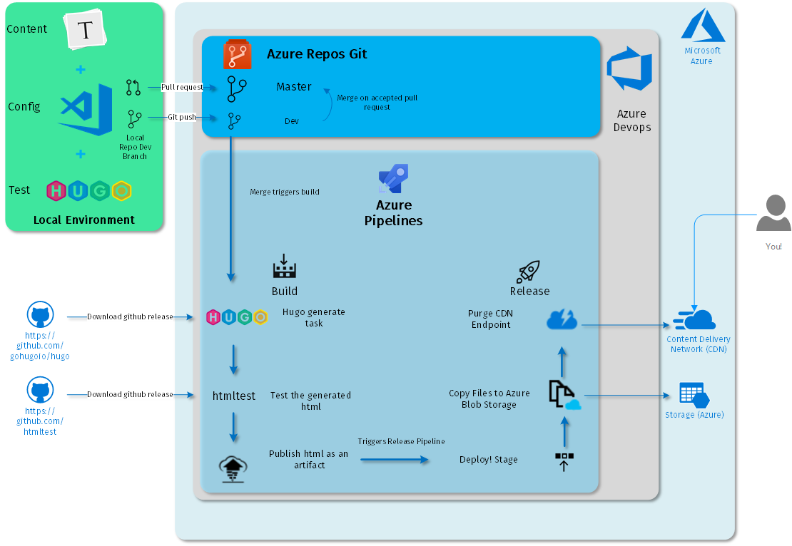
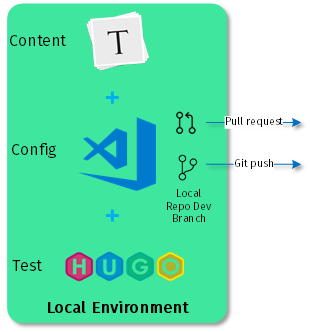
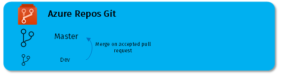
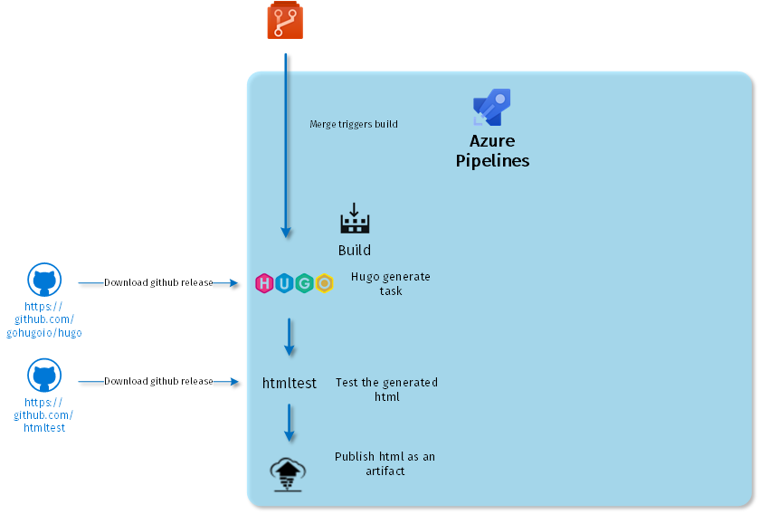
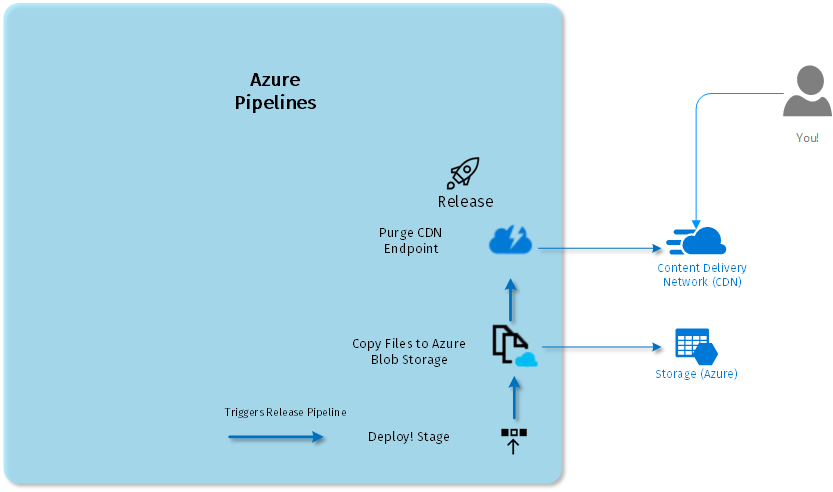

This post offers a small taste of Dutch history but, more importantly, an overview of how to user Azure DevOps to create a CI Pipeline for Hugo!

<!--more-->

## Hugo the Great

[Hugo de Groot](https://en.wikipedia.org/wiki/Hugo_Grotius) (Or **Grotius** because back then fancy people Latinized their surnames) was a Dutch jurist and writer living in the 17th Century, who is most well known for his work *De Jure Belli ac Pacis* (On The Law of War and Peace) on which most of our modern concepts relating to Internal Law are based. In those days, the Dutch Republic was not only a popular location for a stag or hen do but an almost "start-up" like country with all the growing pains that come with it. Without going into to much detail, **Grotius** found himself at the wrong end of a religious dispute and was imprisoned for life.

In 1621, he managed to escape from the castle in which he was imprisoned by hiding himself in a bookcase that was regularly transported to and from his cell so that he could study and write during his imprisonment. He fled and lived in France and Sweden, serving their respective monarchs till his death. Two museums actually claim to have the original bookcase he escaped in. But that's not what this post is about ...

## Continuous integration with [Hugo](https://gohugo.io/) and [Azure Devops](https://dev.azure.com)

My personal blog is based on static HTML, generated with Hugo, and hosted on **Azure Blog Storage**, which is a very convenient and easy way to host a blog that is both performant and secure. However, even though I use **Typora** to write my mark down and have **Visual Studio Code** to do the "coding" (and use **OneDrive** to keep my source files), this is still a very manual and error prone process. So I built me a good ole continuous integration (CI) pipeline. Well not quite - I am the only developer - and though I do branch and use pull requests, my pipeline would work just as well if I committed straight to master ...

Semantics aside - I solved my issues by creating a pipeline (or workflow) that picks up my code from a source control repository after a successful merge\commit, builds an artifact, and deploys the artifacts to a system. The following schematic provides an overview of my blog writing process:

What follows is a brief description of the steps I took to set it all up.

### Tech Choices

Just a really short note on tool an technology choices - most of this can also be done using your own favorite Editor/SSG/Hosted Repo/CI-tool/Object Storage and CDN provider but I chose:

- **[Typora](https://typora.io/)** just because I think its the nicest mark down editor - hardly even tried another. Integration with Hugo would be nice though - stuff like img paths and the like.
- **[Visual Studio Code](https://code.visualstudio.com/)** because it is the most versatile free IDE on Windows with all the extensions I require.
- **Hugo** over **[Jekyll](https://jekyllrb.com/docs/)** quite simply because after years of working with **Opscode Chef** on Windows, I didn't really look forward to using Ruby on Windows ever again. Little more on that later. 
- **Azure** to set up my infrastructure because I have a **MSDN** subscription with the associated free credit monthly. Also, back when I decided to ditch **Wordpress**, **AWS S3** didn't support default/index documents. I chose to use only **Azure** services (except for DNS hosting which was not possible at that time - will most likely migrate soon).
- **[Azure DevOps Repos and Pipelines](https://dev.azure.com)** because they are free, have out-of-the-box integrations with Azure infrastructure, and because it has a pretty decent web based GUI and supports defining everything in YAML as well.
- **[Htmltest](https://github.com/wjdp/htmltest)** over **[html-proofer](https://github.com/gjtorikian/html-proofer)** because I am clearly not smart enough to run a ruby based application inside the default managed agent pool in Azure Devops...even though they include system wide **Ruby** by default. I gave up when I found out I would have to install libcurl compiled for Windows. Manually downloading the .dll and renaming it still gave me errors.

And finally - credit where credit is due - I used [this article](https://adwise.ch/blog/ci-for-this-blog-with-azure-devops/) as my starting point for setting all of this up.

### Local environment

My local environment, aka my laptop, consists of **Typora** for writing and editing mark down, and **Visual Studio Code(VS Code)** for editing the *.toml* files and interacting with version control through git. I use the [Chocolatey](https://chocolatey.org/) package manager to install and update these applications and **Hugo** itself.

In general, I use the following steps:

1. **Git clone or pull** my repo (because I am using **VS Code** and **Azure Repos** I can use the login formerly know as windows live as my credentials for git).
2. Create a dev branch through git.
3. Create a post through **Visual Studio Code**.
4. Write the post in **Typora** and add static content. Review errors through the built-in spell checker.
5. Run `hugo server`, check my post, and go back to **Typora** or **Code** in case of issues and repeat.
6. If all is well, add any new file to git, commit the changes, and push to origin.

### Azure DevOps

In **Azure DevOps**, formerly known as **VSTS**, I've created a public project for my blog. Inside this project, I use the hosted source control and pipelines features. 

#### Azure repos and Git

I've created a simple repository based on **Git** version control. I added **/public** to .gitignore to avoid uploading the generated html to my repo in case I forget to clean up after myself. You can use **Azure Repos** the same way as you would use **Bitbucket**, **Github** or **Gitlab** through a web GUI. This is also where you can create a pull request after committing and pushing your changes from your local repo. After you create the pull request, you can complete it to start the merge from the dev to the master branch. In this setup, I am the person requested and completing - typically these roles would be held by different people or groups of people.

BTW, when using Hugo, it makes sense to add the repo for the theme that you use as a submodule under **/themes**. 

#### Azure pipelines - build

Inside my project, under *Pipelines*, I've created a new "Build" type pipeline. I was not yet brave enough to switch entirely to YAML, so I chose the "Empty Pipeline" option. I used the master branch of the git repo I created previously. Note: **Azure Pipelines** also supports **GitHub**, **Github Enterprise Server**, **Bitbucket** and even **Subversion** as the source for a pipeline. I picked the default *Hosted VS2017* agent pool, which suffices for actions I want to perform. 

There are several options with regards to agents and agent pools (linux, containers, your home brew agents). You can find some more detail [here](https://docs.microsoft.com/en-us/azure/devops/pipelines/agents/pools-queues?view=azure-devops). This results in an empty pipeline with only "Get Sources" and an empty Agent Job in there. I've not set any of the options or variables, but I did enable the "Enable continous integration" trigger, filtered on the master branch. This way a commit/merge to master triggers the build.

On variables - they are exposed as environment variables inside your build machine and can be set at a project or a pipeline level, which allows for defaults and overrides. Some are predefined variables that you can use in your build tasks - a comprehensive list can be found [here](https://docs.microsoft.com/en-us/azure/devops/pipelines/build/variables?view=azure-devops&tabs=designer). 

A very useful variable is ***System.DefaultWorkingDirectory***. Although many tasks already assume this as the prefix, if you define a relative path, you can use it to provide ambiguity. As for the required "Get Sources" step - because I am using a submodule for my team, I checked "Checkout Submodules" and selected "Any nested submodules within". 

An agent job runs on an agent and contains tasks that are run in a certain order - this is were I added the tasks to generate my static html, check the html, and publish the resulting files as an artifact. Quite a few tasks are built-in and some can be found in the so-called marketplace. Most of the following are free, but you will need to add and authorize them for your Azure DevOps org before you can use them:

- ***hugo_generate*** - The marketplace task "Hugo", which downloads **Hugo** to the agent and generates the static html. I only defined the desination, **$(System.DefaultWorkingDirectory)/public**, and decided to always use the latest Hugo version. The *Use Ugly URLs* option doesn't seem to work in recent version of Hugo. Base URL is already defined in my Hugo config file. If you want to use different stages or environments, you'd most likely want to change that so it can be set from the build pipeline. 
- ***download_htmltest*** - Using the preview "Download Github Release", I fetch the latest release of **htmltest**, using the "windows_amd64" item pattern to only get the win_x64 version. I use a "connection" to authenticate to **Github**. Service Connections are predefined connections to, well, ... they are services that allow you to define connection and authentication details once so that you can re-use them in pipeline tasks. These are scoped at the project level and support connection to services ranging from **Azure** to **Kubernetes**.
- ***extract_htmltest*** - Because the release is a zip file, I needed a task to extract it - I used Extract File. Don't check "Clean destination folder before extracting" if you are extracting to your working directory - it will error out.
- ***create_html_config*** - Using the "File Creator" task, I created a config file for **htmltest**. I haven't found any template functionality such **.erb** files in ruby, unfortunately, so this is just a set of strings that will be output to a file. Here, I define what to ignore and where the html files are.
- ***run_htmltest*** - The "Command Line" task is the obvious swiss army knife (quite literally because you can use the same task for Linux/Win/MacOS, and it will run its respective command line shell). Here, I've used it to call **htmltest.exe**. 
- ***publish_pipeline_artifact*** - At the end of my pipeline, I used another preview task, "Publish Pipeline Artifact", to store the html generated by Hugo so that it can be picked up by the release pipeline. 

And that's it. Now, on every committed change, my pipeline spits out a fresh set of html file that has been checked for things like broken links and other html errors, and is ready to be used in a release pipeline. Given the scope of what I am trying to do here, the test coverage should be adequate - but there is nothing keeping you from extending this with custom test (mark down syntax or the like). 

#### Azure pipelines - release

Because of how **Azure Pipelines** are set up, there is actually nothing keeping me from performing the following steps as part of the my build pipeline. However, I wanted to do this properly, so I created a separate release pipeline. I created it through *Pipelines\Release* and picked the "Empty Job" option. There are also various release templates available for the release to various platforms or even to release to a test environment in order to run automated test cases through **Azure Test Manager**.

I found the fancy interface a little confusing when compared to the build pipeline...but, nevertheless, I rather easily got it set up by adding an artifact from the source type "Build", selecting my build pipeline as the source, and setting the default version to "Latest". 

After that, I added a single stage with an empty job and defined the pre-deployment conditions - I only selected the proper trigger (After release). You can actually add required approvals, filters, and gates as pre-conditions for a triggering a deployment. 

After these conditions were defined, I added the tasks to be performed by the agent Job associated with the release. I again picked an agent job. Interestingly enough, I would have thought I could have used an agentless job, but I couldn't get the required task added. Most likely, they are not compatible with agentless jobs.

My pipeline only contains 2 tasks this time:

- ***azure_file_copy*** - a **Marketplace** task that used azcopy to, well, copy files to **Azure Blob Storage**. I use this to copy the artifact that we created in the build pipeline to the blob storage container that contains my website. Here, I've used another connection - this time, to my **Azure** subscription. Use the _[NAME_OF_ARTIFACT]_ as the folder name to point to the copy source. By default, it overwrites the existing files. Passing additional arguments is possible. 
- ***purge_cdn_endpoint*** - a **Marketplace** task that, as you might expect, purges a **CDN Endpoint**. I am purging the endpoint to invalidate stale cached files so that I can ensure only updated files are served to users. Again, I use my **Azure** service connection to connect to the **CDN** endpoint and perform the purge. 

So, after making sure an artifact was created and stored at every committed change, I have also automated deployed said artifact to my hosting infrastructure. 

### Final thoughts

There are still many areas for improvement - version tagging, automated spell check and mark down check, pure yaml pipelines, and even extending my **CI** environment to cover my hosting infrastructure and checking my pipelines in to source control. But though any other production workload will most likely require more tasks and more extended deployment strategies, for me, this illustrates how easy it is to automate a publishing workflow and set up your own **CI** - especially when using **Azure DevOps** in combination with **Azure** infrastructure resources. 

For those interested, here is a larger version of my [diagram](ci_diagram.png).

This post was previously published at my private [blog](https://blog.thirdpartytools.net).