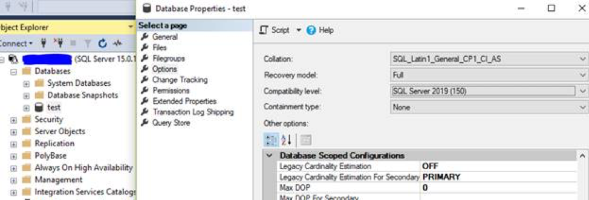
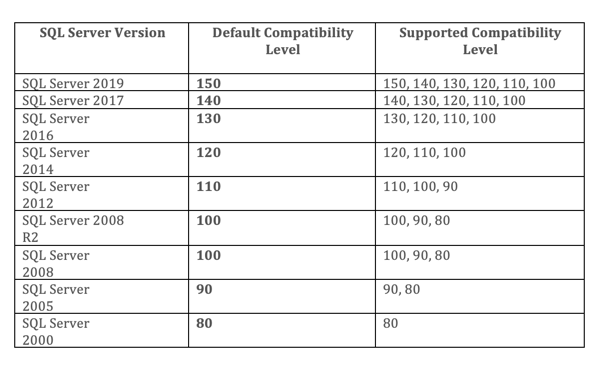

Database compatibility level, one of the database level settings, impacts how a
database functions. Each new version of Microsoft&reg; SQL Server&reg; introduces
many new features, most of which require new keywords and change certain
behaviors that existed in earlier versions. To provide maximum backward
compatibility, Microsoft enables us to set the compatibility level according to
our needs.

<!--more-->

### Database compatibility level defaults

By default, every database inherits the compatibility level of the model
database version from which it was created. For example, the compatibility
level of a SQL Server 2012 database defaults to 110 unless you change it.

### Compatibility levels after a restore

When you restore a database backup taken on an older version of SQL, the
database compatibility level remains the same as it was on the instance from
which you took the backup, unless the source compatibility level is lower than
the minimum supported level. In that case, the database compatibility level
changes to the lowest supported version. For example, if we restore a SQL Server
2005 database backup to SQL Server 2017, then the compatibility level of the restored
database would be set to 100 because that is the minimum SQL 2017 level
supported.

### Compatibility levels after an upgrade

The compatibility levels of the tempdb, model, msdb, and resource databases are
set to the current compatibility level after an upgrade. The master system
database retains the compatibility level it had before the upgrade.

### Determine the compatibility level

To determine the current compatibility level, query the **compatibility_level**
column of **sys.databases**.

To change to a different compatibility level, use the `ALTER DATABASE` command as
shown in the following example:

    Use Master
    Go
    ALTER DATABASE <database name>SET COMPATIBILITY_LEVEL = <compatibility-level>;

If you prefer, you can use the wizard to change the compatibility level. However,
if the database is accessed online by users, you should change the database to
single-user mode first.  Then, after you use the wizard to change the level, you
should put the database in multi-user mode.

To change compatibility level with the wizard, right-click **database –> property
–> options –> Database compatibility level** as shown in the following image:

### Default and supported compatibility levels

The following table shows SQL Server versions with their default compatibility
and a list of supported compatibility levels:

*Source*:[https://www.sqlskills.com/blogs/glenn/database-compatibility-level-in-sql-server/](https://www.sqlskills.com/blogs/glenn/database-compatibility-level-in-sql-server/)

### Database compatibility level and performance

In versions of SQL Server earlier than SQL 2014, database administrators never
worried about database compatibility level from a performance perspective.
Database compatibility level was mainly used as a mechanism to control whether
new features introduced in that version could be used or whether non-supported
features were disabled. It was also used to control backward compatibility.

Now, when you migrate from one version to another, you should do a full
regression test to understand the change in performance. Sometimes, a query
performs better with the old compatibility level even after migration. However,
in other cases, it could be the opposite, so make sure to do a full regression
testing.

Since SQL Server 2014, any database running at compatibility level 120 or above
can make use of the new *cardinality estimate* function. Cardinality estimation
is the logic that takes place to determine how SQL Server executes a query,
based on its estimated cost. The estimation is calculated by using input from
statistics associated with objects involved in that query. Practically, at a
high-level, cardinality estimates are row-count estimates combined with
information about the distribution of the values, distinct value counts, and
duplicate counts contained in the tables and objects referenced in the query.
Getting these estimates wrong can lead to unnecessary disk I/O due to
insufficient memory grants (such as TempDB spills) or to the selection of a
serial plan execution over a parallel plan execution, to name a few possibilities.
I plan to discuss more about cardinality estimation in my next blog post.

### Impact of changing the compatibility level

Changing the compatibility level tells the database to change its feature set.
That is, some features are added, and at the same time, some old features are
removed. For example, the `FOR BROWSE` clause is not allowed in `INSERT` and `SELECT
INTO` statements at compatibility level 100, and it is allowed but ignored at
compatibility level 90. If your application uses this feature, this change might
introduce unexpected results.

When you move a database from a lower to a higher compatibility level, you might
expect that you are not able to use the new feature if compatibility is not
changed. However, that is not entirely correct. This is only true for the database
level feature. You can use instance level features even if you don’t change the
compatibility level.

### Conclusion

Database compatibility level defines how SQL Server uses certain features.
Specifically, it causes them to act like a given version of SQL Server, which is
typically done to provide some level of backward compatibility. Because this is
a database property, the compatibility affects only database level features for
that specific database.

If you upgrade a database by either moving it to a server with a higher version
or by doing an instance upgrade in place, the compatibility level remains the
same as long as that level is supported.

If the compatibility level is set to SQL 2014 or higher, SQL Server uses the new
cardinality estimation feature. If the compatibility level is set to 2012 or
lower, the old optimizer is used.

Use the Feedback tab to make any comments or ask questions.

### Optimize your environment with expert administration, management, and configuration

[Rackspace's Application services](https://www.rackspace.com/application-management/managed-services)
**(RAS)** experts provide the following [professional](https://www.rackspace.com/application-management/professional-services)
and
[managed services](https://www.rackspace.com/application-management/managed-services) across
a broad portfolio of applications:

- [eCommerce and Digital Experience platforms](https://www.rackspace.com/ecommerce-digital-experience)
- [Enterprise Resource Planning (ERP)](https://www.rackspace.com/erp)
- [Business Intelligence](https://www.rackspace.com/business-intelligence)
- [Salesforce Customer Relationship Management (CRM)](https://www.rackspace.com/salesforce-managed-services)
- [Databases](https://www.rackspace.com/dba-services)
- [Email Hosting and Productivity](https://www.rackspace.com/email-hosting)

We deliver:

- **Unbiased expertise**: We simplify and guide your modernization journey,
focusing on the capabilities that deliver immediate value.
- **Fanatical Experience**&trade;: We combine a Process first. Technology second.&reg;
approach with dedicated technical support to provide comprehensive solutions.
- **Unrivaled portfolio**: We apply extensive cloud experience to help you
choose and deploy the right technology on the right cloud.
- **Agile delivery**: We meet you where you are in your journey and align
our success with yours.

[Chat now](https://www.rackspace.com/#chat) to get started.
