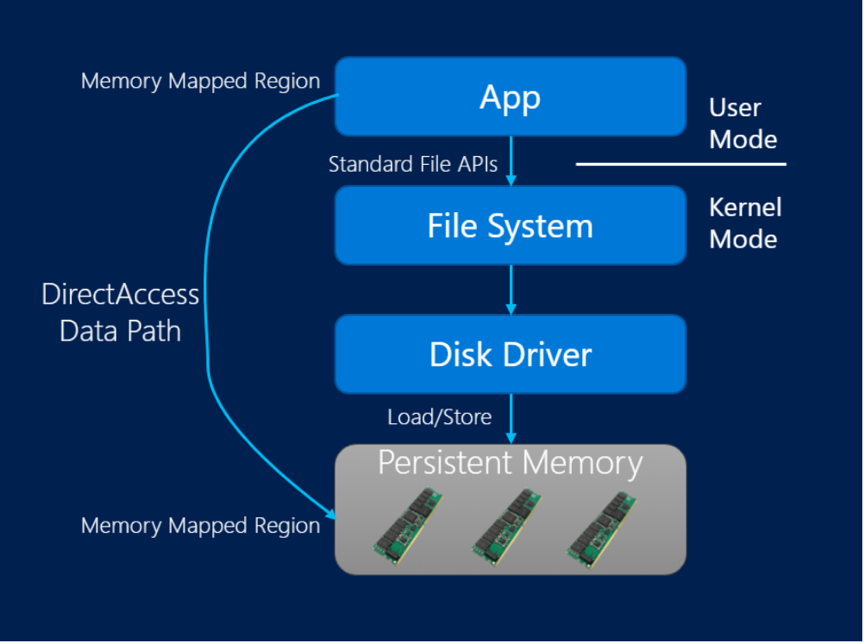

Microsoft&reg; introduced a new feature called a hybrid buffer pool in SQL
Server&reg; 2019 (Preview) CTP 2.1. This feature enables you to directly access
data pages in database files stored in persistent memory (PMEM) devices.

<!--more-->

### What is PMEM?

PMEM is a solid-state high-performance byte-addressable memory device that
resides on the memory bus. It has many benefits over other storage devices.

The main benefits of PMEM include:

-	It provides faster and near real-time data access for large data sets without
   any latency compared to flash Solid State Drives (SSDs).
-	It increases throughput more than flash storage.
-	It is cheaper than Dynamic Random Access Memory (DRAM).
-	It is cacheable. This is a huge advantage over Peripheral Component
   Interconnect (PCIe), which is not cacheable in the central processing unit (CPU).
-	It retains data in memory after a power interruption or shut down.

You can use PMEM in a variety of ways to lower latency for applications where
you need faster data access with an enormous amount of data such as the Internet of
Things (IoT) applications, cyber threat analysis, and financial trading among
others.

### Concepts

The following terms are applicable to the buffer pool extension feature:

- **Solid-state drive (SSD)**: Stores data in memory (RAM) in a persistent manner.

- **Buffer**: In SQL Server, a buffer is an 8-KB page in memory, the same size
as a data or index page. Thus, the buffer cache is divided into 8-KB pages. A
page remains in the buffer cache until the buffer manager needs the buffer area
to read in more data. Data is written back to disk only if it is modified. These
in-memory modified pages are known as dirty pages. A page is clean when it is
equivalent to its database image on disk. Data in the buffer cache can be modified
multiple times before being written back to disk.

- **Buffer pool**: Also referred to as buffer cache, the buffer pool is a global
resource shared by all databases for their cached data pages. The maximum and
minimum size of the buffer pool cache is determined during startup or when the
instance of SQL server is dynamically reconfigured by using sp_configure. This
size determines the maximum number of pages that can be cached in the buffer pool
at any time in the running instance. The maximum memory that can be committed by
the buffer pool extension can be limited by the other applications running on the
machine in case those create significant memory pressure.

- **Checkpoint**: A checkpoint creates a known good point from which the
database engine can start applying changes contained in the transaction log
during recovery after an unexpected shutdown or crash. A checkpoint writes the
dirty pages and transaction log information from memory to disk and, also,
records information about the transaction log.

- **Direct access (DAX)**: DAX operates like memory to get the lowest latency.
The app directly modifies the persistent memory, bypassing the stack. This
option can be used with NTFS only.

The following image illustrates DAX:

*Source*: [https://docs.microsoft.com/en-us/windows-server/storage/storage-spaces/deploy-pmem](https://docs.microsoft.com/en-us/windows-server/storage/storage-spaces/deploy-pmem)

### What is a hybrid buffer pool?

In a traditional system, SQL Server caches data pages in the DRAM-based buffer
pool. With the hybrid buffer pool, SQL Server skips copying the page into the
DRAM-based portion of the buffer pool and instead references the page directly
on the database file that lives on a PMEM device. The system accesses data files
in PMEM for a hybrid buffer pool by using memory mapped I/O, which is also known
as the enlightenment of data files within SQL Server.

This process brings performance benefits by avoiding a copy of the page to DRAM and
eliminating the need for the I/O stack of the operating system to access the
page on persistent storage.

The system can directly access only clean pages on a PMEM device. When a page
becomes dirty, the system copies it to the DRAM-based buffer pool and then
writes it back to the PMEM device. This process happens during regular
checkpoint operations.

The hybrid buffer pool feature is available for both Windows&reg; and Linux&reg;. The
PMEM device must be formatted with a filesystem that supports DirectAccess(DAX).
DAX supports the following file systems:

- Extended File System (XFS)
- EXT4
- New Technology File System (NTFS)

SQL Server automatically detects whether data files reside on an appropriately
formatted PMEM device and performs memory mapping in user space. This mapping
happens upon startup, when a new database is attached, restored, or created and
when the hybrid buffer pool feature is enabled for a database.

### Enable hybrid buffer pool

SQL Server 2019 introduces dynamic data language (DDL) to control the hybrid buffer
pool. The following example enables the hybrid buffer pool for an instance of SQL
Server:

    ALTER SERVER CONFIGURATION SET MEMORY_OPTIMIZED HYBRID_BUFFER_POOL = ON;

By default, the hybrid buffer pool is set to disable at the instance scope.

**Note**: For the setting change to take effect, you must restart the SQL Server
instance. The restart facilitates the allocation of enough hash pages to account
for total PMEM capacity on the server.

The following example enables the hybrid buffer pool for a specific database:

    ALTER DATABASE <databaseName> SET MEMORY_OPTIMIZED = ON;

By default, the hybrid buffer pool is set to enable at the database scope.

### Disable the hybrid buffer pool

The following example disables the hybrid buffer pool for an instance of SQL Server:

    ALTER SERVER CONFIGURATION SET MEMORY_OPTIMIZED HYBRID_BUFFER_POOL = OFF;

By default, the hybrid buffer pool is set to disable at the instance scope.

**Note**: For the setting changes to take effect, you must restart the SQL Server
instance. The restart prevents the over-allocation of hash pages because PMEM
capacity on the server does not need to be accounted for.

The following example disables the hybrid buffer pool for a specific database:

    ALTER DATABASE <databaseName> SET MEMORY_OPTIMIZED = OFF;

By default, the hybrid buffer pool is set to enable at the database scope.

### View the hybrid buffer pool configuration

The following example returns the current status of the hybrid buffer pool
system configuration for an instance of SQL Server:

    SELECT * FROM sys.configurations WHERE     name = 'hybrid_buffer_pool';

The following example returns two tables:

    SELECT * FROM sys.configurations WHERE name = 'hybrid_buffer_pool';

    SELECT name, is_memory_optimized_enabled FROM sys.databases;

-	The first table shows the current status of the hybrid buffer pool system
   configuration for an instance of SQL Server.
-	The second table lists the databases and the database level setting for
   the hybrid buffer pool.

### Best practices for the hybrid buffer pool

We recommend that you don not enable the hybrid buffer pool on instances with less
than 16 GB of RAM.

When formatting your PMEM device on Windows, use the largest allocation unit
size available for NTFS (2 MB in Windows Server&reg; 2019) and ensure the device has
been formatted for DAX. Files sizes should be a multiple of 2 MB
(modulo 2 MB should be equal to zero).

If the server-scoped setting for the hybrid buffer pool is set to disabled, the hybrid
buffer pool will not be used by any user database.

If the server-scoped setting for the hybrid buffer pool is enabled, you can disable
the hybrid buffer pool usage for individual user databases by disabling the hybrid buffer
pool at the database-scoped level for those user databases.

### Conclusion

The hybrid buffer pool enables you to directly access database data pages that
are stored in PMEM devices. System performance is improved because there is no
need to copy the page to DRAM and the I/O stack of the operating system doesn't
need to access the page on persistent storage.

Refer to the following documents for more information:

[Microsoft Describes Latest SQL Server 2019 Preview and Azure SQL Improvements](https://redmondmag.com/articles/2018/11/07/microsoft-describes-sql-improvements.aspx)
[Hybrid Buffer Pool](https://docs.microsoft.com/en-us/sql/database-engine/configure-windows/hybrid-buffer-pool?view=sql-server-2017&viewFallbackFrom=sql-server-2019)

Use the Feedback tab to make any comments or ask questions.

### Optimize your environment with expert administration, management, and configuration

[Rackspace's Application services](https://www.rackspace.com/application-management/managed-services)
**(RAS)** experts provide the following [professional](https://www.rackspace.com/application-management/professional-services)
and
[managed services](https://www.rackspace.com/application-management/managed-services) across
a broad portfolio of applications:

- [eCommerce and Digital Experience platforms](https://www.rackspace.com/ecommerce-digital-experience)
- [Enterprise Resource Planning (ERP)](https://www.rackspace.com/erp)
- [Business Intelligence](https://www.rackspace.com/business-intelligence)
- [Salesforce Customer Relationship Management (CRM)](https://www.rackspace.com/salesforce-managed-services)
- [Databases](https://www.rackspace.com/dba-services)
- [Email Hosting and Productivity](https://www.rackspace.com/email-hosting)

We deliver:

- **Unbiased expertise**: We simplify and guide your modernization journey,
focusing on the capabilities that deliver immediate value.
- **Fanatical Experience**&trade;: We combine a Process first. Technology second.&reg;
approach with dedicated technical support to provide comprehensive solutions.
- **Unrivaled portfolio**: We apply extensive cloud experience to help you
choose and deploy the right technology on the right cloud.
- **Agile delivery**: We meet you where you are in your journey and align
our success with yours.

[Chat now](https://www.rackspace.com/#chat) to get started.
