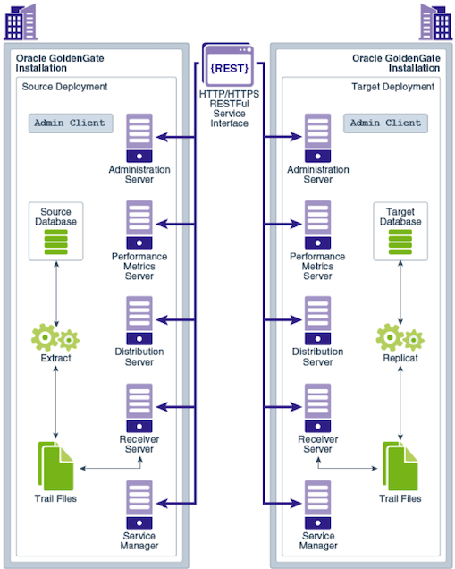
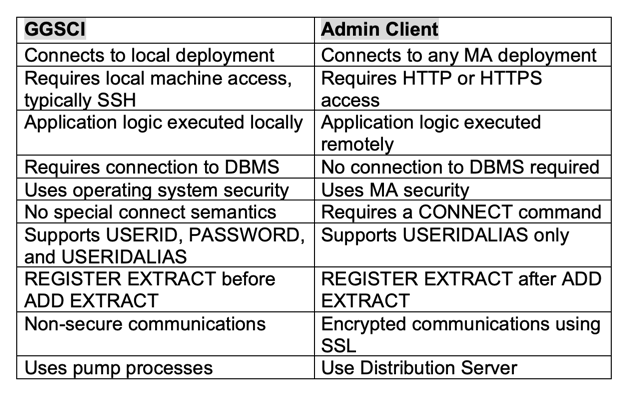
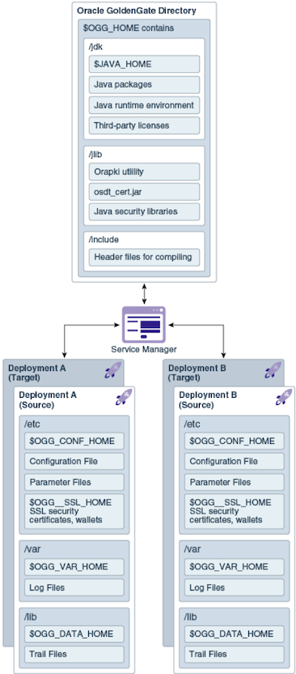

Oracle&reg; GoldenGate&reg; supports two architectures: the classic architecture
and the Oracle GoldenGate Microservices Architecture (OGG MA).

Classic architecture has standard `extract`, `replicat`, `pump`, and `receiver` functions
and is managed by the GoldenGate Software Command Interpreter (GGSCI).

OGG MA is a restful application program interface (API) microservices-based
architecture that enables you to install, configure, monitor, and manage Oracle
GoldenGate services through a web-based user interface. OGG MA was introduced
in version GoldenGate 12.3 and was designed from the perspective of cloud
operations.

<!--more-->

### Oracle GoldenGate microservices components

You can use OGG MA to configure and manage data replication by using an HTML
user interface.

OGG MA has five main components. The following diagram illustrates how
replication processes operate within a secure Rest API environment:

**Image source**: [https://docs.oracle.com/goldengate/c1230/gg-winux/GGCON/img/logicalarch2.png](https://docs.oracle.com/goldengate/c1230/gg-winux/GGCON/img/logicalarch2.png)

The following sections outline the roles and responsibilities of each component
of OGG MA, including the admin client.

#### Service manager

-	The service manager acts as a watchdog for the other services available with
   the microservices architecture.

-	The service manager allows you to manage one or more GoldenGate
   deployments on a local host.

-	The service manager runs as a system service, maintains inventory and
   configuration information about your deployments, and allows you to maintain
   multiple local deployments.

-	By using the service manager, you can start and stop instances and query
   deployments and the other services.

#### Administration server

-	The administration server supervises, administers, manages, and monitors
   both active and inactive processes operating within a GoldenGate deployment.

-	The administration server operates as the central control entity for managing
   replication components in your GoldenGate deployments.

-	By using the administration server, you can create and manage your local
   `extract replicat` processes without accessing the server where GoldenGate is
   installed.

-	The key feature of the administration server is the Rest API service
   interface, which any HTTP or HTTPS client, such as microservices architecture
   service interfaces or perl and python clients, can address.

-	By using the administration server, you can add, delete, or alter GoldenGate
   processes, edit configuration files, add users, and assign roles.

#### Distribution server

-	The distribution server functions as a networked data distribution agent
   that conveys and processes data and commands in a distributed networked
   deployment.

-	The distribution server is a high-performance application that can handle
   multiple commands and data streams from multiple source-trail files concurrently.

-	The distribution server replaces the classic multiple source-side data pumps
   with a single side data pump and with a single instance service. This server
   distributes one or more trails to one or more destinations and provides
   lightweight filtering only.

#### Receiver server

-	The receiver server is the central control service that handles all incoming
   trail files.

-	The receiver server interoperates with the distribution server and provides
   compatibility with the classic architecture pump for remote classic
   deployments.

-	The receiver server replaces multiple discrete target-side collectors with a
   single instance service.

#### Performance metrics server

-	The performance metrics server uses the metrics service to collect and store
   instance deployment performance results.

-	The metrics collection and repository is separate from the administration
   layer information collection.

-	All GoldenGate processes send metrics to the performance metrics server.

-	You can use the performance metrics server in both microservices architecture
   and classic architecture.

-	By using the performance metrics server, you can query various metrics, view
   logs, process status, monitor system utilization, and so on.

#### Admin client

-	The admin client is a command line utility (like the classic GGSCI utility).

-	The admin client uses the Rest API published by the microservices
   architecture server to accomplish its tasks.

-	The admin client is used to create, configure, modify, and remove processes.

The admin client has more functions and is more usable in distributed
configurations than GGSCI as shown in the following table:

### The key microservices architecture directories and variables

The microservices architecture is designed with a simplified installation and
deployment directory structure.

The design is composed of a read-only home directory, where you install
GoldenGate and create a custom deployment-specific directory as shown in the
following image:

**Image source**: [https://docs.oracle.com/goldengate/c1230/gg-winux/GGCON/img/ggcon_dt_003a_dirstruc.png](https://docs.oracle.com/goldengate/c1230/gg-winux/GGCON/img/ggcon_dt_003a_dirstruc.png)

You can change the default locations of all of these directories to customize
where you want to store the files.

In a configuration where **OGG\_VAR\_HOME** is a local directory and
**OGG\_HOME** is a shared read-only remote directory, many deployments with a
local **OGG\_VAR\_HOME** can share the same read-only **OGG_HOME**.

### Conclusion

Microservices architecture is a new service-based architecture that simplifies
the configuration, administration, and monitoring of large-scale, cloud
deployments. This post introduced you to the OGG MA and its components, which
is expected to change the way you replicate data on-premise, in the cloud and
in hybrid environments.

Use the Feedback tab to make any comments or to ask questions.

### Optimize your environment with expert administration, management, and configuration

[Rackspace's Application services](https://www.rackspace.com/application-management/managed-services)
**(RAS)** experts provide the following [professional](https://www.rackspace.com/application-management/professional-services)
and
[managed services](https://www.rackspace.com/application-management/managed-services) across
a broad portfolio of applications:

- [eCommerce and Digital Experience platforms](https://www.rackspace.com/ecommerce-digital-experience)
- [Enterprise Resource Planning (ERP)](https://www.rackspace.com/erp)
- [Business Intelligence](https://www.rackspace.com/business-intelligence)
- [Salesforce Customer Relationship Management (CRM)](https://www.rackspace.com/salesforce-managed-services)
- [Databases](https://www.rackspace.com/dba-services)
- [Email Hosting and Productivity](https://www.rackspace.com/email-hosting)

We deliver:

- **Unbiased expertise**: We simplify and guide your modernization journey,
focusing on the capabilities that deliver immediate value.
- **Fanatical Experience**&trade;: We combine a Process first. Technology second.&reg;
approach with dedicated technical support to provide comprehensive solutions.
- **Unrivaled portfolio**: We apply extensive cloud experience to help you
choose and deploy the right technology on the right cloud.
- **Agile delivery**: We meet you where you are in your journey and align
our success with yours.

[Chat now](https://www.rackspace.com/#chat) to get started.

