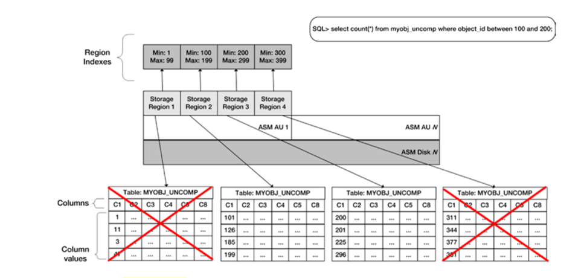

The Oracle&reg; Exadata&reg; system introduces storage indexes, which improve database
performance. A storage index is a structure store in memory that contains key
statistics. This storage index enables Exadata to speed up disk I/O operations
and queries by checking the index first to find relevant data rather than by
reading every row.

<!--more-->

One important consideration with storage indexes is that, for Exadata to produce
storage index I/O savings, the system needs to write the data in these indexes
to the indexes' storage regions. In other words, to be used, storage index data
needs to be primed on the cell server’s region index memory structures. When
you run a query for the first time, you see no storage index I/O savings because
the region indexes contain no relevant data.

### How storage indexes work

The primary goal of a storage index is to reduce the amount of disk I/O required
to service requests for Exadata Smart Scan. By considering actual databases rows
scanned, you can measure the I/O savings derived from using storage indexes.
Storage indexes are used during direct-path read operations, when the query
contains a predicate (that is, a WHERE clause) and the underlying Automatic
Storage Management (ASM) disk group has the `cell.smart_scan_capable=TRUE`
attribute set. In other words, storage indexes compliment Exadata Smart Scan for
SQL statements with query predicates. Additionally, storage indexes yield the
greatest performance savings when your data is well ordered with respect to the
columns in your query predicates.

### Oracle Exadata Architecture

From a design perspective, storage indexes are different from traditional
Oracle B*Tree indexes or other index types. Storage indexes are not
physical structures stored as a segment inside your databases but memory
structures that reside on the Exadata storage cells. While the goal of
traditional indexes is to assist Oracle in rapidly finding rows in a table,
the goal of storage indexes is to provide a very efficient means to instruct
the cell services software to skip physical database row reads if the values
in the storage index indicate that the requested data is not contained within
those rows.

If the data in a storage region is well ordered with respect to columns typically
used in a query predicate, storage indexes enable the Cell Server (CELLSRV)
processes to bypass physical I/O requests and save disk I/O. The cell physical
I/O bytes saved by storage index is a system statistic that you can use to measure
this I/O savings benefit.

If, on the other hand, the data is not well ordered, storage indexes provide
limited or no benefit because each storage region has a higher probability of
containing a large range of potential values for a given column or query
predicate. Like traditional B*Tree indexes, clustering is an important
consideration for storage indexes. One of the interesting facts about storage
indexes is that Exadata’s CELLSVR processes use them only if the predicate values
in a query fall outside the high and low values tracked in the region indexes
for each storage region, regardless of whether the storage region actually
contains data within the tracked ranges.

Consider an example in which a storage region contains data for ten rows in a
table. Within these ten rows, let’s assume there is a column called **FIRST\_NAME**
and within this column, the region contains rows with the FIRST\_NAME containing
“john”, “anto”, “max”, “leigh”, “theo”, “rachel”, “lauren”, “bob”, “denise”,
and “jen”. If you issued a query searching for `FIRST_NAME="chris"`, any existing
storage indexes for this table would not disqualify this region from being accessed
because “chris” alphabetically falls between “anto” and “theo”. However, if you
run a query based on `FIRST_NAME="victor"`, CELLSVR will bypass a physical I/O
to this storage region because the value falls outside the high and low values.

In short, this means that storage index functions can return false positives
(with respect to allowing I/O requests to be issued), but they never return
false negatives.

Bypassing I/O equates to skipping physical reads and skipping physical reads
helps save time. The following image provides a logical representation of how
storage indexes work:

**Image source**: Oracle Exadata Recipes by John Clarke.

### Conclusion

Exadata automatically maintains time-based storage indexes on your application
usage. There is nothing an Exadata Database Machine Administrator (DMA) can do
to influence storage index behavior outside of potentially ordering your data
to encourage their use or change your application’s query predicates.

Consider using storage indexes in the following situations:

-	During direct-path read operations.
-	With smart scans.
-	When the queries contain predicates.

Storage Index is the smartest feature available in the Oracle Exadata product,
and it helps you search data in the fastest and most optimized manner.

Use the Feedback tab to make any comments or to ask questions.

### Optimize your environment with expert administration, management, and configuration

[Rackspace's Application services](https://www.rackspace.com/application-management/managed-services)
**(RAS)** experts provide the following [professional](https://www.rackspace.com/application-management/professional-services)
and
[managed services](https://www.rackspace.com/application-management/managed-services) across
a broad portfolio of applications:

- [eCommerce and Digital Experience platforms](https://www.rackspace.com/ecommerce-digital-experience)
- [Enterprise Resource Planning (ERP)](https://www.rackspace.com/erp)
- [Business Intelligence](https://www.rackspace.com/business-intelligence)
- [Salesforce Customer Relationship Management (CRM)](https://www.rackspace.com/salesforce-managed-services)
- [Databases](https://www.rackspace.com/dba-services)
- [Email Hosting and Productivity](https://www.rackspace.com/email-hosting)

We deliver:

- **Unbiased expertise**: We simplify and guide your modernization journey,
focusing on the capabilities that deliver immediate value.
- **Fanatical Experience**&trade;: We combine a Process first. Technology second.&reg;
approach with dedicated technical support to provide comprehensive solutions.
- **Unrivaled portfolio**: We apply extensive cloud experience to help you
choose and deploy the right technology on the right cloud.
- **Agile delivery**: We meet you where you are in your journey and align
our success with yours.

[Chat now](https://www.rackspace.com/#chat) to get started.

