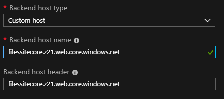
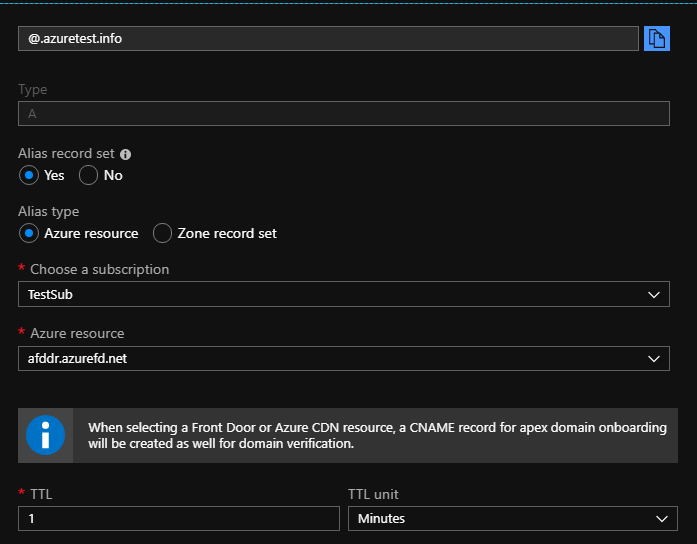
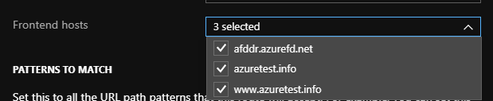

One of the Azure multi-region topologies I have seen included an Azure Traffic Manager with Azure App Service Web Apps in each region. Some customers are cost conscious and would rather have a static web page display after a region failure with some generic message that there is a problem and it is being looked into. With the introduction of Azure Front Door, there are many capabilities that will not only enhance our live site, but will also serve as a cost-effective failover to a static website in a storage account.

<!--more-->

At a high level, the following steps are needed to configure a static website within Azure storage account:

1) Create a **general purpose v2** storage account.
2) Click on **Static website** in the portal blade, enable it, and specify the **Index document name**.
3) Upload the static HTML page to the **$web** container.

The primary endpoint for the static website then returns the uploaded HTML page.

### Detailed configuration steps

Following are more detailed instructions.

#### 1. Provision the resource

Within the Azure portal, provision a new **Azure Front Door** resource. Then, set the front-end host fully qualified domain name (FQDN), assign a unique name, and add it. 

#### 2. Add the back-end pool

Add a back-end pool with a custom host name and back-end host header set to the URL of the static storage account website.

#### 3. Create a routing rule

Create a routing rule and save it with all the defaults. Within a few minutes, the FQDN of the front end resolves to the storage account. Add another back end to the existing back-end pool of your primary web app and then set the priorities to route the way you want it to.

Normally, Azure Front Door is used for customer-facing environments, which enables you to set apex domain-based routing. At a high level, it lets you do the following things:

1) Provision an Azure DNS zone.
2) Set your nameservers for the custom domain to point to the Azure nameservers for the DNS zone.
3) Create an `A` record with a name of **@**.
4) Select `Yes` for the Alias record set and choose an Alias type of **Azure Resource**.
5) Select the Azure Resource Name for Azure Front Door in the Azure resource dropdown.

#### 4. Add a new front-end host

Back in the Azure Front Door designer, add a new front-end host for the custom apex domain. Select both the existing routing rule and the custom apex domain. Then, update the setting.

You have two options to enable an HTTPS protocol for a custom domain within Azure Front Door. Front Door generates a certificate and manages it, or you can use your own certificate. Because I have my own prefix for my domains, I chose the second option, which involves Azure Key Vault. For more information, see [Instructions for Azure Front Door HTTPS](https://docs.microsoft.com/en-us/azure/frontdoor/front-door-custom-domain-https#ssl-certificates) and follow the instructions to configure it.
