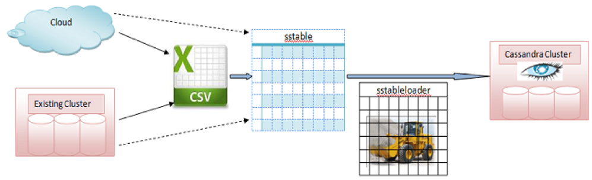

Database backup and recovery is one of the crucial day-to-day activities that a
database administrator (DBA) performs. A database backup is a copy of your
data that can be used to recover the data in the event of data loss.

This blog shows you how to backup Apache&reg; Cassandra&reg; databases and
restore them after a failure.

<!--more-->

### Introduction

Though Apache Cassandra is decentralized, it can endure single and
multi-node failures without losing any business data, as long as one of the
nodes in the cluster contains data. However, as a best practice, you should
configure a backup for the databases.

In case of any failure, such as an entire cluster rebuild, data corruption,
accidental data deletion, and so on, you can recover the data from the backup
and continue business operations with minimal or no impact.

More and more companies are using NoSQL databases, such as Cassandra, to
successfully manage the large volume of business data, more popularly
known as Big Data. Cassandra, widely used by many major organizations,
ensures scalability, fault-tolerance, and consistency to support Big Data.

### Cassandra database backup and restore

You can use the following utilities to take a snapshot of a Cassandra database
and restore it when required:

- `nodetool` (To take the snapshot)
- `sstableloader` (To restore the snapshot backup)

The following image illustrates moving from a cloud cluster to a Cassandra
cluster by using `sstableloader`:

**Image source**: [https://dzone.com/articles/using-casandras-sstable-bulk](https://dzone.com/articles/using-casandras-sstable-bulk)

#### Backup

The following example uses `nodetool` to take a snapshot of Cassandra database
**keyspace(users)** with a table called **employee**.

**Source Cassandra cluster details:**

    $ nodetool -u cassandra -pw ******** -h localhost status

    Datacenter: us-central1
    =======================
    Status=Up/Down
    |/ State=Normal/Leaving/Joining/Moving
    --  Address     Load       Tokens       Owns (effective)  Host ID                               Rack
    UN  10.128.0.2  121.52 KiB  256         63.3%             5957997f-7471-4c21-bead-37a6604812e2  f
    UN  10.128.0.3  92.22 KiB  256          68.0%             87c2a663-a965-4675-b5ed-c4a46d77c796  f
    UN  10.128.0.4  225.3 KiB  256          68.8%             8e12557f-be00-4387-bff3-ef51f431b9a0  f

Use the following command to backup **keyspace**:

    $ nodetool -h localhost -u cassandra -pw ****** snapshot users -t "users-201904201800"

    Requested creating snapshot(s) for [users] with snapshot name [users-201904201800] and options {skipFlush=false}
    Snapshot directory: users-201904201800

This creates a backup snapshot as shown in the following example:

    /bitnami/cassandra/data/data/users/employee-c1319df0636211e9a0e3570eb7f8fd5f/snapshots/users-201904201800
    $ ls -ltr
    total 44
    -rw-r--r-- 2 cassandra cassandra   16 Apr 20 12:05 md-1-big-Filter.db
    -rw-r--r-- 2 cassandra cassandra   56 Apr 20 12:05 md-1-big-Summary.db
    -rw-r--r-- 2 cassandra cassandra   32 Apr 20 12:05 md-1-big-Index.db
    -rw-r--r-- 2 cassandra cassandra  134 Apr 20 12:05 md-1-big-Data.db
    -rw-r--r-- 2 cassandra cassandra   10 Apr 20 12:05 md-1-big-Digest.crc32
    -rw-r--r-- 2 cassandra cassandra   43 Apr 20 12:05 md-1-big-CompressionInfo.db
    -rw-r--r-- 2 cassandra cassandra 4683 Apr 20 12:05 md-1-big-Statistics.db
    -rw-r--r-- 2 cassandra cassandra   92 Apr 20 12:05 md-1-big-TOC.txt
    -rw-r--r-- 1 cassandra cassandra   31 Apr 20 12:05 manifest.json
    -rw-r--r-- 1 cassandra cassandra  865 Apr 20 12:05 schema.cql

    $ date
    Sat Apr 20 12:08:21 UTC 2019

Now, archive the **/snapshot** backup directory files and move the tar
file to the **/bitnami/Cassandra/data/data/backup** directory.

    $ tar -cvf users-201904201800.tar *.*
    manifest.json
    md-1-big-CompressionInfo.db
    md-1-big-Data.db
    md-1-big-Digest.crc32
    md-1-big-Filter.db
    md-1-big-Index.db
    md-1-big-Statistics.db
    md-1-big-Summary.db
    md-1-big-TOC.txt
    schema.cql

    $ ls -ltr
    total 64
    -rw-r--r-- 2 cassandra cassandra    16 Apr 20 12:05 md-1-big-Filter.db
    -rw-r--r-- 2 cassandra cassandra    56 Apr 20 12:05 md-1-big-Summary.db
    -rw-r--r-- 2 cassandra cassandra    32 Apr 20 12:05 md-1-big-Index.db
    -rw-r--r-- 2 cassandra cassandra   134 Apr 20 12:05 md-1-big-Data.db
    -rw-r--r-- 2 cassandra cassandra    10 Apr 20 12:05 md-1-big-Digest.crc32
    -rw-r--r-- 2 cassandra cassandra    43 Apr 20 12:05 md-1-big-CompressionInfo.db
    -rw-r--r-- 2 cassandra cassandra  4683 Apr 20 12:05 md-1-big-Statistics.db
    -rw-r--r-- 2 cassandra cassandra    92 Apr 20 12:05 md-1-big-TOC.txt
    -rw-r--r-- 1 cassandra cassandra    31 Apr 20 12:05 manifest.json
    -rw-r--r-- 1 cassandra cassandra   865 Apr 20 12:05 schema.cql
    -rw-r--r-- 1 cassandra cassandra 20480 Apr 20 12:22 users-201904201800.tar

    cp *.tar /bitnami/cassandra/data/data/backup.
    /bitnami/cassandra/data/data/backup

    $ ls -ltr
    -rw-r--r--  1 cassandra cassandra 20480 Apr 20 12:23 users-201904201800.tar

After copying the backup tar file to a non-default location, drop the **employee**
table.

**NOTE**: Cassandra distributes data based on the defined partition keys and
replication factors across the cluster, so you must run this backup command
from all your nodes. This example uses the Linux&reg; shell script in crontab,
which backs up all nodes at once.

    $ cqlsh -u cassandra -p *******

    Connected to Test_Cassandra at 127.0.0.1:9042.
    [cqlsh 5.0.1 | Cassandra 3.11.4 | CQL spec 3.4.4 | Native protocol v4]
    Use HELP for help.

    cassandra@cqlsh> use users;
    cassandra@cqlsh:users> select * from employee;

     emp_id | employee_address | employee_name
    --------+------------------+---------------
       8796 |        Singapore |           Joy
       5647 |           London |          Mike
       3452 |           Canada |         Nancy
       6453 |            China |          John

    (4 rows)

    cassandra@cqlsh:users> drop table employee;
    cassandra@cqlsh:users> select * from employee;
    InvalidRequest: Error from server: code=2200 [Invalid query] message="unconfigured table employee"

#### Restore

To restore the **employee** table from the **keyspace (users)** snapshot backup,
you must use the `sstableloader` utility. The `sstableloader` utility not only
copies the set of sstables to each node but also transfers the appropriate
part of the data to every node based on the replication strategy defined for
a cluster. Note that it is not necessary to have an empty table to restore the
data.

Use the following steps to restore the tar file into **backup/users**:

    $ pwd
    /bitnami/cassandra/data/data/backup/users
    $ ls -ltr
    total 20
    -rw-r--r-- 1 cassandra cassandra 20480 Apr 20 12:23 users-201904201800.tar
    $ tar -xvf *.tar
    manifest.json
    md-1-big-CompressionInfo.db
    md-1-big-Data.db
    md-1-big-Digest.crc32
    md-1-big-Filter.db
    md-1-big-Index.db
    md-1-big-Statistics.db
    md-1-big-Summary.db
    md-1-big-TOC.txt
    schema.cql

Create a soft link for the user directory with the name of the table that you
are going to restore.

    $ ln -s /bitnami/cassandra/data/data/backup/users employee
    $ ls -ltr
    total 64
    -rw-r--r-- 1 cassandra cassandra   865 Apr 20 12:05 schema.cql
    -rw-r--r-- 1 cassandra cassandra    92 Apr 20 12:05 md-1-big-TOC.txt
    -rw-r--r-- 1 cassandra cassandra    56 Apr 20 12:05 md-1-big-Summary.db
    -rw-r--r-- 1 cassandra cassandra  4683 Apr 20 12:05 md-1-big-Statistics.db
    -rw-r--r-- 1 cassandra cassandra    32 Apr 20 12:05 md-1-big-Index.db
    -rw-r--r-- 1 cassandra cassandra    16 Apr 20 12:05 md-1-big-Filter.db
    -rw-r--r-- 1 cassandra cassandra    10 Apr 20 12:05 md-1-big-Digest.crc32
    -rw-r--r-- 1 cassandra cassandra   134 Apr 20 12:05 md-1-big-Data.db
    -rw-r--r-- 1 cassandra cassandra    43 Apr 20 12:05 md-1-big-CompressionInfo.db
    -rw-r--r-- 1 cassandra cassandra    31 Apr 20 12:05 manifest.json
    -rw-r--r-- 1 cassandra cassandra 20480 Apr 20 12:23 users-201904201800.tar
    lrwxrwxrwx 1 cassandra cassandra    41 Apr 20 15:56 employee -> /bitnami/cassandra/data/data/backup/users

Create the table structure by using the **.cql** file that was generated by the
snapshot backup.

When you execute the backup for **keyspace**, it generates a file called
**schema.cql** that contains the data definition language (DDL) of
the objects that reside in **keyspace**.

Use **schema.cql** to create an employee object, which got dropped by mistake.

    $ cqlsh -u cassandra -p ******** -f schema.cql

    Warnings:
    dclocal_read_repair_chance table option has been deprecated and will be removed in version 4.0

    dclocal_read_repair_chance table option has been deprecated and will be removed in version 4.0
    $ cqlsh -u cassandra -p ******* -f schema.cql

Restore data from the snapshot by using `sstableloader`, which reads every
**sstables** from the backup and streams the data into the cluster. It then
transfers the relevant part of data to each node based on the replication strategy
defined in the cluster.

    Syntax: sstableloader -u <username> -pw passwrod -d <hostname> <employee table softlink name with location>

Use the following command to restore the data:

    $  sstableloader -u cassandra -pw  ******** -d cassandra-cluster-1-node-0 /bitnami/cassandra/data/data/backup/users/employee
    Established connection to initial hosts
    Opening sstables and calculating sections to stream
    Streaming relevant part of /bitnami/cassandra/data/data/backup/users/md-1-big-Data.db  to [/10.128.0.2, /10.128.0.3, /10.128.0.4]
    progress: [/10.128.0.2]0:0/1 0  % [/10.128.0.3]0:0/1 0  % [/10.128.0.4]0:1/1 100% total: 33% 0.032KiB/s (avg: 0.032KiB/s)
    progress: [/10.128.0.2]0:0/1 0  % [/10.128.0.3]0:0/1 0  % [/10.128.0.4]0:1/1 100% total: 33% 0.000KiB/s (avg: 0.031KiB/s)
    progress: [/10.128.0.2]0:0/1 0  % [/10.128.0.3]0:1/1 100% [/10.128.0.4]0:1/1 100% total: 66% 0.113KiB/s (avg: 0.050KiB/s)
    progress: [/10.128.0.2]0:1/1 100% [/10.128.0.3]0:1/1 100% [/10.128.0.4]0:1/1 100% total: 100% 85.129KiB/s (avg: 0.074KiB/s)
    progress: [/10.128.0.2]0:1/1 100% [/10.128.0.3]0:1/1 100% [/10.128.0.4]0:1/1 100% total: 100% 0.000KiB/s (avg: 0.073KiB/s)
    progress: [/10.128.0.2]0:1/1 100% [/10.128.0.3]0:1/1 100% [/10.128.0.4]0:1/1 100% total: 100% 0.000KiB/s (avg: 0.073KiB/s)

    Summary statistics:
       Connections per host    : 1
       Total files transferred : 3
       Total bytes transferred : 0.393KiB
       Total duration          : 5346 ms
       Average transfer rate   : 0.073KiB/s
       Peak transfer rate      : 0.074KiB/s

Repeat these steps for every node to retrieve the data from their sstables.

Repair the data by using `nodetool repair`, which compares all replicas of the
data stored on the node on which the command runs and updates each replica to
the newest version.

    $ nodetool repair -u Cassandra -pw ********

    [2019-04-21 07:59:14,701] Starting repair command #1 (5b123ad0-640b-11e9-a0e3-570eb7f8fd5f), repairing keyspace users with repair options (parallelism: parallel, primary range: false, incremental: true, job threads: 1, ColumnFamilies: [], dataCenters: [], hosts: [], # of ranges: 768, pull repair: false)
    [2019-04-21 07:59:16,450] Repair completed successfully
    [2019-04-21 07:59:16,451] Repair command #1 finished in 1 second
    [2019-04-21 07:59:16,460] Replication factor is 1. No repair is needed for keyspace 'system_auth'
    [2019-04-21 07:59:16,474] Starting repair command #2 (5c22e780-640b-11e9-a0e3-570eb7f8fd5f), repairing keyspace system_traces with repair options (parallelism: parallel, primary range: false, incremental: true, job threads: 1, ColumnFamilies: [], dataCenters: [], hosts: [], # of ranges: 513, pull repair: false)
    finished (progress: 1%)
    [2019-04-21 07:59:17,653] Repair completed successfully
    [2019-04-21 07:59:17,653] Repair command #2 finished in 1 second

Validate data into the **employee** table, which we dropped. The previous command
restored the data from the backup you took previously. Now you need to validate
the data to see if it was restored properly.

    $ cqlsh -u cassandra -p ********

    Connected to Test_Cassandra at 127.0.0.1:9042.
    [cqlsh 5.0.1 | Cassandra 3.11.4 | CQL spec 3.4.4 | Native protocol v4]
    Use HELP for help.

    cassandra@cqlsh> use users;

    cassandra@cqlsh:users> select * from employee;

     emp_id | employee_address | employee_name
    --------+------------------+---------------
       8796 |        Singapore |           Joy
       5647 |           London |          Mike
       3452 |           Canada |         Nancy
       6453 |            China |          John

    (4 rows)

### Conclusion

In this post, you learned how to backup and restore a table into a Cassandra
database. However, if you need to restore a full keyspace/database, use the
preceding steps without the table restore part. You must recreate the
**keyspace** and load data by using `sstableloader`.

The number of nodes in the source and target databases cluster doesn’t matter
with `sstableloader` because it reads each **sstables** from the backup.
Then, it streams the data into the cluster while placing the data according to
the defined replication strategy in the cluster.

Use the Feedback tab to make any comments or to ask questions.

### Optimize your environment with expert administration, management, and configuration

[Rackspace's Application services](https://www.rackspace.com/application-management/managed-services)
**(RAS)** experts provide the following [professional](https://www.rackspace.com/application-management/professional-services)
and
[managed services](https://www.rackspace.com/application-management/managed-services) across
a broad portfolio of applications:

- [eCommerce and Digital Experience platforms](https://www.rackspace.com/ecommerce-digital-experience)
- [Enterprise Resource Planning (ERP)](https://www.rackspace.com/erp)
- [Business Intelligence](https://www.rackspace.com/business-intelligence)
- [Salesforce Customer Relationship Management (CRM)](https://www.rackspace.com/salesforce-managed-services)
- [Databases](https://www.rackspace.com/dba-services)
- [Email Hosting and Productivity](https://www.rackspace.com/email-hosting)

We deliver:

- **Unbiased expertise**: We simplify and guide your modernization journey,
focusing on the capabilities that deliver immediate value.
- **Fanatical Experience**&trade;: We combine a Process first. Technology second.&reg;
approach with dedicated technical support to provide comprehensive solutions.
- **Unrivaled portfolio**: We apply extensive cloud experience to help you
choose and deploy the right technology on the right cloud.
- **Agile delivery**: We meet you where you are in your journey and align
our success with yours.

[Chat now](https://www.rackspace.com/#chat) to get started.

