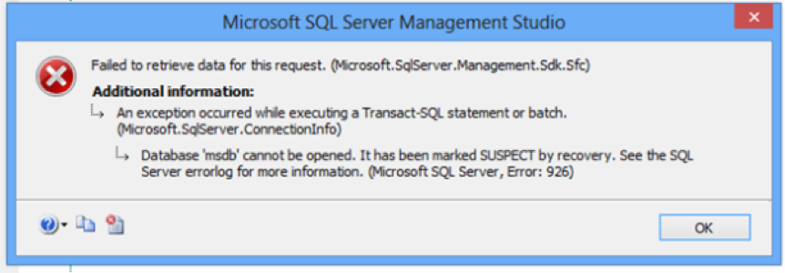
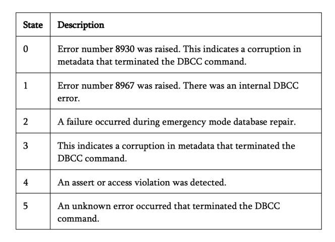

The blog describes corruptions that can occur at the database level in
Microsoft&reg; SQL Server&reg;, how to detect them, and how to correct them by
using advanced restore and repair techniques.

<!--more-->

### Introduction

Currently, SQL Server is one of the most popular and widely used relational
database management systems because of its advanced internal structure and great
reliability. Many organizations have opted for SQL Server databases to
maintain and save critical business data.

Companies expect database administrators (DBAs) to improve database
performance, maintenance, and security continuously. When a database is corrupted and data is
inaccessible, you might suspect a variety of causes such as hardware corruption,
disk issues, a virus attack, or operating system (OS) failures. Repairing
corrupted databases is not an easy task until you know the best technique.

This post discusses some causes of database corruption, helps you to identify
page corruption, explores the Database Consistency Checker (DBCC) CHECKDB
command, and demonstrates advanced restore and repair techniques.

### Database corruption

SQL Server stores the user data in the form of pages. Those pages reside in
**.MDF** (Primary) data files. Corruption of an **.MDF** file can lead to
corruption of the entire database. The data file page is good when written out
of SQL Server’s memory (that is, onto a disk) but bad when read back into memory,
as shown in the following image:

#### Causes of database corruption:

Database corruption types include the following items:

-	I/O Subsystem (This is one of the most common reasons for database corruption.)
-	Windows operating system
-	File system drivers such as encryption or antivirus
-	SAN or RAID controllers
-	Disks
-	Memory
-	File Headers
-	SQL Server bugs
-	Human errors

#### Error messages:

When you access a corrupted database, you might see the following error messages:

-  **Msg 823 in SQL Server**
-  **Msg 824 in SQL Server**
-  **Msg 825 (read retry) in SQL Server**
-  **Error 9004 SQL Server**
-  **Metadata Corruption Error**
-  **Page Level Corruption Error**

### Tracing page corruption

SQL Server has a built-in mechanism to automatically identify and alert you
when there is a corruption during I/0 operations such as reading and writing
pages to the disk.

The following different types of page-level verifying options are available on
SQL Server and help protect the pages on the disk:

-	TORN\_PAGE\_DETECTION
-	Checksum

When *TORN\_PAGE\_DETECTION* is specified, a bit is flipped for the 16 x 512-byte
disk sector for an 8 KB data file page whenever the page is written to disk.
After the page is subsequently read into memory, these values are compared.
If the bits are found in the wrong state, the page likely was written incorrectly.
In this case, the system generates an error message 824 (indicating a torn-page
error).

When *Checksum* is specified, the system calculates the checksum value over the
contents of the page and stores that value in the page header when writing the page
to the disk. After the page is loaded from disk later on, the checksum is
recomputed and compared with the value stored at page header. If the value does not
match, the system generates an error message 824 (indicating a checksum failure).

Both errors, **823 hard I/O** and **824 soft I/O**, are severity 24 errors and
are logged in the **msdb.dbo.** suspect_pagestable.

Table **msdb.dbo. suspect_pagestable** is used for a single page restore
operation and can be logged to the SQL Server error log and the Windows&reg; event log.

### DBCC CHECKDB

DBCC CHECKDB checks the physical and logical integrity of all objects in a
database.

It is a resource-intensive operation and uses parallel processing, but you can
run it in a single thread by tracing flag 2528.

#### Primitive critical system table checks

The primitive checks are designed to perform the check on critical system tables
that hold the storage engine metadata and on allocation paths where data is
stored in **MDF** files.

The primitive checks are shown in the following list:

-	**DBCC CHECKALLOC**: Checks the allocation structure consistency in a
   database. It checks that the allocation structure is valid and that no single data
   file pages are allocated to two tables.

-	**DBCC CHECKTABLE**: Checks the consistency of tables and indexes. It
   validates the structure of the table and its related indexes. It determines
   whether the index data has matching rows in the table and examines the index
   order keys. If there is any FILESTREAM used in the table, it validates the
   link’s existence.

-	**DBCC CHECKCATALOG**: Checks the consistency between system catalogs.

-	**DBCC CHECKFILEGROUP**: Similar to DBCC CHECKDB, this check performs a
   consistency check for a file group and an allocation check for the database.

#### Sample code

    DBCC CHECKDB
      [ ( database_name | database_id | 0
        [ , NOINDEX
        | , { REPAIR_ALLOW_DATA_LOSS | REPAIR_FAST | REPAIR_REBUILD } ]
      ) ]
      [ WITH
        {
            [ ALL_ERRORMSGS ]
            [ , EXTENDED_LOGICAL_CHECKS ]
            [ , NO_INFOMSGS ]
            [ , TABLOCK ]
            [ , ESTIMATEONLY ]
            [ , { PHYSICAL_ONLY | DATA_PURITY } ]
            [ , MAXDOP  = number_of_processors ]
        }
      ]
    ]

#### Internal database snapshot

Using an internal database snapshot with CHECKDB to perform the checks and
maintain transactional consistency prevents blocking and concurrency problems.
If you cannot create a database snapshot, make sure you have an exclusive lock
for the database and shares table locks because this is required to perform the
table level checks. CHECKDB fails on the master if no snapshot is created.

The following list contains the internal checks performed by DBCC CHECKDB:

-	Critical system tables check.
-	Critical system tables logical check.
-	Other tables logical check.
-	Allocation check.
-	Metadata check.
-	Service broker validation check.
-	Indexed view, spatial index check.

#### CHECKDB errors

The following table shows some DBCC CHECKDB errors:

#### Best practices

If the database **VLDB** has run time issues for CHECKDB, you should use the
**PHYSICAL_ONLY** option often to reduce the run time for the **VLDB**
production database. However, you should generally run DBCC CHECKDB with no options
specified. Schedule your CHECKDB run depends on your individual production
environments.

### Advanced restore options

While most people use the simple database restore technique for corruption
issues, the following advanced restore techniques are available:

####	Page restore

You can restore one or more pages with this technique. Page-level restore is an
online operation for the database enterprise edition, and you can use the offline
operation for other editions, which implies that the database can be offline
during the restore process.

##### T-SQL script

    RESTORE DATABASE <database_name>
    PAGE = '<file: page> [ ,... n ] ' [ ,... n ]
    FROM <backup_device> [ ,... n ]
    WITH NORECOVERY

To obtain the Page Id’s, use different sources available like Error log,
Eventtraces, DBCC, and  **msdb..suspectpages** table records that list corrupt
pages and their IDs.

**Note:** You cannot restore boot pages, file header pages, some pages in critical system tables,
and allocation bitmaps as a page restore.

####	Piecemeal and partial restores

Similar to page restore, you can perform piecemeal and partial restores online
for enterprise edition and offline for other editions that contain multiple
files or filegroups.

Every piecemeal restore starts with a partial restore sequence `RESTORE DATABASE`
statement that restores a full backup with a `PARTIAL` option. When this restore
completes, the database should be online partially, which implies that remaining
files are in recovery pending mode because the recovery has been postponed.

The piecemeal restore depends on the recovery model of the database and its
sequence of recovery.

####	Restore sequence

To perform a partial restore of filegroups X and Z and the primary filegroup,
run the following code:

    RESTORE DATABASE DB_XYZ FILEGROUP='X',FILEGROUP='Z'
      FROM partial_backup
      WITH PARTIAL, RECOVERY;

At the preceding point X, the following is true:

- Filegroup Z and the primary filegroup are online.
- Files in Filegroup Y are recovery pending.
- Filegroup is offline.

The run	`RESTORE DATABASE DB_XYZ FILEGROUP='Y' FROM backup WITH RECOVERY;`

Now, all filegroups are online.

### Other advanced repair techniques

Does repair always give a guarantee of data recovery?  The answer is “NO.”

There could be a number of possible combinations that can corrupt the data, and
it's impossible to test all combinations. For instance, a system table
is corrupted, and repairs won’t work on pages like **Boot** and **PFS**.

Following are some repair options:

#### REPAIR_REBUILD

This option performs a repair, but it might cause data loss when rebuilding damaged NC
indexes.

#### REPAIR_ALLOW_DATA_LOSS

This option performs the repair, but it might cause data loss.

#### System table index rebuild

You cannot repair clustered system table indexes, but you can repair
non-clustered indexes in some situations by checking the DBCC CHECKTABLE option.

**Note:** Always perform any sort of advanced repair techniques on a copy of the
database and not on the original database to avoid dire situations.

####	Rebuild date from a non-clustered index:

If a clustered index or heap is damaged, repair is the only option for
recovering data from a non-clustered (NC) index. However, in some cases, repair won’t
work if the metadata is corrupted.

You can use a select statement to force the selection of non-damaged NC indexes,
but that might depend on column-level coverage of the NC index.

####	DBCC Page

Using `DBCC PAGE … WITH TABLERESULTS` can identify the key ranges. You can
construct it from a non-clustered index and examine the corrupt pages to try
to get data from the pages.

### Conclusion

After reading this post, you should have a better understanding of database
corruption and how to recover your database by using both simple and advanced
techniques. Additionally, these techniques help with bringing the database
online after corruption. You should always have a robust backup plan to avoid
any corruption outages.

Use the Feedback tab to make any comments or ask questions.

### Optimize your environment with expert administration, management, and configuration

[Rackspace's Application services](https://www.rackspace.com/application-management/managed-services)
**(RAS)** experts provide the following [professional](https://www.rackspace.com/application-management/professional-services)
and
[managed services](https://www.rackspace.com/application-management/managed-services) across
a broad portfolio of applications:

- [eCommerce and Digital Experience platforms](https://www.rackspace.com/ecommerce-digital-experience)
- [Enterprise Resource Planning (ERP)](https://www.rackspace.com/erp)
- [Business Intelligence](https://www.rackspace.com/business-intelligence)
- [Salesforce Customer Relationship Management (CRM)](https://www.rackspace.com/salesforce-managed-services)
- [Databases](https://www.rackspace.com/dba-services)
- [Email Hosting and Productivity](https://www.rackspace.com/email-hosting)

We deliver:

- **Unbiased expertise**: We simplify and guide your modernization journey,
focusing on the capabilities that deliver immediate value.
- **Fanatical Experience**&trade;: We combine a Process first. Technology second.&reg;
approach with dedicated technical support to provide comprehensive solutions.
- **Unrivaled portfolio**: We apply extensive cloud experience to help you
choose and deploy the right technology on the right cloud.
- **Agile delivery**: We meet you where you are in your journey and align
our success with yours.

[Chat now](https://www.rackspace.com/#chat) to get started.
