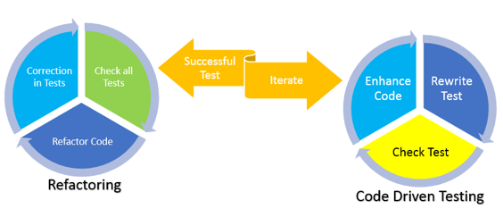

No matter how good our code is, if we cannot test it properly, it is a tedious
task to modify or enhance it. This situation results in problems for both users and
developers.

<!--more-->

### Introduction

Because requirements frequently change during the development process, you
constantly need to modify the code. Sometimes the requirement changes might
involve a complete change in the process.

Writing testable code is always more difficult than actually testing your code.
However, in the long run, testable code makes life easier for the developer
than the one who is testing the code.

You may face the following situations:

-	You are asked to change your own code. You might like this idea, but you
don't remember the details of the code that you originally wrote.
-	You have to change someone else’s code. This situation is not ideal, but it
is common.

How can you be sure that you won’t break anything after implementing changes
if you cannot test the code? The traditional approaches that we’ve seen over
the years include the following:

-	Write some tests in the development environment, and check that there are no
dumps.
-	Transfer to the quality testing environment, and test again.
-	Deliver to the functional consultant to let them test at their end.
-	Release to the user for User Acceptance Testing (UAT).

When someone encounters an issue with the code, we're likely to blame a
difference in test data. Even if it’s true, the real issue is that the
software is poorly written and not robust enough. You cannot test it without
real data. In other words, the program has dependencies, and you can't test it.

### Test-driven development and ABAP

Test-driven development (TDD) solves these issues by enabling you to deliver
high-quality software and products.

TDD is a software development process that relies on the repetition of a very
short development cycle: requirements turn into very specific test cases,
then the software is improved to pass only the new tests. (Wikipedia)



In ABAP, all of the code gets converted into an ABAP Unit, which is nothing
more than a specific piece of code. Testing ABAP units is not necessarily a
purely technical process performed by the developers. Because you don't need a
developer key to run unit tests for an ABAP program, anyone with the proper
authorization to display programs or classes should be able to run the tests.
As a best practice, involve our business experts and functional consultants in
testing whenever you can.

### Behavior-driven development

Behavior-driven development (BDD) is a software development process that
emerged from TDD. BDD combines the general techniques and principles of TDD
with ideas from domain-driven design and object-oriented analysis and design to
provide software development and management teams with shared tools and a
shared process to collaborate on software development. (Wikipedia)

BDD simplifies testing methods, so the methods labeled for testing in an ABAP
unit should have descriptions that make sense to a developer, business analyst,
and users. You can achieve this by setting each test method so that it fulfills
the phrase `IT SHOULD`.

Then inside of this method, you create three helper methods by using the
following pattern:

- `GIVEN`: Include inputs or initial conditions that the program receives.
- `WHEN`: Describe the activities that you are going to test.
- `THEN`: Specify the success and failure outcomes.

### Sample refactored test class

The following code sample, which uses dummy code to define the process, is a
sample refactored test class for the **zcl_instruments** class.

```
class lcl_test_class definition deferred.

"Allow access to private components within the class

class zcl_instruments definition local friends lcl_test_class.

class lcl_test_class definition final for testing
  duration short
  risk level harmless.

  private section.

    types: ty_guitars type standard table of zguitars with empty key.

    data: mo_class_under_test type ref to zcl_instruments,
	   guitar_instance type ref to zcl_guitar,
             guitars type ty_guitars.
	   guitar_to_add type ref to zcl_guitar.
	   guitar_to_search type ref to zcl_guitar.
	   mo_exception_raised type abap_bool.
	   found_guitars type zcl_instruments=>guitars_tab.


    methods:
      setup,
      "User Acceptance tests:

      "IT SHOULD....................
      add_guitar_to_instruments for testing,
      add_duplicate_and_get_error for testing,
      search_within_the_instruments for testing,

      "GIVEN ..................................................
      given_guitar_attribs_entered,
      given_initial_instruments,

      "WHEN ..................................................
      when_guitar_is_added,
      when_same_guitar_twice,
      when_guitar_is_searched,

      "THEN ..................................................
      then_instruments_has_guitar,
      then_exception_is_raised,
      then_guitar_is_found,

      "Other helper methods
      load_mockups returning value(re_guitars) type ty_guitars.

endclass.
```

You should include `IT SHOULD` methods that come right out of the functional
specification document.

In this example, the **zcl_instruments** class should be able to:

-	Add guitars to instruments.
-	Restrict duplicity.
-	Search any specific guitar in instruments.

The following sample shows an implementation of the
`add_guitar_to_instruments()` method:

```
  method add_guitar_to_instruments.

    given_guitar_attribs_entered ().

    when_guitar_is_added ().

    then_instruments_has_guitar ().

  endmethod.

```

To add a guitar to the instruments, you start with some guitar attributes,
add the guitar to instruments, and check if is successfully added. If there’s
no green light when you run a test for this method, that indicates that
something is wrong with this part of the process.

The following `given_guitar_attribs_entered()` method just initializes one
guitar object.

```
  method given_guitar_attribs_entered.

  data: guitar_spec_attributes type zcl_guitar_spec=>ty_guitar_attributes.

    guitar_spec_attributes-builder = zcl_enum_builder=>fender.
    guitar_spec_attributes-model    = 'XYZ'.
    guitar_spec_attributes-type     = zcl_enum_guit_type=>electric.
    guitar_spec_attributes-backwood = zcl_enum_wood=>maple.
    guitar_spec_attributes-topwood = zcl_enum_wood=>maple.

    data(guitar_spec) = new zcl_guitar_spec (guitar_spec_attributes).

    data(guitar_record) = value zcl_guitar=>ty_guitar_attributes (serialnumber = 'ABC0001'
                                                                   price = '1000'
                                                                   specs = guitar_spec).
    guitar_to_add = new zcl_guitar (guitar_record).


  endmethod.
```

The `WHEN` part of the BDD description, from the class under test, enables you
to test the method.

```
  method when_guitar_is_added.

    try.
        mo_class_under_test->add_guitar (guitar_to_add).
      catch zcx_guitar.
        "Oops
    endtry.

  endmethod.
```

Finally, you can check that the object instruments have a guitar by using the
following method. This check represents the helper method for the `Then` part of BDD.

```
method then_instruments_has_guitar.

    data(guitar) = mo_class_under_test->guitars [ serial_number = 'ABC0001'].

    cl_abap_unit_assert=>assert_not_initial (act = guitar
                                             msg = 'Guitar is not in instruments').

  endmethod.
```

### Conclusion

This blog highlights the importance of writing testable code and shows how to do
that. By focusing on test-driven development, you can adapt your programming
style to include testable code. As a result, you end up with clean, easy to
maintain, and reusable code. Writing testable code helps you to become a better developer.
Sometimes, when you have tighter delivery deadlines, it is easy to ignore the
testability aspects of the code, and by doing so, you might save time. However,
in the long run, you end up spending more time and resources fixing bugs.
Therefore, by adopting the test-driven development concepts described here, you
not only make your own life easier, but you also help the next developer who
works on your code.

Use the Feedback tab to make any comments or ask questions.

### Optimize your environment with expert administration, management, and configuration

[Rackspace's Application services](https://www.rackspace.com/application-management/managed-services)
**(RAS)** experts provide the following [professional](https://www.rackspace.com/application-management/professional-services)
and
[managed services](https://www.rackspace.com/application-management/managed-services) across
a broad portfolio of applications:

- [eCommerce and Digital Experience platforms](https://www.rackspace.com/ecommerce-digital-experience)
- [Enterprise Resource Planning (ERP)](https://www.rackspace.com/erp)
- [Business Intelligence](https://www.rackspace.com/business-intelligence)
- [Salesforce Customer Relationship Management (CRM)](https://www.rackspace.com/salesforce-managed-services)
- [Databases](https://www.rackspace.com/dba-services)
- [Email Hosting and Productivity](https://www.rackspace.com/email-hosting)

We deliver:

- **Unbiased expertise**: We simplify and guide your modernization journey,
focusing on the capabilities that deliver immediate value.
- **Fanatical Experience**&trade;: We combine a Process first. Technology second.&reg;
approach with dedicated technical support to provide comprehensive solutions.
- **Unrivaled portfolio**: We apply extensive cloud experience to help you
choose and deploy the right technology on the right cloud.
- **Agile delivery**: We meet you where you are in your journey and align
our success with yours.

[Chat now](https://www.rackspace.com/#chat) to get started.
