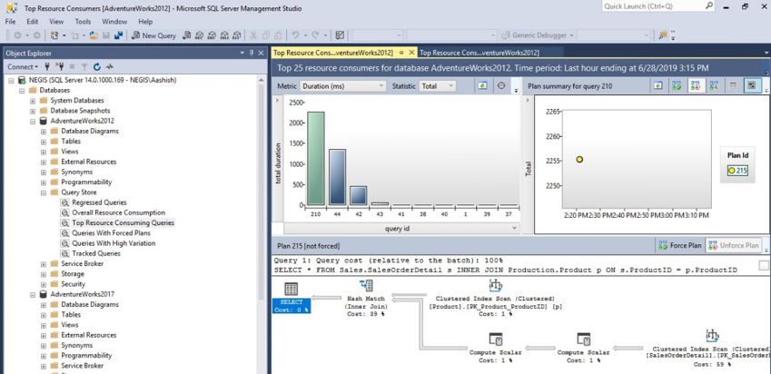
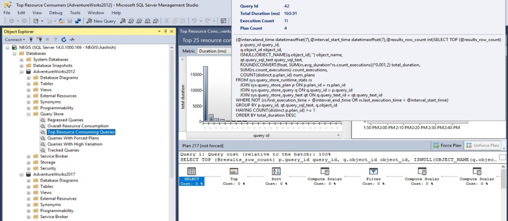
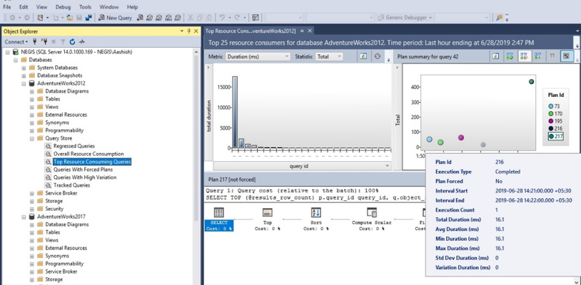
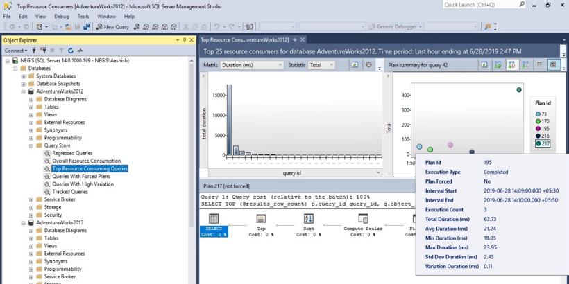
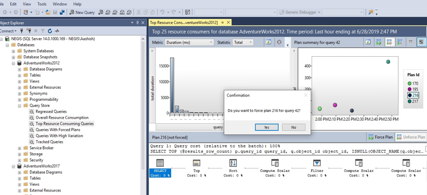
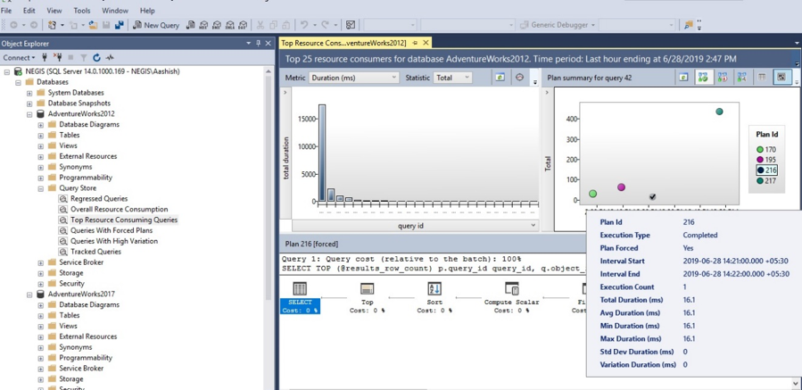

Microsoft&reg; SQL Server&reg; Query Store, as the name suggests, is like a
store that captures the database history of executed queries, query runtime
execution statistics, and execution plans. Because the data is stored on a disk,
you can retrieve the query store data anytime for troubleshooting purposes, and
SQL Server restarts do not affect the data. Use Query Store, which was introduced
in SQL Server 2016 and is available in all later editions, to troubleshoot
performance issues caused by query plan changes.

<!--more-->

### Introduction

You might find baseline data analysis useful for performance troubleshooting,
but until Query Store was introduced, that information was not natively
available in SQL server. If Query Store is enabled for a database, it keeps
information about executed queries along with execution plans and runtime
statistics. It is enabled at the database level and can be enabled for all
users' databases and the MSDB system database. Query store-related information
and metadata are stored in internal tables within the database itself. There
is no need to manage a separate backup of the Query Store because a standard
database backup has all the required information. To view Query Store data,
you need to have the `View Database State` permission, and you need to have
`DB_Owner` rights to force and unforce plans. You can view this data through
the management studio and through T-SQL.

### Setting Up Query Store

Perform the following steps to enable Query Store for a database:

1. Right-click **Database -> Go to Properties**.
2. Under **Select a Page**, choose **Select Query Store**.
3. In the **General** section, change **Operation Mode (Requested)** from `Off`
   to `Read-Write`.
4. Leave the other fields in the **Operation Mode (Requested)** drop-down box
   set to the pre-populated default values.
5. Click **Ok** in the database properties box to enable Query Store for the
   selected database.

You can enable Query Store with T-SQL by using the following code:

    ALTER DATABASE [DB_Name] SET QUERY_STORE = ON;

### Various Configuration Options of Query Store

The following list contains descriptions of some Query Store options:

-	**Operation Mode (Requested)** has three values: `Off`, `Read Only`, and
   `Read Write`. When the Query Store has a mode set to `Read`, no new
   execution plans or query runtime statistics are collected. This mode is for
   read-only operations related to Query Store. Changing the mode to `Read Write`
   enables Query Store to gather queries that are executed, execution plans that
   are used for those queries, and runtime statistics for those queries run in
   the selected database.

-	**Data Flush Interval (Minutes)** allows you to set how frequently the
   collected execution plans and query runtime statistics are flushed from
   memory to disk. By default, it is set to 15 minutes.

-	**Statistics Collection Interval** defines the aggregation interval of
   query runtime statistics that should be used inside the Query Store. By
   default, it is set to 60 minutes.

-  **Max Size (MB)** is used to configure the maximum size of the Query Store.
   By default, it is set to 100 MB. The data in Query Store is stored in the
   database where the SQL Server Query Store is enabled. Depending on the size
   configured here, after Query Store reaches the maximum size, the operation
   mode switches to the `Read Only` mode automatically.

-  **Capture Mode** helps you choose which type of query to capture in Query
   Store. The default option is `All`, which stores every executed query. When
   this option is set to `auto`, Query Store tries to triage which query capture,
   by priority, and tries to ignore infrequently executed as well as other ad hoc queries.

-  **Stale Query Threshold (Days)** is used to define how long data stays in
   Query Store. The default value for this mode is 30 days.

### Query Store Reports

Query Store includes the following reports:

-	**Regressed Queries**: Pinpoint queries for which execution metrics have
   recently regressed or changed to worse.
-	**Overall Resource Consumptions**: Analyze the total resource consumption
   for the database for any of execution metrics.
-	**Top Resource Consuming Queries**: Queries which have biggest impact on
   database resource consumption.
-	**Queries with Forced Plans**: Built-in report, that shows all queries with
   forced execution plans.
-	**Queries with High Variation**: This report shows the queries with the most
   frequent parameterization problems.
-	**Tracked Queries**: Track the execution of the most important queries in real
   time.

### Forcing Plans with Query Store

Because of a plan regression, a query, which was working fine yesterday, might
take too long to execute, consume too many resources or time out today. By
default, SQL Server keeps the latest execution plan only for queries. Any
changes in the schema, statistics, or indexes could change the query execution
plan that is used by the Query Optimizer. The plan can be also dropped due to
pressure in the plan cache memory.

Query Store stores query plans and statistical information aggregated over time
within each monitored database. Unlike the plan cache, Query Store can retain
multiple plans per query and maintain a history of query plan changes along
with associated stats per plan. By choosing among various execution plans, you
can go ahead and force any execution plan. Query Optimizer then uses this forced
execution plan only for the upcoming query executions.

The **Query Store -> Open Top Resource Consuming Queries** report lists queries
that are resource intensive. Let’s select a query for examination:

Hover your mouse over **Plan** to see related statistics.

Let's compare different plans.

**Plan 216 details:**

**Plan 195 details:**

The average duration for Plan 216 is lower, so it can be used to force this plan
in further executions. Click on **Force Plan** to see a confirmation screen
with the message “Do you want to force plan 216 for query 42?”

Click **Yes**.  After the plan is forced, it is highlighted with a checkmark as
shown in the following screenshot. In the future, this plan will be used by
query optimizer for execution.

### Best Practices with Query Store

-	Use the latest SQL Server Management Studio to see the latest features and enhancements.

-	Verify and monitor the Query Store data collection.

-	Set the **Optimal Query** capture mode and revisit the Query Store
   configuration option as needed to make adjustments.

-	Avoid using non-parameterized queries.

-	Check the status of forced plans regularly.

### Conclusion

Query Store is a useful feature introduced in SQL Server 2016. Because tuning
performance enhancements is one of the key skills required for every database
administrator (DBA), you should learn how to configure and use Query Store.
You can also use Query Store to track performance changes and troubleshoot any
degradation in query performance by comparing execution plans. You can force a
query plan for any query. This overrides the one saved in the plan cache,
and thus provide performance benefits. Query Store has no major impact on SQL
Server performance because it is used to capture and save queries execution
statistics and plans to be viewed later.

Use the Feedback tab to make any comments or ask questions.

### Optimize your environment with expert administration, management, and configuration

[Rackspace's Application services](https://www.rackspace.com/application-management/managed-services)
**(RAS)** experts provide the following [professional](https://www.rackspace.com/application-management/professional-services)
and
[managed services](https://www.rackspace.com/application-management/managed-services) across
a broad portfolio of applications:

- [eCommerce and Digital Experience platforms](https://www.rackspace.com/ecommerce-digital-experience)
- [Enterprise Resource Planning (ERP)](https://www.rackspace.com/erp)
- [Business Intelligence](https://www.rackspace.com/business-intelligence)
- [Salesforce Customer Relationship Management (CRM)](https://www.rackspace.com/salesforce-managed-services)
- [Databases](https://www.rackspace.com/dba-services)
- [Email Hosting and Productivity](https://www.rackspace.com/email-hosting)

We deliver:

- **Unbiased expertise**: We simplify and guide your modernization journey,
focusing on the capabilities that deliver immediate value.
- **Fanatical Experience**&trade;: We combine a Process first. Technology second.&reg;
approach with dedicated technical support to provide comprehensive solutions.
- **Unrivaled portfolio**: We apply extensive cloud experience to help you
choose and deploy the right technology on the right cloud.
- **Agile delivery**: We meet you where you are in your journey and align
our success with yours.

[Chat now](https://www.rackspace.com/#chat) to get started.
