This blog covers the essentials of how to use the advanced security option to
secure sensitive data within an Oracle&reg; database by using Transparent Data
Encryption (TDE). This feature enables you to encrypt database columns and
manage encryption keys.

<!--more-->

### Introduction

TDE enables the encryption of sensitive database data, which is stored in the
operating system files. It provides secure storage and management of encryption
keys in a security module located outside the database.

Encrypted data is transparently decrypted for a database user who has access to
the data. TDE stores the encryption keys in a security module external to the
database.

### Why use TDE?

If thieves steal backup tapes of the database, and restore it on their own
server, they have access to the company's most sensitive data. This is an
unacceptable risk. Most company regulations and guidelines consider protecting
database data a compliance requirement. How can you protect your database from
this vulnerability?

One solution is to encrypt the sensitive data in the database and to store the
encryption keys in a separate location. Without the keys, any stolen data is
worthless.

### How does TDE work?

TDE is a key-based access control system. Even if the encrypted data is
retrieved, it is useless without authorized decryption, which occurs
automatically for users authorized to access the table.

For tables containing encrypted columns, the encryption key is called the
column encryption key. Each table's column encryption key is encrypted with the
database server's master key. The master encryption key is stored outside the
database in the Oracle Wallet.

Encrypted table keys are placed in the data dictionary. When a user enters data
into a column this is defined as encrypted, Oracle performs the following tasks:

1) It retrieves the master key from the wallet.
2) It decrypts the encryption key for that table from the data dictionary.
3) It uses that encryption key on the input value.
4) It stores the encrypted data in the database.

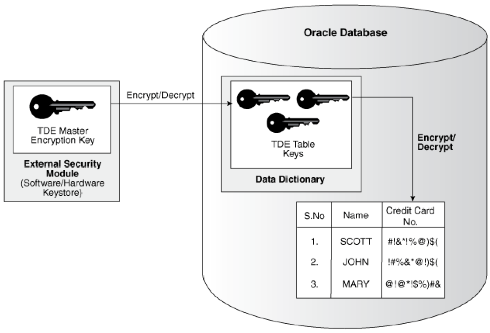

*Image source*: [https://docs.oracle.com/database/121/ASOAG/img/GUID-5FD3A3BB-441C-4C42-A520-1248974627B0-default.png](https://docs.oracle.com/database/121/ASOAG/img/GUID-5FD3A3BB-441C-4C42-A520-1248974627B0-default.png)

TDE encrypts the data in the following database files:

-	The datafile
-	The redo log and archive log files
-	Memory
-	The file backup

### Managing Oracle Wallet

This section describes creating, opening, and closing the wallet.

#### Create the wallet

When you first enable TDE, you must create the wallet where the master key is
stored.

By default, the wallet is created in the **$ORACLE\_BASE/admin/$ORACLE\_SID/wallet**,
but you can set a different location by specifying it in **sqlnet.ora** in the
following lines:

    ENCRYPTION_WALLET_LOCATION = (SOURCE =
                                 (METHOD = FILE)
                                 (METHOD_DATA =
                                 (DIRECTORY =D:\oracle\product\Wallet)))

Next, run the following command to create the wallet:

    ALTER SYSTEM SET ENCRYPTION KEY [certificate_ID] IDENTIFIED BY password;

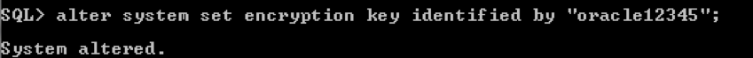

- The wallet **password** is case sensitive. Enclose the password string in
  double quotation marks (" ").

- The **certificate\_ID** is an optional string containing the unique
  identifier of a certificate stored in the Oracle wallet. You can search for a
  certificate_ID by querying the **V$WALLET** fixed view when the wallet is open.

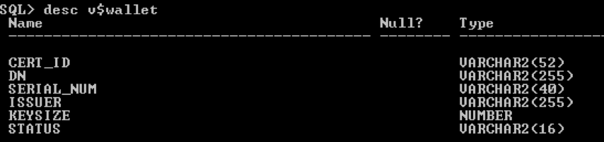

#### Open and close the wallet

After you create the wallet and set the password, you need to open the wallet
explicitly by using `SYS`, `SYSTEM`, or `SYSDBA` accounts every time you start
the database.

For example, run the following command:

    alter system set encryption wallet open identified by "oracle12345";

**Important:** To perform any action on database, you must open the wallet.

The following example demonstrates a database operation where the database is
up but the wallet is closed:

    alter system set encryption wallet close;

Now, if you try to retrieve the data from an encrypted column, the following
error message displays because the wallet is closed:

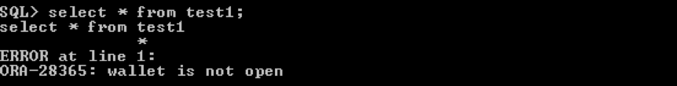

To retrieve the data from an encrypted column, you need to open a wallet by
using the following command:

    alter system set encryption wallet open identified by "oracle12345";

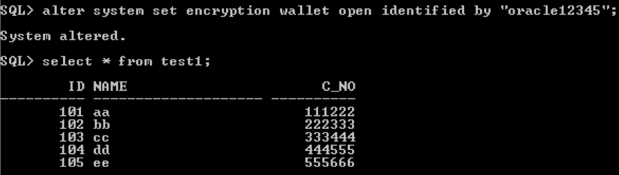

Now you can retrieve data from the encrypted columns because the wallet is open.

### Create tables with an encrypted column

Use the following command to create a table with an encrypted column:

    CREATE TABLE test2 (id number,name varchar2(20),s_s_num number ENCRYPT);

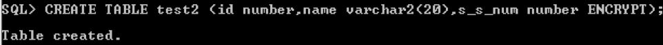

#### Create tables using a non-default algorithm and the NO SALT option

SALT is a random string that is added to the data before it is encrypted to make
it even more secure and harder to hack. By default, TDE adds SALT to the
cleartext before encrypting it.

You can’t create and index on a column which is encrypted with the SALT option.
If you want to add index on the encrypted column, you must use the NO SALT
option such as the following example:

    CREATE TABLE test3 (id number,name varchar2(20),s_s_num number ENCRYPT NO SALT,Ph_no number ENCRYPT USING '3DES168');

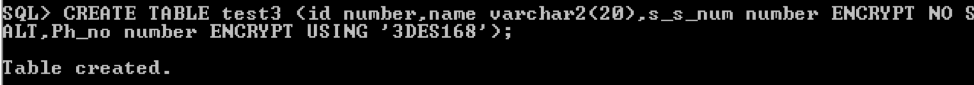

Here, the **S\_S\_NUM** column is encrypted with the NO SALT option and the
**PH_NO** column is created with a default SALT option.

The following example shows that you can't create an index on the **PH_NO**
column because you created it with the SALT option by default.

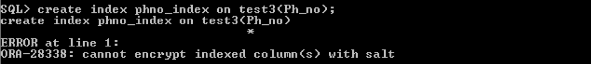

### Encrypt columns in existing tables

The following command encrypts a column in an existing table:

    ALTER TABLE test1 ADD (ssn VARCHAR2(11) ENCRYPT);

### Disable encryption on a column

The following command disables encryption on a column:

    ALTER TABLE test1 MODIFY (ssn DECRYPT);

### Restrictions on using TDE

Keep the following restrictions on using TDE in mind:

- You cannot create any index other than a B-tree on an encrypted column.

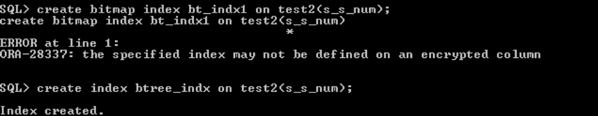

- Encryption is not allowed on external large objects (BFILE).

- You cannot perform import or export operations if the wallet is closed.

**Error because wallet is closed**

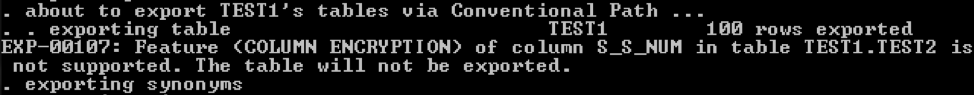

**Success because wallet is open**

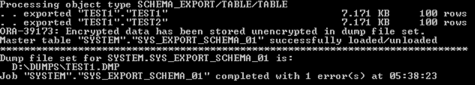

### Conclusion

If you need to secure sensitive data from unauthorized, or back-door, access,
use the TDE security option. This feature lets you immediately provide data
encryption and compliance with no coding and key management complexity. Thus,
it enables you to focus on more strategic efforts.

Use the Feedback tab to make any comments or to ask questions.

### Optimize your environment with expert administration, management, and configuration

[Rackspace's Application services](https://www.rackspace.com/application-management/managed-services)
**(RAS)** experts provide the following [professional](https://www.rackspace.com/application-management/professional-services)
and
[managed services](https://www.rackspace.com/application-management/managed-services) across
a broad portfolio of applications:

- [eCommerce and Digital Experience platforms](https://www.rackspace.com/ecommerce-digital-experience)
- [Enterprise Resource Planning (ERP)](https://www.rackspace.com/erp)
- [Business Intelligence](https://www.rackspace.com/business-intelligence)
- [Salesforce Customer Relationship Management (CRM)](https://www.rackspace.com/salesforce-managed-services)
- [Databases](https://www.rackspace.com/dba-services)
- [Email Hosting and Productivity](https://www.rackspace.com/email-hosting)

We deliver:

- **Unbiased expertise**: We simplify and guide your modernization journey,
focusing on the capabilities that deliver immediate value.
- **Fanatical Experience**&trade;: We combine a Process first. Technology second.&reg;
approach with dedicated technical support to provide comprehensive solutions.
- **Unrivaled portfolio**: We apply extensive cloud experience to help you
choose and deploy the right technology on the right cloud.
- **Agile delivery**: We meet you where you are in your journey and align
our success with yours.

[Chat now](https://www.rackspace.com/#chat) to get started.

