This post discusses how to set up log shipping, which is a disaster recovery
(DR) solution, with existing Microsoft&reg; SQL Server&reg; AlwaysOn-configured
databases.

<!--more-->

### Introduction

The AlwaysOn availability group (AG) feature is a high-availability and
disaster recovery solution that provides an enterprise-level alternative to
database mirroring. Introduced in SQL Server 2012 (11.x), AlwaysOn AGs
maximize the availability of a set of user databases for an enterprise.
AGs support a fail over environment for a discrete set of user
databases, known as availability databases, that fail over together. They also
support a set of read-write primary databases and one to eight sets of
corresponding secondary databases. Optionally, AGs can make
secondary databases available for read-only access and some backup operations.

SQL Server log shipping enables you to automatically send transaction log
backups from a primary database on a primary server instance to one or more
secondary databases on separate secondary server instances. The transaction log
backups are applied to each of the secondary databases individually.

### Reasons why you might need AlwaysOn log shipping

Let's assume that you have configured an AlwaysOn setup between your primary
replica server and your secondary replica and that AlwaysOn is used in the main
data center. You might need to use log shipping if you can’t expand the required
Windows Server Failover Cluster (WSFC) configuration into the DR site. Reasons
include the following possibilities:

-	The infrastructure or staff can't maintain the WSFC configurations between
   different sites.
-	You can’t leverage the target server in the DR site in the WSFC configuration
   because it is already part of another WSFC configuration.
-  The service level agreements (SLAs) on recovery point objective (RPO) and
   recovery time objective (RTO) force a fast recovery from manual error, which
   can be realized only with a delayed recovery restoring the transaction log
   backups on one instance of the high availability (HA) and DR strategy.

Therefore, you need to supply the target server, which is in the DR site, by
using log shipping to ship the transaction log from backups performed in the
main site on the current primary.

### Prerequisites for using log shipping

Before you set up log shipping, make sure you meet the following prerequisites:

-	The primary database must use the full or bulk-logged recovery model.
   Switching the database to simple recovery causes log shipping to stop
   functioning.
-	Before you configure log shipping, you must create a shared path to make the
   transaction log backups available to the secondary server.
-	The log-shipping stored procedures require membership in the sysadmin
   fixed server role.
-	The backup shared path should have read and write permissions to the SQL
   Server service account.

### Configure log shipping DR solution example

In this example, we have already setup AlwasyOn between the primary replica
server, called PRIMEHEAD, and your secondary replica, called HEAD2, as shown
in the following image:

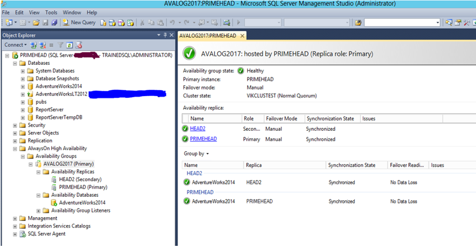

This section provides a step-by-step solution to configure log shipping on a
database that is already a part of an AlwaysOn AG.

#### Step 1

Configure log shipping for the **AdventureWork2014** database between the
PRIMEHEAD and the DR server, HEAD3.

While configuring log shipping on the database, take a full backup of the
**AdventureWork2014** database and restore it on HEAD3 with non-recovery.
You need to create a shared folder on PRIMEHEAD to store the log backup that
the `LSCopy` (log shipping) job uses.

#### Step 2

Right-click on the database, select **Properties**, and click on the
**Transaction Log Shipping** option on the left side of PRIMEHEAD. Then, click
on the highlighted **Enable this as a primary database in a log shipping configuration**
checkbox as shown in the following image:

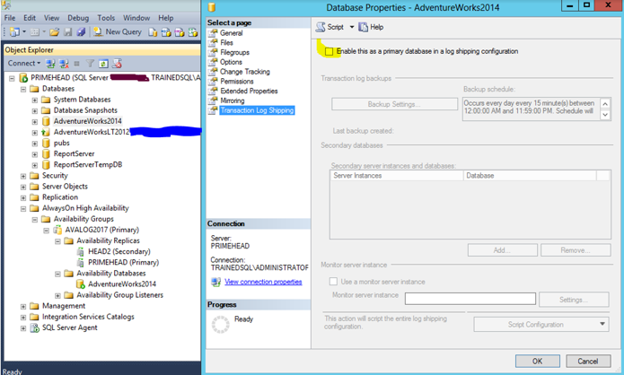

#### Step 3

Click **Backup Setting** to configure the **LS Backup** option. Select the
network-shared path for LS Backup, as shown in the following image:

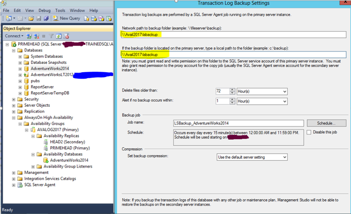

#### Step 4

At this point, you can also schedule LS Backup according to your requirements.
However, in this scenario, use the default settings.

#### Step 5

To add a DR server, click **Add** as shown in the following image:

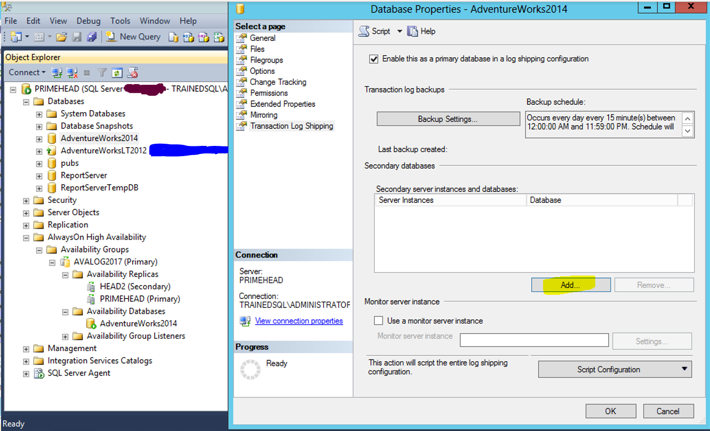

#### Step 6

Click **Connect** to connect to HEAD3, the DR server, as shown in the
following image:

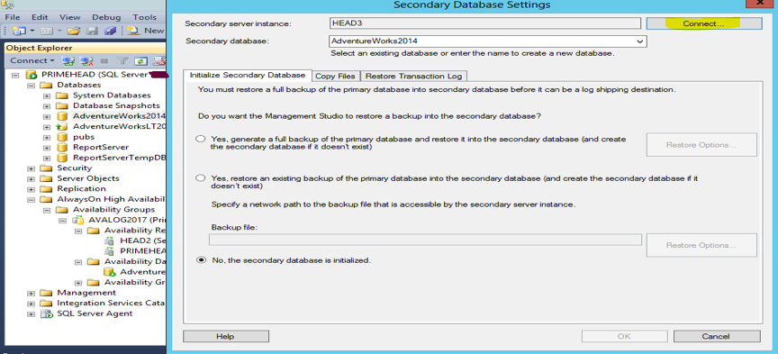

#### Step 7

On the **Initialize Secondary Database** tab, select the third option because
the database has already been initialized on HEAD3.

#### Step 8

Click the **Copy Files** tab. In the **Destination folder for copied files**
box, type the path where transaction log backups are copied. For this scenario,
use **C:\LSCopyAlwaysOn** for the path, as shown in the following image:

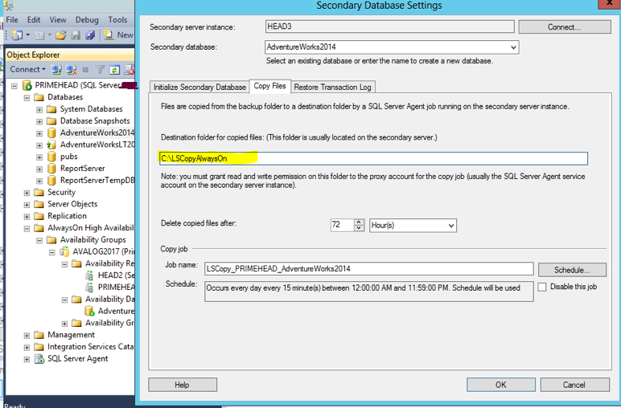

#### Step 9

On the **Restore Transaction Log** tab, under **Database state when restoring backups**,
choose either **No recovery mode** or **Standby mode**, as shown in the following
image:

In this example, we selected **No recovery mode**, which implies that the DR
database is not accessible. If you select **Standby Mode**, the DR database is
available to the end user in read-only mode.

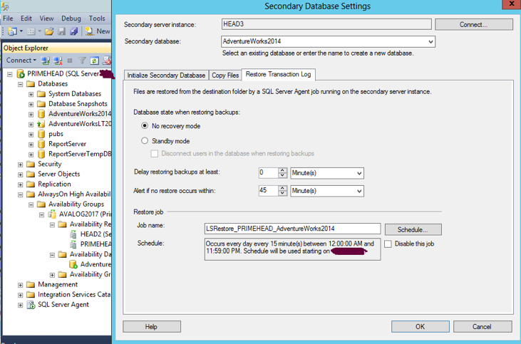

#### Step 10

Click **OK** to start the log shipping.

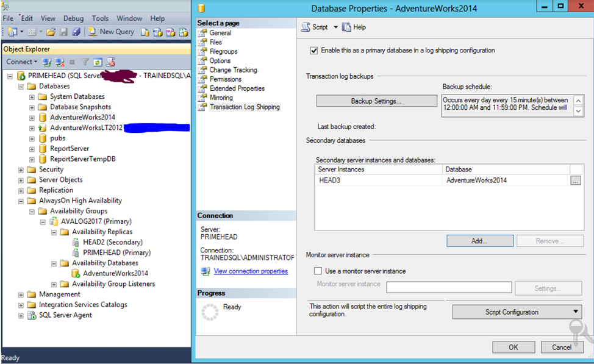

The following screen displays:

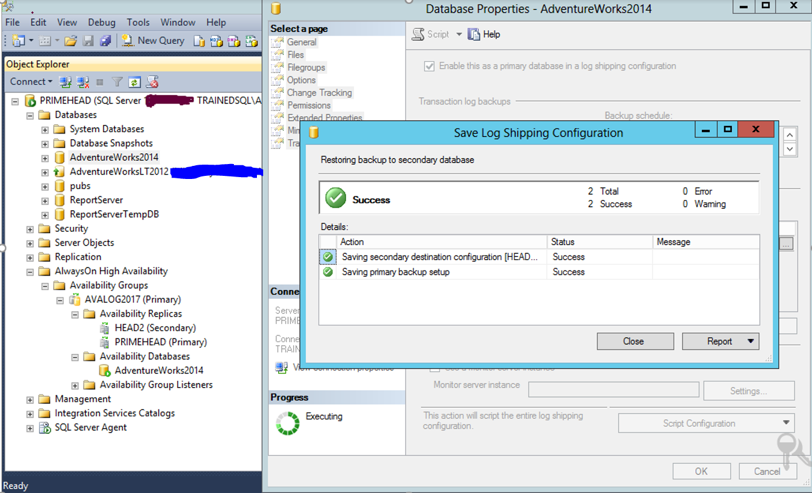

#### Step 11

To check the log shipping status, right-click on the DR server, HEAD3, instances,
and select **Reports->Standard reports—>Transactional Log Shipping Status**. If
the following screen appears, log shipping is healthy and working as expected.

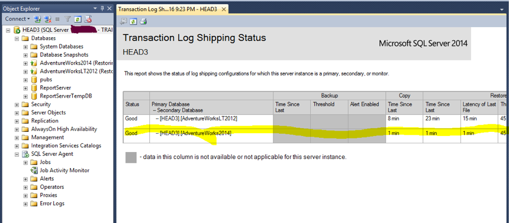

If an AG fail over between PRIMEHEAD and HEAD2 occurs, log shipping is interrupted
until you configure it considering AG specifications.

Now you can configure log shipping from HEAD2 to HEAD3, which will not impact
log shipping functionality even if there is a fail over in the future between the
AG replicas. Log backup always happens on the same path or location, regardless
of which replica is serving as the primary.

You need to initiate a fail over between the replicas. Before initiating the
fail over, complete the following steps:

1. Execute an LS backup job on primary replica and disable the job.

2. Execute an LS copy and restore job on secondary replica and then disable it.

To do this, right-click on the AG and select the fail over option as shown in the
following image:

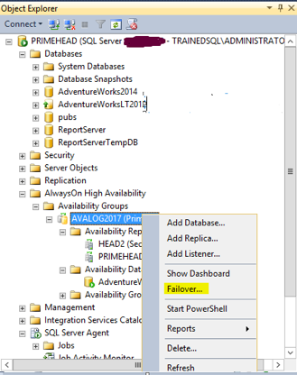

You can also accomplish this by using the following T-SQL commands to manually
trigger an AG fail over:

    USE master;
    GO

    ALTER AVAILABILITY GROUP [AGName] FAILOVER
    GO

After the fail over completes, the following window displays:

#### Step 12

After an AG fail over between PRIMEHEAD and HEAD2, the current primary instance
is HEAD2.

Follow the same steps to configure log shipping from the current primary server or
node, HEAD2, to the DR Server, HEAD3. While configuring log shipping, choose the
same shared path that you used during LS configuration between PRIMEHEAD and
HEAD3, **\\Avail2017\lsbackup**.

#### Step 13

After the log shipping between HEAD2, the current primary, and HEAD3 completes,
an LS backup job is created on HEAD2, and another set of LS copy and LS restore
jobs are created on HEAD3.

Once again, initiate a fail over between AG replicas. Before initiating the
fail over, make sure to complete the following steps:

1. Execute LS backup job on primary (HEAD2) and disable the job.

2. Execute LS copy and restore job on secondary (HEAD3) and then disable it.

#### Step 14

After the final fail over, the current primary is PRIMEHEAD, HEAD2 is the
secondary replica, and HEAD3 is the DR server. Because LS backup jobs exist on
both the servers (primary and secondary), you need to modify LS backup job on
both the PRIMEHEAD and HEAD2 to ensure that it only takes the log backup from
the current primary.

To do this, add the following code to the job step 1:

    Declare @dbname as varchar(20)
    Set @dbname=’AdventureWorks2014’
    If sys.fn_hadr_backup_is_preferred_replica (@dbname)<>1
    begin
    RAISERROR (50005,-- Message id,
               16, -- Severity,
               1, --State,
               N’This is not the primary server backup is rolled back’);
    end

The following image illustrates this:

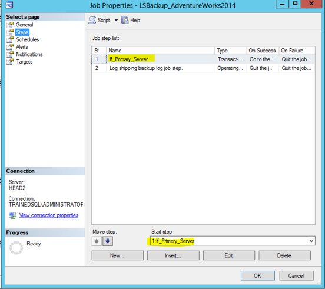

After making the preceding changes, notice that the LS backup job starts failing
on secondary server but runs fine on the primary.

#### Step 15

Because there are two sets of LS copy and restore jobs on HEAD3, the DR server,
you must ensure that only one set of jobs run at a time. You need to keep the
jobs enabled that got created while configuring log shipping between HEAD2 and
HEAD3 and disable the other set of jobs.

The following image shows more details:

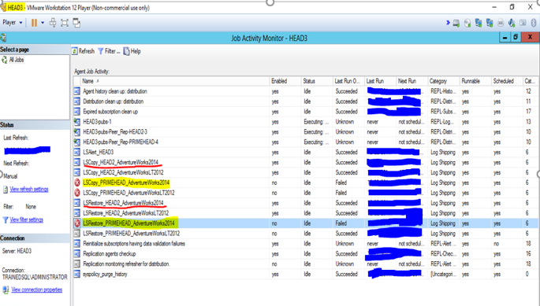

Now, you have successfully configured log shipping on a database that is an
existing part of an AlwaysOn AG. No matter which server is working as a primary
server, your log shipping will be in sync.

**Note**: We strongly recommended that you do not make any changes in production
without testing. Before implementing this solution in your production environment,
first implement this configuration in a test environment.

#### Validation:

a)	Make sure that the backup job is running successfully on the current primary replica.
b)	The backup path should be the same as the shared path.
c)	Copy and restore jobs, which were created during LS configuration from HEAD2
to HEAD3 should run properly on the DR server.
d)	Check the Transactional Log Shipping Status in the standard report section.

### Conclusion

Configuring log shipping on a highly available database enables you to have a
DR server set up in a different data center. This setup proves helpful in case of a
disaster and keeps your business unaffected while requiring minimal manual effort
even if the servers in another data center are impacted.

Use the Feedback tab to make any comments or ask questions.

### Optimize your environment with expert administration, management, and configuration

[Rackspace's Application services](https://www.rackspace.com/application-management/managed-services)
**(RAS)** experts provide the following [professional](https://www.rackspace.com/application-management/professional-services)
and
[managed services](https://www.rackspace.com/application-management/managed-services) across
a broad portfolio of applications:

- [eCommerce and Digital Experience platforms](https://www.rackspace.com/ecommerce-digital-experience)
- [Enterprise Resource Planning (ERP)](https://www.rackspace.com/erp)
- [Business Intelligence](https://www.rackspace.com/business-intelligence)
- [Salesforce Customer Relationship Management (CRM)](https://www.rackspace.com/salesforce-managed-services)
- [Databases](https://www.rackspace.com/dba-services)
- [Email Hosting and Productivity](https://www.rackspace.com/email-hosting)

We deliver:

- **Unbiased expertise**: We simplify and guide your modernization journey,
focusing on the capabilities that deliver immediate value.
- **Fanatical Experience**&trade;: We combine a Process first. Technology second.&reg;
approach with dedicated technical support to provide comprehensive solutions.
- **Unrivaled portfolio**: We apply extensive cloud experience to help you
choose and deploy the right technology on the right cloud.
- **Agile delivery**: We meet you where you are in your journey and align
our success with yours.

[Chat now](https://www.rackspace.com/#chat) to get started.

