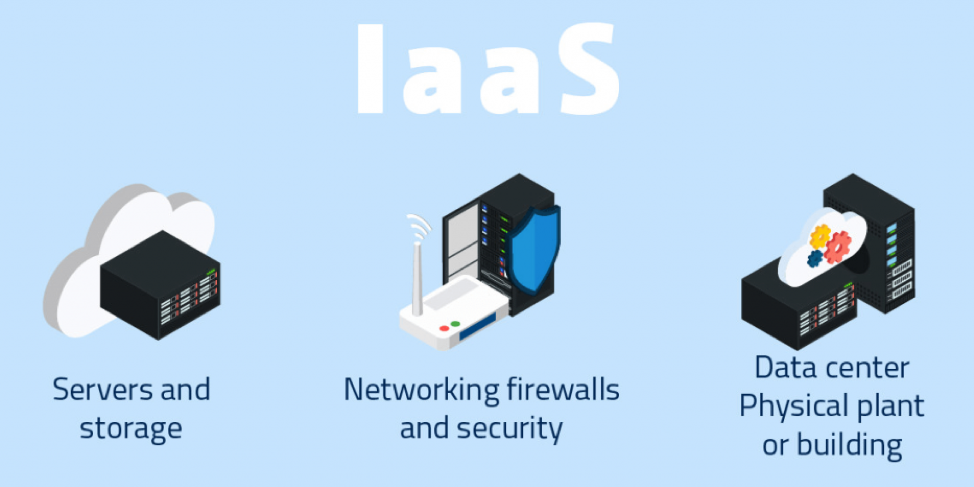
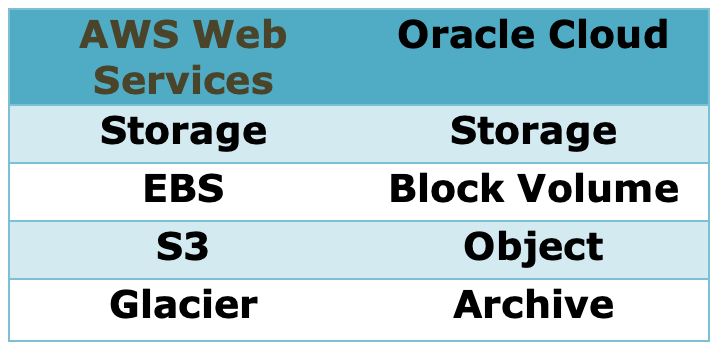

This blog compares Amazon Web Services to the Oracle Cloud, which is an infrastructure-as-a-service offering, and explores the features and services that both the providers support.

<!--more-->

### Introduction

Amazon has been a pioneer in cloud services, and Oracle, despite being a late entrant, provides a robust infrastructure service to compete with Amazon and others in the market.

Both Amazon and Oracle Cloud have unique features. This post gives you a better understanding of both clouds and what makes each unique.

### Infrastructure-as-a-service

The following image shows Infrastructure-as-a-service (IaaS) services:

*Image source*: [https://www.syntax.com/wp-content/uploads/2018/01/IaaS_graphic.png](https://www.syntax.com/wp-content/uploads/2018/01/IaaS_graphic.png)

### Amazon and Oracle Cloud services

Let’s begin with the following fundamental services of Amazon and Oracle Cloud.

- In the cloud, you run remote instances of computers. Amazon calls this *EC2*, and Oracle calls it *Compute Instances*.
- You can categorize the storage into two types: block volume and object storage.

Block volume is a traditional storage medium that is available for servers in data centers and is commonly known as the local storage. Object storage, or cloud storage, maintains files on the Internet, which you can access as needed.

Amazon has three types of storage services:

- **EBS**: Elastic block storage used by instances on EC2.
- **S3**:  The simple storage service - basically object storage or an Internet storage.
- **Glacier**: An archive storage on the cloud.

Oracle provides the following types of storage:

- **Block volumes**: Similar to EBS from Amazon.
- **Object storage**: Similar to S3 from Amazon.
- **Archive storage**: Similar to Glacier from Amazon.

The following chart shows the service equivalence:

### Accessing storage on the cloud

To access cloud storage through data centers or other cloud instances, both AWS and Oracle provide a software interface. Amazon calls it a **storage gateway**, whereas Oracle calls it the **Oracle Cloud File Storage** that supports Network File System (NFS) to mount the volume on your instances so that you can access the object storage.

### Networking on AWS and Oracle Cloud

On the networking front, Amazon offers a virtual private cloud (VPC), where users can set up their networking within an Amazon data center. Oracle calls the same feature Virtual Cloud Networking (VCN), and you can use it to set up networking inside Oracle Cloud.

### Accessing the cloud through data centers

If you are going to run your computing infrastructure within a data center, you need to access it over the Internet. However, this has disadvantages like speed, network bandwidth, and low latency. To overcome these obstacles, both the providers offer a service to collaborate with the partners who bring in a dedicated connection from the data center of their cloud to the customer's data center. Amazon calls it **Direct connect**, and Oracle calls it **Fast connect**.

### Transferring data from on-premises to the cloud

If you have a lot of data, moving on-premises applications to the cloud over the network can take a long time. Both providers offer a service that allows you to copy your data onto disks or storage and then ship it across the data center via the cloud, which then transfers it to the remote instances. Amazon calls it **Import/Export services**, and Oracle calls it the **Data Transfer service**.

### Load balancing to ensure high availability of applications

Both the providers offer a load-balancing feature to ensure high-availability applications. Anyone who has a cloud application can either set up their own Virtual Machine (VM) template and provision it on Amazon, or create their own template and provision it on the Oracle Cloud. This way, software owners can launch their application on the cloud either on the Amazon market place or the Oracle market place.

### Conclusion

After reading this post, you should have a basic knowledge about both AWS and Oracle Cloud in IaaS and their features.

When considering the two cloud service providers, you need to decide which platform best suits your business needs. This decision might depend on the business size because you should ensure that the provider can satisfy your database needs. Your data and cloud computing needs are likely to keep growing. Keeping the future growth of the business in mind is important so you maintain the flexibility to scale up or down as the situation demands.

Use the Feedback tab to make any comments or ask questions.

### Optimize your environment with expert administration, management, and configuration

[Rackspace's Application services](https://www.rackspace.com/application-management/managed-services)
**(RAS)** experts provide the following [professional](https://www.rackspace.com/application-management/professional-services)
and
[managed services](https://www.rackspace.com/application-management/managed-services) across
a broad portfolio of applications:

- [eCommerce and Digital Experience platforms](https://www.rackspace.com/ecommerce-digital-experience)
- [Enterprise Resource Planning (ERP)](https://www.rackspace.com/erp)
- [Business Intelligence](https://www.rackspace.com/business-intelligence)
- [Salesforce Customer Relationship Management (CRM)](https://www.rackspace.com/salesforce-managed-services)
- [Databases](https://www.rackspace.com/dba-services)
- [Email Hosting and Productivity](https://www.rackspace.com/email-hosting)

We deliver:

- **Unbiased expertise**: We simplify and guide your modernization journey,
focusing on the capabilities that deliver immediate value.
- **Fanatical Experience**&trade;: We combine a Process first. Technology second.&reg;
approach with dedicated technical support to provide comprehensive solutions.
- **Unrivaled portfolio**: We apply extensive cloud experience to help you
choose and deploy the right technology on the right cloud.
- **Agile delivery**: We meet you where you are in your journey and align
our success with yours.

[Chat now](https://www.rackspace.com/#chat) to get started.
