Oracle&reg; version 12.1.0.1 has incorporated two new features based on Hub and Leaf
node architecture. The new features are:

-	Flex Cluster
-	Flex Automatic Storage Management (Flex ASM)

<!--more-->

### Introduction

Oracle implements the Flex ASM feature by default in Oracle Database Appliance
(ODA) version 12.1.x, along with the ASM Dynamic Volume Manager (ADVM) Proxy
instance and the Grid Infrastructure Management Repository database, *MGMTDB*.
This blog explains Flex ASM, ADVM and MGMTDB features and the associated
benefits.

### Flex ASM

Flex ASM reduces the ASM instance footprint by running on each node of the
cluster, and also ensures that the database instance has high availability, in
case of ASM instance failure on a particular node. You can configure Flex ASM
by using dedicated ASM network, or you can share the private interconnect used
by the cluster. The following images show the test cases performed for Flex ASM:

Cluster ASM listener Node1:

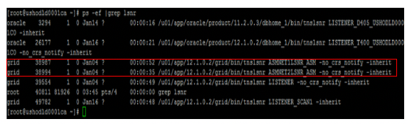

Cluster ASM listener Node2:

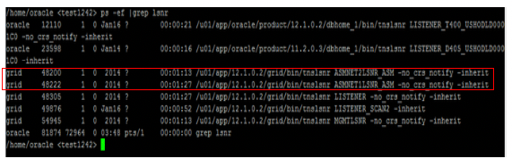

### Flex ASM test case

Use the following code to check the ASM cluster mode and state:

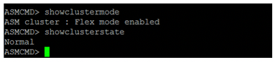

Use the following code to check ASM status:

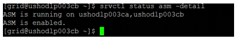

Use the following code to check ASM configuration:

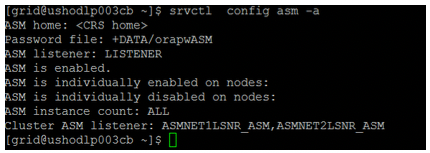

**NOTE**: You can reduce an ASM instance count to a minimum of two by using the
following command, which shows instances running on Node1:

    srvctl modify asm -count 2

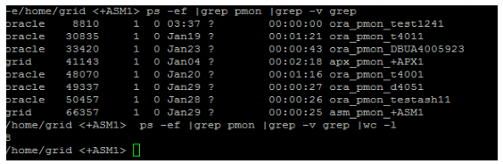

Then run the following code:

    srvctl status asm -node ushodld0001ca

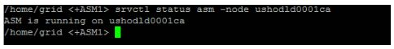

Now, you need to stop the ASM instance on Node1 by running the following command:

    srvctl stop asm -node ushodld0001ca -stopoption abort –force

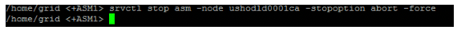

Use the following code to check the status:

    srvctl status asm

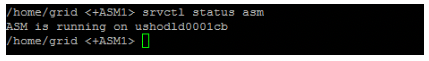

Use the following code to check the cluster:

    crsctl check cluster

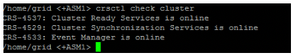

Use the following code to Verify that all the instances except ASM1 are running
on Node1 because of Flex ASM:

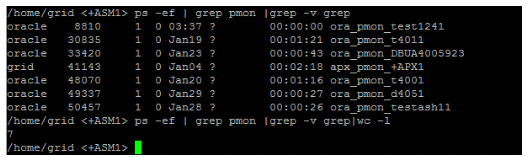

Use the following code to verify that instances are running fine on both the
nodes even if ASM1 is down:

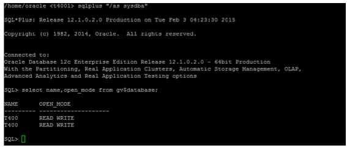

Use the following code to check the ADVM proxy instance:

### Benefits of Flex ASM

Flex ASM has the following benefits:

-	Oracle Flex ASM supports larger LUN sizes for Oracle Database 12c clients.
-	You can connect to other ASM instance from a different instance (for example,
   connect to a second +ASM2 instance from the first instance).
-	You have the flexibility to rename an ASM Disk in a Disk Group. You can
   rename the Disk name given by Oracle as needed.

### About ADVM proxy instance

The ADVM Proxy is a special Oracle instance, which enables ADVM to connect to
Flex ASM and is required to run on the same node as the ADVM and the ASM Cluster
File System (ACFS).

The ADVM Proxy instance ORACLE_SID is set to `+APX<node number>`.

### MGMTDB - Grid Infrastructure Management Repository database

MGMTDB is a database instance used for storing cluster health monitor data (CHM).
In version 11g, this information is stored in berkley database. Starting from
version 12.1.0.2, it is part of default (mandatory) installation.

If the existing node crashes. MGMTDB, an Oracle single instance managed by Grid
Infrastructure, fails over to the surviving node. You can identify the current
master using the following command:

    oclumon manage -get MASTER

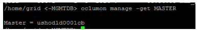

This instance is managed by using the following SRVCTL commands:

    srvctl status mgmtdb

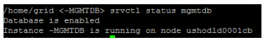

    srvctl config mgmtdb

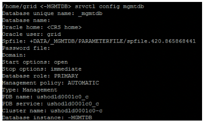

You can see the single listener associated with this database by running the
following command:

    ps -ef|grep MGMTLSNR.

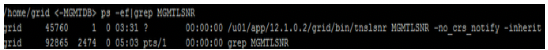

You can view information about MGMTDB from metalink doc - 1568402.1.

By using the `oclumon` command, you can collect information about the cluster
health.

### Conclusion

This blog explored Oracle's Flex ASM, the ADVM Proxy instance, and MGMTDB
features.

Flex ASM reduces the ASM instance footprint, running on each node of the
cluster and also ensures high availability of your database instance, in case
the ASM instance fails on a particular node.

The ADVM Proxy is a special Orale instance, which enables ADVM to connect to
Flex ASM. You can't shutdown the ADVM Proxy unless ACFS is running.

If the instance crashes, the MGMTDB fails over to the available node.

### Optimize your environment with expert administration, management, and configuration

[Rackspace's Application services](https://www.rackspace.com/application-management/managed-services)
**(RAS)** experts provide the following [professional](https://www.rackspace.com/application-management/professional-services)
and
[managed services](https://www.rackspace.com/application-management/managed-services) across
a broad portfolio of applications:

- [eCommerce and Digital Experience platforms](https://www.rackspace.com/ecommerce-digital-experience)
- [Enterprise Resource Planning (ERP)](https://www.rackspace.com/erp)
- [Business Intelligence](https://www.rackspace.com/business-intelligence)
- [Salesforce Customer Relationship Management (CRM)](https://www.rackspace.com/salesforce-managed-services)
- [Databases](https://www.rackspace.com/dba-services)
- [Email Hosting and Productivity](https://www.rackspace.com/email-hosting)

We deliver:

- **Unbiased expertise**: We simplify and guide your modernization journey,
focusing on the capabilities that deliver immediate value.
- **Fanatical Experience**&trade;: We combine a Process first. Technology second.&reg;
approach with dedicated technical support to provide comprehensive solutions.
- **Unrivaled portfolio**: We apply extensive cloud experience to help you
choose and deploy the right technology on the right cloud.
- **Agile delivery**: We meet you where you are in your journey and align
our success with yours.

[Chat now](https://www.rackspace.com/#chat) to get started.

