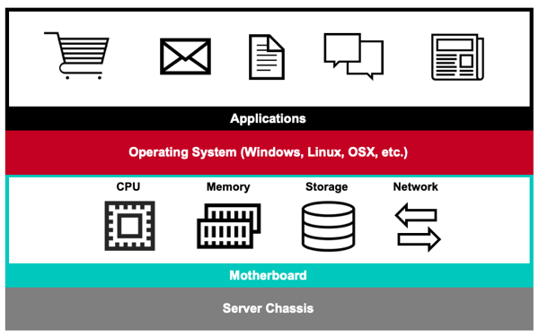
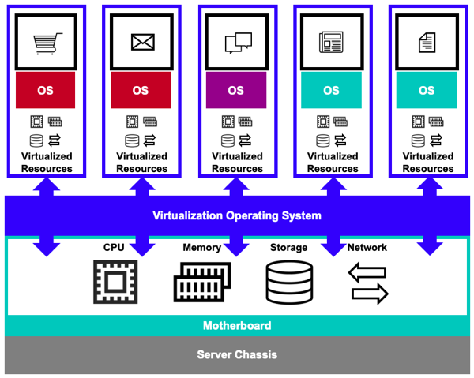
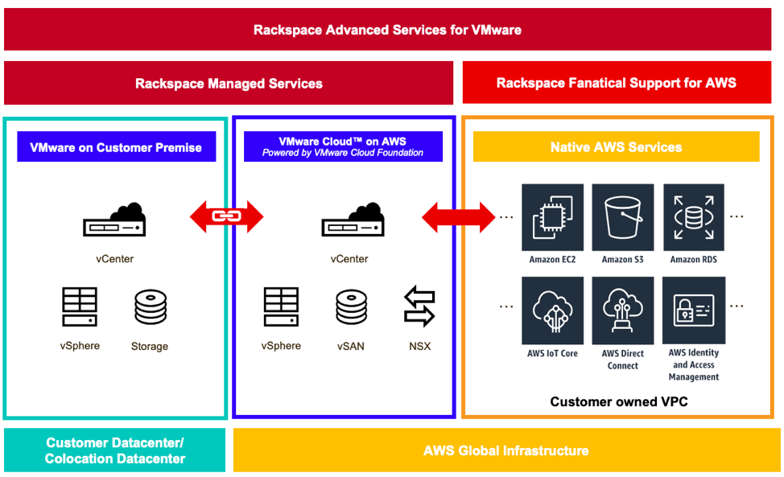

Rackspace helps maximize virtualization advantages!

<!--more-->

### Introduction

Computers, servers, phones, and so on all require an operating system (OS) to
run. The most important job of the OS is to give applications access to the
hardware layer they need to run: the computer processor, memory, hard drive,
and network ports to connect to the world.

The following image illustrates these layers:

However, we can only run one OS on a computer at a time. Right?

### Virtualization

Virtualization changed the way we use computers by enabling us to install and
run more than one OS at the same time and to maximize all of the
hardware power available in a given chassis, as shown in the following image:

Virtualization software exists between the hardware layer and the OS.
It acts like the hardware layer and *fools* any OS
installed on the server, enabling the user to maximize the hardware potential
and squeeze every ounce of capacity out of the physical CPU, memory, and
storage available on a server. Instead of having to purchase multiple physical
servers to run various applications, you can now create multiple *virtual*
servers running on a single physical server. The number of virtual servers
you can have depends on the number of cores and amount of memory on the chassis.

### Virtualization with AWS and VMware

So, what do servers and virtualization have to do with the Amazon Web Services&reg;
(AWS) public cloud services? Many people don’t know this, but AWS—the world’s
largest cloud infrastructure provider—also sells single-tenant dedicated
physical servers hosted in their data centers. You can buy them alongside all
of their other services, like EC2 instances, S3 storage, and the thousands of
other features AWS offers.

This AWS hardware offering gives customers flexibility by letting them deploy
the OSs of their choosing. This flexibility includes the ability to install
ESX, the VMware&reg; OS used to deploy virtual servers. Given that
VMware controls approximately 75% of the server virtualization market, the
AWS/VMware partnership gives customers a very powerful, feature-rich, and
flexible compute platform, as shown in the following image:

VMworld&reg; announced the initial availability of VMware Cloud on AWS to
create a *seamlessly integrated hybrid cloud* in 2017. This announcement followed
the strategic alliance that the two companies announced in October 2016.

VMware Cloud on AWS includes the VMware Cloud Foundation technologies of
vSphere&reg;, vSAN&trade;, NSX&reg;, and vCenter Server&reg;. The service
enables you to automatically
provision your infrastructure with full virtual machine (VM) compatibility and
workload portability between wherever your VMware environments are and the AWS
Cloud.

### Benefits of combining VMware and AWS

In other words, customers who run VMware on their own or with a service provider
can extend their infrastructure into the AWS ecosystem and gain access to many
benefits, including the following:

-	**Simplified operations:** No new tools. Administrators use the tools they
   already know, and they keep the same VMware provisioning, storage, and
   lifecycle policies in use today. Moving applications between locations does
   not require the purchase of new hardware or rewriting your applications.

-	**Enhanced availability:** Access to the AWS ecosystem means access to
   highly available and scalable solutions running on EC2 bare metal instances.
   Eliminating single points of failure in your infrastructure is now easier
   than ever.

-	**Reduced costs:** Instead of procuring hardware on your own that you need
   to power and cool, you have access to the exact amount of resources you need
   where you need them, while removing much of the complexity and cost
   associated with expanding on your own.

-	**Improved time to market:** How long would it take you to order, receive,
   and install a three-node ESX cluster in your data center or with a
   third-party provider? Remove the approval, shipping, and installation times
   from that scenario because you acquire VMware on AWS just like other AWS
   services: through the portal on your own or through your service provider.
   Usually, you get your infrastructure in hours, not weeks.

-	**Increased innovation:** By having VMs deployed onto the AWS platform you
   now have native, high-speed access to the entire AWS portfolio: databases,
   storage, API endpoints for services like Lambda, SQS, and S3, along with
   data and analytics services like Amazon RDS, DynamoDB, Kinesis, and Redshift.
   AWS also offers the ability to convert VMware instances into native EC2
   instances.

### Use cases

Given all of these benefits, what are some actual use cases?

-	Accelerating and simplifying Cloud migrations
-	Regional footprint expansion
-	Rapid and flexible on-demand capacity and expansion
-	Deploying disaster recovery solutions

### How Rackspace enhances the experience

Now if all of this isn’t cool enough, Rackspace adds even more value to the
equation. Customers can continue to manage their own VMware infrastructure and
connect it with AWS, but you can also work with Rackspace, enabling our
industry-leading cloud infrastructure experts to extend your IT team. This
service includes our world-class operations and account management and our Service
Delivery Management teams, which provide personal contact for business and
technical issues while serving as your single point of contact across VMware
and AWS including escalation management. The Rackspace SLA provides 24x7x365
support with response times from 15 minutes to 4 hours, and those are clock
hours, not “business hours.”

Furthermore, Rackspace can help accelerate your path to public and hybrid cloud
solutions, thanks to the Rackspace Center of Excellence for VMC on AWS, our
strong partnership with both companies, and professional services that can help
you easily migrate VMware workloads to VMC on AWS and progressively transform
applications to cloud-native AWS services.

### Conclusion

The AWS/VMware partnership provides you with a powerful combination of
technologies from the two leaders in their respective fields. By incorporating
Rackspace into that powerful partnership, we can accelerate and optimize your
journey into the cloud.

Use the Feedback tab to make any comments or ask questions.

### Optimize your environment with expert administration, management, and configuration

[Rackspace's Application services](https://www.rackspace.com/application-management/managed-services)
**(RAS)** experts provide the following [professional](https://www.rackspace.com/application-management/professional-services)
and
[managed services](https://www.rackspace.com/application-management/managed-services) across
a broad portfolio of applications:

- [eCommerce and Digital Experience platforms](https://www.rackspace.com/ecommerce-digital-experience)
- [Enterprise Resource Planning (ERP)](https://www.rackspace.com/erp)
- [Business Intelligence](https://www.rackspace.com/business-intelligence)
- [Salesforce Customer Relationship Management (CRM)](https://www.rackspace.com/salesforce-managed-services)
- [Databases](https://www.rackspace.com/dba-services)
- [Email Hosting and Productivity](https://www.rackspace.com/email-hosting)

We deliver:

- **Unbiased expertise**: We simplify and guide your modernization journey,
focusing on the capabilities that deliver immediate value.
- **Fanatical Experience**&trade;: We combine a Process first. Technology second.&reg;
approach with dedicated technical support to provide comprehensive solutions.
- **Unrivaled portfolio**: We apply extensive cloud experience to help you
choose and deploy the right technology on the right cloud.
- **Agile delivery**: We meet you where you are in your journey and align
our success with yours.

[Chat now](https://www.rackspace.com/#chat) to get started.
