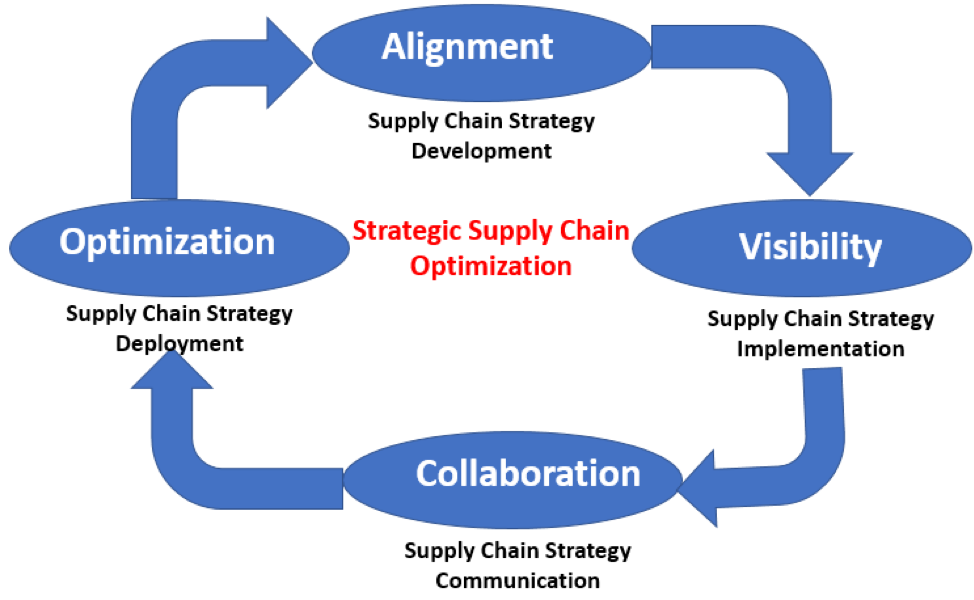

This blog describes some of the benefits of strategic supply chain optimization.

<!--more-->

### Manufacturing versus service companies

Strategic supply chain management and optimization have been a key competitive
differentiator for the manufacturing companies for some time. These manufacturing
companies designed their supply chain not only to find opportunities to reduce
spending but also to demand and ensure input quality and timely delivery. The
supply chain is critical for their profitability, and the input quality is
directly reflected in the quality of finished products and the willingness of
consumers to purchase them.

In contrast, the service industries are often at a loss in describing the
strategic and financial impact of superior supply chain management for their
large strategic spend categories, such as IT services, legal services, and
consulting. These companies are not able to apply the same best-practice
principles as manufacturers do. The supply chain management concepts pertaining
to manufacturing, such as centralizing and coordinating, sourcing, and
procurement, are not fully leveraged by the service companies. In fact, service
organizations often use line-of-business managers to manage important parts of
the supply chain in a decentralized fashion. These managers often make vendor
decisions without ascertaining the benefits of cross-company historical
performance, such as on-time delivery and quality of services rendered.

The financial impact of an improved supply chain in the service industry is not
much different than in the manufacturing industry. Service organizations have
direct inputs to their offerings from external service providers. The quality
and timely execution of consultancies affect the end quality of these
offerings and the cost of their development. Controlling costs is indeed part
of the story, but, service organizations must also ensure that their external
service providers deliver the results.

### Benefits of strategic supply chain optimization in the service industry

A strategic supply chain optimization in the service industry does the following:

-	**Helps to develop new service with focused supply chain management tools
    and processes**: Businesses integrate procurement processes and their enabling
    technology with other enterprise applications to help expand the
    ecosystem and increase control-related project development, cost estimation,
    budgeting, and financial management.
-	**Reduces costs**: For instance, in banks, the supply chain involves all the
    distribution channels where cash is held and through which customers transact,
    such as ATMs, branches, mobile devices, net banking, and agent outlets. Banks
    need to monitor transactions at these locations and leverage modeling to
    forecast requirements and plan the logistics for distribution of cash and
    other transactional devices. Doing this can reduce costs and optimize service
    levels.
-	**Leverages better information and analytics**: With the development of
    scorecards, based on high-quality information and maintained in the supply
    chain management system, companies hold vendors accountable for business
    results based on the quality of their services.

The following diagram illustrates strategic supply chain optimization:

### Rackspace Offering

Rackspace’s Professional Services, Business Intelligence Services, and Business
Application Support Services provide Oracle&reg; Supply Chain Management (SCM) solutions
that empower the modern value chain.

-	Our supply chain solutions transform an entire supply chain into a value chain.
-	Our supply chain is seamlessly integrated with Oracle Advanced Supply Chain
    Planning, Forecasting (out-of-the-box integration with the Demantra solution),
    and Oracle Enterprise Business Services (EBS)/Cloud Financials.
-	We have been helping various global manufacturing, consumer products, and
    services companies to improve their agility, transform to an adaptive
    supply network, and achieve real-time visibility from the top floor to
    the shop floor.

### Conclusion

As supply chain tools and processes in the service industry mature, strategic
supply chain management has the potential to become essential to building a
competitive advantage. The supply chain management is a powerful strategic
enabler that can better analyze categories of expenditure, services, project
costs, and execution results. You can collaborate and accelerate innovation with
*Social*, make better decisions anytime and anywhere with *Mobile* powered by
*Analytics*, and scale quickly and reduce costs with *Cloud*.

Use the Feedback tab to make any comments or ask questions.

### Optimize your environment with expert administration, management, and configuration

[Rackspace's Application services](https://www.rackspace.com/application-management/managed-services)
**(RAS)** experts provide the following [professional](https://www.rackspace.com/application-management/professional-services)
and
[managed services](https://www.rackspace.com/application-management/managed-services) across
a broad portfolio of applications:

- [eCommerce and Digital Experience platforms](https://www.rackspace.com/ecommerce-digital-experience)
- [Enterprise Resource Planning (ERP)](https://www.rackspace.com/erp)
- [Business Intelligence](https://www.rackspace.com/business-intelligence)
- [Salesforce Customer Relationship Management (CRM)](https://www.rackspace.com/salesforce-managed-services)
- [Databases](https://www.rackspace.com/dba-services)
- [Email Hosting and Productivity](https://www.rackspace.com/email-hosting)

We deliver:

- **Unbiased expertise**: We simplify and guide your modernization journey,
focusing on the capabilities that deliver immediate value.
- **Fanatical Experience**&trade;: We combine a Process first. Technology second.&reg;
approach with dedicated technical support to provide comprehensive solutions.
- **Unrivaled portfolio**: We apply extensive cloud experience to help you
choose and deploy the right technology on the right cloud.
- **Agile delivery**: We meet you where you are in your journey and align
our success with yours.

[Chat now](https://www.rackspace.com/#chat) to get started.
