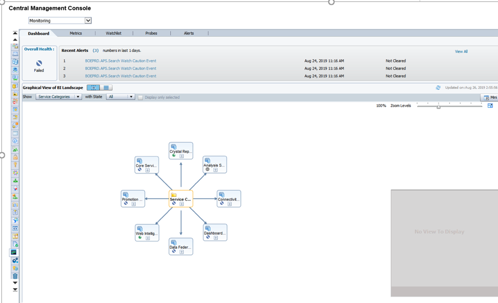
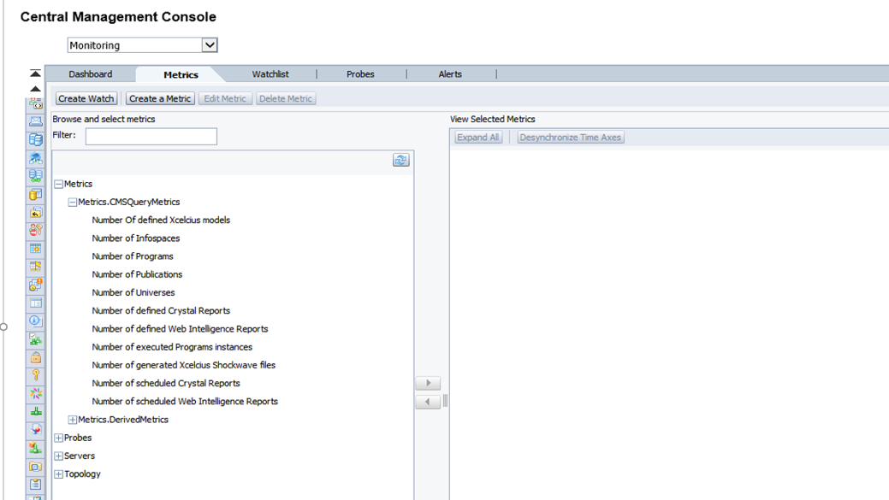
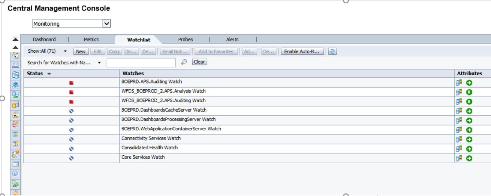
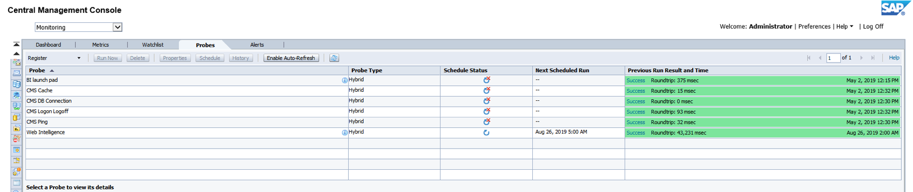
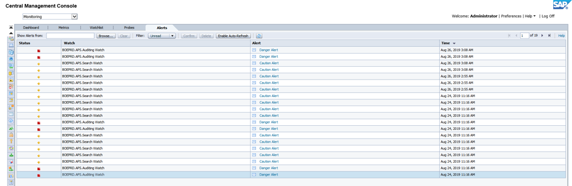

The new monitoring feature of the Central Management Console (CMC) allows
administrators to monitor the usage and health of the SAP&reg; BusinessObjects (BO)
system.

<!--more-->

The monitoring feature, introduced in SAP BO 4, has watches, probes,
metrics, and alerts as part of the monitoring process. Some default
monitoring features allow an administrator, without any prior expertise or
knowledge on the topic, to obtain useful information about the status of the
system. Before using this feature, you need to know which actions to perform and
understand the existing limitations.

You must ensure that you store the information for monitoring in the monitoring
database. Because it is a CMS database, it works independently from the other
two databases in SAP BO. To activate the monitoring database, use the following
steps:

1. Log in to the CMC.

2. Select applications.

3. Double-click on the Monitoring application.

4. When the properties window of the Monitoring application opens, make sure to
   check the `Enable Monitoring Application` option.

5. Click **Save and Close**.

6. If it is not checked, restart the Adaptive Processing Server (APS).

The information in the database is deleted every time the volume of data
exceeds 1 GB. You can increase the size of the CMC.

### Monitoring

To reach the monitoring section in the CMC, go to **Applications > Monitoring**
as shown in the following monitoring default view:

As you can see in the preceding image, there are five different tabs in this
section: Dashboards, Metrics, Watchlists, Probes, and Alerts. The following
sections explore these topics.

#### Dashboards

The default tab is divided into the following parts:

-	**Overall Health**: The icon shows whether BO is working correctly or not.

-	**Recent Alerts**: Here you can see the alerts that were triggered by the
   system in the last 24 hours.

-	**Graphical view of BI Landscape**: This panel includes a graphical or
   tabular view of the watches within the system. You can click on an individual
   watch to view the details.

-	**KPIs Status**: This displays three key performance indicators for the
   system. Drill down by clicking on them individually.

-	**Deployment Level Metrics**: Use this option to view metrics of users,
   running jobs, and pending jobs.

#### Metrics

Metrics are individual pieces of information that help you to understand the
overall health of different components of the system, as shown in the following
image:

Metrics are used to measure the health of a component. The metrics you define
depend on the components that you are monitoring and your requirements. Examples
of metrics include user login time, query execution time, CPU usage percentage,
availability status for system service, and others. You can use them in watches
and alerts, setting thresholds for *Warning and Danger* alerts. There are around
250 predefined metrics. Furthermore, you can create your own metrics. The default
metrics enable you to check the status of almost everything in the system.

You can see the historical and current status of any metric that you select.

#### Watchlists

This tab helps monitor the watches created. The watches are thresholds for
metrics that show you if the metric is in a healthy, warning, or danger status,
as shown in the following image:

The preceding image shows watches created by default. You can change these
thresholds to adapt them to your system. Also, you can create notifications for
the watches, such as requesting an email if the system is in danger, for example.
There are many interesting options with the watches, so check them out.

You also have the flexibility to decide which watches you want to include in the
dashboard tab.

#### Probes

Probes let you monitor the BO system by using simulated application workflows
that run through software development kit-based scripts.

The most interesting part of the CMC monitoring, probes are the most challenging
part as well. You create probes by using a software development kit (SDK).

You can choose among the following system-generated default probes:

-	**CMS Logon Logoff**: Monitors a user logging on to the BO system and
   how long it takes.

-	**Crystal Reports service through Page and Cache Server**:  Monitors the
   availability and performance of the Crystal Reports service (through the page
   and the cache servers).

-	**Crystal Reports service through Report Application Server**: Monitors the
   availability and performance of the Crystal Reports service (through Report
   Application Server).

-	**Infoview**: Monitors the availability and performance of logon and logoff
   of the InfoView web application.

-	**Web Intelligence Service monitoring**: Tests the availability and
   performance of the Web Intelligence Service through the report servers.

-	**CMS ping**: Tests the core functionality of the CMS.

-	**CMS cache**: Tests the availability of the CMS cache.

-	**CMS database connection**: Tests the connection to the CMS repository.

-	**Start and stop servers**: Tests the start and stop functions of the
   different servers in the system.

#### Alerts

This option lists the alerts that have been set up in the watchlist.

You can see the different details of the alerts by clicking on each one. These
alerts send emails and perform actions, depending on your watchlist configuration.

###  How to use all in one

The preceding information provides an overview of the different tabs of the
monitoring application and how to use them.

To fully take advantage of monitoring, you need to make use of all the options.
One example could be monitoring the response time to open a report in the
system. For this, use the probe `Web Intelligence Service Monitoring` option
that logs in, opens, and refreshes a report in Web Intelligence. After this,
check both the metric of the time that it takes for the system to execute the
probe and the metric that shows if the probe was successful or not. Also, create
a watchlist with this metric, and if the probe takes more than five seconds, you
get an email advising the administrator that the system is working a bit slowly.
If the probe fails or takes more than 15 seconds, the system sends another email
advising you that the system is not working properly. You can schedule this
probe to execute daily.

With this simple scenario, you can detect any problems in the system automatically,
before any user reports it. Moreover, the Alert tab can be used to show if there
is something wrong that went unnoticed before.

### Conclusion

By using this feature and the options available, you can accomplish important
tasks and get everything under control in your BO system. Though some aspects
are complex, you can do a lot with just the default settings. After you
understand more, you can create your own probes and add more personalized
options to your monitoring.

Use the Feedback tab to make any comments or ask questions.

### Optimize your environment with expert administration, management, and configuration

[Rackspace's Application services](https://www.rackspace.com/application-management/managed-services)
**(RAS)** experts provide the following [professional](https://www.rackspace.com/application-management/professional-services)
and
[managed services](https://www.rackspace.com/application-management/managed-services) across
a broad portfolio of applications:

- [eCommerce and Digital Experience platforms](https://www.rackspace.com/ecommerce-digital-experience)
- [Enterprise Resource Planning (ERP)](https://www.rackspace.com/erp)
- [Business Intelligence](https://www.rackspace.com/business-intelligence)
- [Salesforce Customer Relationship Management (CRM)](https://www.rackspace.com/salesforce-managed-services)
- [Databases](https://www.rackspace.com/dba-services)
- [Email Hosting and Productivity](https://www.rackspace.com/email-hosting)

We deliver:

- **Unbiased expertise**: We simplify and guide your modernization journey,
focusing on the capabilities that deliver immediate value.
- **Fanatical Experience**&trade;: We combine a Process first. Technology second.&reg;
approach with dedicated technical support to provide comprehensive solutions.
- **Unrivaled portfolio**: We apply extensive cloud experience to help you
choose and deploy the right technology on the right cloud.
- **Agile delivery**: We meet you where you are in your journey and align
our success with yours.

[Chat now](https://www.rackspace.com/#chat) to get started.
