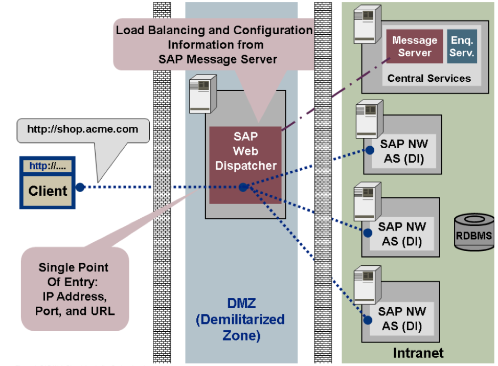

This blog explains SAP&reg; Web Dispatcher, its features, and how to use it.

<!--more-->

### Introduction

Because the SAP landscape cannot be directly connected or exposed to the Internet, SAP Web Dispatcher provides the external connection, serving as an entry point for the connections or requests for the SAP environment. Features of Web Dispatcher include load distribution across the landscape of incoming web requests, minimal configuration, and granular control of functions such as security or load balancing. Because Web Dispatcher does not contain a Common Gateway Interface (CGI) or start any executables with environment variables that depend on request inputs, it is not vulnerable to the shellshock class of attacks.

### Web Dispatcher architecture

Web Dispatcher architecture has the following characteristics:

- Configured correctly, Web Dispatcher is a single point of entry for IP addresses, ports, and URLs.

- It forwards the incoming HTTP and HTTPS requests to the application server of the SAP system.

- The architecture is the same as the architecture of the Internet Communication Manager (ICM).

- Web Dispatcher does not directly pass incoming requests to a work process such as a server process. Instead, it passes them to the ICM of the application server.

The following image illustrates Web Dispatcher architecture:

*Source*: [https://help.sap.com](https://help.sap.com)

### Web Dispatcher uses

Following are some of Web Dispatcher's important functions:

- Web Dispatcher lies between the Internet and the SAP system and serves as the entry point for HTTP and HTTPS requests into the SAP system, which consists of one or more SAP NetWeaver&trade; application servers.

- As a *software web switch* that switches between network connections within the same domain, Web Dispatcher rejects or accepts connections. After accepting a connection, it balances the load to ensure an even distribution of web requests across the servers.

- Web Dispatcher contributes to security and balances the load in your SAP system.

- You can use Web Dispatcher in pure Advanced Business Application Programming (ABAP) systems, in combined ABAP/Java systems (*dual-stack* systems), and in pure Java systems.

### SAP recommendations:

You can use Web Dispatcher if you want to cover only one aspect, such as security functions or load balancing. For example, SAP recommends using Web Dispatcher if you do not need security functions, such as entry point in the DMZ, SSL, or URL filtering, but do need to balance the load between SAP NetWeaver application server instances.

Use Web Dispatcher for an SAP system with multiple application server instances for Web applications.

You can run Web Dispatcher on a server that connects directly to the Internet. It requires the following minimal configuration in the profile file (`<xx>` refers to the instance number):

- The port that receives the HTTP or HTTPS requests (parameter `icm/server_port_ <xx>`)

- The computer and HTTP port of SAP message servers (parameter `rdisp/mshost` and parameter `ms/http_port or wdisp/system_ <xx>`)

Although Web Dispatcher is downward-compatible to older releases of SAP systems, some restrictions on release combinations of Web Dispatcher and SAP systems supported by SAP might apply.

At the latest, SAP releases its Web Dispatcher for older versions of SAP systems when the kernel release of the Web Dispatcher on which it is based is released. It is used as the downward-compatible kernel for the SAP system.

### Features:

Features of Web Dispatcher include:

- **Application server selection**: When you chose the load balancing process for the destination server, Web Dispatcher forwards the content to the ICM of the destination application server.

- **Multiple system configuration**: Place Web Dispatcher in front of multiple SAP systems and configure which requests should go to which system or perform load balancing across system boundaries.

- **URL filtering**: Restrict access to your system by defining the URLs that you want to reject.

- **Web caching**: Use Web Dispatcher as a web cache to improve the response times and to conserve the application server cache.

In a classic SAP system web environment, Web Dispatcher uses the message server to balance load. It forwards incoming HTTP and HTTPS requests to the application servers and returns the responses from the backend to the client.

Outgoing requests, such as requests to another SAP NetWeaver application server, are not sent using Web Dispatcher. Instead, the appropriate intranet proxy server ends outgoing requests.

### Conclusion

Implementing SAP Web Dispatcher is not difficult, but you need a basic understanding of  how the Internet works. After reading this blog, I am sure you understand the importance of the SAP Web Dispatcher and its features. Including it in your SAP landscape with minimal configuration makes a significant difference for system security and load balancing without the need for extra resources.

Use the Feedback tab to make any comments or ask questions.

### Optimize your environment with expert administration, management, and configuration

[Rackspace's Application services](https://www.rackspace.com/application-management/managed-services)
**(RAS)** experts provide the following [professional](https://www.rackspace.com/application-management/professional-services)
and
[managed services](https://www.rackspace.com/application-management/managed-services) across
a broad portfolio of applications:

- [eCommerce and Digital Experience platforms](https://www.rackspace.com/ecommerce-digital-experience)
- [Enterprise Resource Planning (ERP)](https://www.rackspace.com/erp)
- [Business Intelligence](https://www.rackspace.com/business-intelligence)
- [Salesforce Customer Relationship Management (CRM)](https://www.rackspace.com/salesforce-managed-services)
- [Databases](https://www.rackspace.com/dba-services)
- [Email Hosting and Productivity](https://www.rackspace.com/email-hosting)

We deliver:

- **Unbiased expertise**: We simplify and guide your modernization journey,
focusing on the capabilities that deliver immediate value.
- **Fanatical Experience**&trade;: We combine a Process first. Technology second.&reg;
approach with dedicated technical support to provide comprehensive solutions.
- **Unrivaled portfolio**: We apply extensive cloud experience to help you
choose and deploy the right technology on the right cloud.
- **Agile delivery**: We meet you where you are in your journey and align
our success with yours.

[Chat now](https://www.rackspace.com/#chat) to get started.
