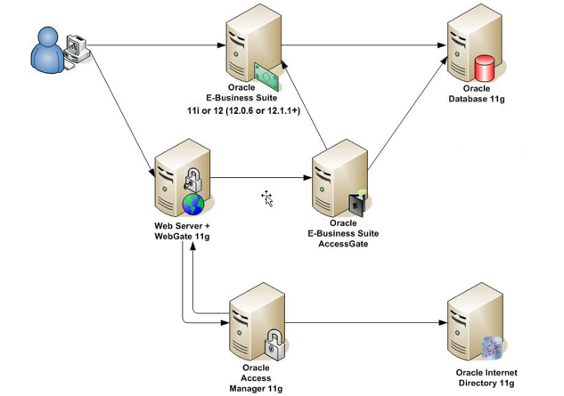
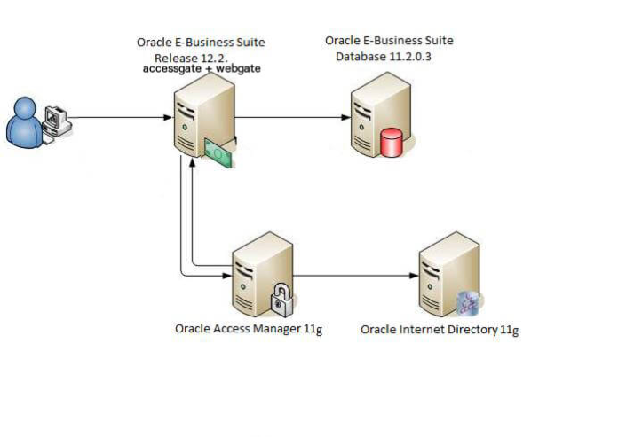

Oracle&reg; Access Manager (OAM) version 12.2.1.3 provides identity management and an
access control system that enables users to access all supported applications. To
integrate multiple Oracle E-Business Suites (EBS) version R12.2 with OAM for single
sign-on (SSO), you need to perform integration steps on each EBS instance.

<!--more-->

### OAM systems

The following two systems comprise OAM:

- **Identity System**: Used to create and manage users and groups, providing self-registration and password management.

- **Access System**: Used to configure a single or multi-domain SSO solution for web and
non-web-based applications, web pages, and other resources and to configure access
management (authentication and authorization) to resources (web pages and applications).

### Integration prerequisites

Before you begin integration, complete the following steps:

1. Apply the latest Active Directory&reg; (AD) and EBS Technology Stack (TXK) Delta update packs.

2. Update the EBS application-tier Java&reg; Development Kit (JDK) to a JDK 7 update 13
(January 2017 CPU) or later.

3. Install and configure OAM 12c Release 2 patch set 3 (12.2.1.3.0).

### Steps to integrate EBS with OAM

Perform the following steps to integrate EBS with OAM:

#### 1. Deploy EBS AccessGate

If there is no active online patching cycle, perform the registration on the run-file
system. Otherwise, patch the file system. SSO is enabled only after completing the cycle
and bouncing the instance.

Execute the following script to deploy AccessGate:

    $ perl $AD_TOP/patch/115/bin/adProvisionEBS.pl ebs-create-oaea_resources \
    -contextfile=$CONTEXT_FILE \ 
    -deployApps=accessgate \ 
    -SSOServerURL=<OAM Server URL> \ 
    [-managedsrvname=<managed server name>] \
    [-managedsrvport=<managed server 'Listen Port'>] \
    -logfile=<logfile>

The preceding script performs the following tasks:

1) Creates a managed server `oaea_server<n>` if it does not already exist.
2) Creates a data source `OAEADatasource` if it does not already exist.
3) Deploys the EBS AccessGate application (`accessgate`).

The script has an optional parameter, **managedsrvname**, which defaults to `oaea_server1`,
and a parameter, **managedsrvport**, which defaults to `6801 + port pool`. If you want to
deploy AccessGate to a non-default managed server, you can specify these parameters.

#### 2. Register EBS with OAM

Source the EBS environment on the **RUN (R)** file system. If you run `echo $FILE_EDITION`
and it returns **run**, you are on the correct file system. Ensure there is no active
online patching cycle.

If you have integrated EBS with Oracle Internet Directory (OID), execute the following script:

    $ txkrun.pl -script=SetOAMReg -registeroam=yes \
    -oamHost=<OAM_URL>:<OAM_PORT> \
    -oamUserName=<Username> \
    -ldapUrl=<LDAP URL:PORT> \
    -oidUserName=cn=orcladmin \
    -skipConfirm=yes \
    -ldapSearchBase=cn=Users,dc=example,dc=com \
    -ldapGroupSearchBase=cn=Groups,dc=example,dc=com

#### 3. Test SSO integration

Log in to EBS at `https://<ebshost>.<domain>:<port>/OA_HTML/AppsLogin`.

When this redirects you to the OAM SSO page, log in by using valid OID user credentials.
After successful authentication, the system redirects you to your EBS home page.

#### 4. Perform the online patching cycle

Execute `fs_clone` to synchronize the changes to your run/patch file system before starting
a new online patching cycle.

### OAM integration architecture differences

Two significant differences exist between OAM R12.1 and R12.2 architectures.

#### R12.1 and 11i EBS integration with OAM and OID

To integrate EBS R12.1 with OAM, you need to install and deploy all the services, including
Oracle HTTP Server (OHS) and Weblogic&reg;, as shown in the following image. In R12.1, you need
to manage more services, and it takes more resource hours to implement them in comparison to R12.2.

*Source*: [https://blogs.oracle.com/ebstech/oracle-access-manager-11115-certified-with-e-business-suite-12](https://blogs.oracle.com/ebstech/oracle-access-manager-11115-certified-with-e-business-suite-12)

#### R12.2 Integration with OAM and OID

The integration of OAM has changed in EBS R12.2. Version R12.2, built on OHS, has Weblogic
built-in, which significantly changes how you integrate EBS with other Oracle Fusion products,
such as OAM. You need to configure and deploy Webgate and Accessgate. Deploy Webgate on
top of R12.2 OHS 11g home, and deploy Accessgate as a separate managed server on top of
R12.2 WebLogic, as shown in the following image:

*Source*: [https://blogs.oracle.com/ebstech/oracle-access-manager-11115-certified-with-e-business-suite-12](https://blogs.oracle.com/ebstech/oracle-access-manager-11115-certified-with-e-business-suite-12)

### Conclusion

This blog describes how to integrate OAM with EBS 12.2 applications to maintain a single
registration for an EBS instance. You can apply this integration on the run/patch file
system in EBS 12.2 applications. Because OAM provides centralized, policy-based
authentication and SSO for web-based applications and cloud services, this technology is
necessary for organizations that use Oracle applications.

Use the Feedback tab to make any comments or ask questions.

### Optimize your environment with expert administration, management, and configuration

[Rackspace's Application services](https://www.rackspace.com/application-management/managed-services)
**(RAS)** experts provide the following [professional](https://www.rackspace.com/application-management/professional-services)
and
[managed services](https://www.rackspace.com/application-management/managed-services) across
a broad portfolio of applications:

- [eCommerce and Digital Experience platforms](https://www.rackspace.com/ecommerce-digital-experience)
- [Enterprise Resource Planning (ERP)](https://www.rackspace.com/erp)
- [Business Intelligence](https://www.rackspace.com/business-intelligence)
- [Salesforce Customer Relationship Management (CRM)](https://www.rackspace.com/salesforce-managed-services)
- [Databases](https://www.rackspace.com/dba-services)
- [Email Hosting and Productivity](https://www.rackspace.com/email-hosting)

We deliver:

- **Unbiased expertise**: We simplify and guide your modernization journey,
focusing on the capabilities that deliver immediate value.
- **Fanatical Experience**&trade;: We combine a Process first. Technology second.&reg;
approach with dedicated technical support to provide comprehensive solutions.
- **Unrivaled portfolio**: We apply extensive cloud experience to help you
choose and deploy the right technology on the right cloud.
- **Agile delivery**: We meet you where you are in your journey and align
our success with yours.

[Chat now](https://www.rackspace.com/#chat) to get started.
