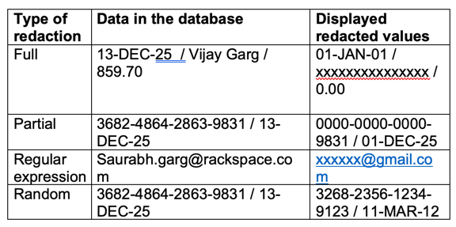
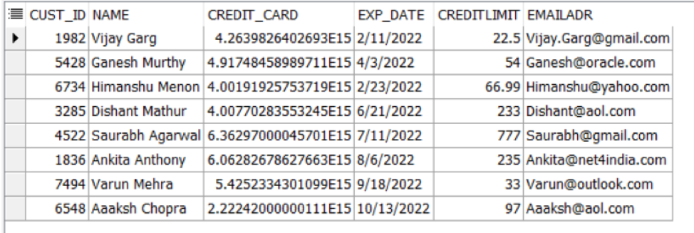
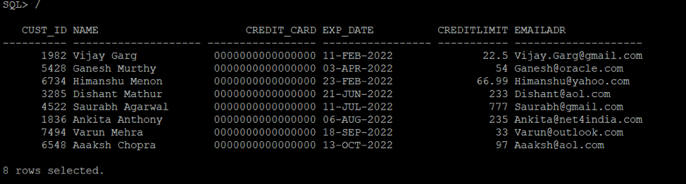
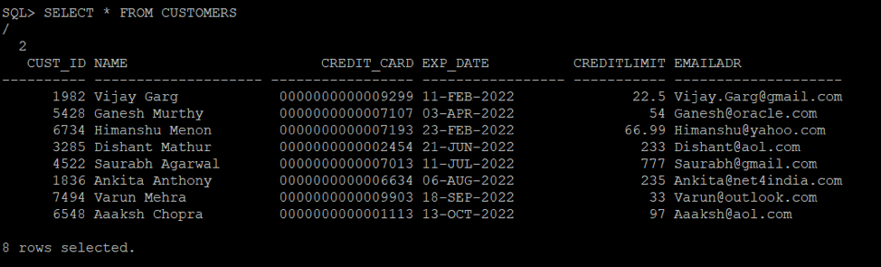
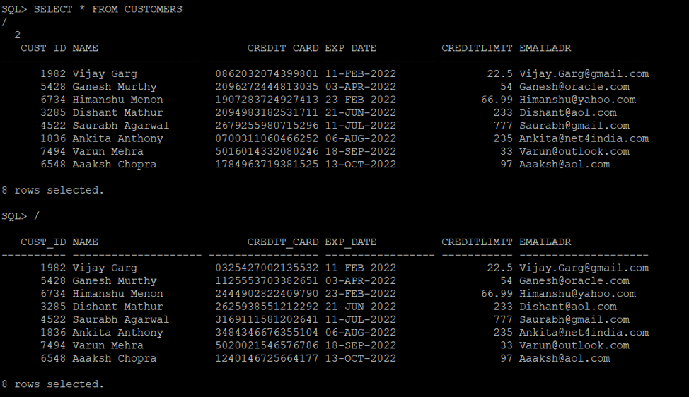
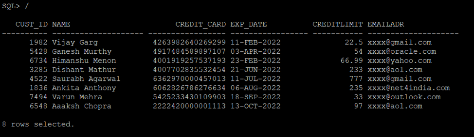
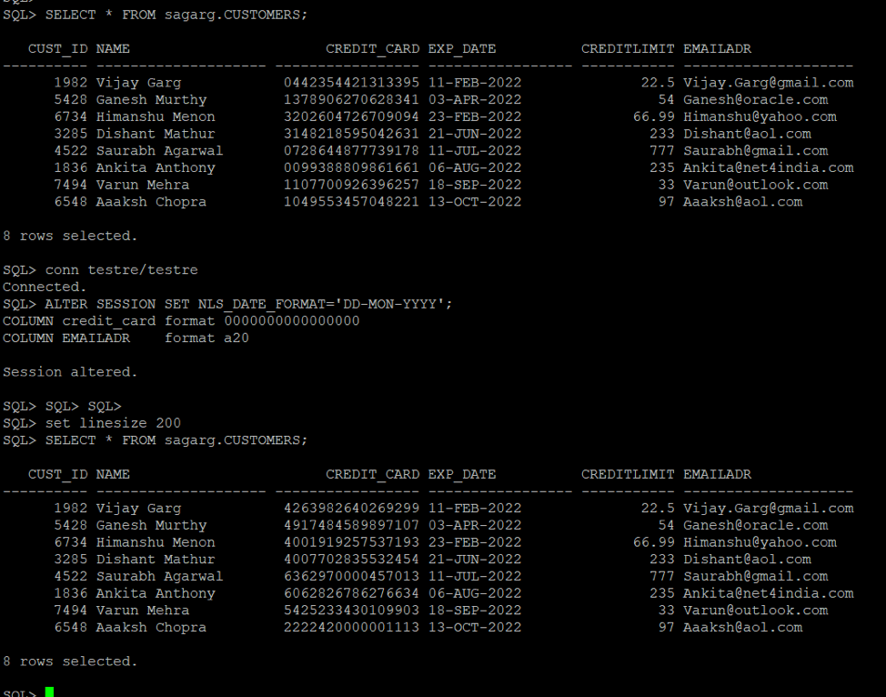

Organizations face a major challenge securing sensitive data like social
security numbers, bank account and routing numbers, and other similar data.

<!--more-->

### Introduction

Regulations and laws require organizations to protect their own data and
customer information from falling into the wrong hands. *Data redaction*, or
*dynamic data masking (DDM)*, is the process of obfuscating or hiding sensitive
data elements.

Oracle&reg; Data Redaction reduces the exposure of sensitive information and
helps to prevent the exploitation of application flaws that may disclose
sensitive data in application pages.

Database and application administrators, security administrators, and application
owners who want an easy way to improve security and comply with regulations that
require redacting sensitive data displayed by applications can use Data Redaction.

### DDM

DDM is the process of replacing sensitive information copied from production
databases to test non-production databases with realistic, but scrubbed, data
based on masking rules.

Oracle 12c (now available in 11.2.0.8 also) introduced a built-in DDM capability
called Data Redaction.

### Data Redaction

Data Redaction has the following characteristics:

- Part of Oracle Advanced Security, which is a separately licensed Enterprise
  Edition option.

- Protects sensitive data displayed in database applications.

- Transparent to application users because it preserves the original data type,
  and optionally, the formatting.

- Highly transparent to the database because the data remains the same in
  buffers, caches, and storage-only environments until it changes just before
  returning the SQL query results to the caller.

### Types of redaction

Following are some examples of the different types of redaction:

### Exceptions for redaction

If you have the `EXEMPT REDACTION POLICY` system privilege, data is never
redacted. Redaction is also never used in the following situations:

-	Connections as `SYS`
-	Database replication
-	Backup and restore
-	Export and import

### Setup

To define a policy, you need to have execute privileges on the `DBMS_REDACT`
package, which is used for adding, altering, or dropping the policies.

For testing, I’ve created a table and inserted some data as shown in the
following example:

    CREATE TABLE CUSTOMERS
       (cust_id     NUMBER NOT NULL
        ,name        varchar2(20)
        ,credit_card NUMBER(16)
        ,exp_date    DATE
        ,creditlimit NUMBER(6,2)
        ,emailadr    varchar2(20)
       )
    /

    INSERT INTO CUSTOMERS VALUES (1982,'Vijay Garg'    ,4263982640269299,'11-FEB-2022',22.50,'Vijay.Garg@gmail.com');
    INSERT INTO CUSTOMERS VALUES (5428,'Ganesh Murthy',4917484589897107,'03-APR-2022',54.00,'Ganesh@oracle.com');
    INSERT INTO CUSTOMERS VALUES (6734,'Himanshu Menon' ,4001919257537193,'23-FEB-2022',66.99,'Himanshu@yahoo.com');
    INSERT INTO CUSTOMERS VALUES (3285,'Dishant Mathur'    ,4007702835532454,'21-JUN-2022',233.00,'Dishant@aol.com');
    INSERT INTO CUSTOMERS VALUES (4522,'Saurabh Agarwal'    ,6362970000457013,'11-JUL-2022',777.00,'Saurabh@gmail.com');
    INSERT INTO CUSTOMERS VALUES (1836,'Ankita Anthony'    ,6062826786276634,'06-AUG-2022',235.00,'Ankita@net4india.com');
    INSERT INTO CUSTOMERS VALUES (7494,'Varun Mehra'    ,5425233430109903,'18-SEP-2022',33.00,'Varun@outlook.com');
    INSERT INTO CUSTOMERS VALUES (6548,'Aaaksh Chopra'    ,2222420000001113,'13-OCT-2022',97.00,'Aaaksh@aol.com');
    Commit;

### FUNCTION_TYPE setting for different types of redaction

Within the policy definition, you set the `FUNCTION_TYPE` that defines what kind
of redaction is being used by using the following values:

-	`DBMS_REDACT.NONE`
-	`DBMS_REDACT.FULL`
-	`DBMS_REDACT.PARTIAL`
-	`DBMS_REDACT.RANDOM`
-	`DBMS_REDACT.REGEXP`

### Display data

The following sections show you how to display data for each of the redaction
types.

#### No redaction

If no redaction is used, you display the data with the following statements:

    ALTER SESSION SET NLS_DATE_FORMAT='DD-MON-YYYY';
    COLUMN credit_card format 0000000000000000
    COLUMN EMAILADR    format a20
    SELECT * FROM CUSTOMERS

#### Full redaction

A user with execute privileges on the `DBMS_REDACT` package defines the policy.

In this example, the credit card data is always redacted because the expression
`1=1` is always true.

**Policy:**

    BEGIN
     DBMS_REDACT.ADD_POLICY (
       object_schema       => 'SAGARG',
       object_name         => 'CUSTOMERS',
       column_name         => 'CREDIT_CARD',
       policy_name         => 'REDACT_POLICY_CARD',
       function_type       => DBMS_REDACT.FULL,
       expression          => '1=1'
     );
    END;
    /

#### Partial redaction

By using the following example, you can mask positions 1 to 12 of the credit card number with a zero:

    BEGIN
     DBMS_REDACT.ADD_POLICY (
       object_schema       => 'SAGARG',
       object_name         => 'CUSTOMERS',
       column_name         => 'CREDIT_CARD',
       policy_name         => 'REDACT_POLICY_CARD',
       function_type       => DBMS_REDACT.PARTIAL,
       function_parameters => '0,1,12',
       expression          => '1=1'
     );
    END;
    /

To drop the previous policy, run the following command:

    execute DBMS_REDACT.drop_policy ('SAGARG','CUSTOMERS','REDACT_POLICY_CARD');

You can also do partial redaction on other columns, if needed.

#### Random redaction

With random redaction, the information is replaced with other random data
as shown in the following example:

    BEGIN
     DBMS_REDACT.ADD_POLICY (
       object_schema       => 'SAGARG',
       object_name         => 'CUSTOMERS',
       column_name         => 'CREDIT_CARD',
       policy_name         => 'REDACT_POLICY_CARD',
       function_type       => DBMS_REDACT.RANDOM,
       expression          => '1=1'
     );
    END;
    /

#### Using regular expressions

With regular expressions, you can redact the data based on pattern matching.
Predefined patterns cover several situations, like email addresses and IP
addresses. The following example hides the beginning of the email address:

    BEGIN
     DBMS_REDACT.ADD_POLICY (
       object_schema          => 'SAGARG',
       object_name            => 'CUSTOMERS',
       column_name            => 'EMAILADR',
       policy_name            => 'REDACT_POLICY_CARD',
       function_type          => DBMS_REDACT.REGEXP,
       regexp_pattern         => DBMS_REDACT.RE_PATTERN_EMAIL_ADDRESS,
       regexp_replace_string  => DBMS_REDACT.RE_REDACT_EMAIL_NAME,
       regexp_position        => DBMS_REDACT.RE_BEGINNING,
       regexp_occurrence      => DBMS_REDACT.RE_ALL,
       expression             => '1=1'
     );
    END;
    /

The parameter value for expression is always ‘1=1’, so the data is always redacted.

#### For a specific user

To redact data for specific user, you can add the following expression to the
profile:

    'SYS_CONTEXT(''USERENV'',''SESSION_USER'') = ''SAGARG'''

For example:

    BEGIN
     DBMS_REDACT.ADD_POLICY(
      object_schema => 'SAGARG',
      object_name => 'CUSTOMERS',
      column_name => 'CREDIT_CARD',
      policy_name => 'REDACT_POLICY_CARD',
      function_type => DBMS_REDACT.RANDOM,
      expression => 'SYS_CONTEXT(''USERENV'',''SESSION_USER'') = ''SAGARG''');
    END;
    /

### Conclusion

When you redact displayed application data by using Oracle Data Redaction, you
limit the risk of exposing sensitive data to application users who are not the
intended audience.

In addition, Oracle Data Redaction helps prevent accidental disclosure of data
to database users who do not desire to see sensitive information yet may come
across it while working with the database.

Use the Feedback tab to make any comments or ask questions.

### Optimize your environment with expert administration, management, and configuration

[Rackspace's Application services](https://www.rackspace.com/application-management/managed-services)
**(RAS)** experts provide the following [professional](https://www.rackspace.com/application-management/professional-services)
and
[managed services](https://www.rackspace.com/application-management/managed-services) across
a broad portfolio of applications:

- [eCommerce and Digital Experience platforms](https://www.rackspace.com/ecommerce-digital-experience)
- [Enterprise Resource Planning (ERP)](https://www.rackspace.com/erp)
- [Business Intelligence](https://www.rackspace.com/business-intelligence)
- [Salesforce Customer Relationship Management (CRM)](https://www.rackspace.com/salesforce-managed-services)
- [Databases](https://www.rackspace.com/dba-services)
- [Email Hosting and Productivity](https://www.rackspace.com/email-hosting)

We deliver:

- **Unbiased expertise**: We simplify and guide your modernization journey,
focusing on the capabilities that deliver immediate value.
- **Fanatical Experience**&trade;: We combine a Process first. Technology second.&reg;
approach with dedicated technical support to provide comprehensive solutions.
- **Unrivaled portfolio**: We apply extensive cloud experience to help you
choose and deploy the right technology on the right cloud.
- **Agile delivery**: We meet you where you are in your journey and align
our success with yours.

[Chat now](https://www.rackspace.com/#chat) to get started.
