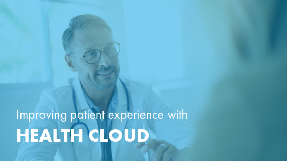

Salesforce&reg; Health Cloud is a top-ranked healthcare customer relationship
management (CRM) system. The software aims to put patients at the heart of
every decision&mdash;strengthening relationships and improving outcomes.

This blog discusses three ways that SalesForce Health Cloud can help
improve patient experience within the health care industry.

<!--more-->

I’m sitting on my couch in San Diego in disbelief. I’m looking at a medical bill
that I just received 18 months after my spinal procedure. It's from a surgical
center that I’ve never been to. What is a *22853.8 – insertion of interbody biome*?
Why am I receiving a bill for it?

I turn to the Internet. Google search results are lacking. I wonder if I’ll need
to find answers the old-fashioned way with library books, or have someone fax me
(does anyone still own a fax machine?). This thought leads me to Amazon, which
informs me I could have a fax machine shipped here same-day and suggests I add
milk to that order (because Amazon knows I’m out). Thank you, Amazon. Now that’s
customer service.

But let’s get back to my medical bill. I needed spinal surgery. It turns out
40-year-old men should not be downhill mountain biking at 35 mph or jumping 10
feet in the air at Whistler Bike Park if they have a genetic predisposition to
spinal compression.

For my spinal procedure, I chose a provider for his clinical prowess, medical
training, and because I just plain liked the guy (which may or may not be
important, because he was about to be millimeters from my spinal cord with a
chisel, but it couldn’t hurt). The bill in my hand wasn’t from him.

After phone calls to the physician’s office, the billing company, and my
insurance company, as well as a well-crafted email, and then a few heated phone
calls (which all feel like a waste of my time), I discover my surgeon had an
assisting surgeon. This bill is from him. And I’ve never met the guy&mdash;at
least, not while I was awake.

Hence, the genesis of this post. I’ve read plenty of blog posts about the patient
experience, and I don’t expect to fix all of our healthcare problems with this
article, but this is a call to action. Technology isn’t a panacea for all that
ails our healthcare delivery system, and neither is “better data” or “better
processes” if they aren’t focused on the outcome. We must tie all three
together&mdash;technology, data, and process&mdash;to focus on the patient
experience, measure it, and improve it.

### Why you need to prioritize patient experience

Your competitive edge and the viability of your business depend on your ability
to stitch together technology, data, and processes to be fanatically focused on
the experiences of your customers.

These digital and analog experiences can be as meaningful as you design and
build them to be. And I’d do it fast, like your competitors.
[Patient satisfaction](https://www.accessefm.com/blog/how-does-patient-satisfaction-impact-reimbursement)
is tied more and more to your reimbursements. You have to earn their business.
Over and over again.

Patients expect more. They are not satisfied with fragmented, siloed, or
slow-moving health services. They know technology can transform their experience,
and they want to see it used. We’re not just talking about young people (or overly
optimistic spry 40-something’s like me). A
[DuetHealth survey](https://www.duethealth.com/patient-engagement-stats-that-keep-hospital-ceos-up-at-night/)
found 89% of patients aged 55 and older said they want to manage their own
healthcare and need technology access to do so. Additionally, 35% of those senior
patients felt their health plans don’t adequately leverage health technology.

Our patients demand it. I demand it. As a patient, I deserve better. Your
patients deserve better. Every. Single. One.

But, I’m not going to complain without proposing a solution. So let me share
something I’m excited about, that I’ve seen work, that could have prevented my
situation with an unexpected medical bill. It’s something I’ve personally spent
a lot of time talking through with our customers.

#### Improve the patient experience with Salesforce Health Cloud

We have the technological maturity in our critical systems&mdash;electronic
health record (EHR), CRM, WCM, MarTech, Social, Middleware/Enterprise Service
Bus (ESB), cloud storage and computing, data warehousing, and artificial
intelligence and machine learning (AI/ML) tools. We have the data. We have the
processes. Let’s put it all together.

I’ve helped businesses like yours implement and use
[Salesforce Health Cloud](https://www.salesforce.com/solutions/industries/healthcare/health-cloud/)
to enable their staff with tools to deliver a better patient experience. You
can use this software to weave together all of your technology tools, removing
data silos, enabling home services, and leveraging data from multiple sources
to improve your quality of care.

Salesforce Health Cloud can positively impact your patient experience in several
ways.

#### Improve the continuity of care

Now, I admit that I’m lucky. I am reasonably healthy with no chronic conditions.
After my injury, I was in and out of the hospital fairly quickly (my left
forefinger is still 25% numb, but hey, that’s way better than before surgery
when it was 75% numb).

What about those who aren’t as lucky? What about the aging population and those
dealing with chronic diseases?

Being sick is tiring and stressful, and when your patients are already feeling
low, nothing is worse than having to provide the same information repeatedly
during their hospital stay. Doing this is not only exhausting, but can also
erode patient confidence in a healthcare provider. Your patients may wonder:
Didn’t I already tell someone this information? Why isn’t my healthcare team
communicating with each other? Are they truly capable of treating me?

Salesforce Health Cloud aims to eliminate data silos, ensuring every member of
a patient’s care team has access to the same EHRs. Doing so not only betters the
patient experience but also saves healthcare providers precious time. Providing
the healthcare team with
[comprehensive patient data](https://relationedge.com/6-best-practices-for-managing-and-cleaning-your-salesforce-data/),
including health conditions and medications, appointment history, and caregiver
information, can make patient consultations much more efficient, and eliminate
much of the risk of human error.

Health Cloud is designed to do all of this while also meeting HIPAA/HITRUST and
other [certification and regulatory standards](https://compliance.salesforce.com/en/services/health-cloud).
This cloud software provides a complete view of the patient and can even integrate
data from medical devices to provide a 360-degree, coordinated view of your
patients and their health.

#### Offer coordinated home care and telehealth services

I haven’t been back for my follow-up. Maybe that makes me a bad patient, but I
didn’t see the value. Do I need an X-ray, MRI, or perhaps a CT? Honestly, I don’t
know. No one told me what to do next. But someone did hand me an appointment card,
which I promptly threw away on the principle that “If they want my business,
they’ll call me.” (They didn’t).

Trips to the doctor’s office often feel like a hassle. If my doctor does need
to follow up on my recovery, I’d be happier simply to update him over the phone.
Home care and telehealth services save time, money, and energy for both patients
and medical caregivers without any decrease in quality of care. Health Cloud
helps you bring these convenient services to your patients.

Home monitoring tools, such as digital scales, can easily relay information back
to your team following a patient’s treatment. For patients with mobility issues,
video conferencing also allows a safer, more accessible way for doctors to follow
up. The Health Cloud platform enables you to leverage services that patients can
access from the comfort of their homes.

[Healthcare providers that have started employing technology](https://www.salesforce.com/form/industries/age-of-the-patient-ebook/)
to offer these types of health services at home have seen patient satisfaction
go up and readmission rates go down.

#### Analyze larger patient data sets

What percentage of your digital footprint&mdash;who you are, what you like, your
diet, hobbies&mdash;culminates from the 15 minutes you spend in an appointment
that your doctor was 20 minutes late for? I bet it’s next to zero.

As a medical professional, you gather EHR data from the 15 minutes a patient
spends in your office, but most of it is a cut and paste from previous visits
or the intake form they filled out for the fifth time. Then, there is everything
else that happens outside the four walls of the hospital. Health Cloud helps you
pull all of your patient data together to gain actionable insights.

[One breast cancer study](https://www.salesforce.com/customer-success-stories/uc-health/)
used the Salesforce platform to manage the electronic records of 100,000 women
and analyze these records to inform their treatment. As the doctor in charge of
that study put it, “a study of such magnitude would not have been possible
without automation.” Health Cloud allowed the team to record voluminous amounts
of patient history and medical profiles and keep track of personalized insights,
as well as follow these patients over time. Imagine the physician’s interaction
with the woman who slipped through the cracks of the traditional system. Can you
see the gratitude on her face, knowing that her life was saved by innovation and
by pushing against the status quo?

As your healthcare staff builds EHR databases, continually adding to patient data,
the Health Cloud system can use complex-data ETL processes to collect, analyze,
identify patient risk factors and initiate an action, send a text message or
email with targeted content for patient education, and check available
appointments&mdash;all without any human intervention. Of course, you’ll need
human interaction eventually, but why not spend human resources on the things
that matter!

### Elevate your patient experience to elevate your business

These are just three examples that scratch the surface of what’s possible when
you tie together technology, data, and process. Salesforce isn’t a fit for every
challenge in our healthcare delivery system, but you owe it to your patients to
explore what this platform can do. Remove the barriers, free your data, innovate,
and focus on outcomes!

I know this post is a little tongue in cheek, and I hope you can appreciate the
humor in my observations. Unfortunately, I can’t choose a surgeon based on his
use of CRM (yet), but I have chosen doctors based on the use of an EHR versus
paper charts. Perhaps someday, CRM will be as ubiquitous and contributive to
measuring patient experience and satisfaction score as EHR is to documenting my
blood pressure.

A final note. As I edit this, preparing to post, I received a call from the
billing company. The charges are being written off. A small victory for me, but
let’s commit to fixing this together to do it right the first time. The doctor
should have been paid for his time, and the billing company should have been paid
for theirs. Until then, I have the remaining 25% of the feeling in my finger to
look forward to&mdash;someday.

<a class="cta purple" id="cta" href="https://www.rackspace.com/salesforce">Learn more about Salesforce Customer Relationship Management (CRM)</a>

Visit [www.rackspace.com](https://www.rackspace.com) and click **Sales Chat**
to get started.

Use the Feedback tab to make any comments or ask questions.

