This article provides initial steps for deploying Palo Alto Firewall on AWS, but
the configuration of advanced features in AWS is beyond the scope of this
article.

<!--more-->

As the cloud computing world moves fast, network security over the cloud is of
prime importance. Enterprises require consistent security in the cloud without
sacrificing deployment flexibility and choice. Along with the inline threat
prevention capabilities, the integration of the VM-series virtualized Palo Alto
firewall with the newly announced Amazon Web Services (AWS) virtual private
connection (VPC) traffic-mirroring capability gives organizations the following
choices:

- To deploy the firewall out-of-band for application visibility.
- To deploy advanced threat detection in AWS cloud and extend your corporate
  network.

You can move corporate applications to the cloud, launch additional web servers,
or add more compute capacity to your network by connecting your VPC to your
corporate network. Because you can host your VPC behind your corporate firewall,
you can seamlessly move your IT resources into the cloud without changing how
your users access these applications.

### Overview:

The following detailed steps show you how to create and save key pairs,
prepare your VPC for different subnets, and create an AWS instance with a
Palo Alto image.

#### Step 1: Create the key pairs

1. Log in to your AWS account.
2. On the left navigation bar, choose **Network Security -> Key Pairs**.
3. Create a key pair by giving it a name and saving the key pair. In the
   PuTTY&reg; Key Generator, choose type `RSA`.
4. Choose the PEM file you created.
5. Choose **Save private key**, but do not put in the password.
6. Save the file with a **.ppk** extension.
7. Go to PuTTY. On the left pane, choose **SSH** and select **Auth**.
8. Click **Browse** and point PuTTY to the **.ppk** file created that you just created.
9. Save the session by clicking on the session on the left-hand side of PuTTY
   and select **Save**.

#### Step 2: Prepare the VPC

1. In AWS, choose **Services -> VPC** and delete the default subnets.
2. Create four new subnets: Management, Inside, Outside, and DMZ. You can
   choose the IP addresses, but they should be in the VPC address range.

#### Step 3: Select the Palo Alto image

1. Log in to your AWS account, go to **AWS Services -> Under Services -> EC2**,
   and create an instance.
2. Choose **Amazon Market Place**, and search for **Palo Alto**.
3. Select **VM-Series Next Generation Firewall Bundle 2**.

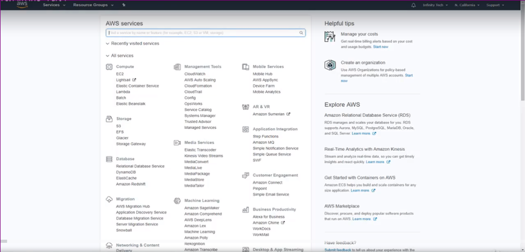

#### Step 4: Create an instance

1. Launch a new EC2 instance by clicking the **Launch Instance** radio button
   as shown in the following image:

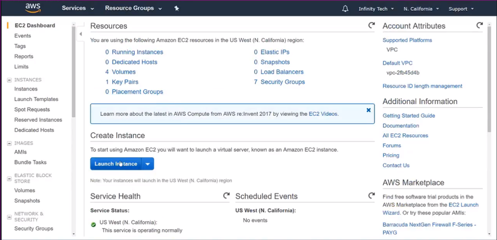

<ol start=2>
    <li>To choose an Amazon Machine Image (AMI), go to AWS Marketplace. On the
    left-hand side, search for <b>Paloalto -> Select VM-Series Next-Generation
    Firewall Bundle 2</b>.</li>
    <li>Click <b>Select</b>.</li>
</ol>
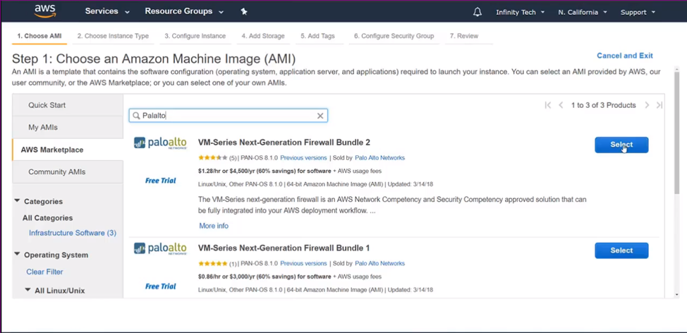

<ol start=4>
    <li>Highlight the instance type <b>M3 Extra Large</b>.</li>
    <li>Click <b>Next: Configure Instance Details</b>.</li>
</ol>

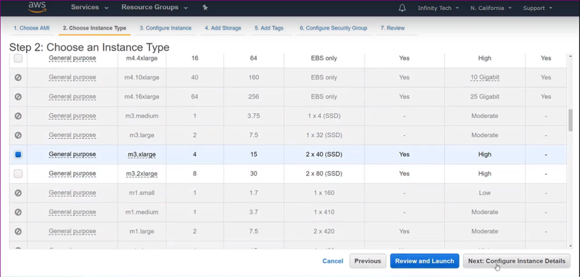

<ol start=6>
    <li>Configure the instance details. Select <b>Management</b> for the subnet,
    auto-assign the Public IP, and click <b>Next: Add Storage</b> as shown in
    the following images:</li>
</ol>

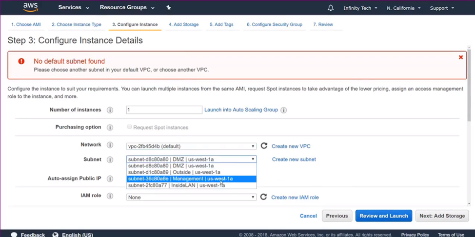

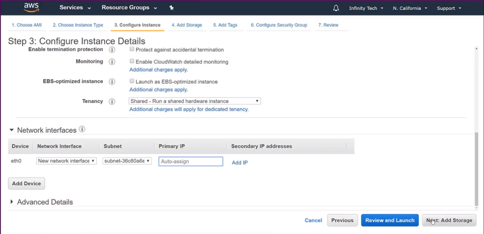

<ol start=7>
    <li>Select <b>General Purpose SSD (Solid State Drive) (GP2) Volume type<\b>
    and click <b>Next: Add Tags</b>.</li>
</ol>

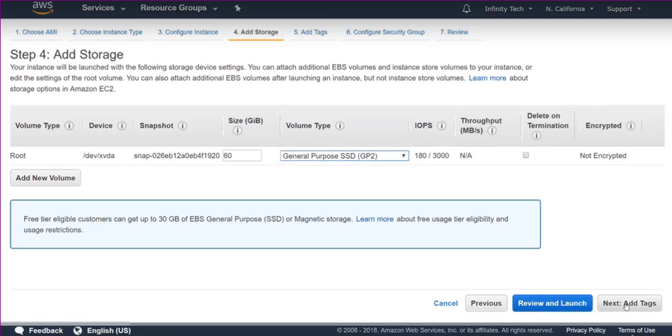

<ol start=8>
    <li>Keep the default settings for <b>Add Tags</b> and click
    <b>Next: Configure Security Group</b>, use the <b>Unrestricted Security Group</b>,
    and click <b>Review and Launch</b>.</li>
</ol>

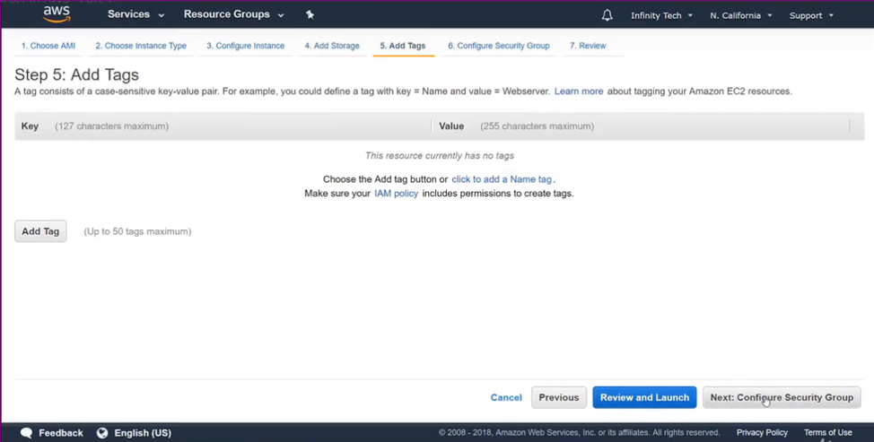

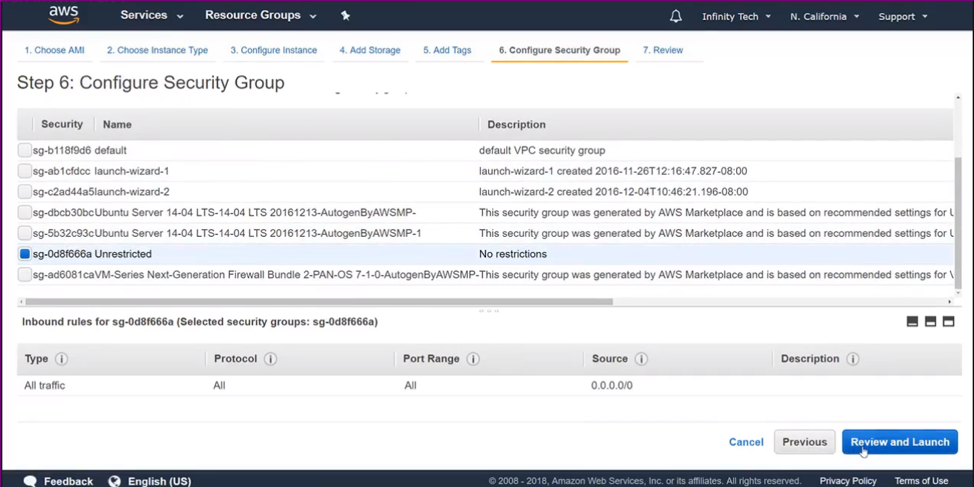

<ol start=9>
    <li>Review all the details of the instance and click <b>Launch</b>.</li>
</ol>

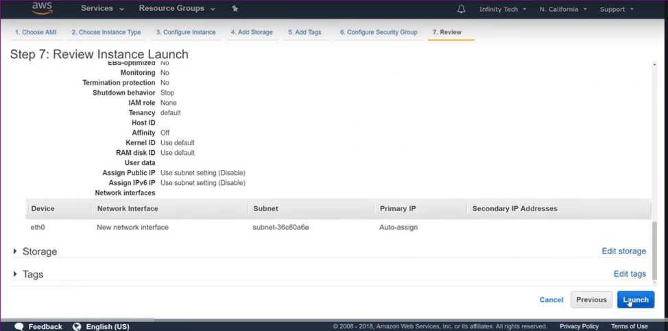

<ol start=10>
    <li>Select the key pair that you created previously and click <b>Launch Instances</b>.</li>
</ol>

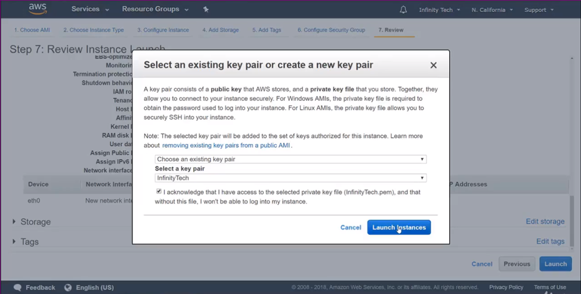

<ol start=11>
    <li>Go to <b>Services -> EC2 -> Instances</b> and validate that the new
    instance is running as shown in the following image:</li>
</ol>

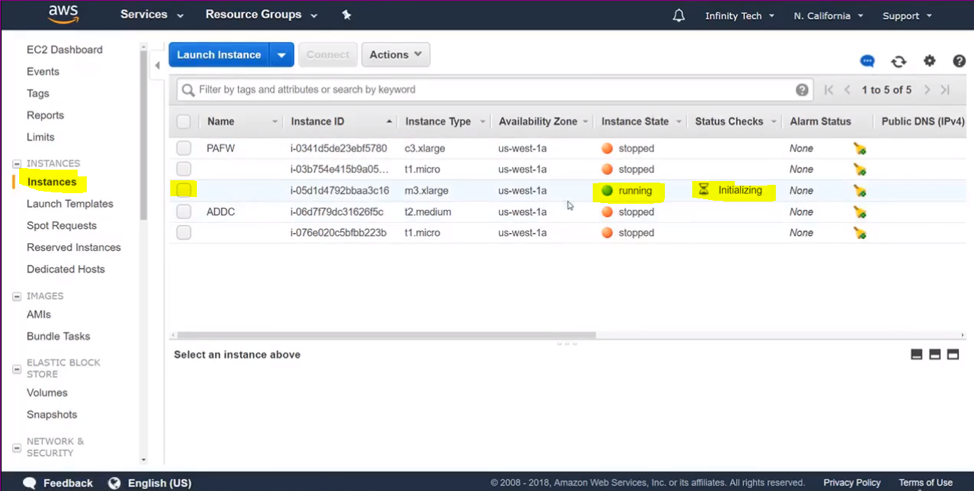

#### Configure the VPC

1. Go to the VPC dashboard from **Services ->  VPC -> Subnets**.
2. Select the **Management** subnet and choose the **Route Table** Tab.
3. Click **Edit** and associate it with the **Outside Routing table** to reach
   it from the Internet. Verify that the new associated Route Entry is listed
   under **Route Table**.

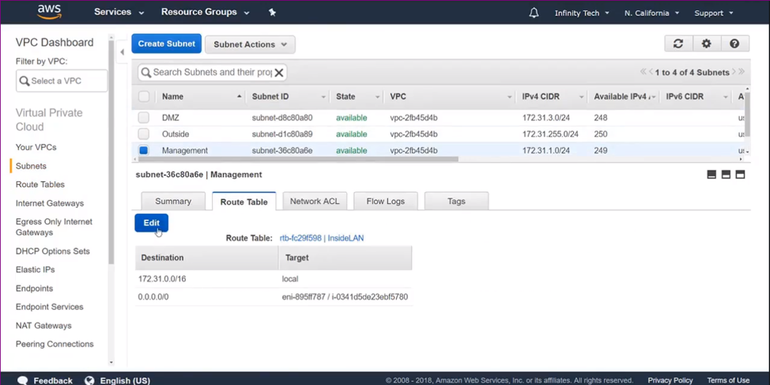

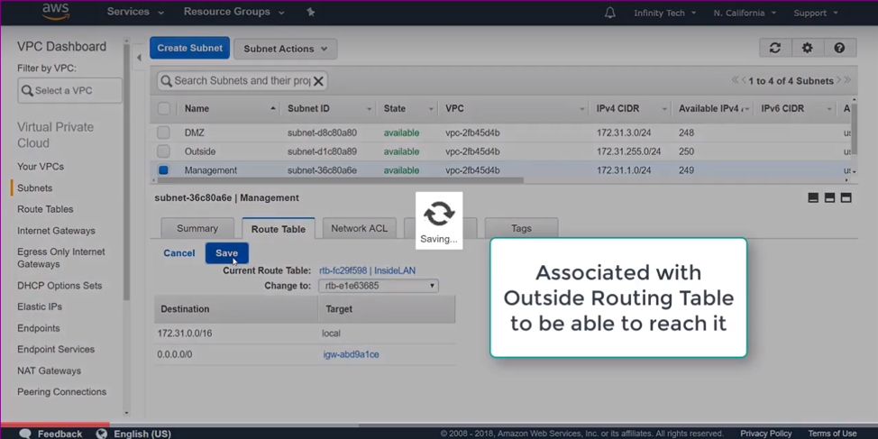

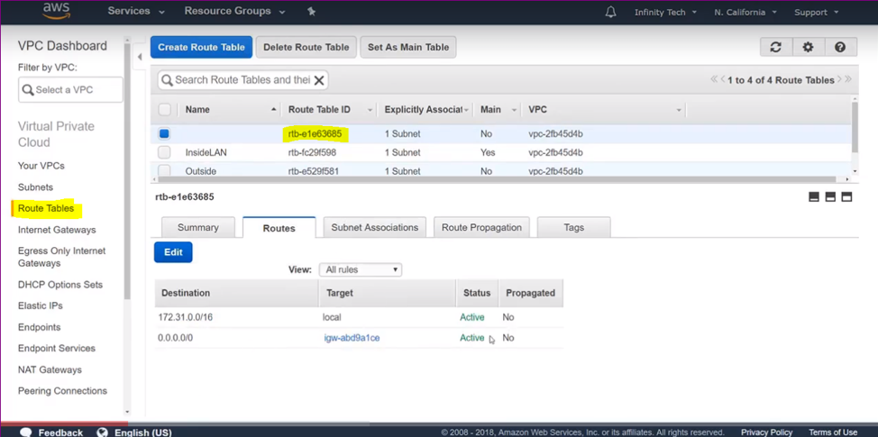

#### Assign an IP address to the instance

1. Go to EC2 and select your instance.
2. Go to **Network & Security** on left hand side, choose **Elastic IPs**, and
   click **Allocate new address**.

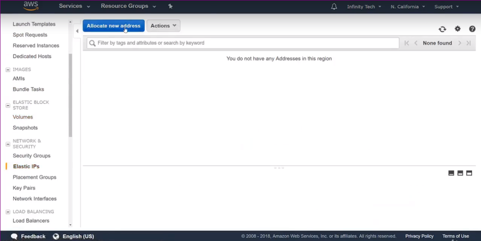

<ol start=3>
    <li>Click <b>Action -> Associate Address -> Assign the running instance</b>.</li>
    <li>Select an IP address from the drop-down menu to assign it.</li>
    <li>Click <b>Associate</b>.</li>
</ol>

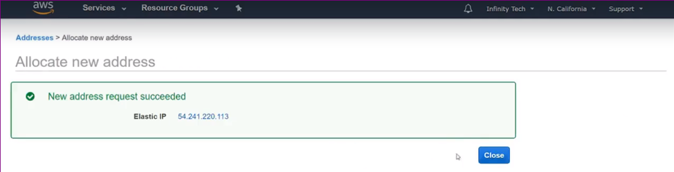

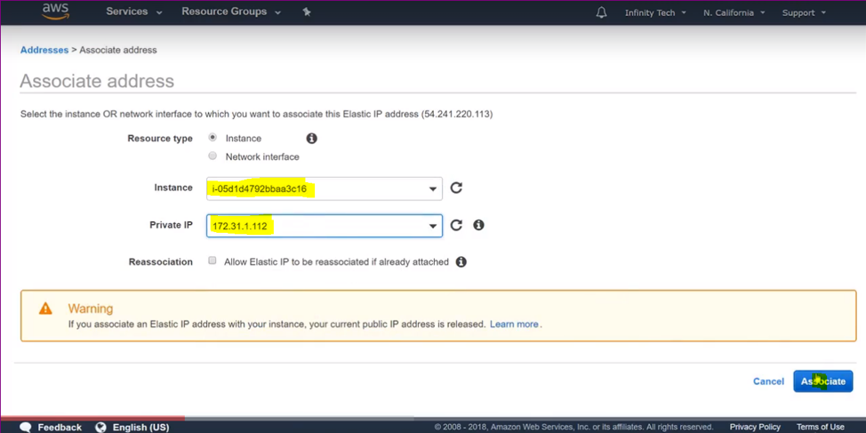

#### Test the configuration

Because the management interface is associated with the outside Public IP, you
should be able to connect to the management interface with the AWS Public IP
address outside interface of the EC2 instance by using a PuTTY session a web
browser (for example, https://<public_IP>).

The following images provide some examples of this test:

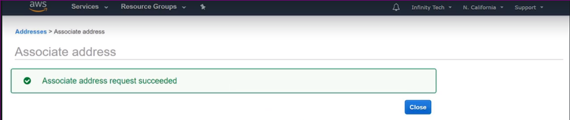

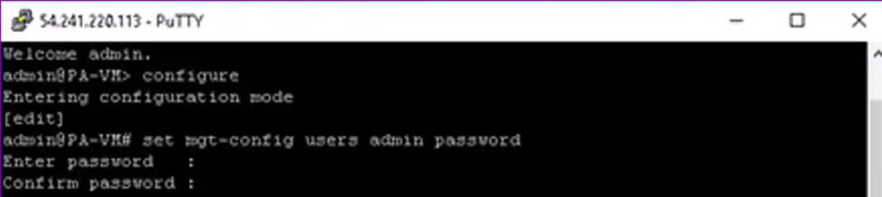

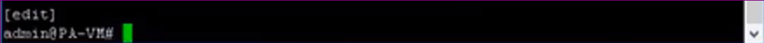

#### Create a Palo Alto support account

1. Go to [support.paloaltonetworks.com](support.paloaltonetworks.com) and
   create an account.
2. Log in to your Palo Alto support account.
3. Click the **Assets** tab.
4. Click **Register new device**.
5. Choose **Software Updates** to verify that you have access to the software.

### Conclusion

By using the steps in this post, you can deploy and provision a Palo Alto firewall
in AWS. Be aware that AWS is not free for Palo Alto, and you are charged per
hour when the instance is running. The charges are for EC2 and a software license
for Palo Alto, which runs around $1.50 an hour. There is also a monthly cost
associated with the storage. Make sure you have the budget before you opt for
using Palo Alto.

After you have finished working on the instance, ensure that you stop it so that
you incur no further charges. Don't terminate the instance, which deletes the
instance altogether.

Use the Feedback tab to make any comments or ask questions.

### Optimize your environment with expert administration, management, and configuration

[Rackspace's Application services](https://www.rackspace.com/application-management/managed-services)
**(RAS)** experts provide the following [professional](https://www.rackspace.com/application-management/professional-services)
and
[managed services](https://www.rackspace.com/application-management/managed-services) across
a broad portfolio of applications:

- [eCommerce and Digital Experience platforms](https://www.rackspace.com/ecommerce-digital-experience)
- [Enterprise Resource Planning (ERP)](https://www.rackspace.com/erp)
- [Business Intelligence](https://www.rackspace.com/business-intelligence)
- [Salesforce Customer Relationship Management (CRM)](https://www.rackspace.com/salesforce-managed-services)
- [Databases](https://www.rackspace.com/dba-services)
- [Email Hosting and Productivity](https://www.rackspace.com/email-hosting)

We deliver:

- **Unbiased expertise**: We simplify and guide your modernization journey,
focusing on the capabilities that deliver immediate value.
- **Fanatical Experience**&trade;: We combine a Process first. Technology second.&reg;
approach with dedicated technical support to provide comprehensive solutions.
- **Unrivaled portfolio**: We apply extensive cloud experience to help you
choose and deploy the right technology on the right cloud.
- **Agile delivery**: We meet you where you are in your journey and align
our success with yours.

[Chat now](https://www.rackspace.com/#chat) to get started.
