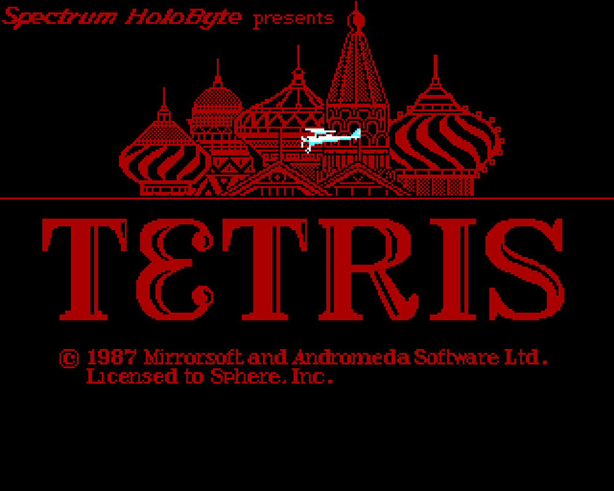
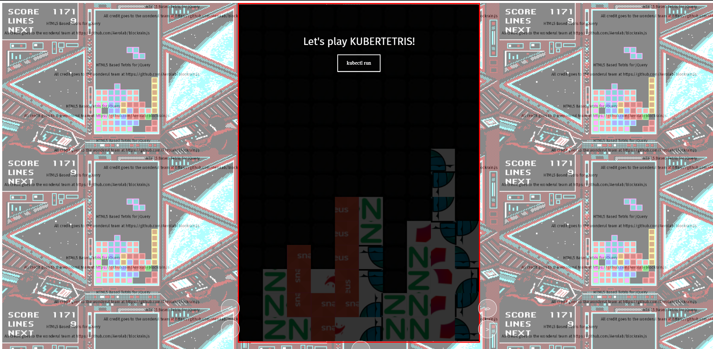
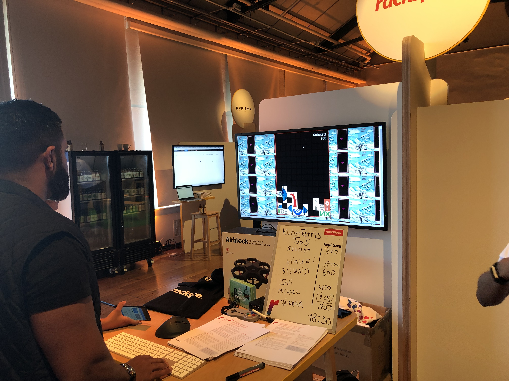
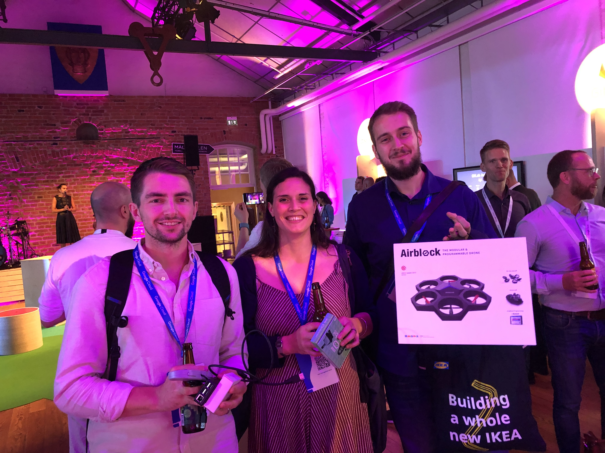
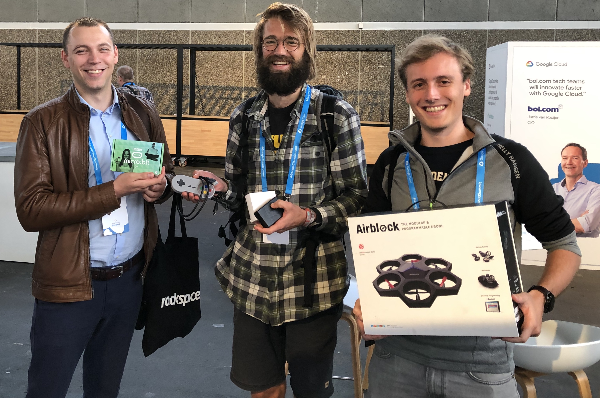

Rackspace sponsored the 2019 Google Cloud Platform (GCP&reg;) Summits in Stockholm and Amsterdam and challenged the attendees to a game of *Kubertetris*.

<!--more-->

### Rust

On the 28th of May 1987, during the **Cold War**, a German teenager named **Mathias Rust** flew a rented *Cesna F172P* (on a side note&mdash;the most successful and most produced airplane ever) from **Helsinki, Finland** into Soviet airspace. Soviet air defenses failed to act appropriately, and he managed to land his plane on a bridge near **the Kremlin** in Moscow. He later stated that his aim was to reduce the tensions between **NATO** and the **Warsaw-Pact**, but in hindsight, he should consider himself lucky that he wasn't shot down and killed. 

However, as an example of the [Butterfly Effect](https://en.wikipedia.org/wiki/Butterfly_effect), the Soviet military's failure allowed [Michael Gorbachov](https://en.wikipedia.org/wiki/Mikhail_Gorbachev) to remove many of the strongest opponents to his reforms, which eventually led to the dismantlement of the **Soviet Union** and the end of the **Cold War**. 

Rust and his tiny plane were immortalized in what could be called a *meme avant la lettre* in the 1987 IBM-PC release of **Tetris** by [Spectrum Holobyte](https://en.wikipedia.org/wiki/Spectrum_HoloByte), which featured the Kremlin and Rust's plane in the game's welcome screen. 

Tetris, created in 1984&mdash;yes, **1984**&mdash;by [Alexey Pajitnov](https://en.wikipedia.org/wiki/Alexey_Pajitnov), which has a whole movie plot-worthy history of its own, managed to permeate the Iron Curtain not long after Rust did to become the most popular computer game of all time by being. To quote *Computing Gaming World* (in 1987): "deceptively simple and insidiously addictive." 

But that's not what this blog post is about... or is it?

### The GCP Summit

Rackspace, as a provider of managed and professional services, has been a Google&reg; partner for years, and we were recognized as their *2018 Global Migration partner of the year*. So, obviously, we attended and sponsored the *Google Cloud Platform Summit* in Stockholm and Amsterdam this year. Both events were very well organized and featured talks by some of our customers and led to very interesting conversations. Still, in all honesty, our services, especially managed services, can be a hard sell. 

Of course, our name doesn't help. But while we are perfectly able to explain where we came from, where we are heading, and why we are uniquely positioned to help companies reach their goals and complete their objectives, compared to **Machine Learning**, **Artificial Intelligence**, or even **Kubernetes**, our managed services and transformation strategies just aren't that sexy. 

How does one exhibit (I have always loved the fact that a collection of sponsor booths is dubbed a *Partner Exhibition* like we are some modern day *Gustav Eiffel*..) or demo managed services? Show a customer environment with all servers patched? Put some of our great support people on display to channel Fanatical Experience&trade;? 

Our local marketing team and I quickly decided that to really tell people how we add value for our customers, we should first find a way to break the ice. And what better way to break the ice than playing a game? 

### Blocks => Tetris + Kubernetes == KuberTetris

When we launched our managed services for what we call **Third-Party Cloud** (AWS&reg;/Azure&reg;/GCP), we only had two service offerings:

- **Navigator** - where we would tell you where to go, but you had to find how to get there by yourself
- **Aviator** - where we would commandeer the steering wheel and take you wherever we thought you wanted to go

In time this proved to be a less than ideal. Some customers needed more help managing their infrastructure for a short period of time, while others only needed help designing their environment and were perfectly able to run it themselves. 

So we introduced the concept of **Service Blocks**, specific blocks of services that our customers can use to compose their own service offering that is a fit for them and for their purpose. 

But don't worry, this is not some stale sales pitch. The concept of blocks (and quite possibly the difficulty that some of us had when transitioning to the new model) was what inspired me to pick Tetris as our promotional vehicle. And because much of the work we do on GCP is around Kubernetes and because&mdash;let's be honest here&mdash;Kubernetes is pretty difficult to navigate as well, the *portmanteau* **KuberTetris** was born.

### The Tech behind the Talk

Personally, I hardly qualify as a proper developer, let alone a game developer. But I knew I wanted to build something that could be run just about anywhere on non-specific hardware, and that would be easy to maintain and support, which lead me to explore the possibility of creating **Tetris** based on **HTML5** and client-side only code. 

Luckily, some kind souls already did all the hard work and developed an open-source **Tetris HTML5** clone with theme support. I cannot praise them enough, and I've tried to reach out to see if we can somehow compensate them for their hard work. Kudos to the people at **Aerolab** and their project [Blockrain.js](https://aerolab.github.io/blockrain.js/)! 

I created a custom theme around GCP and Rackspace, included our **Service Blocks**, adjusted some of the game files for additional customization, and hosted the game on blob storage, the result of which can be found [here](https://kubertetris.thirdpartytools.net/index.html). **NB - Works best in Chrome and not on mobile!**

Don't tell Google that it's on **Azure Blob Storage** for now ;-). The epileptic background animations are standard CSS, and it features the original **Gameboy** soundtrack by [Chip Tanaka](https://en.wikipedia.org/wiki/Hirokazu_Tanaka). 

Add a simple whiteboard to record the scores, some awesome prizes (**Airblock** - A modular programmable drone/Hovercraft, a **Raspberry PI 3** with **MINECRAFT: PI edition**, and a **BBC Micro-bit**), and some enthusiastic contestants and winners, and you have the recipe for a very enjoyable day at the conference booth! 

### Back to the future

Because of the success of the first version, one of my colleagues came up with the idea to use the game as an example workload to truly exhibit our services. So, as we speak, we are adding features, such as a CI/CD pipeline, to deploy straight into object storage (on Google, this time), an on-screen high score (rather daunting considering my JS skills), and a proper block preview function. At the same time, some of my colleagues are creating a high-level proposal, a detailed design document, and fully branded graphics and images. 

The next version is now available [here](https://kubertetris.thirdpartytools.net/index.html) !! **NB - Works best in Chrome and not on mobile!**

Our aim is to present the game and these artifacts at [Google Next '19 in London](https://cloud.withgoogle.com/next/uk) and to slowly add more functionality and services, such as some analytics on in-game data and events. 

And of course, I will blog about it. 

For those in the Netherlands, you can play a 1.1 version of our game at the [Infosecurity](https://www.infosecurity.nl/) event in Utrecht on the 30th and 31st of October.
