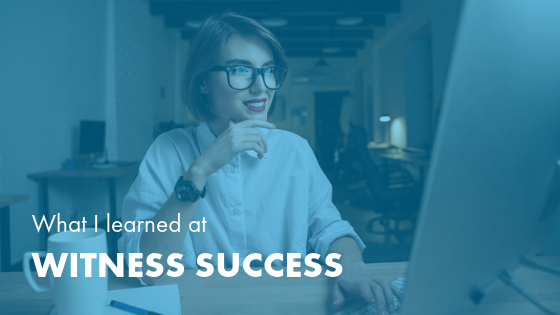

This July, I attended and [spoke](https://witnesssuccess.com/2019-session-speakers/)
at my first **WITness Success** event in Nashville, which was invigorating. I
left motivated and re-energized in my Salesforce&reg; career.

<!--more-->

WITness Success is a Women In Tech (WIT) event for everyone in the Salesforce
ecosystem worldwide. This event brings together women of all backgrounds to
speak about career growth, diversity and inclusion, technical knowledge, and
functional skills.

I can sum up my experience at WITness Success in three concepts: we are stronger
when we work together, we benefit from having and becoming strong allies, and
we all have untapped potential. Here's how these three lessons have motivated me
to be more active in advancing my own Salesforce career.

### We are stronger when we work together

Although I have been a Salesforce user for 7 years, I only started attending
user-led community groups in August. In my previous job, I often felt alone in
my Salesforce role. I was on a small team with limited resources. This meant that
when I encountered something technically complex or new to me, I often had to
leave it behind and move on to the next pressing task.

When I changed jobs, our MVPs and community leaders motivated me to become more
involved with the Salesforce ecosystem. While attending WITness Success, I saw
the incredible value that community groups provide.

Bringing together Salesforce employees, partners, and users enabled us all to
work together and help each other advance our skills and knowledge. I saw this
in sessions like *Getting to the Bottom of Your User’s Needs* and *Leveraging the Power of SOQL*,
where session leaders guided conversations on best practices. Events like WITness
Success help people get past barriers, share ideas, and move forward. Each person
at WITness Success, whether they were a session speaker or attendee, had something
valuable to contribute to a conversation.

Many people in the Salesforce ecosystem have felt as alone as I used to
feel&mdash;WITness Success is a place for these people to find support and
encouragement to continue with their careers. Now, I am more motivated to
participate in other user-led groups where I can learn from my peers and offer
to help others in their Salesforce careers.

### We benefit from having and becoming strong allies

Many sessions at WITness Success, including my own, highlighted the
[importance of allyship](https://www.youtube.com/watch?v=Kcotl7vRbYY&feature=youtu.be)
in the Salesforce ecosystem. In my session on how to be more inclusive in the
workplace, I spoke about the power of privilege and how we can better use our
privilege to help advance people from marginalized groups.

Two other panels that I attended discussed the power of allyship. At the panel
on Latinas in the Salesforce economy, I heard powerful stories of how Latinx
members in the Salesforce community still face discrimination, unequal pay, and
hostile work environments. The panelists mentioned that having strong allies has
helped them advance in their careers and that allies have provided extra support
when faced with unjust treatment.

The panel session *Am I Still on Mute or Are You Unconscious[-ly Biased]?* echoed
this. Panelist Charlie Isaacs, CTO for Customer Connection at Salesforce, made
a specific call for more people to be allies, to speak up, and to stick up for
people when they notice an injustice. That might mean using your voice to redirect
a conversation to include a coworker who has been talked over or asking a
colleague to stop using discriminatory language. It could even mean starting your
own community group within your company where people can come together and find
strength in numbers.

Allyship can come in a variety of forms&mdash;from something as formal as
mentorship and community groups to more informal practices that you incorporate
to be more inclusive in your daily life. WITness Success made it clear that the
Salesforce ecosystem needs more allies to help support the growing workforce. I
plan to continue finding ways to be a better ally at work. I hope you’ll join me.

### We all have untapped potential

The final theme that stood out to me at WITness Success focused on our own
personal potential. As a woman in tech without a college degree in anything
related to computer science, I often experience imposter syndrome. Sometimes it
feels like I haven’t earned my role or title, and other times I doubt my abilities
to solve a problem or suggest a solution. At WITness Success, I saw that other
women face these same doubts.

What’s wonderful about the Salesforce platform is that you don’t need formal
technical training to be successful. At WITness Success, I heard women with
stories similar to my own&mdash;other first-generation college students, others
who came from low-income households, others who started their careers in a
different field. We all found Salesforce, and we are all successful.

No one person knows every single thing about the Salesforce platform. Resources
like user groups, [Trailhead](https://trailhead.salesforce.com/en/home), and the
Trailblazer community help us overcome the barriers we put in front of ourselves
and make strides in our careers. I feel more confident in my ability to conquer
moments of imposter syndrome and other self-imposed hurdles to learning because
I have as much potential as anyone else to become a Salesforce expert.

### We get by with the help of other Salesforce Trailblazers

These topics at WITness Success reminded me that our own success is dependent
on the success of those around us. When we are all supported, respected, and
heard, we can solve more problems.

I learned that I need to start identifying the barriers I place in front of
myself and create plans to overcome these barriers. Whether that means finally
going for another certification or buckling down to learn more about *AMPscript*,
I am more motivated now to challenge myself and move forward in my career. I am
also more conscious of how I can be a better ally to my colleagues and customers
to make sure their voices are heard and respected.

To anyone that is wondering whether WITness Success or other user-led groups are
worth the time and investment, I highly recommend giving your next local user
group meeting a chance. This provides you an opportunity to meet new people,
hear new perspectives, and maybe find inspiration to try something you have never
thought of before.

<a class="cta purple" id="cta" href="https://www.rackspace.com/salesforce">Learn more about Salesforce Customer Relationship Management (CRM)</a>

Visit [www.rackspace.com](https://www.rackspace.com) and click **Sales Chat**
to get started.

Use the Feedback tab to make any comments or ask questions.