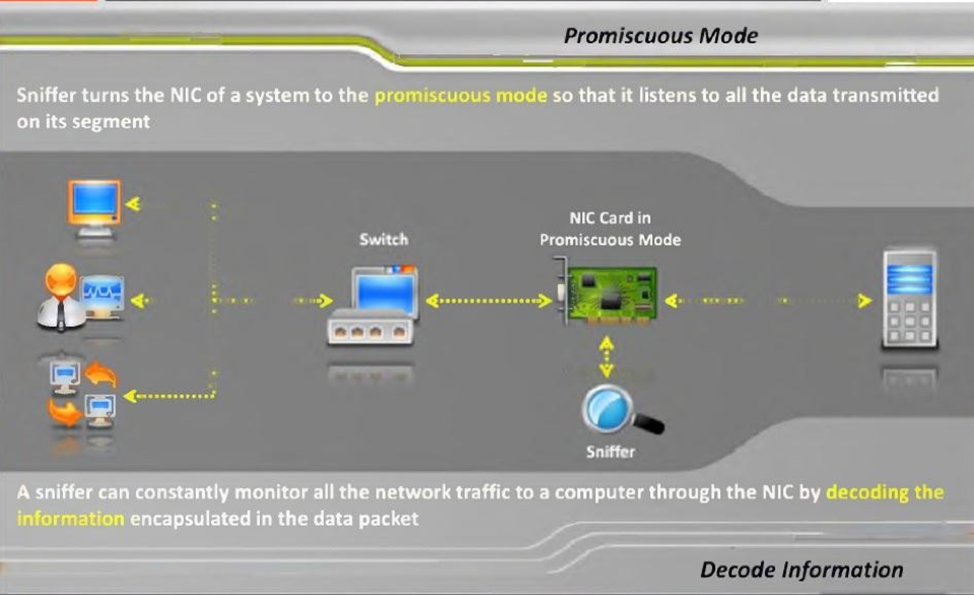
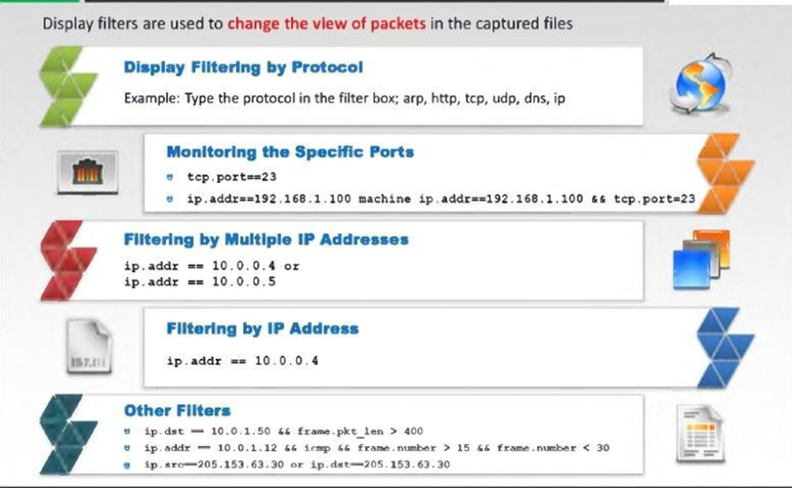
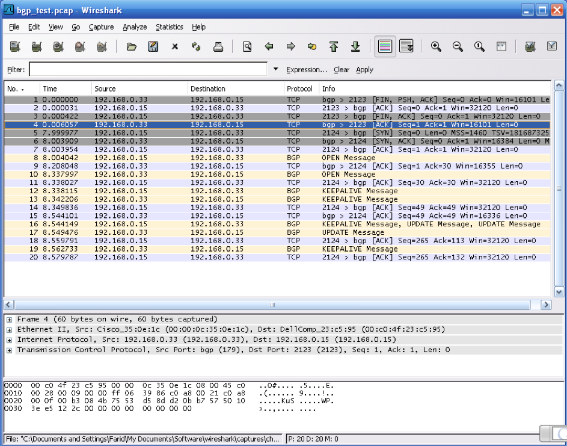

This post explores packet sniffers, which are a useful tool and a potential
threat. It provides detailed information about packet sniffers, software used
as packet sniffers, how sniffers work, types of sniffing, protocols vulnerable
to sniffing, Wireshark&reg; filters, threats of Address Resolution Protocol (ARP)
poisoning, span port, and how to defend against packet sniffing.

<!--more-->

### What are packet sniffers?

A sniffer is a piece of software that captures network traffic and performs
network analysis, traffic analysis, protocol analysis, sniffing, packet analysis,
and so on. A packet sniffer is essentially a tool that aids in monitoring
network traffic and troubleshooting a network. It works by capturing and
analyzing packets of data that flow through a network. In some cases, a packet
sniffer might be a dedicated hardware device.

Sniffers capture, decode, and analyze network traffic and answer questions such
as the following:

-	Why is the network slow?
-	What is the network traffic pattern?
-	How is the traffic being shared between nodes?

### Network analyzer

A network analyzer is a combination of hardware and software tools that can detect, decode, and
manipulate traffic on the network. Network administrators use network analyzers to
troubleshoot networking issues, but many hackers use them to gather vital
information.

Uses include:

-	Passive sniffing (detection) - Difficult to detect
-	Active sniffing (attack)

#### Common network analyzers

The following list contains some common analyzers:

-	Wireshark
-	Ettercap&reg;
-	Dsniff&reg;
-	Tcpdump
-	Etherpeak&reg;
-	Cain and Abel&reg;

### How a sniffer works

Data travels through a network in the form of packets. Packet-switched
networks break down the data to transmit into several packets. They then
reassemble these packets after all the data packets reach their intended
destination.

When you install a packet sniffer in the network, the sniffer intercepts the
network traffic and captures the raw data packets. Subsequently, the packet
sniffing software analyzes the captured data packet and presents the results to
the network administrators in a user-friendly format so that they can interpret
the data.

*Image source:* [https://www.eccouncil.org/](https://www.eccouncil.org/)

### Types of sniffing

There are two types of sniffing: passive and active.

Network administrators use passive sniffing on the hub used by the network to
send traffic to all the ports. It only monitors packets sent by others and does
not insert any additional data packets into the network traffic.

Attackers use active sniffing to steal data from others. In a network that
uses hubs to connect systems, all hosts on the network can see all the traffic,
and therefore, an attacker can easily capture data packets.

### What is Wireshark?

Formerly known as Ethereal, Wireshark is an open-source program with many free
features that provides the following functionality:

-  Helps you to decode over 750 protocols.
-  Is compatible with many other sniffers.
-  Has plenty of online resources available.
-	 Supports the command-line and GUI interfaces.
-	 Offers the TShark command-line interface that has the following three components:
   -	**Editcap**: Reads the captured packets from the infile and reads and writes
      the same capture files that are supported by Wireshark.
   -	**Mergecap**: Combines multiple saved capture files into a single output file.
   -	**Text2pcap**: Reads in an ASCII hex dump and writes the data described
      into a `pcap` or `pcapng` capture file. Text2pcap can read hex dumps with
      multiple packets in them and build a capture file of multiple packets.

### Protocols vulnerable to sniffing

The following protocols are vulnerable to sniffing:

-	HTTP
-	Telnet
- rlogin
-	POP
-	IMAP
-	SMTP and NNTP
-	FTP

### Users of network analyzers

The following roles use network analyzers:

-	System administrators
   -	Understand system problems and performance
-	Malicious individuals (intruders)
   -	Capture cleartext data
   -	Passively collect data on the following vulnerable protocols: FTP, POP3,
      IMAP, SMATP, rlogin, HTTP, and so on.
   -  Capture VoIP data
   -  Map the target network
   -  Discover traffic patterns
   -  Actively break into the network (backdoor techniques)

### Filters

You can use filters to analyze captured data.

*Image source:* [https://www.wireshark.org](https://www.wireshark.org)

Sometimes, you can observe and record traffic traveling on a network, which
might contain valuable information such as the following:

–	 Usernames and passwords
   -	Encrypted
   -	Unencrypted
–	 Email, web requests (and replies), data files, and so on.

### Wireshark

Wireshark a is very popular network analyzer tool, which is used by network
administrators to capture packets traversing through a network. Administrators
mostly use it to identify network problems, but hackers also use it to decode
secure information.

The following image shows a Wireshark screen:

*Image source:* [https://www.wireshark.org](https://www.wireshark.org)

#### Example – A nmap port scan:

-	Target host: 10.0.0.1
   –	Start Wireshark
-	Source host: 10.0.0.2 or the attacker's computer
   –	Perform a TCP-connect scan: `nmap –sT <target host>`
-	View results

#### Example – A web connection:

-	Target host: 10.0.0.1
   –	Start Wireshark
-	Source host: 10.0.0.2
   –	Open web browser: Type any website name
-	View results

#### Example – An FTP connection:

-	Target host: 10.0.0.1
   –	Start Wireshark
-	Source host: 10.0.0.2
   –	Use the ftp client: `ftp <target host>`
-	View results

### Man-in-the-middle

The man-in-the-middle is a common attack tactic.

In a switched environment, a host receives only the following:

-  Traffic destined for itself
-  Broadcast traffic

The host cannot see traffic between other hosts. The man-in-the-middle attack
enables you to insert yourself as an (undetected) intermediary between
communicating hosts.

### What is ARP poisoning?

Address Resolution Protocol (ARP) poisoning is when an attacker sends falsified ARP messages over a local
area network (LAN) to link an attacker’s MAC address with an IP address of a
legitimate computer or a server on the network. After the attacker’s media access control (MAC) address
is linked to an authentic IP address, the attacker can receive any messages
directed to the legitimate MAC address. As a result, the attacker can intercept,
modify, or block communications to the legitimate MAC address.

Attackers look for the following opportunities to use ARP poisoning:

–  Sensitive, unencrypted communications
   -  Web requests or replies, email, FTP, or HTTP
–	 Weakly-encrypted communications
   -  Old versions of SSH or RDC

#### ARP poisoning  countermeasures

Dynamic ARP inspection in Cisco&reg; systems helps to prevent man-in-the-middle
attacks by not relaying invalid or gratuitous ARP replies to other ports in the
same VLAN. Dynamic ARP inspection intercepts all ARP requests and all replies
on untrusted ports. Each intercepted packet is verified for valid IP-to-MAC
bindings via DHCP snooping. Denied ARP packets are either dropped or logged by
the switch for auditing when ARP poisoning attacks are stopped. Incoming ARP
packets on the trusted ports are not inspected. Dynamic ARP inspection can also
rate-limit ARP requests from client ports to minimize port scanning mechanisms.

### How to defend against sniffing

Use the following techniques and best practices to protect yourself from
sniffing attacks:

-	Restrict the physical access to the network media to ensure that a packet
  sniffer cannot be installed.
-	Use encryption to protect confidential information.
-	Permanently add the MAC address of the gateway to the ARP cache.
-	Use static IP addresses and static ARP tables to prevent attackers from
  adding spoofed ARP entries for their machines to the network.
-	Turn off network identification broadcasts, and if possible, restrict the
  network to authorized users in order to protect the network from being
  discovered with sniffing tools.
-	Use the IPv6 instead of the IPv4 protocol.
-	Use encrypted sessions such as Secure Shell (`ssh`) instead of Telnet.
- Use Secure Copy (`scp`) instead of a file transfer protocol (`ftp`).
- Use Secure Socket Layer (SSL) for email connections.

### Conclusion

These days, many attacks happen through packet sniffing. Packet sniffers are
placed in cyber cafes and on open wifi in restaurants, hotels, and public
places. You can protect your data with a little caution. You should never use
open wifi and should stop using open text protocols like ftp, http, IMAP, Telnet,
and SNMP V1 and V2. You must install SSL certificates in your websites, use
Secure File Transfer Protocol (`sftp`) instead of `ftp`, and use SSH instead of
telnet. You should use SNMP V3 and opt for the strongest encryption.

Use the Feedback tab to make any comments or ask questions.

### Optimize your environment with expert administration, management, and configuration

[Rackspace's Application services](https://www.rackspace.com/application-management/managed-services)
**(RAS)** experts provide the following [professional](https://www.rackspace.com/application-management/professional-services)
and
[managed services](https://www.rackspace.com/application-management/managed-services) across
a broad portfolio of applications:

- [eCommerce and Digital Experience platforms](https://www.rackspace.com/ecommerce-digital-experience)
- [Enterprise Resource Planning (ERP)](https://www.rackspace.com/erp)
- [Business Intelligence](https://www.rackspace.com/business-intelligence)
- [Salesforce Customer Relationship Management (CRM)](https://www.rackspace.com/salesforce-managed-services)
- [Databases](https://www.rackspace.com/dba-services)
- [Email Hosting and Productivity](https://www.rackspace.com/email-hosting)

We deliver:

- **Unbiased expertise**: We simplify and guide your modernization journey,
focusing on the capabilities that deliver immediate value.
- **Fanatical Experience**&trade;: We combine a Process first. Technology second.&reg;
approach with dedicated technical support to provide comprehensive solutions.
- **Unrivaled portfolio**: We apply extensive cloud experience to help you
choose and deploy the right technology on the right cloud.
- **Agile delivery**: We meet you where you are in your journey and align
our success with yours.

[Chat now](https://www.rackspace.com/#chat) to get started.
