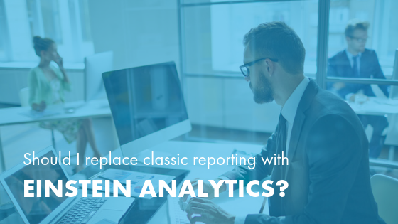

Do you ever feel that the analytics you get from Salesforce&reg; Classic Reports
and Dashboards isn’t providing enough insight for your organization’s goals?

If you feel like you’re not leveraging your data as effectively as you could,
you have likely matured past what Classic Reports can do. The solution
is to turn to Salesforce’s stronger reporting platform, Einstein Analytics.

<!--more-->

While both Sales Cloud and Service Cloud have basic reporting tools built in,
the main purpose of these platforms isn’t reporting. Einstein Analytics, by
contrast, is a true reporting platform designed to integrate with your CRM. The
two are fundamentally different in purpose and nature and act as complementary
technologies to propel your business.

Does your company need the stronger capabilities of Einstein Analytics? Ask the
following questions to find out.

### 1. Do you lack a 360-degree perspective?

Classic reporting allows users to retrieve data across three object levels&mdash;
a fairly limited number. This gives you a rather shallow view of performance,
and while it might be enough when your organization is small, as you grow and your
goals expand, you need reporting that provides a more complete view of your data.

Einstein Analytics doesn’t limit how many cross objects a report can include,
which offers a holistic view of performance. Users have access to all the data they
need in one location. Plus, thanks to easy customization options, your
personalized dashboard reflects your own projects and priorities.

### 2. Do you need to report on external data?

External data is excluded from your reports if you’re using Classic Reports.
The reports only include Salesforce data, and therefore, can only show you part of
the story.

Einstein Analytics enables you to create data sets from external sources with a
user-friendly point-and-click model. By combining data from Salesforce with that
from other sources, your data-driven insights become broader and deeper.

### 3. Is the mobile experience underwhelming?

Reporting is all about making data accessible and actionable. If your reports
aren’t optimized for mobile, it means that data is not easy for employees to
access from various locations. This access is imperative if you have multiple
office locations, remote employees, or team members who regularly travel for
work. While users can access Classic Reports via mobile, the reports aren’t
mobile-optimized, which limits functionality.

Einstein Analytics solves this issue by optimizing reporting for mobile devices.
This means any team members working from home or in the field have easy access
to in-depth data and expansive reporting tools.

### 4. Do your reports feel inaccessible?

If users perceive a reporting system as slow, confusing, or difficult to
navigate, they are more likely to avoid consulting the available data. As your
organization’s reporting needs progress, you might find it frustrating that
Classic Reports cannot be easily embedded into other Salesforce workflows or
that you cannot execute Salesforce actions directly from the reports. The
inconveniences of Classic Reports might discourage your team members from
fully utilizing the data and insights available.

Einstein Analytics removes these obstacles by allowing users to embed Salesforce
triggers into reports and embed reports into everyday workflows. This makes it
easier for users to incorporate intelligent reporting and analytics into their
decisions and actions at work.

### 5. Are your reports inflexible?

There is no such thing as a one-size-fits-all report. The best reports are
customized for the user, the moment, and the question at hand. On-demand
reporting is possible in Classic Reports, but it’s time and labor-intensive,
which deters teams from using it.

Einstein Analytics offers a true self-service experience, empowering users
without extensive technical training to instantly create reports on the fly.
With a convenient way to create custom reports, your questions can be instantly
connected with answers, and decisions can be backed up by data.

### Ready to implement Einstein Analytics?

If you are ready for the deeper reporting capabilities that Einstein Analytics
offers, your organization can consider the following license options: Sales
Analytics, Service Analytics, or the Einstein Analytics Platform (which includes
both Sales and Service).

No matter which option you choose, creating a thoughtful plan for implementation
is key. Taking the time to clean and organize your data and architect your
system correctly spares you many hassles down the road. As a Salesforce
Platinum Consulting Partner, we have years of experience with organizing data,
architecting systems, and implementing technology for specific business
requirements.

Rackspace partners with you to customize your Einstein Analytics platform
for your business needs, create a plan for implementation and fostering user
adoption, and gain the expertise to make the most out of the analytics at your
fingertips. Contact our team of business process and technology experts today
for a consultation.

<a class="cta teal" id="cta" href="https://www.rackspace.com/salesforce">Learn more about Salesforce Customer Relationship Management (CRM)</a>

Visit [www.rackspace.com](https://www.rackspace.com) and click **Sales Chat**
to get started.

Use the Feedback tab to make any comments or ask questions.
