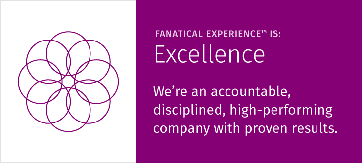
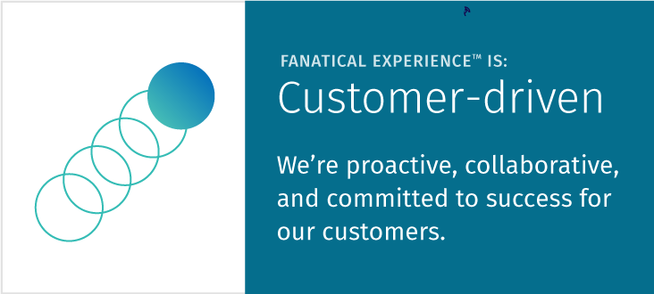
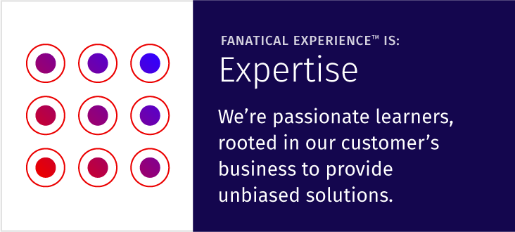
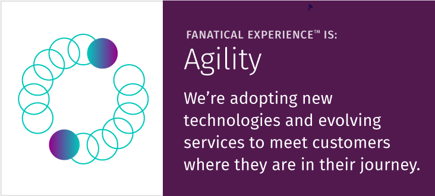
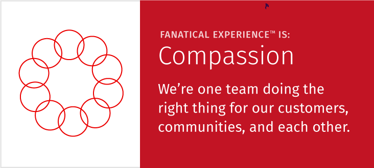

Working in technical support comes with its own unique set of challenges and opportunities, but it also means that we get the satisfaction of remaining at the forefront of technical change as things move so rapidly and new hosting services and products change seemingly quicker than a new iPhone can be released.

<!--more-->

Because of this, Rackspace’s refreshed Core Values are a breath of fresh air as they have been simplified through not merely offering the *Fanatical Support* that the company is known for, but by targeting the entire customer journey, from the very first contact with Rackspace, to create a **Fanatical Experience**&reg; for customers.

### Excellence

*We’re an accountable, disciplined, high-performing company with proven results.*

Obviously, in support especially, if a company is not able to provide a level of excellence in its products and services, it becomes an uphill battle to differentiate itself from other businesses. That's why Rackspace holds strong to its original promise of not only providing the experience and quality outputs that customers hold Rackers accountable for, but also expects Rackers to continuously push each other to be great. We are there to help each other, lift each other up, and to assure that the support we are providing is second to none.

In a day where customers have unprecedented access to forums, rating sites, and social media, if a company does not live up to a high level of excellence, customers can make sure their voices are heard, both with their wallets and their commentary.

### Customer-driven

*We’re proactive, collaborative, and committed to success for our customers.*

In Support, we often work with other teams in a collaborative effort to assure that a customer has the best experience possible. Sales might speak with support, who speaks to the account team, who then speaks to billing, in a harmonious dance behind the scenes.  We consider it not only important to solve issues as they pop up but to keep headaches from ever happening in the first place, providing little or no impact on customers. By being as proactive as possible, we are driven to support the success of our customers, sometimes without them even knowing it.

### Expertise

*We’re passionate learners, rooted in our customer’s business to provide unbiased solutions.*

One of the top strengths that we see most often in support is **learner**.  Because of this, there is never a shortage of Rackers learning the newest technologies to assure that we remain at the front of technological advancements and assure a quality team with an amazing level of knowledge behind it to help its support.

Because we love learning, we are always open to other Racker ideas, incorporating various perspectives and ways to view problems. This enables us to grow technically and professionally and thus offer a higher level of expertise for customers to provide a Fanatical experience.

### Agility

*We’re adopting new technologies and evolving services to meet customers where they are in their journey.*

Coupled with our drive to learn, agility is paramount in the technology space. In fact, I have often taken a few days vacation only to come back to multiple process changes and application updates.  We are driven to learn new technologies to not fall behind in providing quality support to customers.

If Rackers can't remain agile, then their ability to provide excellent customer service is compromised, which is not an option on the support floor. That being said, Rackers help each other to be great because we don't have a dog-eat-dog mentality here at the Rack. We very much understand that no one person knows it all, and that the only way to win is by banding together to help each other succeed.

### Compassion

*We’re one team doing the right thing for our customers, communities, and each other.*

Sure we give back through donations to charities, both in money and time, but the compassion piece of the Core Values puzzle is so very much more. We used to have an ideology of treating fellow Rackers like friends and family, but we understood that we left out a group that is just as important to Rackspace: customers.

We are here for our customers, and only through providing great service and products to them do we get to live in this symbiotic relationship. Through our gains from providing a **Fanatical Experience**, we are empowered to give back to the community.

The new Core Values focus on a the customer experience, and at the heart of that is the support that we hope and expect to continue to provide to customers, both internal and external. The goal of Rackspace still remains the same&mdash;to provide the type of experience that customers deserve in each and every interaction with Rackspace. That is, a **Fanatical Experience**.
