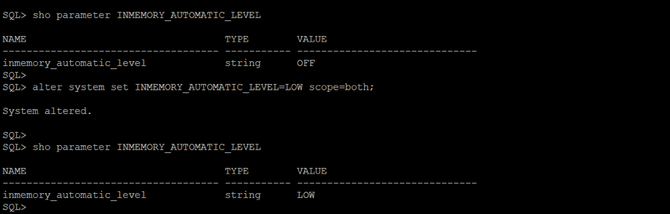
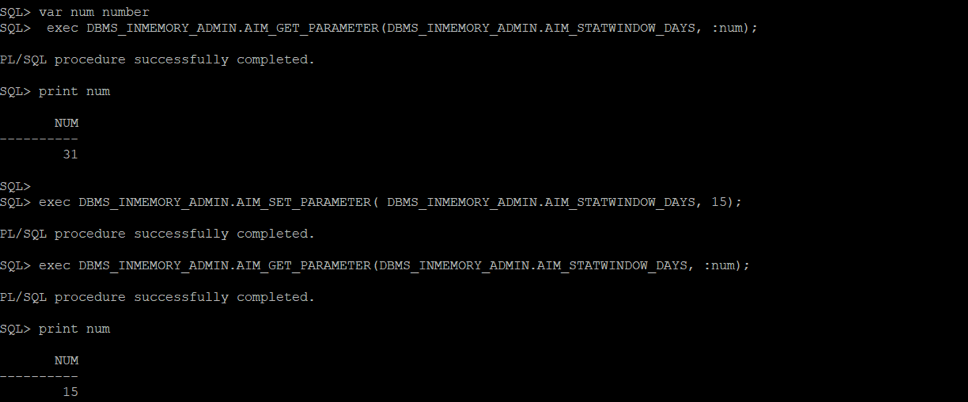
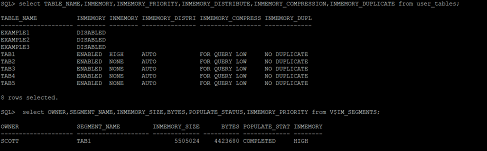
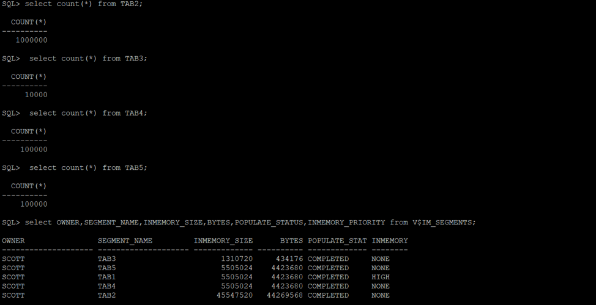
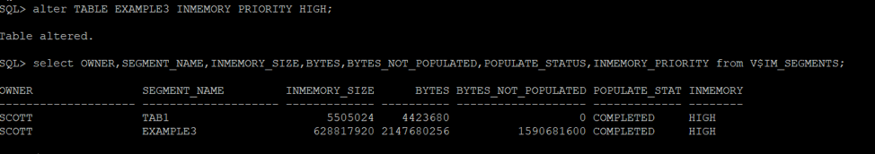
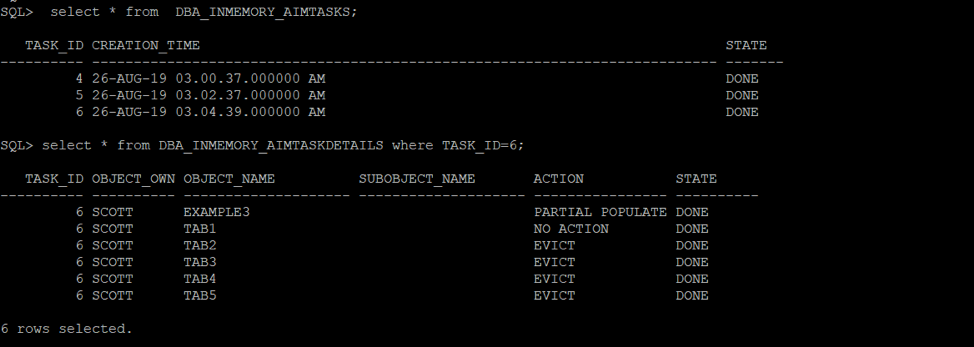

This blog discusses how to configure Oracle&reg; Automatic In-Memory (AIM) to
manage objects in the In-Memory (IM) Column Store.

<!--more-->

### Introduction

The IM column store feature allows you to populate segments in a columnar format.
Unlike a buffer cache, IM column store populates the complete segment into memory.
Automatic Data Optimization (ADO) and AIM manage the objects in the IM column
store.

Oracle introduced AIM in Oracle Database version 18c, and it uses access
tracking, column statistics, and other relevant statistics to manage objects in
the IM column store. AIM ensures that active segments always remain populated
by automatically evicting cold (infrequently accessed) segments.

An in-memory segment is only eligible for eviction if the **INMEMORY** priority
is `NONE`, and AIM evicts an in-memory segment when the IM column store space is
exhausted. The database uses the internal statistics of populated segments to
define the set of objects to evict. If any ADO policy is enabled to prevent
in-memory segment eviction, then the ADO policy overrides AIM and prevents
eviction.

### Enable AIM

The system-level initialization parameter, **INMEMORY\_AUTOMATIC\_LEVEL**, enables
AIM and has the following values:

-	**OFF** (default): Disables AIM.
-	**LOW**: The cold segments get evicted from the IM column in case of memory
   pressure.
-	**MEDIUM**: This level ensures that any hot segment that was not populated
   because of memory pressure is populated first.

The following image shows the **INMEMORY\_AUTOMATIC\_LEVEL** parameter and how
to modify its value:

### Set the time interval for AIM

Use the **DBMS\_INMEMORY\_ADMIN** package to set the time interval for the usage
statistics that AIM checks. The default value is 31 days. You can change this
setting as shown in the following example:

### Understand how AIM works

You can query the dynamic performance (V$) view, **V$IM_SEGMENTS**, to list
currently populated segments in an IM column store and check the tables with
the `INMEMORY ENABLED` status for a schema. In the following example, you can
see segment **TAB1** already shows in the populated segments lists because its
priority is set to `HIGH`.

Now, you can populate other tables with `INMEMORY ENABLED`. Tables are populated
in an IM column store after you access the tables, as shown in the following
example:

Next, you can try to populate one more table, **EXAMPLE3**, with `HIGH` priority
to give it preference over segments with priority of `NONE`. Querying
**V$IM_SEGMENTS** reveals that tables with a priority of `NONE` do not show up.
This is because the IM column store is under memory pressure. You can see
**EXAMPLE3** is partially populated, and **BYTES\_NOT\_POPULATED** is not `0`.
That is why AIM evicted the other cold segments (or segments having priority of
`NONE`). Also note that if a segment is partially populated, queries accessing
those objects in the IM column store run fine&mdash;they get the remaining data
that they do not find in the IM column store from the database.

You can query **DBA\_INMEMORY\_AIMTASKS** to see the status of all the tasks
created by AIM. **DBA\_INMEMORY\_AIMTASKDETAILS** lists all the details of
actions taken by AIM on segments present in the IM column store. In the
following image, you can see that no action has been taken on **TAB1** because
its priority is `HIGH` and as explained earlier while populating table **EXAMPLE3**,
the IM column store was under memory pressure so AIM evicted the other segments.

### Conclusion

Though AIM is a helpful feature to automate objects in IM column store, it has
restrictions because it can only be enabled on databases hosted on cloud-based
systems and engineered systems. Databases hosted on other system types, such as
premise systems, generate an error when you attempt to enable AIM.

Use the Feedback tab to make any comments or ask questions.

### Optimize your environment with expert administration, management, and configuration

[Rackspace's Application services](https://www.rackspace.com/application-management/managed-services)
**(RAS)** experts provide the following [professional](https://www.rackspace.com/application-management/professional-services)
and
[managed services](https://www.rackspace.com/application-management/managed-services) across
a broad portfolio of applications:

- [eCommerce and Digital Experience platforms](https://www.rackspace.com/ecommerce-digital-experience)
- [Enterprise Resource Planning (ERP)](https://www.rackspace.com/erp)
- [Business Intelligence](https://www.rackspace.com/business-intelligence)
- [Salesforce Customer Relationship Management (CRM)](https://www.rackspace.com/salesforce-managed-services)
- [Databases](https://www.rackspace.com/dba-services)
- [Email Hosting and Productivity](https://www.rackspace.com/email-hosting)

We deliver:

- **Unbiased expertise**: We simplify and guide your modernization journey,
focusing on the capabilities that deliver immediate value.
- **Fanatical Experience**&trade;: We combine a Process first. Technology second.&reg;
approach with dedicated technical support to provide comprehensive solutions.
- **Unrivaled portfolio**: We apply extensive cloud experience to help you
choose and deploy the right technology on the right cloud.
- **Agile delivery**: We meet you where you are in your journey and align
our success with yours.

[Chat now](https://www.rackspace.com/#chat) to get started.
