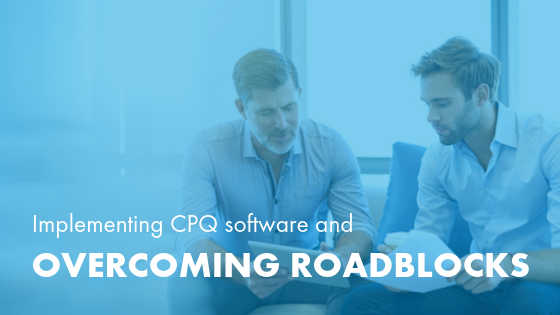

Your company’s sales team is growing, and your books are in the black. While
this is good news, with significant growth also comes increased
complexity&mdash;if your Configure, Price, Quote (CPQ) process isn’t growing
with you, your pain points soon become evident.

<!--more-->

Manually configuring quotes for individual clients leaves your sales team at a
disadvantage and causes burn out. It can be difficult, or even impossible, to
scale your process for quotes without the help of automated software.

Thankfully, CPQ solutions like Salesforce CPQ & Billing are designed specifically
for this purpose.

Salesforce CPQ streamlines your processes and expedites your quote-to-cash
cycle&mdash;which is the time between when a customer requests a quote from your
company and when they make a payment. CPQ software allows you to integrate with
other internal systems, so the customer always receives the most comprehensive,
accurate quote.

While this software can make your salespeople's jobs much easier, implementing
a new technology solution can be intimidating if you do not have a plan. As a
Salesforce Gold Consulting Partner, we have helped implement the use of CPQ
software at many businesses. We are familiar with the common roadblocks and how
to tackle them.

Following are six tips for overcoming some of the most common CPQ implementation
challenges.

### Using bad data

**The problem:** The data in your CPQ system must be current, accurate, and
verifiable. Otherwise, the proposals you provide to customers could include
inflated prices or inaccurate delivery times. This situation is true for manual
proposals as well as automated CPQ processes.

Imagine that you are running an end-of-the-year product promotion. Without
updating your CPQ solution to consider the new prices, your sales team might
inadvertently deliver proposals to customers that do not include the promised
savings.

**The fix:** When you set up your CPQ software, establish a clear process for
maintaining accurate data, and hold data owners responsible for keeping their
information updated. You might decide product managers should update product
details each time a new generation is released and that the marketing or sales
team is responsible for updating promotional pricing.

###  Integration woes

**The problem:** If you fail to integrate your CPQ solution with other essential
software, you risk using incomplete or non-current data in these different
systems. Doing so can create many problems, including customers receiving
misleading contracts, or inaccurate customer data communicated to stakeholders.

**The fix:** When implementing your CPQ software, consider how your different
data systems communicate with each other. Your CPQ system needs to integrate
with your Customer Relationship Management (CRM) system. It might also need to
communicate with your product data management, contract management, or other
important systems.

Choose a CPQ solution that offers either custom or out-of-the box integration.
If you are working with an implementation partner, at the start of your project,
outline all the important platforms that your CPQ system should communicate with.
It can be expensive and time-consuming to try to fix a data integration
problem&mdash;set yourself up for success at the start.

### Taking on too much at once

**The problem:** Big changes to your CPQ process can overwhelm your team. Moving
from spreadsheets or manual templates to integrated CPQ software changes the
day-to-day workflow. Users might have trouble transitioning, resulting in user
mistakes or overall resistance to the software. Moving too quickly might end up
being a costly mistake that affects the long-term adoption of the product.

**The fix:** Consider using the Crawl-Walk-Run approach to roll out your new CPQ
practices across multiple releases. Much like a business might change its website
functionality over several months, you can roll out the functionality of your
new CPQ software in sections. Start with the tools that are easy to use and that
benefit the most employees. Introducing these tools first helps spread positive
feedback among your team and encourages optimism about the upcoming changes.

### Not fully taking advantage of the benefits of your software

**The problem:** You might be hindering your team and leaving revenue on the
table if your CPQ system makes it challenging to customize a quote with an
additional service or product, or does not provide reminders about current
promotions and new product lines. Some businesses fail to take advantage of the
benefits of their CPQ solution&mdash;including reminders to your team about new
products or promotions.

Without reminders, you might have to adjust pricing later on because your sales
team forgot to include an applicable promotion. This situation can frustrate
your customer&mdash;or worse, drive them away.

**The fix:**  A good automated CPQ system can appropriately remind users of all
available, relevant add-ons. This reminder helps ensure that customers are being
offered useful products and services, as well as provides a more consistent
customer experience.

### Not expecting and preparing for human error

**The problem:** The standard CPQ process can introduce a myriad of human errors.
A salesperson can forget to include necessary shipping or delivery costs, or
they might omit a product that the installation team needs. It is not realistic
to expect that your sales team never makes a mistake.

**The fix:** Everyone is responsible for mitigating errors. First,
[train your entire team on a rolling basis](https://www.business.com/articles/empower-your-team-technology-top-to-bottom/)&mdash;your
sales team should understand how your products relate to one another. Next, set
up your CPQ solution to alert users when they omit critical information. Finally,
institute a review process for necessary situations and prioritize who to alert
when a mistake is made. Note that manual or complex reviews can slow down your
quoting process, so minimize the number of reviewers.

### Losing the human element of communication

**The problem:** Customers used to dealing directly with a salesperson might
miss having the opportunity to get clarification or pose specific questions.
While automating the proposal process means it takes less time, sometimes it can
seem colder to the customer.

Similarly, discussions between departments while developing a quote might
decrease after implementing a CPQ solution. Without conscious effort, this
scenario might cause teams
[to become siloed](https://martechseries.com/mts-insights/guest-authors/dont-let-data-silos-downfall/)
and ultimately cut off communication and data sharing.

**The fix:** Encourage your sales team to follow up with customers after the
delivery of each proposal. The goal is for your customers to always be able to
access their sales representative as needed and still experience the human side
of your business. Every proposal should include ways to contact your brand. To
foster internal communication, implement strategies and feedback loops for
different teams to check in regularly with each other about new accounts,
promotional campaigns, and more.

### Work with a CPQ partner for a seamless implementation

Are you looking for a way to streamline your CPQ process? As your business grows
and sales increase, you need the ability to produce proposals more quickly and
make your quote-to-cash process more consistent. CPQ software revolutionizes
your quoting process, as long as you anticipate common CPQ implementation
challenges and build strategies ahead of time to address them.

As a Salesforce Platinum Consulting Partner and digital agency, Rackspace helps
you implement your new CPQ solution and customize it to your business needs for
accuracy, speed, and scalability. The best CPQ solutions are those that
prioritize customer needs, efficiency, and transparency. Contact us today for a
free consultation.

<a class="cta teal" id="cta" href="https://www.rackspace.com/salesforce">Learn more about Salesforce Customer Relationship Management (CRM)</a>

Visit [www.rackspace.com](https://www.rackspace.com) and click **Sales Chat**
to get started.

Use the Feedback tab to make any comments or ask questions.
