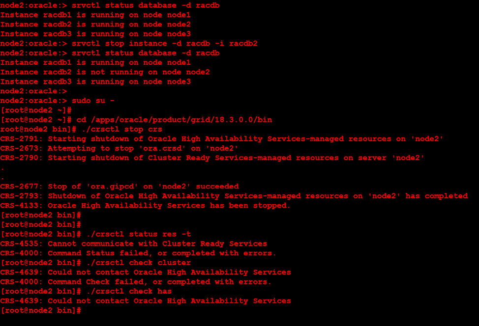
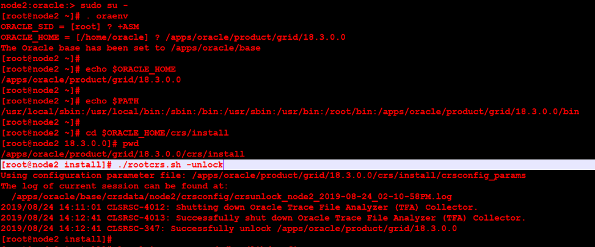
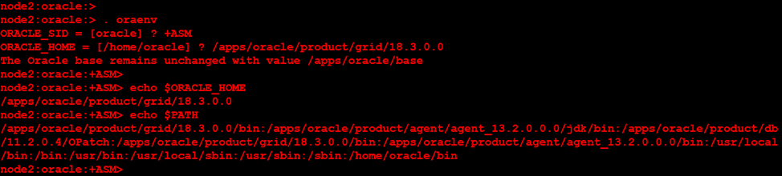
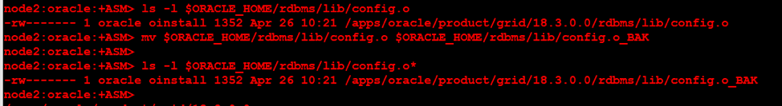
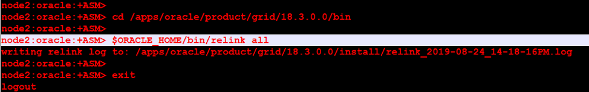
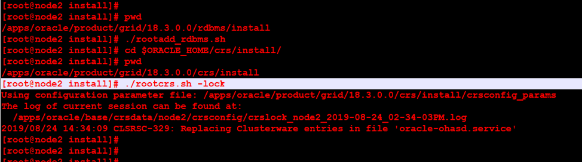
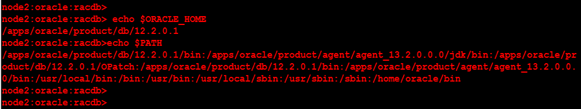
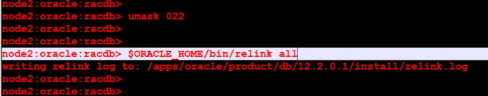

This blog provides insight about what relinking is, why it is required, and how you
relink Oracle&reg; object files.

<!--more-->

### Introduction

For any language, you need the predefined functions, which are defined inside
the library files for that language and are required to compile the code to
create a binary format file (object file). The object files are then linked
together with operating system (OS) libraries to create a single executable
file. For linking the files, the process needs to find all the function definitions
before it can generate an executable from the components.

### What does it mean to relink Oracle Home binaries?

Oracle software is shipped in the form of object and archive files and then
grouped in a compressed Java&reg; Archive (jar) format. The object files are
then relinked at the operating system (OS) level during installation to create
usable executables. This relinking guarantees reliable integration with the
functions provided by the OS system libraries. During relinking, the current
executables are renamed and saved, while the new executables are generated.
After the new executables are in place and you verify that the new executables
work, you can delete the old executables in the directory **ORACLE_HOME/bin**. Each
old executable has an 'O' appended to its file name. For example, **exp.exe** is
renamed to **expO.exe**.

The following directories in Oracle Home contain various object and archive
files:

-	**/lib**
-	**/usr/lib**
-	**$ORACLE_HOME/lib**
-	**$ORACLE_HOME/rdbms/lib**
-	**$ORACLE_HOME/\<product\>/lib**

The **sysliblist** file, found in **$ORACLE_HOME/rdbms/lib** or **$ORACLE_HOME/lib**,
contains a list of other libraries, which you need to include.

### Why is Oracle Home relinking required?

Oracle Home relinking must occur to link Oracle-provided object files to the OS
system library.

Relinking occurs automatically under the following circumstances:

-	The Oracle Universal Installer (OUI) installed an Oracle database.
-	The OUI applied an Oracle database patchset.
-	The `OPatch` utility applied an Oracle database patch.

You can also perform relinking manually.

### When is manual relinking required?

You need to perform manual relinking in the following circumstances:

-	After an OS upgrade or downgrade.
-	After an OS patch.
-	If there are missing library files in RDBMS home.
-	If you need to reset the Oracle Home binaries permission.

### Steps to manually relink Oracle object files

Before starting the relink operation, you need to stop all the services that
run from the **$ORACLE_HOME** directory. Shut down all the databases,
listeners, Oracle Automatic Storage (ASM) instances, and cluster services.

#### Root access required

Use root access to run the following command to unlock **GRID_HOME**:

    # cd GRID_HOME/crs/install
    # rootcrs.sh -unlock

#### Oracle Grid Infrastructure cluster owner access required

Use the Oracle Grid Infrastructure cluster owner access to perform the
following steps:

Verify that the environment variables **$ORACLE_HOME** and **$PATH** are set properly.

Take a backup of **$ORACLE_HOME/rdbms/lib/config.o** before executing the
relink command.

Execute the following commands to relink **GRID_HOME**:

    $ export ORACLE_HOME=Grid_home
    $ Grid_home/bin/relink all

Review the relink log file for any errors.

#### Root access required

Use root access to run the following commands to lock the **GRID-HOME** binaries:

    # cd Grid_home/rdbms/install/
    # ./rootadd_rdbms.sh
    # cd Grid_home/crs/install
    # rootcrs.sh -lock

### Relink Oracle database binaries

Make sure the environment variables **$ORACLE_HOME** and **$PATH** are set properly.

Before proceeding with relink command, set **umask** to `022`.

Review the relink log file for any errors.

The `relink all` command resets the permissions of **extjob**, **jssu**,
**oradism**, and **externaljob.ora**.

You also need to execute the following commands, as root, to change permissions
for the specified binaries:

    chown root $ORACLE_HOME/bin/oradism
    chmod 4750 $ORACLE_HOME/bin/oradism
    chown root $ORACLE_HOME/bin/extjob
    chmod 4750 $ORACLE_HOME/bin/extjob
    chown root $ORACLE_HOME/rdbms/admin/externaljob.ora
    chmod 640  $ORACLE_HOME/rdbms/admin/externaljob.ora
    chown root $ORACLE_HOME/bin/jssu
    chmod 4750 $ORACLE_HOME/bin/jssu
    chown root $ORACLE_HOME/bin/nmb
    chmod 4710 $ORACLE_HOME/bin/nmb
    chown root $ORACLE_HOME/bin/nmhs
    chmod 4710 $ORACLE_HOME/bin/nmhs
    chown root $ORACLE_HOME/bin/nmo
    chmod 4710 $ORACLE_HOME/bin/nmo

Start all clusters, database services, and verify that everything is working
properly.

### Conclusion

The relink process uses the combined expertise of the database administrator,
system administrator, operating system programmer, and software programmer, and it ensures
that the Oracle software works properly after you've done major changes to the
servers at OS level.

Use the Feedback tab to make any comments or ask questions.

### Optimize your environment with expert administration, management, and configuration

[Rackspace's Application services](https://www.rackspace.com/application-management/managed-services)
**(RAS)** experts provide the following [professional](https://www.rackspace.com/application-management/professional-services)
and
[managed services](https://www.rackspace.com/application-management/managed-services) across
a broad portfolio of applications:

- [eCommerce and Digital Experience platforms](https://www.rackspace.com/ecommerce-digital-experience)
- [Enterprise Resource Planning (ERP)](https://www.rackspace.com/erp)
- [Business Intelligence](https://www.rackspace.com/business-intelligence)
- [Salesforce Customer Relationship Management (CRM)](https://www.rackspace.com/salesforce-managed-services)
- [Databases](https://www.rackspace.com/dba-services)
- [Email Hosting and Productivity](https://www.rackspace.com/email-hosting)

We deliver:

- **Unbiased expertise**: We simplify and guide your modernization journey,
focusing on the capabilities that deliver immediate value.
- **Fanatical Experience**&trade;: We combine a Process first. Technology second.&reg;
approach with dedicated technical support to provide comprehensive solutions.
- **Unrivaled portfolio**: We apply extensive cloud experience to help you
choose and deploy the right technology on the right cloud.
- **Agile delivery**: We meet you where you are in your journey and align
our success with yours.

[Chat now](https://www.rackspace.com/#chat) to get started.
