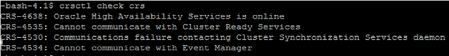

This blog explores a scenario where you've lost an Oracle&reg; Cluster Registry
(OCR) and voting disk, and the voting disk has no backup. Though a tricky
situation, you can restore it from the last automatic backup of the OCR.

<!--more-->

### Introduction

The voting disk is a file that manages information about node membership, and
the OCR is a file that manages the cluster and Real Application Clusters (RAC)
database configuration information. The Oracle Clusterware installation process
creates the voting disk and the OCR on a shared storage volume.

A cluster node member should always access half of the voting disk to avoid node
eviction from the cluster group. The voting disk plays a key role by ensuring
that all nodes mark their availability. The Cluster Synchronization Services
daemon (CSSd) performs all the operations for the voting disk in Clusterware.

The OCR serves as the central repository for Cluster Ready Services
(CRS)&mdash;storing the metadata, configuration, and state information for all
cluster resources defined in Clusterware. The OCR always retains the latest three
backup copies of the OCR, which are four hours old, one day old, and one week old.

### What is stored in OCR?

-	Node membership information, including which nodes are part of the cluster
-	Software current active version
-	Location of the voting disk
-	Server pools
-	Status of the cluster resources such as RAC databases, listeners, instances,
   and other Oracle component services

### What is stored in the voting disk?

The voting disk contains both static and dynamic data.

-	Static data: Keeps the information about all the nodes in a cluster.
-	Dynamic data: Keeps the information about the disk heartbeat mechanism.

The voting disk also maintains the details about the cluster nodes membership,
such as which node is currently the part of the cluster, or which node is
joining or leaving the cluster.

### Where is the voting disk stored?

The voting disk is a shared disk that is accessed by all the member nodes in
the cluster during an operation. You should store the voting disks on shared
accessible storage like Oracle Automatic Storage Management (ASM) or a certified
cluster file system.

### Environment details

The sample scenario for this blog uses the following environment:

-  **Oracle Version**: Release 11.2.0.4.0
-  **OS**: Sun OS 5.11 11.2
-  **Cluster**: RAC (2 nodes)

### The error

Let's fix the following error:

    cssd(3980)]CRS-1714:Unable to discover any voting files,
    retrying discovery in 15 seconds; Details at (:CSSNM00070:)
    in /oracle/11.2.0/grid/log/testdb01/cssd/ocssd.log

We need to access the OCR and voting disk to bring up the cluster. However,
because these resources are not accessible, the cluster remains down.

### Restore the voting disk

Use the following steps to restore the voting disk from the OCR backup.

#### Step 1: Disable the CRS automatic start service

Run the following command to disable the automatic restart:

    root@testdb01:/oracle/11.2.0/grid/bin# ./crsctl disable crs

#### Step 2: Restart the node

Run the following command to restart the node:

    root@testdb01:/oracle/11.2.0/grid/bin# init 6

#### Step 3: Verify that the CSR service did not start

After reboot, the CSR service should not be running because you disabled it in
Step 2. Run the following command to check if the CRS service started:

    root@testdb01:/oracle/11.2.0/grid/bin# ./crsct check crs

#### Step 4: Clear the header of the voting disk

Before creating the disk group, run the following command to clear the header
of the current failed voting disk so that you can reuse it:

    root@testdb01:/dev/rdsk# dd if=/dev/zero
    of=/dev/rdsk/c0t60002AC0000000000000001900008265d0s0 bs=1024k count=1000

#### Step 5: Start the cluster

Run the following command to start the cluster in exclusive mode:

    root@testdb01:/oracle/11.2.0/grid/bin# ./crsctl start crs -excl

#### Step 6: Start the ASM with a PFILE

Run the following command to start the ASM with a PFILE:

    root@testdb01:/oracle/11.2.0/grid/bin# su - grid
    -bash-4.1$sqlplus / as sysasm
    startup pfile='location of pfile';
    ASM instance started
    Total System Global Area 1136082944 bytes
    Fixed Size 2189048 bytes
    Variable Size 1108728072 bytes
    ASM Cache 25165824 bytes
    ORA-15032: not all alterations performed
    ORA-15017: diskgroup "OCRDATA" cannot be mounted
    ORA-15063: ASM discovered an insufficient number of disks for diskgroup
    "OCRDATA"

#### Step 7: Create a disk group

Run the following command to create a disk group:

    SQL> create diskgroup OCRDATA external redundancy disk
    '/dev/rdsk/c0t60002AC0000000000000001900008265d0s0' attribute 'COMPATIBLE.ASM'='11.2';
    Diskgroup created

#### Step 8: Create a SPFILE and restart the ASM

Run the following commands to create a SPFILE from the PFILE of ASM and to
restart the ASM to read the SPFILE from the voting disk:

    SQL> create spfile='+OCRDATA' from pfile='/home/grid/initASM1.ora';
    File created.
    SQL> shutdown
    ASM diskgroups volume disabled
    ASM diskgroups dismounted
    ASM instance shutdown
    SQL> startup
    ASM instance started
    Total System Global Area 1136082944 bytes
    Fixed Size 2189048 bytes
    Variable Size 1108728072 bytes
    ASM Cache 25165824 bytes
    ASM diskgroups mounted
    ASM diskgroups volume enabled
    SQL> exit

#### Step 9: Restore the current OCR backup

Run the following command to restore the OCR backup:

    root@testdb01:/oracle/11.2.0/grid/bin# ./ocrconfig -restore
    /oracle/11.2.0/grid/cdata/testdb01-kl/day.ocr ------(Last Auto Backup of OCR from default location)

#### Step 10: Replace the voting disk

Run the following command to replace the voting disk:

    root@testdb01:/oracle/11.2.0/grid/bin# ./crsctl replace votedisk +OCRDATA
    Successful addition of voting disk b1e7c2fbeb754f82bf09a991b2cf4441.
    Successfully replaced voting disk group with +OCRDATA.
    CRS-4266: Voting file(s) successfully replaced
    root@testdb01:/oracle/11.2.0/grid/bin#

#### Step 11: Enable the CRS automatic start service

Run the following commands to enable the CRS automatic start service and
verify that all the cluster services are online:

    root@testdb01:/oracle/11.2.0/grid/bin# ./crsctl enable crs
    CRS-4622: Oracle High Availability Services autostart is enabled.
    root@testdb01:/oracle/11.2.0/grid/bin# ./crsctl start cluster
    root@testdb01:/oracle/11.2.0/grid/bin# ./crsctl check crs
    root@testdb01:/oracle/11.2.0/grid/bin# ./crsctl stop crs -f
    root@testdb01:/oracle/11.2.0/grid/bin# ./crsctl start crs

#### Step 12: Cross-check the OCR disk status

Run the following command to cross-check the OCR disk status:

    root@testdb01:/oracle/11.2.0/grid/bin# ./ocrcheck
    Status of Oracle Cluster Registry is as follows :
    Version : 3
    Total space (kbytes) : 262120
    Used space (kbytes) : 2816
    Available space (kbytes) : 259304
    ID : 1103197739
    Device/File Name : +OCRDATA
    Device/File integrity check succeeded
    Device/File not configured
    Device/File not configured
    Device/File not configured
    Device/File not configured
    Cluster registry integrity check succeeded
    Logical corruption check succeeded

#### Step 13: Check the voting disk details

Run the following command to verify the voting disk:

    root@testdb01:/oracle/11.2.0/grid/bin# ./crsctl query css votedisk
    ## STATE File Universal Id File Name Disk group
    -- ----- ----------------- --------- ---------
    1. ONLINE b1e7c2fbeb754f82bf09a991b2cf4441
    (/dev/rdsk/c0t60002AC0000000000000001900008265d0s0) [OCRDATA]
    Located 1 voting disk(s).

#### Step 14: Check the CRS service status

Run the following command to verify that the CRS service is running:

    root@testdb01:/oracle/11.2.0/grid/bin# ./crs_stat –t
    root@testdb01:/oracle/11.2.0/grid/bin# ./crs_stat -t
    Name Type Target State Host
    ------------------------------------------------------------
    ora....VE.dg ora....up.type ONLINE ONLINE testdb01...db01
    ora....XK.dg ora....up.type ONLINE ONLINE testdb01...db01
    ora....XK.dg ora....up.type ONLINE ONLINE testdb01...db01
    ora....ER.lsnr ora....er.type ONLINE ONLINE testdb01...db01
    ora....N1.lsnr ora....er.type ONLINE ONLINE testdb01...db01
    ora....TA.dg ora....up.type ONLINE ONLINE testdb01...db01
    ora.REDO.dg ora....up.type ONLINE ONLINE testdb01...db01
    ora.asm ora.asm.type ONLINE ONLINE testdb01...db01
    ora.cvu ora.cvu.type ONLINE ONLINE testdb01...db01
    ora.gsd ora.gsd.type OFFLINE OFFLINE
    ora....network ora....rk.type ONLINE ONLINE testdb01...db01
    ora.oc4j ora.oc4j.type ONLINE ONLINE testdb01...db01
    ora.ons ora.ons.type ONLINE ONLINE testdb01...db01
    ora....ry.acfs ora....fs.type ONLINE ONLINE testdb01...db01
    ora.scan1.vip ora....ip.type ONLINE ONLINE testdb01...db01
    ora....SM1.asm application ONLINE ONLINE testdb01...db01
    ora....01.lsnr application ONLINE ONLINE testdb01...db01
    ora....b01.gsd application OFFLINE OFFLINE
    ora....b01.ons application ONLINE ONLINE testdb01...db01
    ora....b01.vip ora....t1.type ONLINE ONLINE testdb01...db01
    ora....b02.vip ora....t1.type ONLINE ONLINE testdb01...db01

#### Step 15: Check the ASM disk groups

Run the following commands to check the ASM disk groups:

    root@testdb01:/oracle/11.2.0/grid/bin# su - grid
    Oracle Corporation SunOS 5.11 11.2 March 2015
    -bash-4.1$ asmcmd
    ASMCMD> lsdg
    State Type Rebal Sector Block AU Total_MB Free_MB Req_mir_free_MB Usable_file_MB
    Offline_disks Voting_files Name
    MOUNTED EXTERN N 512 4096 1048576 1023991 1023549 0 1023549 0
    N ARCHIVE/
    MOUNTED EXTERN N 512 4096 1048576 1023991 1023881 0 1023881 0
    N INDEX1/
    MOUNTED EXTERN N 512 4096 1048576 51191 50795 0 50795 0
    Y OCRDATA/
    MOUNTED EXTERN N 512 4096 1048576 1023991 818013 0 818013 0
    N ORADATA1/
    MOUNTED EXTERN N 512 4096 1048576 511991 479085 0 479085 0
    N REDO/

### Conclusion

The steps in this blog show you how to fix a failed voting disk in any RAC
environment. By using these steps, you can overcome the voting disk missing
backup issue by recovering a backup from the OCR. If the disk recovery succeeds,
you can reuse it.

Remember that you must enable OCR automatic backup for this solution to work. OCR
always stores the backup at the default location or the location you specified.

Use the Feedback tab to make any comments or ask questions.

### Optimize your environment with expert administration, management, and configuration

[Rackspace's Application services](https://www.rackspace.com/application-management/managed-services)
**(RAS)** experts provide the following [professional](https://www.rackspace.com/application-management/professional-services)
and
[managed services](https://www.rackspace.com/application-management/managed-services) across
a broad portfolio of applications:

- [eCommerce and Digital Experience platforms](https://www.rackspace.com/ecommerce-digital-experience)
- [Enterprise Resource Planning (ERP)](https://www.rackspace.com/erp)
- [Business Intelligence](https://www.rackspace.com/business-intelligence)
- [Salesforce Customer Relationship Management (CRM)](https://www.rackspace.com/salesforce-managed-services)
- [Databases](https://www.rackspace.com/dba-services)
- [Email Hosting and Productivity](https://www.rackspace.com/email-hosting)

We deliver:

- **Unbiased expertise**: We simplify and guide your modernization journey,
focusing on the capabilities that deliver immediate value.
- **Fanatical Experience**&trade;: We combine a Process first. Technology second.&reg;
approach with dedicated technical support to provide comprehensive solutions.
- **Unrivaled portfolio**: We apply extensive cloud experience to help you
choose and deploy the right technology on the right cloud.
- **Agile delivery**: We meet you where you are in your journey and align
our success with yours.

[Chat now](https://www.rackspace.com/#chat) to get started.
