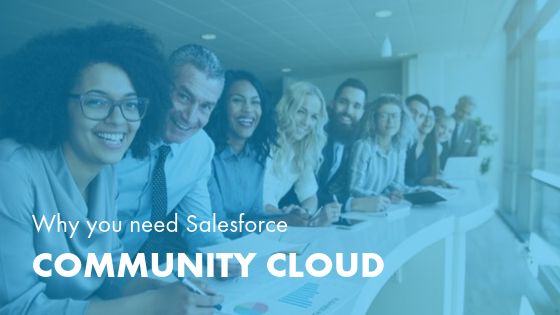

Salesforce&reg; Community Cloud offers a centralized platform for loyal customers,
happy employees, and engaged partners. Community Cloud is a Salesforce
application that allows your organization to create online forums (communities)
where members can communicate with each other and with the organization.

<!--more-->

Successful businesses rely on loyal customers, happy employees, and engaged
partners. Loyal customers increase sales, satisfied employees ensure the business
runs well, and interactive partners&mdash;like distributors and sister companies,
solidify a healthy professional network.

We asked Megan Truett, our Community-Certified Project Manager, who is also very
experienced with Community Cloud, to explain how businesses can use this platform
to cater to these three different communities.

Megan says, “While they are all very similar, each of the three versions Salesforce
offers in its ecosystem does very different things. Salesforce Community Cloud
is excellent in comparison to other platforms with its ability to customize the
information sent out to various audiences. It does an awesome job of tailoring
the message and the information that companies want to siphon out to their groups,
whether that’s employees, customers, or partners.”

Megan has more than 12 years of experience in online community building, client
engagement, and social strategy. She knows just how beneficial Community Cloud
can be. Here are five reasons why Community Cloud is a must-have for today’s
modern business.

### It excels at providing personalized customer care

According to Salesforce’s “State of the Connected Customer” report,
[80% of customers](https://www.marketingweek.com/how-customer-experience-impacts-the-bottom-line/)
say that the experience a company provides is as important as its products and
services. This is not a new development. A 2006 study by
[McKinsey Global Institute](https://www.mckinsey.com/business-functions/organization/our-insights/the-moment-of-truth-in-customer-service)
reported that after a negative experience with a brand, more than 70% of customers
reduced their commitment to that brand (in many cases decreasing the amount
spent with the brand or switching brands entirely). The customer journey is
directed by how the customer feels they are being treated.

Customer communities can make your consumers feel connected, heard, and
appreciated. Megan emphasizes that “Community Cloud does a really great job of
connecting people, in ways that are not necessarily tangible, and manages to
keep customers engaged by helping them to find information they need&mdash;letting
them ask questions and discuss things that are important to them." Businesses
with this kind of personalized customer engagement are positioned to thrive.

For example, [Farmers Insurance](https://www.salesforce.com/customer-success-stories/farmers-insurance/#)
leverages Community Cloud for their online Customer Self-Service (CSS) community.
Policyholders can sign-in to this online portal, easily find information, and
connect directly with an agent to get assistance. This provides customers with
a more personalized experience and makes it easier for agents to assist them.

Megan explains that "the number one question companies need to ask themselves is
what are my customers going to get out of this community that they’re not going
to get anywhere else? They need to feel like they can participate in it, that
they belong in it and that it’s their own.”

Today’s customers expect more than long-winded phone calls and automated
recordings. [They want to be able to express concerns](https://www.adweek.com/brand-marketing/why-brands-must-quickly-shift-from-communication-with-consumers-to-conversation/),
talk about their likes and dislikes, and make suggestions to the organization.
A customer community makes this possible by providing a digital space that
promotes authentic feedback. That is how relationships are built between the
organization and the consumer&mdash;and that is how consumers become loyal to a
brand.

### It encourages brand loyalty in an oversaturated market

In addition to stellar customer care, successful businesses have found another
way to maintain their customers’ loyalty. In a world where
[63% of shoppers do not feel like retailers know them](https://www.salesforce.com/blog/2017/05/14-retail-customer-experience-stats.html),
Community Cloud can help organizations increase brand loyalty. By allowing the
company to know its consumers intimately, Community Cloud helps to better
personalize the customer experience.

“A customer community is great for knowing who your customer is and being able
to see trends about them,” Megan divulges. “This is where customers go to and
become brand loyal to you and your products and services because they can connect
with other people who also enjoy the product. So it’s this wonderful circular
connection.” This circular connection works the same as word-of-mouth. One
satisfied customer interacts with another, which improves the brand’s reputation
and increases customer loyalty.

Megan says, "These brand enthusiasts are crucial to both community and a company’s
success ... People who are not your company employees and don’t have a monetary
reason to be there in your community (but are there) are key people to success.
They keep people excited about your product and service, which gives you insider
information. They’re your enthusiasts.”

### It fosters connection in a work-from-home culture

Community Cloud can also set up an employee community, which enhances the
relationship between your business and your employees. “Being able to help people
connect, especially for companies that are remote or have remote employees, is
one of the greatest features of an employee community,” Megan explains. With
more companies embracing a work-from-home culture, nurturing virtual connections
in the workplace is more important than ever.

Setting clear expectations and having a communication playbook are
[essential to the success](https://www.inc.com/amanda-pressner-kreuser/the-most-successful-remote-teams-do-these-5-things.html)
of remote companies and their employees. Implementing an employee community
through Community Cloud addresses both of these concerns. Megan explains how
well Community Cloud’s customizable platform works for both small and large
organizations, “You’ll be amazed at how you ever ran your business without it.”

“An employee community isn’t a place to waste time. Although it’s social, it’s
not social media. It’s much more powerful and business-driven than that. It’s a
premier way to get business information to people in a timely fashion and
efficient manner,” which is the goal of every successful business — especially
as the work-from-home culture continues to grow.

### It grows with your company

Salesforce Community Cloud has the capacity to evolve with your company. “The
community itself is always growing, it’s always evolving, it’s living. It’s never
like you put it up once and you’re done. You’re always improving it, responding
to it, and allowing it to evolve with and for the organization.”

Companies can find themselves stuck with software products that are no longer
useful because they’ve outgrown them or developed beyond the technology’s capacity.
Salesforce Community Cloud can grow along with your company. Because of its
customizable nature, the platform can not only grow with your company, it can
also change its data to match this growth. “Community Cloud can follow the
strategic vision of your company if you allow it to.” Megan says, “Let the
platform respond appropriately to your company’s growth and development.”

### It enhances your professional network

A partner community is an external forum where you can share insider information
with relevant stakeholders. It is a hybrid between an employee and a customer
community focused on keeping your business partners engaged to nurture your
organization’s professional network.

Consider your partners' interests and needs when planning a successful partner
community. Megan advises, “Whether it’s an employee, customer, or partner
community, definitely work with people to find out what they can get in your
community that they can’t get anywhere else.”

For instance, you may use your partner community to share detailed and accessible
reports, providing the information and insights business partners want. Community
Cloud lives within your Salesforce organization, which allows you to use
Salesforce to create accurate, detailed, and easy-to-access reports. “For as
long as I’ve been working in the community world, I haven’t seen any reports on
the other platforms I’ve used come close to Salesforce’s reporting. The
Salesforce platform takes data and turns it into great dashboards.”

[Effective business partnerships](https://www.inc.com/amanda-pressner-kreuser/the-most-successful-remote-teams-do-these-5-things.html) require detailed agreements, clear expectations, and provide mutual benefits. Not only is a partner community a wonderful place to discuss agreements and expectations, but the reporting capabilities Megan describes give you an easy way to reiterate the benefits for all partners involved. Providing your partners with relevant information via dashboards and reports help to maintain a healthy level of communication, so they feel engaged as well as informed.

### Rackspace partners with you to boost your communities

As business process consultants and Salesforce implementation experts, it is our
job to help your organization operate as smoothly as possible. While we recognize
that every business has unique processes, we know that all modern companies need
three things to survive: loyal and consistent customers, passionate and connected
employees, and satisfied and engaged partners.

Salesforce Community Cloud is a platform that can aid in stimulating and promoting
all three types of relationships. We are here to partner with you to implement
Community Cloud and set up your communities. Reach out to our expert team today.
Megan and the rest of our Salesforce certified experts are ready to help your
business thrive.

<a class="cta purple" id="cta" href="https://www.rackspace.com/salesforce">Learn more about Salesforce Customer Relationship Management (CRM)</a>

Visit [www.rackspace.com](https://www.rackspace.com) and click **Sales Chat**
to get started.

Use the Feedback tab to make any comments or ask questions.