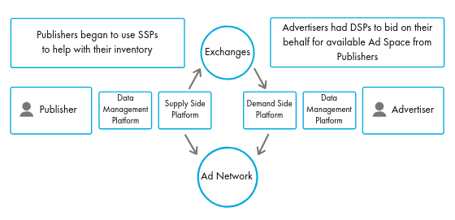

Digital advertising is officially bigger than
[traditional advertising](https://www.vox.com/2019/2/20/18232433/digital-advertising-facebook-google-growth-tv-print-emarketer-2019).
This fact means if digital advertising has not already started consuming a
larger share of your ad spend, it soon will. This also means having technology
that effectively pulls in and analyzes your customer data from digital platforms
is essential to your advertising success.

<!--more-->

Enter [Data management platforms](https://www.salesforce.com/blog/2017/05/what-is-a-dmp.html) (DMPs).

[DMPs like Salesforce&reg; Audience Studio (formerly Salesforce DMP)](https://salesforce.vidyard.com/watch/cwaPkdMeYSXEXP9oLF4X5r)
are the backbone of data-driven marketing efforts. A DMP collects, organizes,
and activates first, second, and third-party audience data from any
source&mdash;online, offline, mobile, and beyond. These platforms allow your
company to gain unique insights into your customers, as well as effectively
segment and reach your audience.

As the director of our Salesforce Marketing Cloud Center of Excellence at
Rackspace, I help clients install and learn to use tools like Audience Studio
every day. This blog introduces Audience Studio and explains how you can use it
to maximize your digital advertising efforts.

### How Salesforce Audience Studio works

[Salesforce Audience Studio](https://www.salesforce.com/products/marketing-cloud/data-management/)
is a powerful Marketing Cloud feature. It is a customer data marketplace that
can only be accessed by other platform users. You can also pair Audience Studio
with [Data Studio](https://www.salesforce.com/products/marketing-cloud/data-sharing/),
which gives you the chance to sell data and purchase look-alike audiences.

Audience Studio helps companies offer customers more valuable advertising and
media experiences. It is a cloud-based data platform that operates in real time,
unifying customer data from all screens and sources into a single view of the
individual. This single view allows you to analyze the data, better understand
unique customer preferences, and then activate the data across any delivery
channel.

To understand the opportunity and security of using data through Audience Studio,
keep the following things in mind:

- **Your company does not have to sell its data.** You can also choose the data
  you are willing to share.
- **Data in the marketplace is anonymized.** First-party data with details like
  customer names cannot be sold or purchased&mdash;only second and third-party
  layers are available to be shared.
- **It is a closed marketplace.** Only Salesforce Audience Studio customers can
  purchase data.

Audience Studio incorporates both a supply-side platform (SSP) to help with ad
inventory and a demand-side platform (DSP) that helps marketers maximize the
efficiency of their ads. The diagram below shows how the SSP and DSP come
together to fuel the ad exchange process.

Audience Studio can increase the effectiveness of your media spend by ensuring
your ads are served to the consumers who are most likely to convert&mdash;but
only if you have a plan for using this powerful tool.

### How you can make the most of Salesforce Audience Studio

Audience Studio is especially effective for [Business-to-Consumer (B2C) companies in the retail industry](https://www.salesforce.com/video/1758211/), but it can also be beneficial to companies in many other industries.

Audience Studio is available to companies with a large enough ad spend to get a
valuable return on investment. If you meet the minimum ad spend, you can start
taking advantage of this powerful tool as a way to make more impact with your
advertising dollars.

There are a number of things that you should have in place before using Audience
Studio. Here are a few of my top recommendations.

#### 1. A media plan

It is critical to develop a media plan before working with Audience Studio. This
tool provides so much data that it can be easy to get lost if you are not
employing a thoughtful approach. A media plan provides a strong foundation for
your Audience Studio strategy. It provides a budget, timeframe, and goals to guide
your efforts.

If you need help getting started, check out our blog for resources on creating
strategies to boost your social posts, target your audience, supplement your
blog efforts, and more.

#### 2. A skilled team with a Data Architect

Audience Studio can be very technical, so it is important that you have a data
architect or data scientist on your team. A data professional can help you
accurately interpret and identify the data that makes a difference to your digital
advertising efforts. If you do not have an in-house data professional, you might
want to consider outsourcing this role to a contractor or partner that can help
you set your business up for success.

#### 3. A full-service implementation partner

Salesforce Audience Studio employs both the creative and technical sides of
marketing. It uses technology and hard data to support your advertising decisions,
and also requires knowledge of marketing concepts&mdash;like understanding the
customer and their buyer’s journey&mdash;to create an effective strategy. Given
the complexity of this platform, it is best to work with a full-service
implementation partner.

### Rackspace understands the art and science of marketing

As a full-service Salesforce Platinum Consulting Partner, Rackspace brings
together technology implementation, data analysis, and digital marketing strategy.
We can show you how to combine data modeling with marketing tools like buyer
personas to direct your ad dollars toward the most impactful channels.

Our expert technology team can help your business implement Marketing Cloud with
Salesforce Audience Studio. Our "Process first. Technology second.&reg;" approach
ensures we implement the best solution for you. Our digital marketing team offers
you ongoing support to refine your digital strategy and ensure your marketing
efforts align with your data-driven insights.

Contact our team of technology and marketing experts to get started with Salesforce Audience Studio today.

<a class="cta blue" id="cta" href="https://www.rackspace.com/salesforce">Learn more about Salesforce Customer Relationship Management (CRM)</a>

Visit [www.rackspace.com](https://www.rackspace.com) and click **Sales Chat**
to get started.

Use the Feedback tab to make any comments or ask questions.