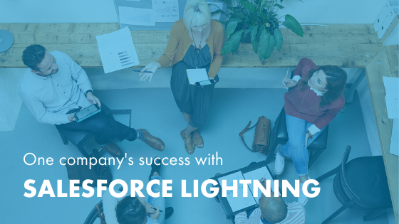

We know that change is never easy. If your company has been using
Salesforce&reg; Classic for some time, you might be nervous about switching to
the new-and-improved Lightning. Even if you have heard about all
[the benefits of converting](https://developer.rackspace.com/blog/five-benefits-of-moving-to-salesforce-lightning/)
(access to new functionality, increased productivity, and much more), you might
still be on the fence.

<!--more-->

At Rackspace, we specialize in helping our clients succeed with the right
technology solutions. We have helped many businesses make the change from Classic
to Lightning. We understand your trepidation, and this process indeed takes
planning and conscious effort to be successful&mdash;but that is what we are
here to help you with.

We recently worked with [The Stow Company](https://www.thestowcompany.com) to help
them fully prepare for their Lightning conversion. We ensured that they avoided
any interruptions to the level of service they provide to their customers. The
Stow Company was extremely satisfied with their experience working with Rackspace,
both during and after their Lightning implementation.

Now that they have fully transitioned to the platform, we asked The Stow Company
to share their story with you to illustrate what you can expect during your own
conversion.

### Why Lightning, and why now?

**Note:** You should prepare to activate Lightning for your organization within
3 days of January 7, 2020.

The Stow Company knew the clock was ticking for their Classic to Lightning
conversion. They first learned about Lightning from their Salesforce representatives,
and then again at Dreamforce in 2018. When the team attended Connections 2019
in Chicago, they could not help but notice the number of sessions that discussed
transitioning from Classic to Lightning.

After Connections, the team decided to be proactive and get ahead of the deadline.
“We wanted to execute well, without our hands held to the fire,” explains Mike
Wolf, Director of Marketing at The Stow Company.

The company’s first order of business was running the Lightning Readiness Report
in Salesforce. Mike admits that reviewing the results was a pivotal moment for
the team. They had no idea how to interpret what they saw and quickly realized
they needed help from someone who could read this new language. They also
acknowledged they did not have the internal bandwidth to handle the transition
project by themselves.

“We knew we needed some external expertise to help us better understand the
impact on our specific configuration. We needed the expertise of those who knew
what the conversion process would be like,” Mike remembers. Through the initial
discovery process, Rackspace was able to help The Stow Company fully understand
what to expect throughout the transition. Rackspace eased their concerns and
enabled them to create a solid game plan for moving forward.

### Preparing for the change with end-user training

The Stow Company began training their end-users to prepare for the upcoming
change. Mike initially introduced Lightning to his teams through instructor-led
sessions several months in advance of the switch to give users a preview of what
was coming. Later, Rackspace engineers were able to completely take over the
training and workflow walkthroughs to prepare users for Lightning.

The Stow Company also identified a test group of internal users who could not
only walk through the transition process with their teammates, but would advocate
within the company to encourage user adoption.

Mike feels strongly that the most important element of a technology conversion
is ensuring that your users are equipped with what they need to be effective
when the system goes live. The Stow Company’s biggest concern was that users’
workflows would not be interrupted when Lightning went live. They wanted to
ensure that that customers would still receive the same responsive service that
they were accustomed to. While this took some extra time and preparation on the
front-end, the team knew it was worth it to answer everyone’s questions and make
sure all users were on the same page before launch.

### Life after Lightning

All of the time spent preparing and in training sessions ultimately paid off.
The Stow Company was able to successfully transition to Lightning with no
interruption to customer service or normal business operations, and they are
very happy with the results. There were minor speedbumps related to third-party
integrations that needed to be adjusted, but these were handled smoothly and
efficiently. Overall, the project went as expected.

Today, end-users at The Stow Company enjoy a cleaner UI, as well as increased
functionality with reporting and opportunity features that were not available
in Classic. Switching to Lightning has established a foundation on which the
company can build and explore the new, rich features within their Salesforce
platform.

### Benefits of working with an implementation partner

Working with an expert consulting partner means you know exactly what to expect
as you begin a project and throughout the phases of the work. “We’re now working
with Rackspace on a couple of other projects. You do a really nice job of
detailing all of the major elements of the project&mdash;what needs to be done,
how long each task takes, who needs to be involved, and what dependencies exist,”
Mike notes.

While knowing what to expect is obviously important, the benefits of working
with Rackspace on your conversion project extend far beyond that. Mike says,
“We truly leaned on Rackspace to do everything. The Rackspace team helped read
the Lightning readiness report, scope the project, build the transition plan,
execute the plan in our sandbox environment, train our users, deploy the
launch&mdash; everything. It was a tremendous help. They did all the heavy
lifting on their end, and we just had to be there to help facilitate
conversations and make key decisions.”

Ready to learn more about what it takes to convert from Classic to Lightning?
Check out our [assessment here](https://www.rackspace.com/resources/salesforce-lightning-conversion-assessment)
and contact us to start a conversation today.

<a class="cta blue" id="cta" href="https://www.rackspace.com/salesforce">Learn more about Salesforce Customer Relationship Management (CRM)</a>

Visit [www.rackspace.com](https://www.rackspace.com) and click **Sales Chat**
to get started.

Use the Feedback tab to make any comments or ask questions.
