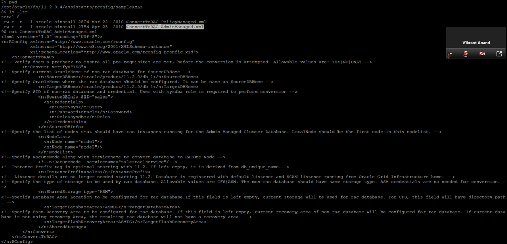
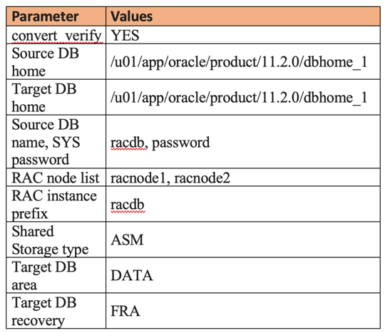

Have you ever wondered how to convert a standalone database to an Oracle&reg;
Real Application Clusters (RAC) database?

<!--more-->

### Introduction

You can use `rconfig`, a non-interactive command-line utility, to convert a
single-instance database to a RAC database. The
utility reads the values provided under the **ConvertToRAC.xml** file.

The **$ORACLE_HOME/assistants/rconfig/sampleXMLs** directory has two templates,
**ConvertToRAC\_AdminManaged.xml** and **ConvertToRAC\_PolicyManaged.xml**,
which you can use to convert a single-instance database to RAC admin or
policy-managed database, respectively. This blog explores the  admin-managed RAC
conversion, although the same approach applies to a policy-managed
database.

The following image shows a sample **ConvertToRAC_AdminManaged.xml** file:

### Prerequisites for using rconfig

Before you use `rconfig`, consider the following prerequisites:

-	Use Oracle Database version 10g R2 or later.
-	Configure Clusterware and have it running on all the nodes.
-	Install Oracle RAC RDBMS on all the nodes.
-	Make sure that shared storage, either Oracle Cluster File System or Automatic
   Storage Management (ASM), is available and accessible from all the nodes.
-	Verify that the standalone database and RAC are the same database version.
-	You need an active ASM instance across the nodes and the database running on
   one of the local nodes.

### Steps for conversion to RAC

Use the following steps to convert your standalone database to RAC.

#### Step 1:  Set the parameters

You need to set the following parameters in **ConvertToRAC_AdminManaged.xml**:

The `convert verify` option in **ConvertToRAC.xml** has three options:

-	**Convert verify="YES"**: `rconfig` performs prerequisite checks followed by
   RAC conversion.
-	**Convert verify="NO"**: `rconfig` performs RAC conversion without the
   prerequisite checks.
-	**Convert verify="ONLY"**: `rconfig` performs only the prerequisite checks and
   takes no other action.

#### Step 2: Perform the prerequisite checks

Run the following command to run the `convert_verify="ONLY”` option to fix any
errors:

    $ cd $ORACLE_HOME/assistants/rconfig/sampleXMLs
    $ $ORACLE_HOME/bin/rconfig ConvertToRAC_racdb.xml

Example:

    [oracle@racnode1 sampleXMLs]$ rconfig ConvertToRAC_racdb.xml
    <?xml version="1.0" ?>
    <RConfig version="1.1" >
      <ConvertToRAC>
        <Convert>
          <Response>
            <Result code="0" >
              Operation Succeeded
            </Result>
          </Response>
          <ReturnValue type="object">
            There is no return value for this step
          </ReturnValue>
        </Convert>
      </ConvertToRAC>
    </RConfig>

#### Step 3: Execute rconfig for RAC conversion

When you run the following commands to execute `rconfig` to convert the
database, make sure you update the parameter to `convert_verify="YES"`.
`rconfig` performs the conversion and the verification.

    $ cd $ORACLE_HOME/assistants/rconfig/sampleXMLs
    $ $ORACLE_HOME/bin/rconfig ConvertToRAC_racdb.xml

Run the following command to monitor alerts in the `rconfig` log on the
standalone database and the new RAC database:

    $ tail -f /ora/app/oracle/cfgtoollogs/rconfig/rconfig*.log

Example:

    [oracle@racnode1 sampleXMLs]$ rconfig ConvertToRAC_racdb.xml
    Converting Database "SOATEMP" to Cluster Database.
    Target Oracle Home: /u01/app/oracle/product/11.2.0/dbhome_1. Database Role: PRIMARY.
    Setting Data Files and Control Files
    Adding Database Instances
    Adding Redo Logs
    Enabling threads for all Database Instances
    Setting TEMP tablespace
    Adding UNDO tablespaces
    Adding Trace files
    Setting Fast Recovery Area
    Updating Oratab
    Creating Password file(s)
    Configuring Listeners
    Configuring related CRS resources
    Starting Cluster Database
    <?xml version="1.0" ?>
    <RConfig version="1.1" >
      <ConvertToRAC>
        <Convert>
          <Response>
            <Result code="0" >
              Operation Succeeded
            </Result>
          </Response>
          <ReturnValue type="object">
            <Oracle_Home>
              /u01/app/oracle/product/11.2.0/dbhome_1
            </Oracle_Home>
            <Database type="ADMIN_MANAGED"  >
              <InstanceList>
                <Instance SID="RACDB1" Node="racnode1"  >
                </Instance>
                <Instance SID="RACDB2" Node="racnode2"  >
                </Instance>
              </InstanceList>
            </Database>
          </ReturnValue>
        </Convert>
      </ConvertToRAC>
    </RConfig>

#### Step 4: Verify the conversion

Run the following commands to verify the log, check the RAC database status,
and check the datafile status.

**Note:** If the standalone database was non-ASM, it is now ASM.

    $ srvctl status database -d racdb
    Check by login to sqlplus
    SQLPLUS> select * from gv$instance;
    SQLPLUS> select file_name from dba_data_files;

#### Step 5: Modify tnsentry

Modify `tnsentry` on the local node with `scan-name` and copy it to all other
nodes.

### Conclusion

`rconfig` performs automated RAC conversions and saves the time and effort of
the multiple manual configuration steps. It also takes an `RMAN` backup in case
a non-ASM to ASM conversion is required, which might increase the downtime for
large databases. You can tune this by allocating multiple I/O channels for the
backup. If the standalone and target RAC database are on ASM, you can use
`rconfig` as a quick solution for the RAC conversion.

Use the Feedback tab to make any comments or ask questions.

### Optimize your environment with expert administration, management, and configuration

[Rackspace's Application services](https://www.rackspace.com/application-management/managed-services)
**(RAS)** experts provide the following [professional](https://www.rackspace.com/application-management/professional-services)
and
[managed services](https://www.rackspace.com/application-management/managed-services) across
a broad portfolio of applications:

- [eCommerce and Digital Experience platforms](https://www.rackspace.com/ecommerce-digital-experience)
- [Enterprise Resource Planning (ERP)](https://www.rackspace.com/erp)
- [Business Intelligence](https://www.rackspace.com/business-intelligence)
- [Salesforce Customer Relationship Management (CRM)](https://www.rackspace.com/salesforce-managed-services)
- [Databases](https://www.rackspace.com/dba-services)
- [Email Hosting and Productivity](https://www.rackspace.com/email-hosting)

We deliver:

- **Unbiased expertise**: We simplify and guide your modernization journey,
focusing on the capabilities that deliver immediate value.
- **Fanatical Experience**&trade;: We combine a Process first. Technology second.&reg;
approach with dedicated technical support to provide comprehensive solutions.
- **Unrivaled portfolio**: We apply extensive cloud experience to help you
choose and deploy the right technology on the right cloud.
- **Agile delivery**: We meet you where you are in your journey and align
our success with yours.

[Chat now](https://www.rackspace.com/#chat) to get started.
