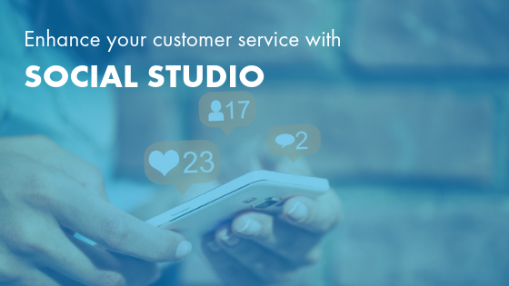
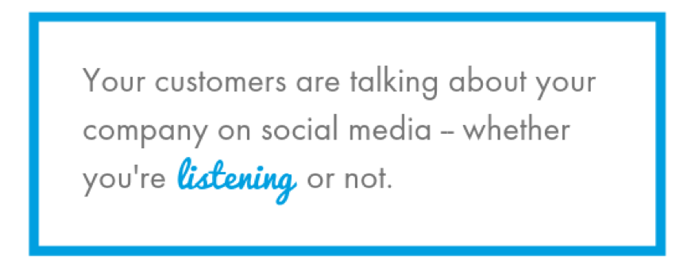
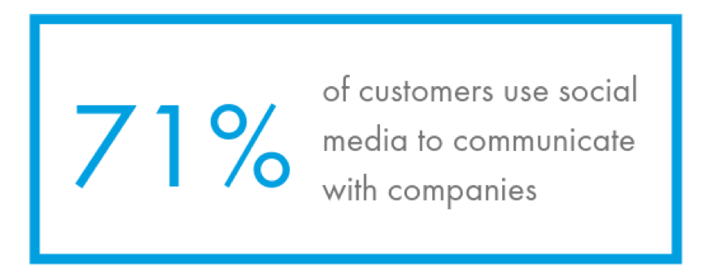
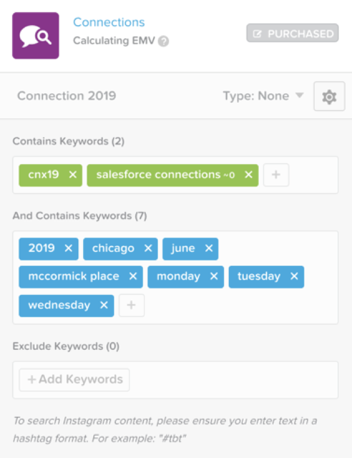

Your customers are probably using social media, which means they are talking
about your company and your products or services&mdash;whether you are listening
or not.

If you are not listening to your customers, you are missing out on potential
conversations, brand mentions, and relationship-building opportunities. What’s
more, if your company is not using social media, you might actually be
disappointing your customers.
[According to one study](https://www.adweek.com/digital/trust-in-social-media-platforms-is-eroding-and-brands-have-a-lot-to-lose/),
60% of people believe social media is the best place for companies to provide
customer service.

<!--more-->

Salesforce’s [Social Studio](https://www.salesforce.com/products/service-cloud/features/social-customer-service/)
lets you join your customers in conversation. Rackspace has helped companies
use Social Studio to manage customer service across social media channels. This
robust tool helps you to delight customers at every step on the path from lead
to loyalty, while also gathering valuable social data.

The key to succeeding with Social Studio is to establish a process, understand
the capabilities of the tool, and respect your customers’ data.

This blog discusses some best practices&mdash;and some mistakes to
avoid&mdash;when using Social Studio to improve your customer service.

### Which teams can use Social Studio?

Social Studio is a leading social listening tool that monitors customer posts
on channels like Twitter, Facebook, Instagram, and more. It makes it easy to
create and manage support cases.

This process can involve multiple teams at your company&mdash;marketing, customer
service, and even IT, might all have a part to play. For instance, you might
use Social Studio to filter messages and inquiries based on topic, and then
prioritize and assign them to different teams based on who is best suited to
respond. Social Studio can also help you identify potential new leads from
incoming requests or questions, which enables you to bring sales or marketing
team members into the conversation earlier.

If multiple departments are using Social Studio, we recommend placing a
centralized team in charge of overseeing the strategy and establishing how your
company uses social media. Within Social Studio, you can set up multiple social
media workspaces that are specific to the needs of each team. This enables
different teams to tweet, post, or snap without tripping over each other.

While you can and should use Social Studio across different teams to benefit
the entire company, the benefits of this solution might be most apparent in your
customer service department. Salesforce’s
[State of the Connected Customer report](https://www.salesforce.com/form/conf/state-of-the-connected-customer-2nd-edition/)
revealed that 71% of customers use social media to communicate with companies,
and 34% rated social media as a preferred channel for communication. If you are
not serving your customers across the right social media channels, you are likely
to be left in the dust.

### Use Social Studio to improve your customer service

Social Studio makes it easy for your customer service team to stay on top of
social listening. You can set up keywords and classifiers that help you flag your
customer service team when they need to resolve an issue. Keywords are used to
frame the conversation you want to follow. They are used to establish context
and need to be refreshed over time as their relevancy evolves. You can organize
keywords into groups, which can be used to direct posts to different teams and
quickly get your customers the information they need. For example, questions
about a sale can be routed to your sales team, while your customer service team
can be flagged when customers are having a problem with a product.

Selecting the right keywords for effective complaint monitoring takes a lot of
trial and error&mdash;it is not a set-it-and-forget-it feature. Try testing
keyword groups and combinations. It is important to monitor your social media
accounts regularly and adjust your keywords as needed. Doing so helps your
customer service team monitor complaints more effectively and deliver exceptional
service on social media.

Social Studio also enables you to set topic profiles. You can categorize
conversations by brand, competitor, and industry to provide more specific data
on your customers’ needs. It is even sophisticated enough to apply context to
the conversations, so your customer service team is not notified every time a
company or product with a similar name is mentioned.

### Common mistakes to avoid

Companies sometimes get excited about using social media and then make simple
mistakes that they could easily avoid with a little forethought. Be aware of the
following common mistakes as you use Social Studio to interact with your consumers
on social media.

#### Making it a one-sided conversation

Often, companies use social media to [highlight their products and services](https://www.huffpost.com/entry/4-ways-you-are-sabotaging-your-business-on-social-media_b_596550e0e4b0911162fc2fa9) without listening to anyone else. Would you hang out with a person who never stops talking and does not listen to you? Neither will your customers. Think two-way communication.

#### Neglecting privacy

Do not ask for an email address or [other personal information publicly](https://www.theverge.com/2018/7/19/17591732/british-airways-gdpr-compliance-twitter-personal-data-security). Take conversations to direct messages or other, more private forms of communication. This respects your customers’ privacy while also making it easier for you to track the conversation.

Failing to handle your customers’ cases in a respectful, honest, and secure way
can seriously damage your relationship with them.
[One recent study](https://www.fastcompany.com/40456895/hey-brands-heres-why-people-call-you-out-on-social-media)
found that the two most common reasons customers call out brands on social media
are dishonesty (60%) and bad customer service (59%).

Protecting the privacy of your customers’ information goes beyond respect and
reputation&mdash;it is also the law. You can face hefty fines if you do not
handle customer data carefully.

#### Forgetting to set expectations

Tell your customers when you are monitoring your social media accounts. If you
don't monitor all the time, give your customers an alternative path to open a
customer service ticket, like a phone number or a link to your website. Salesforce
states that [42% of customers](https://www.salesforce.com/blog/2017/03/respond-social-media-complaints.html)
expect a response on social media within one hour. If you cannot meet this
response rate, set clear expectations with your customers to avoid frustration.

#### Failing to define a process for social customer service

You can avoid most mistakes by having a defined process for your social customer
service. Do not start using Social Studio and expect your customer service team
to magically know what to do&mdash;establish clear procedures for them to follow.
What is the first step to take when a customer makes a complaint? What is the
process for taking a customer conversation from a social media platform to a more
private channel? What should an employee do when they need to escalate a customer
case?

These are just a few of the situations you should address with a clearly
documented process. This helps employees understand how to navigate Social Studio
properly and how to represent your brand best when communicating with consumers.
Remember, if you do not have a defined process, then you cannot fix it when it
breaks.

#### General Data Protection Regulation (GDPR) and data privacy

Providing exceptional customer service means respecting your customers’ data.
Has anyone who lives in Europe or is a citizen of the European Union (EU)
interacted with your company online? Then the
[General Data Protection Regulation (GDPR) applies to you](https://fortune.com/2018/05/24/the-gdpr-is-in-effect-should-u-s-companies-be-afraid/).

GDPR is a law that regulates data privacy for everyone within the EU and the
European Economic Area (EEA). It also addresses the export of personal data
outside the EU and EEA. This means if you communicate with consumers who are
citizens of the EU, you must comply with GDPR&mdash;no matter where your company
is located.

Local data privacy laws also apply to your company. To make sure you comply with
all laws and regulations, you should always:

- Explain to your customers what data you are asking for and why.
- Require double opt-in for your email subscribers.
- Create and maintain an up-to-date privacy policy and make it accessible to
  your consumers.
- Stay on top of applicable laws as you collect and manage customer
  data&mdash;speak to the legal team at your company if you are ever in doubt
  about customer data laws.

Setting up a process as you start using Social Studio can ensure you comply with
data privacy laws, while also offering high-quality social customer service that
satisfies your customers.

### Great customer service is social

At Rackspace, we not only implement and customize Social Studio for your business,
but we can also help you create and streamline your process for using this tool
and other Salesforce tools successfully. Our team of Marketing Cloud experts
partners with you to understand your business’ social media needs, how you
currently use social media to engage with your audience, and your goals for your
ongoing social media presence. This enables us to implement and optimize Social
Studio with the right features and toolsets for your unique business needs.

Our services don’t just stop at implementation&mdash;our Digital Agency team is
here to help you make the most of tools like Social Studio and improve engagement
across your social media channels. With Rackspace, you get a team of digital
marketing and social media experts. We help you understand your target market,
which social channels they frequent, and what types of communication work best
to foster engagement with your brand.

By using our *Process First. Technology Second.*&reg; approach, we ensure that
your company has effective and efficient processes in place to get the best
results from your technology solution. Contact us today to learn more about
Social Studio and how we can help you improve the customer experience for your
business.

<a class="cta teal" id="cta" href="https://www.rackspace.com/salesforce">Learn more about Salesforce Customer Relationship Management (CRM)</a>

Visit [www.rackspace.com](https://www.rackspace.com) and click **Sales Chat**
to get started.

Use the Feedback tab to make any comments or ask questions.
