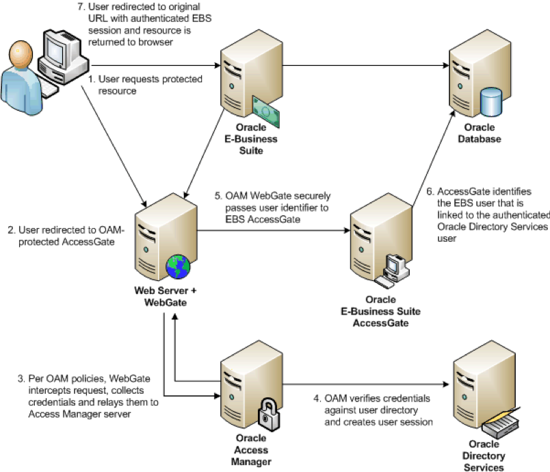
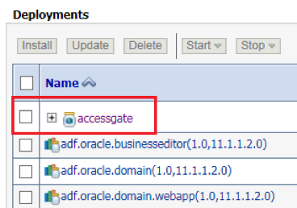

This blog shows how you can integrate Oracle&reg; Access Manager (OAM) 11g with
Oracle E-Business Suite (EBS) by using the WebGate agent.

<!--more-->

If you are upgrading from Oracle Single Sign-On Server version 10gR3, you can
integrate OAM with EBS by using the `mod_osso` agent, but we don't cover that
in this blog.

### Overview of authentication with WebGate

WebGate is a component of OAM that intercepts HTTP requests and redirects them
to the OAM server to determine how to access the resources and
authenticates the current user when required. If OAM is already
deployed in the environment, you can configure an existing WebGate for this
purpose.

The following image shows the integration of WebGate and EBS AccessGate:

*Image source:* [https://docs.oracle.com/cd/E26401_01/doc.122/e22952/T156458T580814.htm](https://docs.oracle.com/cd/E26401_01/doc.122/e22952/T156458T580814.htm)

When an unauthenticated user attempts to access a protected EBS resource, the
user is directed to the EBS AccessGate application, which is a Java Enterprise
Edition (EE) application responsible for mapping a single sign-on (SSO) user to an
EBS user and creating the EBS session for that user. AccessGate is deployed to a
WebLogic Server instance and is separate from EBS.

The OAM server protects EBS AccessGate and reroutes the authentication request
to a separate HTTP Server with WebGate installed.

After a user is initially authenticated by OAM, EBS AccessGate picks up the
request for a resource and the credentials returned by the OAM server.

If the OAM server credentials are valid, WebGate connects to the EBS database
to link the Oracle Directory Services user to an EBS user. If EBS fails to
identify a linked user in the Oracle Directory Services, it redirects the user
to the linking page to allow the user to map his or her unlinked Oracle Directory
Services user account to the correct EBS username. After this mapping completes,
if the session is still valid, WEbGate returns EBS resources directly to the user.

The following sections cover the steps to set up OAM SSO in EBS version 12.2.5
after cloning.

### Part 1: Set up OAM SSO in EBS

#### 1.1	Shutdown all apps services

Source the run file system ENV:

    $ .. EBSapps.env run

Run the following command to shutdown all the services in all nodes and start
only Adminserver in the primary node:

    $ ./adadminsrvctl.sh start - Only Admin server

#### 1.2	Deregister OID from EBS

Source the run file system ENV:

    $ .. EBSapps.env run

Run the following command to deregister the OID:

    $FND_TOP/bin/txkrun.pl  \
    -script=SetSSOReg  \
    -deregisteroid=yes \
    -appspass=<apps_password> \
    -ldaphost=<oid_server> \
    -ldapport=13060 \
    -oidadminuserpass="<OID_Admin_password>"

#### 1.3	Remove SSO Reference from EBS

Source the run file system ENV and execute the following command:

    $FND_TOP/bin/txkrun.pl -script=SetSSOReg -removereferences=yes

Enter APPS password:

    sqlplus -s apps/<appspasswd>  @$FND_TOP/patch/115/sql/fndssouu.sql %

#### 1.4	Delete Managed Server

Log in to the Weblogic console. Check the following managed servers to see if
they are configured:

- oaea\_server1
- oaea\_server2

If they are configured, remove them by using the following commands:

    $ .. EBSapps.env run

On application EBS node 1:

    perl $AD_TOP/patch/115/bin/adProvisionEBS.pl  ebs-delete-managedserver \
    -contextfile=$CONTEXT_FILE -managedsrvname=oaea_server1 \
    -servicetype=oaea -logfile=/usr/tmp/delMS_server.log

On application EBS node 1, (External Node): If the external node does exist, run
the following command:

    perl $AD_TOP/patch/115/bin/adProvisionEBS.pl  ebs-delete-managedserver \
    -contextfile=$CONTEXT_FILE -managedsrvname=oaea_server2 \
    -servicetype=oaea -logfile=/usr/tmp/delMS_server.log

**Note:** Log in to the Weblogic console and make sure no oaea_servers are
present. If any are, delete them by using the preceding command and continue.

#### 1.5	Delete the Data source, OAEADatasource

Log in to the Weblogic console and delete the data source and AccessGate
deployments.

From the console, select **Lock & Edit** -> **Home** -> **Data Sources** ->
**OAEADatasource (Delete)**->**Activate Changes**.

Step 1.4 removed the AccessGate deployments. If any remain, remove them manually.

#### 1.6	Sync up the context file and update the configuration on all nodes

Log in to each node, source the run file system, and then execute the following command:

    perl $AD_TOP/bin/adSyncContext.pl contextfile=$CONTEXT_FILE

#### 1.7	Delete the managed server PATCH file system

Source the patch file system ENV. Log in to the Weblogic console and check the
following managed servers:

- oaea\_server1
- oaea\_server2

If the servers are configured, remove them by using the following command:

    $ .. EBSapps.env patch

Start the PATCH Admin server:

    $ADMIN_SCRIPTS_HOME/adadminsrvctl.sh start forcepatchfs

On application EBS node 1:

    perl $AD_TOP/patch/115/bin/adProvisionEBS.pl  ebs-delete-managedserver \
    -contextfile=$CONTEXT_FILE -managedsrvname=oaea_server1 \
    -servicetype=oaea -logfile=/usr/tmp/delMS_server.log

On application EBS node 1, (External Node): If external node exists, run the
following command:

    perl $AD_TOP/patch/115/bin/adProvisionEBS.pl  ebs-delete-managedserver \
    -contextfile=$CONTEXT_FILE -managedsrvname=oaea_server2 \
    -servicetype=oaea -logfile=/usr/tmp/delMS_server.log

**Note:** Log in to the Weblogic console and make sure no oaea_servers are
present. If any are, delete them by using the preceding command and continue.

#### 1.8	Delete the Data source "OAEADatasource" – PATCH File System

Log in to the PATCH Weblogic console and delete the database source and
AccessGate deployments.

From the console, select **Lock & Edit** -> **Home** -> **Data Sources** ->
**OAEADatasource (Delete)**->**Activate Changes**.

Step 1.4 removed the AccessGate deployments. If any remain, remove them manually.

#### 1.9	Upload the Patch file system context file to the database

Run the following commands:

    $ .. EBSapps.env patch
    $ $ADJVAPRG oracle.apps.ad.autoconfig.oam.CtxSynchronizer action=upload
    contextfile=<full path to patch context file> logfile=/tmp/patchctxupload.log

#### 1.10	Shutdown the admin server in the PATCH file system

Source the PATCH file system ENV and shutdown the admin server:

    $ADMIN_SCRIPTS_HOME/adadminsrvctl.sh stop forcepatchfs

### Part 2:	Integrate EBS with OAM and enable SSO

#### 2.1	Configure oaea_server Managed Server

Source the run ENV file and execute the following command in the respective node:

    $ .. EBSapps.env run

On application EBS node 1 – run:

    $ perl $AD_TOP/patch/115/bin/adProvisionEBS.pl ebs-create-oaea_resources \
    -contextfile=$CONTEXT_FILE \
    -deployApps=accessgate \
    -SSOServerURL=https://xxxxxxxxx.com:8131 \
    -OAMLogoutURL=https://xxxxxxxx.com/oam/server/logout?end_url=https://xxxxxx.com/oamwebsso/logout-success.jsp \
    -managedsrvname=oaea_server1 \
    -managedsrvport=6888 \
    -logfile=/usr/tmp/deployaccessgate1_Time1.log

Enter the APPS and WebLogic password for input.

Use port 6888 for the managed server. Check the log for any error and make sure
the log ends with the following command for all managed servers:

    “Shutdown the managed server oaea_server1 successfully”

On application EBS node 2 – run (External Node):

    $ perl $AD_TOP/patch/115/bin/adProvisionEBS.pl ebs-create-oaea_resources \
    -contextfile=$CONTEXT_FILE \
    -deployApps=accessgate \
    -SSOServerURL=https://xxxxxxxxx.com:8131 \
    - OAMLogoutURL=https://xxxxxxxx.com/oam/server/logout?end_url=https://xxxxxx.com/oamwebsso/logout-success.jsp \
    -managedsrvname=oaea_server2 \
    -managedsrvport=6888 \
    -logfile=/usr/tmp/deployaccessgate1_Time1.log

#### 2.2	Add the AccessGate information to the OHS server

On application EBS nodes 1 and 2, run the following commands:

    $ perl $FND_TOP/patch/115/bin/txkSetAppsConf.pl -contextfile=$CONTEXT_FILE
    -configoption=addMS -accessgate=<ebs-node1.com>:6888

    $ perl $FND_TOP/patch/115/bin/txkSetAppsConf.pl -contextfile=$CONTEXT_FILE
    -configoption=removeMS  -accessgate=<ext_ebs-node1.com>:6888

On application EBS nodes 3 and 4 – run (External node):

    $ perl $FND_TOP/patch/115/bin/txkSetAppsConf.pl -contextfile=$CONTEXT_FILE
    -configoption=addMS -accessgate=<ebs_node1.com>:6888

    $ perl $FND_TOP/patch/115/bin/txkSetAppsConf.pl -contextfile=$CONTEXT_FILE
    -configoption=removeMS  -accessgate=<ebs_node1.com>:6888

Copy the run file system **$INST\_TOP/appl/admin/oaea\_wls.properties** to the
patch file system on application EBS node 1 and application EBS external node 1.

#### 2.3	Register EBS in OAM

On application EBS node 1:

    $ .. EBSapps.env run
    $ perl $FND_TOP/bin/txkrun.pl -script=SetOAMReg -registeroam=yes \
    -oamHost=https://XXXX.com:8130 \
    -oamUserName=ebs_admin  \
    -ldapUrl=ldap://XXXXX.com:13060 \
    -oidUserName=cn=orcladmin \
    -ldapSearchBase=cn=Users,dc=XXXXX,dc=com \
    -ldapGroupSearchBase=cn=Groups,dc=XXXXX,dc=com \
    -authScheme=XXXXXFormsAuthNScheme \
    -authSchemeMode=reference \
    -policyUpdate=No

Enter OAM console password: XXXXXXX
Enter APPS password: <APPSPASSWD>

On application EBS node 1 – External Node:

    $ . . EBSapps.env run
    $ perl $FND_TOP/bin/txkrun.pl -script=SetOAMReg -registeroam=yes \
    -oamHost=https://XXXXX.com:8130 \
    -oamUserName=ebs_admin  \
    -ldapUrl=ldap://XXXXX.com:13060 \
    -oidUserName=cn=orcladmin \
    -ldapSearchBase=cn=Users,dc=XXXXX,dc=com \
    -ldapGroupSearchBase=cn=Groups,dc=XXXXX,dc=com \
    -authScheme=XXXXXFormsAuthNScheme \
    -authSchemeMode=reference \
    -policyUpdate=No

Enter OAM console password: XXXXXXX
Enter APPS password: <APPSPASSWD>

#### 2.4	Copy webgate agent files from backup

Source the RUN env file and execute the following commands:

    $ .. EBSapps.env run

Move the config folder to config\_old:

    mv $FMW_HOME/webtier/instances/EBS_web_<INSTANCE_NAME>_OHS1/config/OHS/EBS_web_<INSTANCE_NAME>/webgate/config $FMW_HOME/webtier/instances/EBS_web_<INSTANCE_NAME>_OHS1/config/OHS/EBS_web_<INSTANCE_NAME>/webgate/config_old
    mv $FMW_HOME/webtier/instances/EBS_web_<INSTANCE_NAME>_OHS2/config/OHS/EBS_web_<INSTANCE_NAME>/webgate/config $FMW_HOME/webtier/instances/EBS_web_<INSTANCE_NAME>_OHS2/config/OHS/EBS_web_<INSTANCE_NAME>/webgate/config_old

Restore the Webgate agent file from backup. Get in touch with the OAM
administrator to get the Webgate agent files.

Internal:

    $ cd /xxx/xxxxx/OAM/XXXXX/agent/internal
    $ cp –rf config $FMW_HOME/webtier/instances/EBS_web_<INSTANCE_NAME>_OHS1/config/OHS/EBS_web_<INSTANCE_NAME>/webgate

External:

    $ cd /xxx/xxxxx/OAM/XXXXX/agent/external
    $ cp –rf config $FMW_HOME/webtier/instances/EBS_web_<INSTANCE_NAME>_OHS2/config/OHS/EBS_web_<INSTANCE_NAME>/webgate

#### 2.5	Register OID

    $ .. EBSapps.env run
    $ $FND_TOP/bin/txkrun.pl \
    -script=SetSSOReg \
    -registeroid=yes \
    -ldaphost=XXXXX \
    -ldapport=13060 \
    -provisiontype=4

Enter the LDAP Directory Administrator (orcladmin) Bind password? XXXXXXX
Enter the instance password that you will like to register this application instance with? <APPSPASSWD>
Enter Oracle E-Business apps database user password? <APPSPASSWD>

#### 2.6	Execute Post SSO steps

Source the RUN ENV and execute the following command:

    $ .. EBSapps.env run
    $ Sqlplus apps/<APPSPASSWD>
    SQL>execute fnd_oid_plug.setPlugin(p_default_user_repository =>'cn=Users,dc=XXXX,dc=com');
    SQL>commit;

Start up the application node 1 and set the following profile options that are
used in EBS to update behavior of the environment:

    APPS_AUTH_AGENT		: /accessgate
    APPS_SSO_LDAP_SYNC		: N
    APPS_SSO_AUTO_LINK_USER	: Y
    APPS_SSO			: SSWA_SSO
    APPS_SSO_LINK_SAME_NAMES	: Y
    APPS_SSO_LOCAL_LOGIN		: BOTH

Shut down application node 1 and execute `autoconfig` on the primary node.

#### 2.7	Validate SSO with EBS

     $ .. EBSapps.env run

Start all the services in the run file system only on the primary node.

Access the login screen and check: Internal - https://XXXXXX.com/

**Note:** The first time you access the SSO page, a home page error displays.

Execute the below commands and try again:

    $ ./adopmnctl.sh stopall
    $ ./adopmnctl.sh startall

You can try out different browsers if the preceding command service bounces.

You are re-directed to your OAM SSO page. Log in using valid OID user
credentials. After successful authentication, you are re-directed to your EBS
home page.

After you can access the SSO page, start all services in all nodes and validate
the instance. Also check the external URL, **https://XXXXXX.com**:

Use the following URL to login as SYSADMIN:

Backdoor URL - https://XXXXXX.com/OA_HTML/AppsLocalLogin.jsp

#### 2.8	Perform fs_clone

If validation is good, execute the following command to synchronize the changes
to your patch file system:

    $ adop phase=fs_clone

### Conclusion

This blog walks you through integrating OAM with EBS by using the WebGate agent,
providing the necessary steps. After performing these steps, you can log in to
EBS by using your SSO credentials.

Use the Feedback tab to make any comments or ask questions.

### Optimize your environment with expert administration, management, and configuration

[Rackspace's Application services](https://www.rackspace.com/application-management/managed-services)
**(RAS)** experts provide the following [professional](https://www.rackspace.com/application-management/professional-services)
and
[managed services](https://www.rackspace.com/application-management/managed-services) across
a broad portfolio of applications:

- [eCommerce and Digital Experience platforms](https://www.rackspace.com/ecommerce-digital-experience)
- [Enterprise Resource Planning (ERP)](https://www.rackspace.com/erp)
- [Business Intelligence](https://www.rackspace.com/business-intelligence)
- [Salesforce Customer Relationship Management (CRM)](https://www.rackspace.com/salesforce-managed-services)
- [Databases](https://www.rackspace.com/dba-services)
- [Email Hosting and Productivity](https://www.rackspace.com/email-hosting)

We deliver:

- **Unbiased expertise**: We simplify and guide your modernization journey,
focusing on the capabilities that deliver immediate value.
- **Fanatical Experience**&trade;: We combine a *Process first. Technology second.&reg;*
approach with dedicated technical support to provide comprehensive solutions.
- **Unrivaled portfolio**: We apply extensive cloud experience to help you
choose and deploy the right technology on the right cloud.
- **Agile delivery**: We meet you where you are in your journey and align
our success with yours.

[Chat now](https://www.rackspace.com/#chat) to get started.
