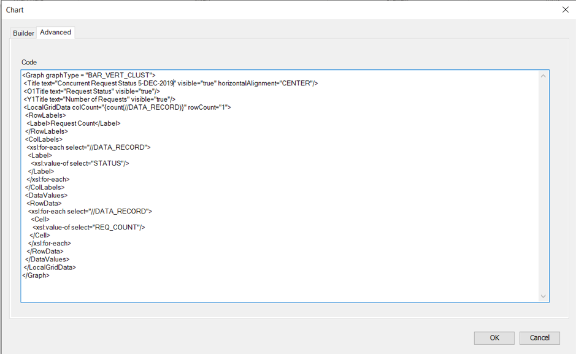
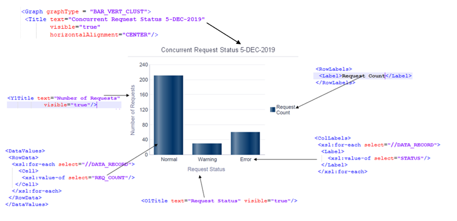
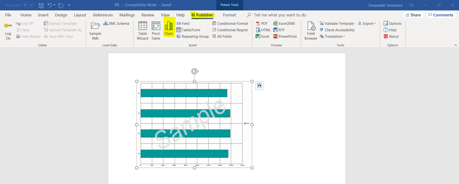
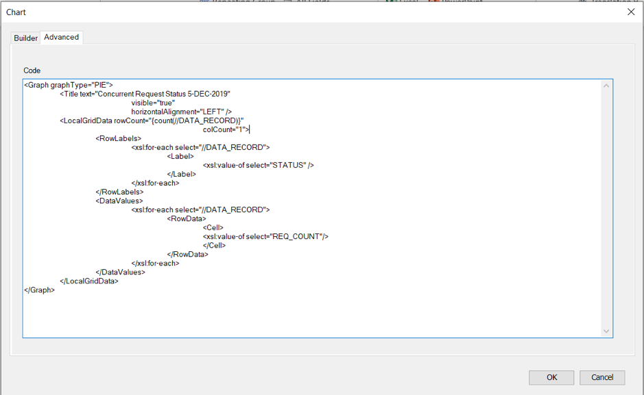
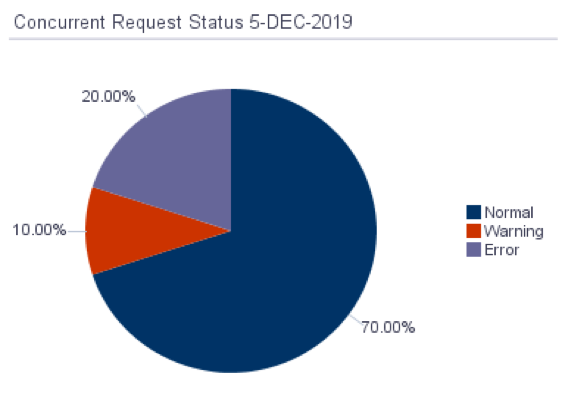
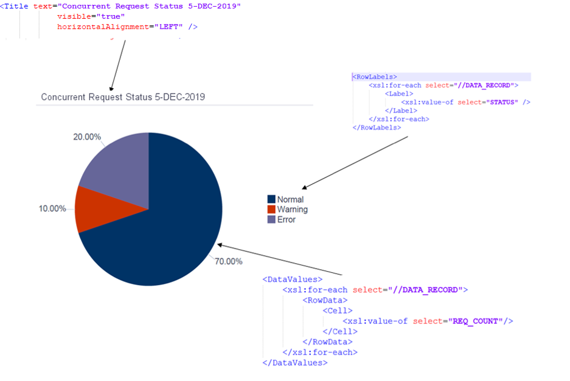
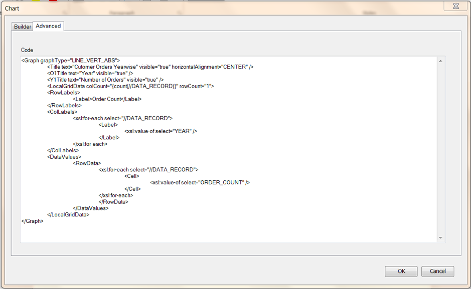
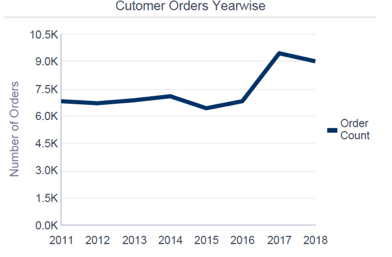

This blog explains how to create Oracle&reg; XML Publisher reports with charts.

<!--more-->

Often, reports contain data in a tabular format, but charts offer a graphical representation and better explain the data.

For example, graphs could enhance the following reports:

- A customer’s sales history based on organizational management (OM) data
- The number of instances of failed, completed, or completed-with-warning requests on a daily basis

### Types of charts

You can use the following types of charts:

- **Bar chart (horizontal or vertical)**: Used to show data in the form of bars with an X-axis and Y-axis.
- **Line chart**: Mainly used for chronological data.
- **Pie chart**: Represents data in the form of a circular graph and used for proportional data.

### Create bar charts

Example XML data file:

    <main>
       <DATA_RECORD>
         <STATUS>Normal</STATUS>
         <REQ_COUNT>210</REQ_COUNT>
       </DATA_RECORD>
       <DATA_RECORD>
         <STATUS>Warning</STATUS>
         <REQ_COUNT>30</REQ_COUNT>
       </DATA_RECORD>
       <DATA_RECORD>
         <STATUS>Error</STATUS>
         <REQ_COUNT>60</REQ_COUNT>
       </DATA_RECORD>
    </main>

In an `rtf` template, insert an object of chart type from the XML Publisher add-in.

Click the **Advanced** tab and paste the following text:

    <Graph graphType = "BAR_VERT_CLUST">
      <Title text="Concurrent Request Status 5-DEC-2019" visible="true" horizontalAlignment="CENTER"/>
      <O1Title text="Request Status" visible="true"/>
      <Y1Title text="Number of Requests" visible="true"/>
      <LocalGridData colCount="{count(//DATA_RECORD)}" rowCount="1">
         <RowLabels>
            <Label>Request Count</Label>
         </RowLabels>
         <ColLabels>
           <xsl:for-each select="//DATA_RECORD">
             <Label>
               <xsl:value-of select="STATUS"/>
             </Label>
           </xsl:for-each>
         </ColLabels>
         <DataValues>
           <RowData>
              <xsl:for-each select="//DATA_RECORD">
                <Cell>
                   <xsl:value-of select="REQ_COUNT"/>
                </Cell>
              </xsl:for-each>
           </RowData>
         </DataValues>
      </LocalGridData>
    </Graph>

This creates a dummy chart image on the template. Use this image to size the chart as you need it in the output.

#### Explanation of bar chart XML

A line-by-line explanation of the code follows:

    <Graph graphType = "BAR_VERT_CLUST">

This section indicates the graph type category as **BAR_VERT_CLUST**, which is a bar chart with a vertical
cluster format.

    <Title text="Concurrent Request Status 5-DEC-2019" visible="true" horizontalAlignment="CENTER"/>

This line shows the title for the chart and identifies its alignment. You can also set a dynamic title by
using an XML tag.

    <O1Title text="Request Status" visible="true"/>
    <Y1Title text="Number of Requests" visible="true"/>

These lines name the X and Y axes of the bar chart.

    <LocalGridData colCount="{count(//DATA_RECORD)}" rowCount="1">

This section identifies number of rows and columns in the chart.

In our example, `colCount="{count(//DATA_RECORD)}"`, the XML data file has three `DATA_RECORD` items, so
this chart has three columns.

`rowCount="1"`, in our bar chart, identifies the number of rows.

    <RowLabels>
       <Label>Request Count</Label>
    </RowLabels>

This section defines the row labels as static or dynamic. We used **Request Count**.

    <ColLabels>
       <xsl:for-each select="//DATA_RECORD">
          <Label>
             <xsl:value-of select="STATUS"/>
          </Label>
       </xsl:for-each>
    </ColLabels>

This section defines the column labels. You can use dynamic column labels based on the value of `STATUS`
tag in the XML data file.

    <DataValues>
       <RowData>
          <xsl:for-each select="//DATA_RECORD">
            <Cell>
               <xsl:value-of select="REQ_COUNT"/>
            </Cell>
          </xsl:for-each>
       </RowData>
    </DataValues>

This section refers to the data values in the chart. The created bars should have a size proportional to the
value of the `REQ_COUNT` tag in the XML data file.

### Create pie charts

Example XML data file:

    <main>
       <DATA_RECORD>
         <STATUS>Normal</STATUS>
         <REQ_COUNT>210</REQ_COUNT>
       </DATA_RECORD>
       <DATA_RECORD>
         <STATUS>Warning</STATUS>
         <REQ_COUNT>30</REQ_COUNT>
       </DATA_RECORD>
       <DATA_RECORD>
         <STATUS>Error</STATUS>
         <REQ_COUNT>60</REQ_COUNT>
       </DATA_RECORD>
    </main>

In the `rtf` template, insert an object of chart type from Publisher Add-In.

Click the **Advanced** tab and paste the following text:

    <Graph graphType="PIE">
       <Title text="Concurrent Request Status 5-DEC-2019" 
       visible="true" horizontalAlignment="LEFT" />
       <LocalGridData rowCount="{count(//DATA_RECORD)}" colCount="1">
          <RowLabels>
             <xsl:for-each select="//DATA_RECORD">
                <Label>
                   <xsl:value-of select="STATUS" />
                </Label>
             </xsl:for-each>
          </RowLabels>
          <DataValues>
             <xsl:for-each select="//DATA_RECORD">
                <RowData>
                  <Cell>
                     <xsl:value-of select="REQ_COUNT"/>
                  </Cell>
                </RowData>
             </xsl:for-each>
          </DataValues>
       </LocalGridData>
    </Graph>

#### Explanation of pie chart XML

A line-by-line explanation of the code follows:

    <Graph graphType="PIE">

This section identifies the graph type and category as the `PIE` chart format.

    <LocalGridData rowCount="{count(//DATA_RECORD)}" colCount="1">

This section identifies number of rows and columns in the chart.

In our example, `rowCount="{count(//DATA_RECORD)}"`, the XML data file has three `DATA_RECORD` items, so
this chart has three sections in the circle.

    <RowLabels>
       <xsl:for-each select="//DATA_RECORD">
          <Label>
             <xsl:value-of select="STATUS" />
          </Label>
       </xsl:for-each>
    </RowLabels>

This section defines the row labels, which are static or dynamic. You can use row labels based on the value
of the `STATUS` tag in the XML data file.

    <DataValues>
       <RowData>
          <xsl:for-each select="//DATA_RECORD">
             <Cell>
                <xsl:value-of select="REQ_COUNT"/>
             </Cell>
          </xsl:for-each>
       </RowData>
    </DataValues>

This section refers to the data value of the chart, creating a pie of a fractional size that is proportional
to the value of the `REQ_COUNT` tag. The values represent fractions of the total count.

### Create line charts

Generally, use this chart type when data is timeline-based.

Example XML data file:

    <main>
       <DATA_RECORD>
          <YEAR>2011</YEAR><ORDER_COUNT>6797</ORDER_COUNT>
       </DATA_RECORD>
       <DATA_RECORD>
          <YEAR>2012</YEAR><ORDER_COUNT>6686</ORDER_COUNT>
       </DATA_RECORD>
       <DATA_RECORD>
          <YEAR>2013</YEAR><ORDER_COUNT>6851</ORDER_COUNT>
       </DATA_RECORD>
       <DATA_RECORD>
          <YEAR>2014</YEAR><ORDER_COUNT>7065</ORDER_COUNT>
       </DATA_RECORD>
       <DATA_RECORD>
          <YEAR>2015</YEAR><ORDER_COUNT>6421</ORDER_COUNT>
       </DATA_RECORD>
       <DATA_RECORD>
          <YEAR>2016</YEAR><ORDER_COUNT>6816</ORDER_COUNT>
       </DATA_RECORD>
       <DATA_RECORD>
          <YEAR>2017</YEAR><ORDER_COUNT>9426</ORDER_COUNT>
       </DATA_RECORD>
       <DATA_RECORD>
          <YEAR>2018</YEAR><ORDER_COUNT>9008</ORDER_COUNT>
       </DATA_RECORD>
    </main>

In an `rtf` template, insert an object of chart type from the XML Publisher add-in.

Click the **Advanced** tab and paste the following text:

    <Graph graphType="LINE_VERT_ABS">
       <Title text="Cutomer Orders Yearwise" visible="true" horizontalAlignment="CENTER" />
       <O1Title text="Year" visible="true" />
       <Y1Title text="Number of Orders" visible="true" />
       <LocalGridData colCount="{count(//DATA_RECORD)}" rowCount="1">
          <RowLabels>
             <Label>Order Count</Label>
          </RowLabels>
          <ColLabels>
             <xsl:for-each select="//DATA_RECORD">
                <Label>
                   <xsl:value-of select="YEAR" />
                </Label>
             </xsl:for-each>
          </ColLabels>
          <DataValues>
             <RowData>
                <xsl:for-each select="//DATA_RECORD">
                   <Cell>
                      <xsl:value-of select="ORDER_COUNT" />
                   </Cell>
                </xsl:for-each>
             </RowData>
          </DataValues>
       </LocalGridData>
    </Graph>

This creates a dummy chart image on the template. Use this image to size the chart as you need it in the output.

#### Explanation of line chart XML

A line-by-line explanation of the code follows:

    <Graph graphType="LINE_VERT_ABS">

This section indicates the graph type and category as `LINE_VERT_ABS`, which is a line chart.

The rest of the tags are the same as for a BAR type chart.

### Chart uses

In Oracle, charts are useful for analytics-related reports. Any XML publisher report can take
advantage of this functionality.

### Conclusion

Charts are easy to read and better explain data for the end users. For large data sets, you can
summarize the data to a materialized view, and use this view to create reports with XML Publisher,
which also saves you from needing to use expensive third-party tools.  

Use the Feedback tab to make any comments or ask questions.

### Optimize your environment with expert administration, management, and configuration

[Rackspace's Application services](https://www.rackspace.com/application-management/managed-services)
**(RAS)** experts provide the following [professional](https://www.rackspace.com/application-management/professional-services)
and
[managed services](https://www.rackspace.com/application-management/managed-services) across
a broad portfolio of applications:

- [eCommerce and Digital Experience platforms](https://www.rackspace.com/ecommerce-digital-experience)
- [Enterprise Resource Planning (ERP)](https://www.rackspace.com/erp)
- [Business Intelligence](https://www.rackspace.com/business-intelligence)
- [Salesforce Customer Relationship Management (CRM)](https://www.rackspace.com/salesforce-managed-services)
- [Databases](https://www.rackspace.com/dba-services)
- [Email Hosting and Productivity](https://www.rackspace.com/email-hosting)

We deliver:

- **Unbiased expertise**: We simplify and guide your modernization journey,
focusing on the capabilities that deliver immediate value.
- **Fanatical Experience**&trade;: We combine a *Process first. Technology second.&reg;*
approach with dedicated technical support to provide comprehensive solutions.
- **Unrivaled portfolio**: We apply extensive cloud experience to help you
choose and deploy the right technology on the right cloud.
- **Agile delivery**: We meet you where you are in your journey and align
our success with yours.

[Chat now](https://www.rackspace.com/#chat) to get started.
