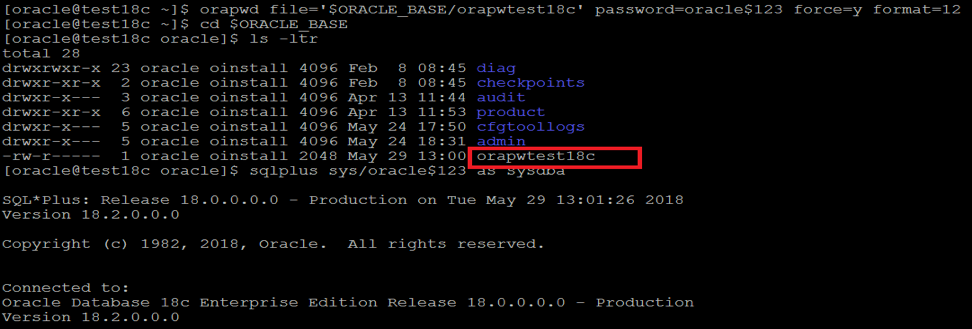

This blog post discusses the new interesting features introduced in Oracle
Database 18c that make the life of DBA a little easier.

<!--more-->

Oracle Database 18c introduces the following new features:

- SQL cancelling
- Password file location
- Read-only Oracle Home
- Private temporary tables

### SQL cancelling

Oracle Database 18c introduces a new command that database administrators (DBAs) can use
to cancel blocking, or overly expensive, statements without needing to kill the
original session. In earlier releases, DBAs used the `alter session kill` command
to terminate the session. The new `alter system cancel` SQL command cancels an
SQL statement in a session, providing an alternative to killing a rogue session
in the Oracle Database 18c.

Use the following syntax for the `alter system cancel` SQL statement:

    ALTER SYSTEM CANCEL SQL 'SID, SERIAL#[, @INST_ID][, SQL_ID]';

If you omit the **INST\_ID**, the system defaults to the current instance. If
you omit the **SQL\_ID**, the system assumes that the SQL should run in the
specified session. Following are some variations:

- Current SQL in session on this instance.

        ALTER SYSTEM CANCEL SQL '723, 45325';

- Current SQL in session on instance with **INST\_ID** = 1.

        ALTER SYSTEM CANCEL SQL '723, 45325, @1';

- Specified SQL in session on this instance.

        ALTER SYSTEM CANCEL SQL '723, 45325, 84djy3b3xgvq';

- Specified SQL in session on instance with **INST\_ID** = 1.

        ALTER SYSTEM CANCEL SQL '723, 45325, @1, 84djy3b3xgvq';

### Password file location

The default location for the Oracle Database 18c password file is now
**ORACLE\_BASE** instead of **ORACLE\_HOME/dbs**. This change enables you to use
Oracle Home as a static repository for database files.

The new location simplifies database migrations because **ORACLE\_BASE** is
common to every installation's **ORACLE\_HOME**. Migrating a database from one
**ORACLE\_HOME** to another does not require moving the password file:

    orapwd file=’$ORACLE_BASE/orapwtest18c’ password=oracle force=y format=12

### Read-only Oracle Home

The new password file location enables you to mount one shared read-only
Oracle Home on different systems, making deployment for complex architectures
more reliable and simpler. In other words, a read-only Oracle Home separates the
software from the database configuration information and log files, which enables
you to share the software across different deployments easily. A read-only Oracle
Home also simplifies version control and standardization.

Use the following steps to enable the read-only
Oracle Home:

1. Go to the bin directory:

        $ cd $ORACLE_HOME/bin

2. Run the script to enable read-only Oracle home:

        $ ./roohctl -enable

### Private temporary tables

Oracle Database 18c introduces the concept of a private temporary table&mdash;a
memory-based temporary table that is dropped at the end of the session or
transaction depending on the setup. In the previous releases, you can create a
Global Temporary Table (GTT), which is a permanent metadata object that holds
rows in temporary segments on a transaction-specific or session-specific basis.
Normally, you don't create and drop GTTs on the fly. With the introduction of
private temporary tables, Oracle has a similar option available in other engines,
where the table object itself is temporary, not just the data.

The `PRIVATE_TEMP_TABLE_PREFIX` initialization parameter, which defaults to
**ORA$PTT_**, defines the prefix that you must use in the name when creating the
private temporary table. If you try to create a private temporary table without
using the correct prefix in the name, an error results.

The default `ON COMMIT DROP DEFINITION` clause drops the table at the end of the
transaction or at the end of the session.

Use the following syntax to create a private temporary table:

    CREATE PRIVATE TEMPORARY TABLE ora$ptt_my_temp1 (
      id NUMBER,
      description  VARCHAR2(20)
    )
    ON COMMIT DROP DEFINITION;

### Conclusion

We recommend that you take advantage of these new features, such as using SQL
cancelling to clear any identified sessions from the database. The read-only
**ORACLE\_HOME** feature enables you to share the software across
different deployments easily. With the introduction of private temporary tables, you
can quickly create a temporary table without having to keep track of it,
because Oracle automatically drops it at the end of the transaction. Depending
on what situation that you need to handle, you can use any of these features
to save time.

Use the Feedback tab to make any comments or ask questions.

### Optimize your environment with expert administration, management, and configuration

[Rackspace's Application services](https://www.rackspace.com/application-management/managed-services)
**(RAS)** experts provide the following [professional](https://www.rackspace.com/application-management/professional-services)
and
[managed services](https://www.rackspace.com/application-management/managed-services) across
a broad portfolio of applications:

- [eCommerce and Digital Experience platforms](https://www.rackspace.com/ecommerce-digital-experience)
- [Enterprise Resource Planning (ERP)](https://www.rackspace.com/erp)
- [Business Intelligence](https://www.rackspace.com/business-intelligence)
- [Salesforce Customer Relationship Management (CRM)](https://www.rackspace.com/salesforce-managed-services)
- [Databases](https://www.rackspace.com/dba-services)
- [Email Hosting and Productivity](https://www.rackspace.com/email-hosting)

We deliver:

- **Unbiased expertise**: We simplify and guide your modernization journey,
focusing on the capabilities that deliver immediate value.
- **Fanatical Experience**&trade;: We combine a *Process first. Technology second.&reg;*
approach with dedicated technical support to provide comprehensive solutions.
- **Unrivaled portfolio**: We apply extensive cloud experience to help you
choose and deploy the right technology on the right cloud.
- **Agile delivery**: We meet you where you are in your journey and align
our success with yours.

[Chat now](https://www.rackspace.com/#chat) to get started.
